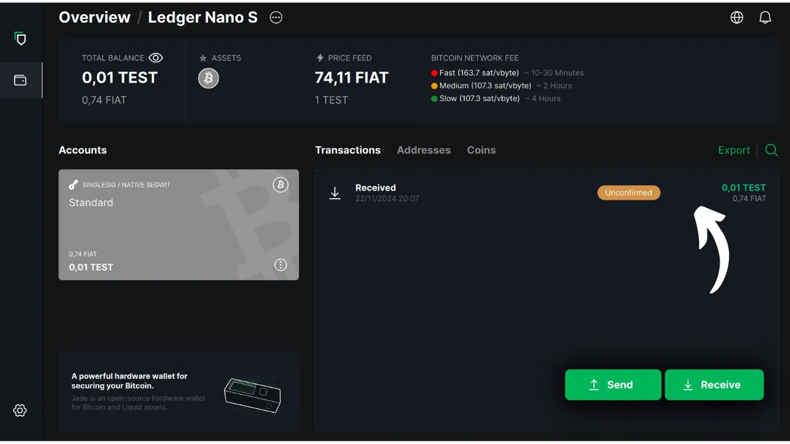

在本教程中，我们将探讨如何在电脑上使用 Blockstream Green 软件来管理硬件钱包上的安全钱包。使用硬件钱包时，必须在电脑上使用软件来管理钱包。该管理软件无法访问私钥；它仅用于查询钱包余额、生成接收地址以及构建和分发由硬件钱包签名的交易。Green 只是管理比特币硬件钱包的众多解决方案之一。

2024 年，Blockstream Green 只与 Ledger Nano S（旧版本）、Ledger Nano X、Trezor One、Trezor T 和 Blockstream Jade 设备兼容。

## 绿色 Blockstream 介绍

Blockstream Green是一款软件应用程序，可在手机和桌面上使用。其前身为 "绿色地址"，在2016年被收购后成为Blockstream项目。

Green 是一款非常易于使用的应用程序，因此特别适合初学者。它提供多种功能，如管理热钱包、硬件钱包以及 Liquid 侧链上的钱包。您还可以用它来设置手表专用钱包。

在本教程中，我们将只专注于在电脑上使用该软件。要了解 Green 的其他用途，请参考我们的其他专门教程：

https://planb.network/tutorials/wallet/mobile/blockstream-green-e84edaa9-fb65-48c1-a357-8a5f27996143
https://planb.network/tutorials/wallet/mobile/blockstream-green-watch-only-66c3bc5a-5fa1-40ef-9998-6d6f7f2810fb
## 安装和配置 Blockstream Green 软件

首先在计算机上安装 Blockstream Green 软件。访问 [官方网站](https://blockstream.com/green/) 并点击 "*立即下载*"按钮。然后根据您的操作系统按照安装过程进行操作。

启动应用程序，然后勾选 "我接受条件...*"框。

首次打开 Green 时，主屏幕上不会出现已配置的投资组合。之后，如果你创建或导入投资组合，它们就会出现在这个界面中。在继续创建投资组合之前，我建议你调整应用程序的设置，以满足你的需求。点击左下角的设置图标。

在 "*常规*"菜单中，您可以更改软件语言，并根据需要激活实验功能。

在 "*网络*"菜单中，你可以启用通过 Tor 网络连接，该网络会加密所有连接，使你的活动难以被追踪。虽然该选项可能会略微减慢程序的运行速度，但我们强烈建议您使用该选项来保护自己的隐私，尤其是在不使用自己的完整节点时。

对于拥有自己完整节点的用户，Green 提供了通过 Electrum 服务器与之连接的选项，以保证对比特币网络信息和交易传播的完全控制。为此，请点击 "*自定义服务器和验证*"菜单，然后输入您的 Electrum 服务器详细信息。

另一个替代功能是 "*SPV 验证*"选项，它允许您直接验证某些区块链数据，从而减少对 Blockstream 默认节点的信任，不过这种方法并不能提供完整节点的所有保证。该选项也可在 "*自定义服务器和验证*"菜单中找到。

根据需要调整这些参数后，就可以退出该界面。

## 在 Blockstream Green 上导入比特币钱包

现在您可以导入比特币钱包了。点击 "**开始**"按钮。

您可以选择创建本地软件钱包或通过硬件钱包管理冷钱包。在本教程中，我们将专注于管理硬件钱包，因此你需要选择 "*在硬件钱包*"选项。

只看*"选项可让你导入扩展公开密钥 (`xpub`)，查看投资组合交易，但不能动用相关资金。

如果使用的是 Jade，请单击相应的按钮。否则，请选择 "*连接不同的硬件设备*"。对于 Ledger 用户，请确保在硬件钱包上安装了 "*Bitcoin Legacy*"应用程序，因为 Green 只支持该版本。

将硬件钱包连接到电脑，然后选择 "绿色"。

等待绿色导入您的投资组合信息，之后您就可以访问这些信息了。

此时，有两种可能的情况。如果你以前使用过硬件钱包，你应该会看到你的账户出现在软件上。但如果你像我一样，刚刚通过生成一个记忆短语初始化了硬件钱包，还没有使用过，那么你就需要创建一个账户。点击 "*创建账户*"。

如果希望使用经典钱包，请选择 "*标准*"。

现在您可以访问您的账户了。

## 使用 Blockstream Green 硬件钱包

现在，您的比特币钱包已经设置完毕，可以开始接收第一笔比特币了！只需点击 "*接收*"按钮。

点击 "*复制地址*"按钮复制地址，或扫描二维码。

交易在网络上广播后，就会出现在您的钱包中。等到收到足够多的确认信息后，就可以认为交易不可更改。

钱包里有了比特币，现在就可以发送了。点击 "*发送*"按钮。

在下一页，输入收件人地址。您可以手动输入，也可以用网络摄像头扫描二维码。

选择付款金额。

在屏幕底部，您可以选择该交易的费率。您可以选择按照应用程序的建议或自定义收费。与其他待处理交易相比，费用越高，交易处理速度越快。有关费用市场信息，请访问 [Mempool.space](https://mempool.space/) 中的 "*交易费用*"部分。

如果您想具体选择在交易中使用哪些UTXO，请点击 "*手动硬币选择*"按钮。

检查交易参数，如果一切正常，请点击 "*下一步*"。

仔细检查地址、金额和费用是否正确，然后点击 "*确认交易*"。

确保硬件钱包屏幕上的所有交易参数正确无误，然后使用它签署交易。

硬件钱包签署交易后，Green 会自动将其广播到比特币网络。然后，您的交易将出现在比特币钱包仪表板上，等待确认。

现在您知道如何轻松配置 Blockstream Green 来管理硬件钱包上的比特币钱包了吧。

如果您觉得本教程有用，请在下方留下绿色拇指，我将不胜感激。欢迎在您的社交网络上分享本文。非常感谢

我还建议您查看 Blockstream Green 移动应用程序上关于设置热钱包的其他综合教程：

https://planb.network/tutorials/wallet/mobile/blockstream-green-e84edaa9-fb65-48c1-a357-8a5f27996143