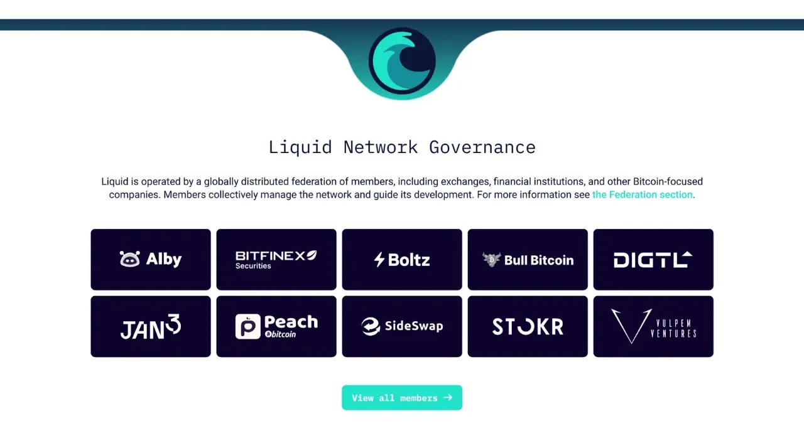
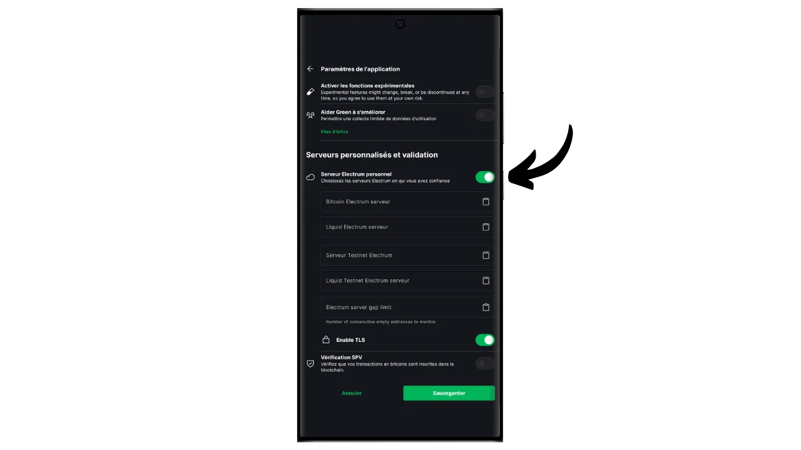
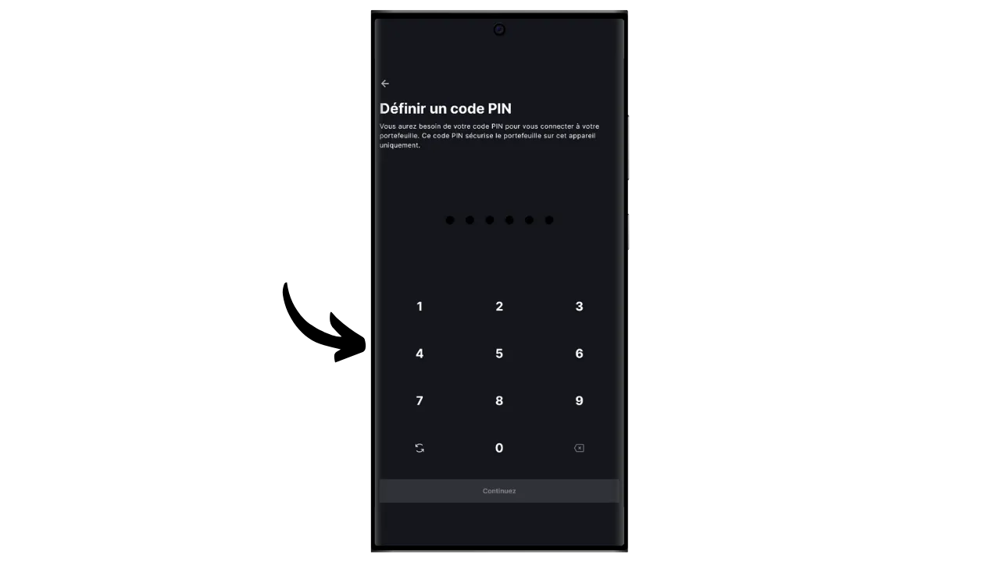

Das Bitcoin-Protokoll hat absichtlich technische Beschränkungen, die dazu beitragen, die Dezentralisierung des Netzwerks aufrechtzuerhalten und sicherzustellen, dass die Sicherheit auf alle Nutzer verteilt wird. Diese Beschränkungen können jedoch manchmal frustrierend für die Nutzer sein, insbesondere bei Überlastung durch ein hohes Volumen an gleichzeitigen Transaktionen. Die Debatte über die Skalierbarkeit von Bitcoin hat die Gemeinschaft lange gespalten, insbesondere während des Blocksize War. Seit dieser Episode ist es in der Bitcoin-Gemeinschaft weithin anerkannt, dass die Skalierbarkeit durch Lösungen außerhalb der Bitcoin-Kette, auf Systemen der zweiten Ebene, sichergestellt werden muss. Zu diesen Lösungen gehören Sidechains, die im Vergleich zu anderen Systemen wie dem Lightning Network noch relativ unbekannt und wenig genutzt sind.

Eine Sidechain ist eine unabhängige Blockchain, die parallel zur Haupt-Bitcoin-Blockchain läuft. Sie verwendet Bitcoin als Rechnungseinheit, dank eines Mechanismus namens "*two-way peg*". Dieses System ermöglicht es, Bitcoins auf der Hauptkette zu sperren, um ihren Wert auf der Sidechain zu reproduzieren, wo sie in Form von Token zirkulieren, die durch die ursprünglichen Bitcoins gedeckt sind. Diese Token behalten normalerweise die Wertgleichheit mit den auf der Hauptkette gesperrten Bitcoins, und der Prozess kann umgekehrt werden, um Gelder auf Bitcoin zurückzuholen.

Das Ziel von Sidechains ist es, zusätzliche Funktionalitäten oder technische Verbesserungen anzubieten, wie z.B. schnellere Transaktionen, niedrigere Gebühren oder Unterstützung für Smart Contracts. Diese Innovationen können nicht immer direkt auf der Bitcoin-Blockchain implementiert werden, ohne ihre Dezentralität oder Sicherheit zu gefährden. Sidechains ermöglichen es daher, neue Lösungen zu testen und zu erforschen, ohne die Integrität von Bitcoin zu gefährden. Diese Protokolle erfordern jedoch oft Kompromisse, insbesondere in Bezug auf Dezentralisierung und Sicherheit, je nach dem gewählten Governance-Modell und Konsensmechanismus.

Die bekannteste Sidechain ist heute wahrscheinlich Liquid. In diesem Tutorial erkläre ich Ihnen zunächst, was Liquid ist, und zeige Ihnen dann, wie Sie es einfach mit der Blockstream Green-Anwendung nutzen können, damit Sie alle Vorteile genießen können.

## Was ist Liquid Network?

Liquid ist ein föderiertes Sidechain-Overlay für Bitcoin, das von Blockstream entwickelt wurde, um die Transaktionsgeschwindigkeit, Vertraulichkeit und Funktionalität zu verbessern. Es nutzt einen bilateralen Verankerungsmechanismus, der auf einer Föderation etabliert ist, um Bitcoins auf der Hauptkette zu sperren und im Gegenzug Liquid-Bitcoins (L-BTC) zu schaffen, Token, die auf Liquid zirkulieren, aber durch die ursprünglichen Bitcoins gesichert bleiben.

Das Liquid-Netzwerk stützt sich auf eine Föderation von Teilnehmern, die sich aus anerkannten Einrichtungen des Bitcoin-Ökosystems zusammensetzt, die Blöcke validieren und das bilaterale Pegging verwalten. Zusätzlich zu L-BTC ermöglicht Liquid auch die Ausgabe anderer digitaler Vermögenswerte wie Stablecoins und anderer Kryptowährungen.

## Einführung von Blockstream Green

Blockstream Green ist eine Software-Wallet, die auf dem Handy und dem Desktop verfügbar ist. Früher als *Green Address* bekannt, wurde diese Wallet nach der Übernahme durch Blockstream im Jahr 2016 ein eigenes Projekt.

Green ist eine besonders einfach zu bedienende Anwendung, was sie auch für Anfänger interessant macht. Sie bietet alle wesentlichen Funktionen einer guten Bitcoin-Wallet, darunter RBF (*Replace-by-Fee*), eine Tor-Verbindungsoption, die Möglichkeit, einen eigenen Node zu verbinden, SPV (*Simple Payment Verification*), Coin-Tagging und Kontrolle.

Blockstream Green unterstützt auch das Liquid-Netzwerk, und genau das werden wir in diesem Tutorial herausfinden. Wenn Sie Green für andere Anwendungen nutzen möchten, empfehle ich Ihnen, auch einen Blick auf diese anderen Tutorials zu werfen:

https://planb.network/tutorials/wallet/desktop/blockstream-green-desktop-c1503adf-1404-4328-b814-aa97fcf0d5da
https://planb.network/tutorials/wallet/mobile/blockstream-green-e84edaa9-fb65-48c1-a357-8a5f27996143
https://planb.network/tutorials/wallet/mobile/blockstream-green-watch-only-66c3bc5a-5fa1-40ef-9998-6d6f7f2810fb
## Installieren und Konfigurieren der Blockstream Green Anwendung

Der erste Schritt besteht natürlich darin, die Green-Anwendung herunterzuladen. Gehen Sie zu Ihrem Anwendungsspeicher:

- [Für Android] (https://play.google.com/store/apps/details?id=com.greenaddress.greenbits_android_wallet);
- [Für Apple] (https://apps.apple.com/us/app/green-bitcoin-wallet/id1402243590).

Android-Benutzer können die Anwendung auch über die .apk-Datei [verfügbar auf Blockstreams GitHub] (https://github.com/Blockstream/green_android/releases) installieren.

Starten Sie die Anwendung und markieren Sie das Feld "Ich akzeptiere die Bedingungen...*".

Wenn Sie Green zum ersten Mal öffnen, erscheint der Startbildschirm ohne ein konfiguriertes Portfolio. Wenn Sie später Portfolios erstellen oder importieren, werden sie in dieser Oberfläche angezeigt. Bevor Sie mit der Erstellung eines Portfolios beginnen, sollten Sie die Anwendungseinstellungen an Ihre Bedürfnisse anpassen. Klicken Sie auf "Anwendungseinstellungen".

Die Option "*Erweiterte Privatsphäre*", die nur unter Android verfügbar ist, verbessert die Privatsphäre, indem sie Screenshots deaktiviert und Anwendungsvorschauen ausblendet. Außerdem wird der Zugriff auf Anwendungen automatisch gesperrt, sobald das Telefon gesperrt wird, sodass Ihre Daten nicht mehr so leicht zu finden sind.

Für diejenigen, die ihre Privatsphäre schützen möchten, bietet die Anwendung die Möglichkeit, ihren Datenverkehr über Tor zu leiten, ein Netzwerk, das alle ihre Verbindungen verschlüsselt und ihre Aktivitäten schwer nachvollziehbar macht. Obwohl diese Option den Betrieb der Anwendung etwas verlangsamen kann, ist sie sehr empfehlenswert, um Ihre Privatsphäre zu schützen, insbesondere wenn Sie keinen eigenen vollständigen Knoten verwenden.

Für Nutzer, die ihren eigenen kompletten Node haben, bietet Green Wallet die Möglichkeit, sich mit diesem über einen Electrum-Server zu verbinden, wodurch die vollständige Kontrolle über Bitcoin-Netzwerkinformationen und die Verbreitung von Transaktionen gewährleistet wird. Aber diese Funktion ist für klassische Bitcoin-Wallets, also brauchen Sie sie nicht, wenn Sie Liquid verwenden.

Eine weitere alternative Funktion ist die Option "*SPV Verification*", die es Ihnen ermöglicht, bestimmte Blockchain-Daten direkt zu verifizieren und somit die Notwendigkeit zu verringern, dem Standardknoten von Blockstream zu vertrauen, obwohl diese Methode nicht alle Garantien eines vollständigen Knotens bietet. Auch dies betrifft nur Ihre Onchain-Bitcoin-Wallets, nicht Liquid.

Wenn Sie diese Einstellungen Ihren Wünschen entsprechend angepasst haben, klicken Sie auf die Schaltfläche "*Speichern*" und starten Sie die Anwendung neu.

## Erstellen Sie ein Liquid-Portfolio auf Blockstream Green

Sie sind nun bereit, ein Liquid-Portfolio zu erstellen. Klicken Sie auf die Schaltfläche "*Get Started*".

Sie haben die Wahl zwischen der Erstellung einer lokalen Software-Wallet oder der Verwaltung einer Cold Wallet über eine Hardware-Wallet. In diesem Tutorial konzentrieren wir uns auf die Erstellung einer Hot Wallet auf Liquid, daher müssen Sie die Option "*Auf diesem Gerät*" auswählen. Sie können auch eine kompatible Hardware-Wallet, wie Blockstream Jade, verwenden, um Ihre Liquid-Wallet zu sichern.

Sie können dann wählen, ob Sie eine bestehende Bitcoin-Wallet wiederherstellen oder eine neue erstellen möchten. Für die Zwecke dieses Tutorials werden wir eine neue Wallet erstellen. Wenn Sie jedoch eine bestehende Liquid-Wallet anhand ihrer mnemonischen Phrase wiederherstellen müssen, zum Beispiel nach dem Verlust Ihrer Hardware-Wallet, müssen Sie die zweite Option wählen.

Sie können dann zwischen einer Gedächtnisstütze mit 12 oder 24 Wörtern wählen. Mit dieser Phrase können Sie im Falle eines Problems mit Ihrem Telefon von jeder kompatiblen Software aus wieder auf Ihre Brieftasche zugreifen. Gegenwärtig bietet die Wahl einer 24-Wörter-Phrase nicht mehr Sicherheit als eine 12-Wörter-Phrase. Ich empfehle Ihnen daher, eine Phrase mit 12 Wörtern zu wählen.

Green gibt Ihnen dann Ihre Eselsbrücke. Bevor Sie fortfahren, vergewissern Sie sich, dass Sie nicht beobachtet werden. Klicken Sie auf "*Wiederherstellungsphrase anzeigen*", um sie auf dem Bildschirm anzuzeigen.

**Mit dieser Gedächtnishilfe haben Sie uneingeschränkten Zugriff auf alle Ihre Bitcoins ** Jeder, der im Besitz dieser Gedächtnishilfe ist, kann Ihr Geld stehlen, auch ohne physischen Zugriff auf Ihr Telefon.

Es stellt den Zugang zu Ihren Bitcoins im Falle von Verlust, Diebstahl oder Bruch Ihres Telefons wieder her. Es ist also sehr wichtig, sie sorgfältig zu sichern **auf einem physischen Medium (nicht digital)** und sie an einem sicheren Ort aufzubewahren. Sie können sie auf ein Stück Papier schreiben, oder für zusätzliche Sicherheit, wenn es sich um eine große Geldbörse handelt, empfehle ich, sie auf einen Edelstahlträger zu gravieren, um sie vor Feuer, Überschwemmung oder Einsturz zu schützen (für eine heiße Geldbörse, die eine kleine Menge an Bitcoins sichern soll, ist ein einfaches Papier-Backup wahrscheinlich ausreichend).

*Natürlich dürfen Sie diese Worte niemals im Internet verbreiten, wie ich es in diesem Tutorial tue. Dieses Beispielportfolio wird nur im Testnet von Liquid verwendet und am Ende des Tutorials gelöscht

Wenn Sie Ihre Eselsbrücke korrekt auf einem physischen Medium aufgezeichnet haben, klicken Sie auf "*Fortfahren*". Green Wallet bittet Sie dann, einige der Wörter in Ihrer Gedächtnisstütze zu bestätigen, um sicherzustellen, dass Sie sie richtig aufgezeichnet haben. Füllen Sie die Lücken mit den fehlenden Wörtern aus.

Wählen Sie den PIN-Code Ihres Geräts aus, der zum Entsperren Ihrer grünen Brieftasche verwendet wird. Dies ist Ihr Schutz gegen unbefugten physischen Zugriff. Dieser PIN-Code ist nicht an der Ableitung der kryptografischen Schlüssel Ihrer Brieftasche beteiligt. Selbst wenn Sie keinen Zugang zu diesem PIN-Code haben, können Sie mit Ihrer 12- oder 24-Wort-Mnemonik wieder Zugang zu Ihren Bitcoins erhalten.

Wir empfehlen, einen 6-stelligen PIN-Code zu wählen, der möglichst zufällig ist. Achten Sie darauf, diesen Code zu speichern, damit Sie ihn nicht vergessen, da Sie sonst gezwungen sind, Ihr Portemonnaie über die Eselsbrücke abzurufen. Sie können dann eine biometrische Sperroption hinzufügen, um zu vermeiden, dass Sie die PIN jedes Mal eingeben müssen, wenn Sie sie benutzen. Im Allgemeinen sind biometrische Daten weit weniger sicher als die PIN selbst. Daher empfehle ich Ihnen, diese Entsperrungsoption standardmäßig nicht einzurichten.

Geben Sie Ihre PIN ein zweites Mal ein, um sie zu bestätigen.

Warten Sie, bis Ihr Portfolio erstellt wurde, und klicken Sie dann auf die Schaltfläche "*Konto erstellen*".

Wählen Sie im Feld "*Aktiv*" die Option "*Liquid Bitcoin*". Sie können dann zwischen einer Standard-Wallet mit einer einzigen Unterschrift, die wir in diesem Tutorial verwenden werden, oder einer Wallet, die durch eine Zwei-Faktor-Authentifizierung (2FA) geschützt ist, wählen.

Und das war's, Ihre Liquid-Brieftasche wurde mit der Green-Anwendung erstellt!

Bevor Sie Ihre ersten Bitcoins in Ihrer Liquid-Wallet erhalten, **empfehle ich Ihnen dringend, einen Test zur Wiederherstellung der leeren Wallet durchzuführen**. Notieren Sie sich einige Referenzinformationen, wie z. B. Ihre xpub- oder erste Empfangsadresse, und löschen Sie dann Ihre Wallet in der Green-App, solange sie noch leer ist. Versuchen Sie dann, Ihre Brieftasche auf Green mit Hilfe Ihrer Papier-Backups wiederherzustellen. Überprüfen Sie, ob die nach der Wiederherstellung generierten Cookie-Informationen mit denen übereinstimmen, die Sie ursprünglich aufgeschrieben haben. Wenn dies der Fall ist, können Sie sicher sein, dass Ihre Papier-Backups zuverlässig sind. Wenn Sie mehr darüber erfahren möchten, wie Sie eine Testwiederherstellung durchführen können, lesen Sie bitte diesen anderen Leitfaden:

https://planb.network/tutorials/wallet/backup/recovery-test-5a75db51-a6a1-4338-a02a-164a8d91b895
## Aufbau eines Liquiditätsportfolios

Wenn Sie Ihr Portfolio personalisieren möchten, klicken Sie auf die drei kleinen Punkte in der oberen rechten Ecke.

Mit der Option "*Umbenennen*" können Sie den Namen Ihres Portfolios anpassen, was besonders nützlich ist, wenn Sie mehrere Portfolios in derselben Anwendung verwalten.

Über das Menü "*Einheit*" können Sie die Basiseinheit Ihrer Geldbörse ändern. Sie können zum Beispiel wählen, dass sie in Satoshis statt in Bitcoins angezeigt wird.

Das Menü "*Einstellungen*" bietet Zugang zu den verschiedenen Optionen Ihrer Bitcoin-Wallet.

Hier finden Sie z. B. Ihren *Deskriptor*, der nützlich sein kann, wenn Sie aus diesem Liquid-Portfolio ein reines Beobachtungsportfolio einrichten wollen.

Sie können auch Ihre Brieftaschen-PIN ändern und eine biometrische Verbindung aktivieren.

## Verwendung Ihres Liquiditätsportfolios

Nun, da Ihr Liquid-Portfolio eingerichtet ist, sind Sie bereit, Ihre ersten L-Sätze zu empfangen!

Wenn Sie noch keine L-BTC haben, haben Sie mehrere Möglichkeiten. Die erste ist, sich direkt welche schicken zu lassen. Wenn jemand Sie mit Bitcoins auf Liquid bezahlen möchte, geben Sie ihm einfach eine Empfangsadresse. Die andere Möglichkeit ist, Ihre Bitcoins auf der Kette oder im Lightning-Netzwerk gegen L-BTC zu tauschen. Dazu können Sie [eine Brücke wie Boltz] (https://boltz.exchange/) verwenden. Geben Sie einfach Ihre Liquid-Adresse auf der Website ein und nehmen Sie dann die Zahlung entweder über das Lightning-Netzwerk oder onchain vor.

Um eine Liquid-Adresse zu erzeugen, klicken Sie auf die Schaltfläche "*Empfangen*".

Green zeigt dann die erste leere Empfangsadresse in Ihrer Brieftasche an. Sie können entweder den zugehörigen QR-Code scannen oder die Adresse direkt kopieren, um L-BTC zu senden.

Wenn die Transaktion im Netzwerk übertragen wird, erscheint sie in Ihrer Brieftasche.

Warten Sie, bis Sie genügend Bestätigungen erhalten haben, um die Transaktion als endgültig zu betrachten. Bei Liquid sollten die Bestätigungen schnell erfolgen, da jede Minute ein Block veröffentlicht wird.

Wenn Sie L-Satelliten in Ihrem Liquid-Portfolio haben, können Sie diese nun auch versenden. Klicken Sie auf "*Senden*".

Auf der nächsten Seite geben Sie die Liquid-Adresse des Empfängers ein. Sie können sie manuell eingeben oder ihren QR-Code scannen.

Wählen Sie den Zahlungsbetrag.

Klicken Sie auf "*Weiter*", um den Bildschirm mit der Transaktionsübersicht aufzurufen. Überprüfen Sie, ob die Adresse, der Betrag und die Gebühren korrekt sind.

Wenn alles gut geht, schieben Sie die grüne Schaltfläche am unteren Rand des Bildschirms nach rechts, um die Transaktion zu signieren und im Bitcoin-Netzwerk zu veröffentlichen.

Ihre Transaktion wird nun auf dem Dashboard Ihrer Bitcoin-Wallet angezeigt und wartet auf die Bestätigung.

Und jetzt wissen Sie, wie Sie die Liquid-Sidechain ganz einfach mit der Blockstream Green-Anwendung nutzen können!

Wenn Sie diese Anleitung nützlich fanden, wäre ich Ihnen dankbar, wenn Sie unten einen grünen Daumen hinterlassen würden. Sie können diesen Artikel auch gerne in Ihren sozialen Netzwerken teilen. Herzlichen Dank!

Ich empfehle Ihnen auch, sich dieses andere umfassende Tutorial über die Blockstream Green Mobile App anzusehen, um eine Onchain Bitcoin Hot Wallet einzurichten:

https://planb.network/tutorials/wallet/mobile/blockstream-green-e84edaa9-fb65-48c1-a357-8a5f27996143