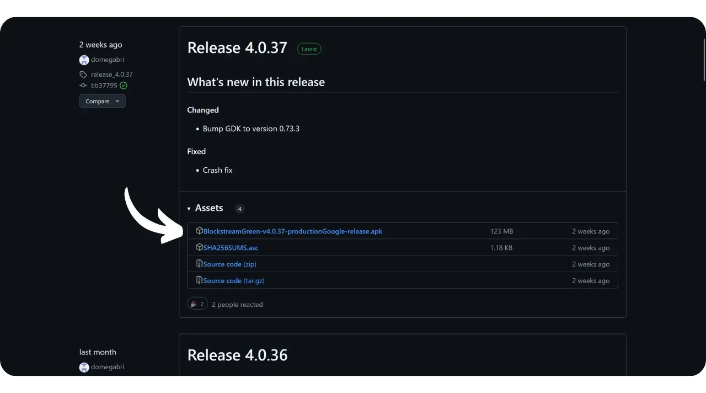
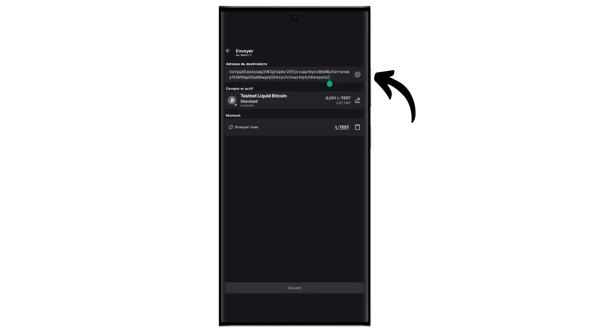
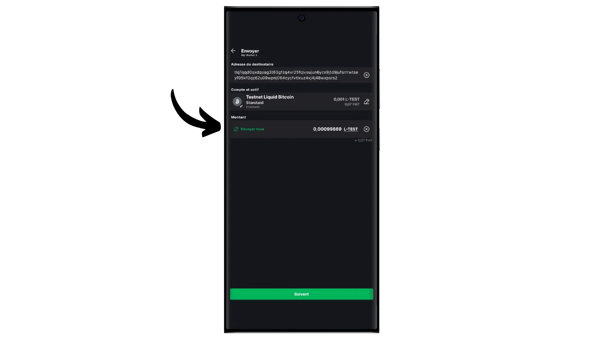

El protocolo Bitcoin tiene limitaciones técnicas intencionadas que ayudan a mantener la descentralización de la red y garantizan que la seguridad se distribuya entre todos los usuarios. Sin embargo, estas limitaciones pueden a veces frustrar a los usuarios, particularmente durante la congestión debida a un alto volumen de transacciones simultáneas. El debate sobre la escalabilidad de Bitcoin ha dividido a la comunidad durante mucho tiempo, especialmente durante la Guerra del Tamaño de Bloque. Desde este episodio, es ampliamente reconocido dentro de la comunidad Bitcoin que la escalabilidad debe ser asegurada por soluciones fuera de la cadena, en sistemas de segunda capa. Estas soluciones incluyen sidechains, que todavía son relativamente desconocidas y poco utilizadas en comparación con otros sistemas como la Lightning Network.

Una sidechain es una cadena de bloques independiente que funciona en paralelo a la cadena de bloques principal de Bitcoin. Utiliza bitcoin como unidad de cuenta, gracias a un mecanismo denominado "*two-way peg*". Este sistema permite bloquear bitcoins en la cadena principal para reproducir su valor en la sidechain, donde circulan en forma de tokens respaldados por los bitcoins originales. Estos tokens normalmente mantienen la paridad de valor con los bitcoins bloqueados en la cadena principal, y el proceso puede invertirse para recuperar fondos en Bitcoin.

El objetivo de las sidechains es ofrecer funcionalidades adicionales o mejoras técnicas, como transacciones más rápidas, tarifas más bajas o soporte para contratos inteligentes. Estas innovaciones no siempre pueden implementarse directamente en la blockchain de Bitcoin sin comprometer su descentralización o seguridad. Las sidechains, por tanto, permiten probar y explorar nuevas soluciones preservando la integridad de Bitcoin. Sin embargo, estos protocolos a menudo requieren compromisos, especialmente en términos de descentralización y seguridad, dependiendo del modelo de gobernanza y el mecanismo de consenso elegido.

Hoy en día, la cadena lateral más conocida es probablemente Liquid. En este tutorial, primero te contaré qué es Liquid y luego te guiaré para que empieces a utilizarla fácilmente con la aplicación Blockstream Green y puedas disfrutar de todas sus ventajas.

## ¿Qué es la Red Líquida?

Liquid es una cadena lateral federada para Bitcoin, desarrollada por Blockstream para mejorar la velocidad, confidencialidad y funcionalidad de las transacciones. Utiliza un mecanismo de anclaje bilateral establecido en una federación para bloquear bitcoins en la cadena principal y crear Liquid-bitcoins (L-BTC) a cambio, tokens que circulan en Liquid sin dejar de estar respaldados por los bitcoins originales.

La red Liquid se basa en una federación de participantes, formada por entidades reconocidas del ecosistema Bitcoin, que validan bloques y gestionan la vinculación bilateral. Además de L-BTC, Liquid también permite la emisión de otros activos digitales, como stablecoins y otras criptodivisas.

## Presentación de Blockstream Green

Blockstream Green es un monedero de software disponible en móvil y escritorio. Anteriormente conocido como *Green Address*, este monedero se convirtió en un proyecto de Blockstream tras su adquisición en 2016.

Green es una aplicación particularmente fácil de usar, lo que la hace interesante para los principiantes. Ofrece todas las características esenciales de un buen monedero Bitcoin, incluyendo RBF (*Replace-by-Fee*), una opción de conexión Tor, la posibilidad de conectar tu propio nodo, SPV (*Simple Payment Verification*), etiquetado y control de monedas.

Blockstream Green también es compatible con la red Liquid, y eso es lo que vamos a descubrir en este tutorial. Si quieres utilizar Green para otras aplicaciones, te recomiendo que también eches un vistazo a estos otros tutoriales:

https://planb.network/tutorials/wallet/desktop/blockstream-green-desktop-c1503adf-1404-4328-b814-aa97fcf0d5da
https://planb.network/tutorials/wallet/mobile/blockstream-green-e84edaa9-fb65-48c1-a357-8a5f27996143
https://planb.network/tutorials/wallet/mobile/blockstream-green-watch-only-66c3bc5a-5fa1-40ef-9998-6d6f7f2810fb
## Instalación y configuración de la aplicación Blockstream Green

El primer paso es, por supuesto, descargar la aplicación Green. Ve a tu tienda de aplicaciones:

- [Para Android](https://play.google.com/store/apps/details?id=com.greenaddress.greenbits_android_wallet);
- [Para Apple](https://apps.apple.com/us/app/green-bitcoin-wallet/id1402243590).

Los usuarios de Android también pueden instalar la aplicación a través del archivo `.apk` [disponible en GitHub de Blockstream](https://github.com/Blockstream/green_android/releases).

Inicie la aplicación y marque la casilla "Acepto las condiciones...*".

Al abrir Green por primera vez, aparece la pantalla de inicio sin ninguna cartera configurada. Más adelante, si creas o importas carteras, aparecerán en esta interfaz. Antes de pasar a crear una cartera, te recomiendo que ajustes la configuración de la aplicación para adaptarla a tus necesidades. Haga clic en "Configuración de la aplicación".

La opción "*Privacidad mejorada*", disponible solo en Android, mejora la privacidad desactivando las capturas de pantalla y ocultando las vistas previas de las aplicaciones. También bloquea automáticamente el acceso a las aplicaciones en cuanto se bloquea el teléfono, lo que dificulta la exposición de tus datos.

Para aquellos que deseen mejorar su privacidad, la aplicación ofrece la opción de enrutar tu tráfico a través de Tor, una red que encripta todas tus conexiones y dificulta el rastreo de tus actividades. Aunque esta opción puede ralentizar ligeramente el funcionamiento de la aplicación, es muy recomendable para proteger tu privacidad, especialmente si no utilizas tu propio nodo completo.

Para los usuarios que tienen su propio nodo completo, Green Wallet ofrece la opción de conectarse a él a través de un servidor Electrum, garantizando un control total sobre la información de la red Bitcoin y la difusión de las transacciones. Pero esta función es para los monederos Bitcoin clásicos, así que no la necesitas si usas Liquid.

Otra función alternativa es la opción "*SPV Verification*", que permite verificar directamente determinados datos de blockchain y reducir así la necesidad de confiar en el nodo predeterminado de Blockstream, aunque este método no ofrece todas las garantías de un nodo completo. De nuevo, esto sólo afectará a sus monederos Bitcoin onchain, no a Liquid.

Una vez que hayas ajustado estos parámetros a tus necesidades, pulsa el botón "*Guardar*" y reinicia la aplicación.

## Crear una cartera líquida en Blockstream Green

Ya está listo para crear una cartera Liquid. Haga clic en el botón "*Get Started*".

Puede elegir entre crear un monedero de software local o gestionar un monedero frío a través de un monedero de hardware. Para este tutorial, nos centraremos en la creación de un monedero en caliente en Liquid, por lo que deberá seleccionar la opción "*En este dispositivo*". También puede utilizar un monedero de hardware compatible, como Blockstream Jade, para proteger su monedero Liquid.

A continuación, puede elegir entre restaurar un monedero Bitcoin existente o crear uno nuevo. Para los fines de este tutorial, crearemos un nuevo monedero. Sin embargo, si necesitas regenerar un monedero Liquid existente a partir de su frase mnemotécnica, por ejemplo tras la pérdida de tu monedero hardware, tendrás que elegir la segunda opción.

A continuación, puede elegir entre una frase mnemotécnica de 12 o 24 palabras. Esta frase le permitirá recuperar el acceso a su monedero desde cualquier software compatible en caso de problema con su teléfono. Actualmente, optar por una frase de 24 palabras no ofrece más seguridad que una frase de 12 palabras. Por lo tanto, le recomiendo que elija una frase mnemotécnica de 12 palabras.

Green te proporcionará entonces tu frase mnemotécnica. Antes de continuar, asegúrate de que no te están observando. Haz clic en "*Mostrar frase de recuperación*" para que aparezca en pantalla.

**Esta mnemotecnia te da acceso completo y sin restricciones a todos tus bitcoins ** Cualquiera en posesión de esta mnemotecnia puede robar tus fondos, incluso sin acceso físico a tu teléfono.

Restaura el acceso a tus bitcoins en caso de pérdida, robo o rotura de tu teléfono. Así que es muy importante hacer una copia de seguridad cuidadosamente **en un soporte físico (no digital)** y guardarla en un lugar seguro. Puedes escribirla en un papel o, para mayor seguridad, si se trata de un monedero grande, te recomiendo grabarla en un soporte de acero inoxidable para protegerla del riesgo de incendio, inundación o derrumbe (para un monedero caliente diseñado para asegurar una pequeña cantidad de bitcoins, una simple copia de seguridad en papel probablemente sea suficiente).

*Obviamente, nunca debe compartir estas palabras en Internet, como estoy haciendo en este tutorial. Esta cartera de muestra sólo se utilizará en Testnet de Liquid y se eliminará al final del tutorial.*

Una vez que haya grabado correctamente su frase mnemotécnica en un soporte físico, haga clic en "*Continuar*". Cartera Verde le pedirá que confirme algunas de las palabras de su frase mnemotécnica para asegurarse de que las ha grabado correctamente. Rellene los espacios en blanco con las palabras que faltan.

Elige el código PIN de tu dispositivo, que se utilizará para desbloquear tu monedero verde. Es su protección contra el acceso físico no autorizado. Este código PIN no interviene en la derivación de las claves criptográficas de su monedero. Por lo tanto, incluso sin acceso a este código PIN, la posesión de su frase mnemotécnica de 12 o 24 palabras le permitirá recuperar el acceso a sus bitcoins.

Te recomendamos que elijas un código PIN de 6 dígitos lo más aleatorio posible. Asegúrate de guardar este código para que no se te olvide, de lo contrario te verás obligado a recuperar tu monedero desde la mnemotecnia. A continuación, puedes añadir una opción de bloqueo biométrico para evitar tener que introducir el PIN cada vez que la utilices. En general, los datos biométricos son mucho menos seguros que el propio PIN. Así que, por defecto, te aconsejo que no configures esta opción de desbloqueo.

Introduzca su PIN una segunda vez para confirmarlo.

Espere a que se cree su cartera y haga clic en el botón "*Crear una cuenta*".

En la casilla "*Active*", selecciona "*Liquid Bitcoin*". A continuación, puedes elegir entre un monedero estándar de firma única, que utilizaremos en este tutorial, o un monedero protegido por autenticación de dos factores (2FA).

Y ya está, ¡tu monedero Liquid ha sido creado utilizando la aplicación Green!

Antes de recibir sus primeros bitcoins en su monedero Liquid, **le aconsejo encarecidamente que realice una prueba de recuperación en vacío**. Anote algunos datos de referencia, como su xpub o su primera dirección de recepción y, a continuación, elimine su monedero en la aplicación Green mientras esté vacío. A continuación, intenta restaurar tu monedero en Green utilizando tus copias de seguridad en papel. Comprueba que la información de la cookie generada tras la restauración coincide con la que anotaste originalmente. Si es así, puede estar seguro de que sus copias de seguridad en papel son fiables. Para saber más sobre cómo realizar una recuperación de prueba, consulta este otro tutorial:

https://planb.network/tutorials/wallet/backup/recovery-test-5a75db51-a6a1-4338-a02a-164a8d91b895
## Configurar su cartera de liquidez

Si desea personalizar su cartera, haga clic en los tres puntitos de la esquina superior derecha.

La opción "*Renombrar*" le permite personalizar el nombre de su cartera, lo que resulta especialmente útil si gestiona varias carteras en la misma aplicación.

El menú "*Unidad*" te permite cambiar la unidad base de tu monedero. Por ejemplo, puedes elegir mostrarlo en satoshis en lugar de bitcoins.

El menú "*Configuración*" permite acceder a las distintas opciones de su monedero Bitcoin.

Aquí, por ejemplo, encontrará su *descriptor*, que puede resultarle útil si planea configurar una cartera de sólo vigilancia a partir de esta cartera Liquid.

También puedes cambiar el PIN de tu monedero y activar una conexión biométrica.

## Utilización de su cartera líquida

Ahora que su cartera Liquid está configurada, ¡está listo para recibir sus primeros L-sats!

Si aún no tienes L-BTC, tienes varias opciones. La primera es que te envíen algunos directamente. Si alguien quiere pagarte en bitcoins en Liquid, sólo tienes que darle una dirección de recepción. La otra opción es intercambiar sus bitcoins onchain o en la red Lightning por L-BTC. Para ello, puede utilizar [un puente como Boltz](https://boltz.exchange/). Sólo tienes que introducir tu dirección Liquid en el sitio y, a continuación, realizar el pago a través de la red Lightning o de onchain.

Para generar una dirección líquida, pulse el botón "*Recibir*".

Green mostrará entonces la primera dirección de recepción en blanco en tu monedero. Puedes escanear el código QR asociado o copiar directamente la dirección para enviar L-BTC.

Cuando la transacción se difunda en la red, aparecerá en su monedero.

Espere a recibir suficientes confirmaciones para considerar la transacción definitiva. En Liquid, las confirmaciones deben ser rápidas, ya que se publica un bloque cada minuto.

Con L-sats en su cartera Liquid, ahora también puede enviarlos. Haga clic en "*Enviar*".

En la página siguiente, introduzca la dirección de Liquid del destinatario. Puede introducirla manualmente o escanear su código QR.

Elija el importe del pago.

Pulse "*Siguiente*" para acceder a la pantalla de resumen de la transacción. Compruebe que la dirección, el importe y los cargos son correctos.

Si todo va bien, deslice el botón verde de la parte inferior de la pantalla hacia la derecha para firmar y difundir la transacción en la red Bitcoin.

Su transacción aparecerá ahora en el panel de control de su monedero Bitcoin, a la espera de confirmación.

Y ahora ya sabes cómo utilizar la cadena lateral Liquid fácilmente con la aplicación Blockstream Green

Si este tutorial te ha resultado útil, te agradecería que dejaras un pulgar verde a continuación. No dudes en compartir este artículo en tus redes sociales. ¡Muchas gracias!

También te recomiendo que eches un vistazo a este otro tutorial completo sobre la aplicación móvil Blockstream Green para configurar un monedero caliente onchain Bitcoin :

https://planb.network/tutorials/wallet/mobile/blockstream-green-e84edaa9-fb65-48c1-a357-8a5f27996143