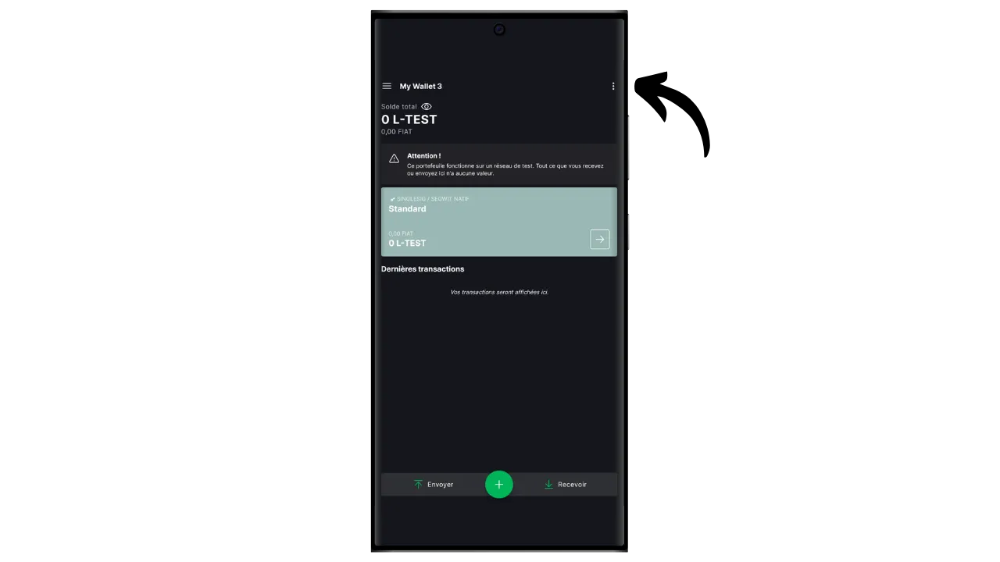

Bitcoini protokollil on tahtlikud tehnilised piirangud, mis aitavad säilitada võrgu detsentraliseeritust ja tagada, et turvalisus on jaotatud kõigi kasutajate vahel. Siiski võivad need piirangud mõnikord kasutajaid frustreerida, eriti ummikute ajal, mis on tingitud suurest samaaegsete tehingute hulgast. Arutelu Bitcoini skaleeritavuse üle on pikka aega kogukonda lõhestanud, eriti Blocksize War'i ajal. Pärast seda episoodi on Bitcoini kogukonnas laialdaselt tunnustatud, et skaleeritavus tuleb tagada ahelavälise lahenduse abil, teise kihi süsteemides. Nende lahenduste hulka kuuluvad sidechains, mis on veel suhteliselt tundmatu ja vähe kasutatud võrreldes teiste süsteemidega, näiteks Lightning Networkiga.

Sidechain on sõltumatu plokiahel, mis töötab paralleelselt peamise Bitcoini plokiahelaga. See kasutab Bitcoini kui arvestusühikut tänu mehhanismile nimega "*two-way peg*". See süsteem võimaldab bitcoinide lukustamist põhiahelas, et reprodutseerida nende väärtust sidechainis, kus need ringlevad tokenite kujul, mille tagatiseks on algsed bitcoinid. Need märgid säilitavad tavaliselt võrdse väärtuse peahelas lukustatud bitcoinidega ning protsessi saab Bitcoini raha tagasisaamiseks ümber pöörata.

Kõrvalahelate eesmärk on pakkuda lisafunktsioone või tehnilisi täiustusi, näiteks kiiremaid tehinguid, väiksemaid tasusid või toetust arukatele lepingutele. Neid uuendusi ei saa alati otse Bitcoini plokiahelas rakendada, ilma et see kahjustaks selle detsentraliseeritust või turvalisust. Seetõttu võimaldavad sidechains katsetada ja uurida uusi lahendusi, säilitades samal ajal Bitcoini terviklikkuse. Need protokollid nõuavad siiski sageli kompromisse, eelkõige detsentraliseerimise ja turvalisuse osas, sõltuvalt valitud valitsemismudelist ja konsensusmehhanismist.

Tänapäeval on ilmselt kõige tuntum sidechain Liquid. Selles õpetuses räägin teile kõigepealt, mis on Liquid, ja seejärel juhatan teid, kuidas seda hõlpsasti Blockstream Green rakendusega kasutama hakata, et saaksite nautida kõiki selle eeliseid.

## Mis on Liquid Network?

Liquid on Bitcoini jaoks mõeldud föderatiivne sidechain overlay, mille on välja töötanud Blockstream, et parandada tehingute kiirust, konfidentsiaalsust ja funktsionaalsust. See kasutab föderatsioonil loodud kahepoolset ankurdamismehhanismi, et lukustada bitcoinid põhiahelas ja luua vastutasuks Liquid-bitcoinid (L-BTC), mis on Tokenid, mis ringlevad Liquidis, jäädes samal ajal algsete bitcoinide poolt tagatud.

Liquid-võrk tugineb osalejate föderatsioonile, mis koosneb Bitcoini ökosüsteemi tunnustatud üksustest, kes valideerivad plokke ja haldavad kahepoolset sidumist. Lisaks L-BTC-le võimaldab Liquid ka muude digitaalsete varade, näiteks stablecoins ja muude krüptovaluutade emiteerimist.

## Blockstream Green'i tutvustamine

Blockstream Green on tarkvara rahakott, mis on saadaval mobiilis ja töölaual. Varem tuntud kui *Green Address*, sai see rahakott pärast selle omandamist 2016. aastal Blockstreami projektiks.

Green on eriti lihtsasti kasutatav rakendus, mis teeb selle huvitavaks ka algajatele. See pakub kõiki hea Bitcoini rahakoti olulisi funktsioone, sealhulgas RBF (*Replace-by-Fee*), Tor-ühenduse võimalus, võimalus ühendada oma sõlme, SPV (*Simple Payment Verification*), mündi märgistamine ja kontroll.

Blockstream Green toetab ka Liquid-võrku, ja seda me selles õpetuses ka välja selgitame. Kui soovite kasutada Green'i teiste rakenduste jaoks, siis soovitan vaadata ka neid teisi õpetusi:

https://planb.network/tutorials/wallet/desktop/blockstream-green-desktop-c1503adf-1404-4328-b814-aa97fcf0d5da
https://planb.network/tutorials/wallet/mobile/blockstream-green-e84edaa9-fb65-48c1-a357-8a5f27996143
https://planb.network/tutorials/wallet/mobile/blockstream-green-watch-only-66c3bc5a-5fa1-40ef-9998-6d6f7f2810fb
## Blockstream Green rakenduse paigaldamine ja konfigureerimine

Esimene samm on loomulikult rohelise rakenduse allalaadimine. Mine oma rakenduste poodi:

- [Androidile](https://play.google.com/store/apps/details?id=com.greenaddress.greenbits_android_wallet);
- [Apple](https://apps.apple.com/us/app/green-bitcoin-wallet/id1402243590).

Androidi kasutajate jaoks saate rakenduse paigaldada ka `.apk` faili kaudu [saadaval Blockstream'i GitHubis](https://github.com/Blockstream/green_android/releases).

Käivitage rakendus, seejärel märgistage ruut "Nõustun tingimustega...*".

Kui avate Greeni esimest korda, ilmub avakuva ilma seadistatud portfooliota. Hiljem, kui loote või impordite portfooliosid, ilmuvad need sellesse kasutajaliidesesse. Enne portfelli loomisele minekut soovitan kohandada rakenduse seaded vastavalt oma vajadustele. Klõpsake nuppu "Rakenduse seaded".

Valik "*Tihedam privaatsus*", mis on saadaval ainult Androidi puhul, suurendab privaatsust, keelates ekraanipiltide tegemise ja rakenduste eelvaate varjamise. Samuti lukustab see automaatselt rakenduste juurdepääsu kohe, kui teie telefon on lukustatud, mis muudab teie andmete paljastamise keerulisemaks.

Neile, kes soovivad suurendada oma privaatsust, pakub rakendus võimalust juurida oma liiklust Tori kaudu, mis on võrk, mis krüpteerib kõik teie ühendused ja muudab teie tegevuse raskesti jälgitavaks. Kuigi see võimalus võib rakenduse tööd veidi aeglustada, on see oma privaatsuse kaitsmiseks väga soovitatav, eriti kui te ei kasuta oma täielikku sõlme.

Kasutajatele, kellel on oma täielik sõlme, pakub Green Wallet võimalust ühendada see Electrumi serveri kaudu, tagades täieliku kontrolli Bitcoini võrguandmete ja tehingute levitamise üle. Kuid see funktsioon on mõeldud klassikaliste Bitcoini rahakottide jaoks, nii et te ei vaja seda, kui kasutate Liquid'i.

Teine alternatiivne funktsioon on valik "*SPV Verification*", mis võimaldab teil kontrollida teatud plokiahela andmeid otse ja seega vähendada vajadust usaldada Blockstream'i vaikimisi sõlme, kuigi see meetod ei paku kõiki täieliku sõlme garantiisid. Jällegi, see mõjutab ainult teie onchain Bitcoini rahakotte, mitte Liquidit.

Kui olete need seaded oma vajadustele vastavaks muutnud, klõpsake nupule "*Save*" ja käivitage rakendus uuesti.

## Loo Liquid portfelli Blockstream Green

Nüüd olete valmis looma Liquid portfelli. Vajutage nupule "*Alusta*".

Saate valida, kas luua lokaalne tarkvaraline rahakott või hallata külma rahakotti riistvaralise rahakoti kaudu. Selle õpetuse puhul keskendume kuuma rahakoti loomisele Liquidil, seega peate valima valiku "*See seade*". Võite kasutada ka ühilduvat riistvaralist rahakotti, näiteks Blockstream Jade, et kindlustada oma Liquid rahakotti.

Seejärel saate valida, kas taastada olemasolev Bitcoini rahakott või luua uus. Selle õpetuse jaoks loome uue rahakoti. Kui teil on aga vaja taastada olemasolev Liquid rahakott selle mälulause alusel, näiteks pärast riistvaralise rahakoti kadumist, peate valima teise võimaluse.

Seejärel saate valida kas 12- või 24-sõnalise mnemofraasi. See fraas võimaldab teil taastada juurdepääsu oma rahakotile mis tahes ühilduva tarkvara abil, kui teie telefoniga tekib probleem. Praegu ei paku 24-sõnalise fraasi valimine suuremat turvalisust kui 12-sõnaline fraas. Seepärast soovitan teil valida 12-sõnaline mnemooniline fraas.

Green annab teile seejärel oma mnemoonilise fraasi. Enne jätkamist veenduge, et teid ei jälgita. Klõpsake "*Montaažifraasi näitamine*", et see ekraanile kuvada.

**See mnemoonik annab teile täieliku ja piiramatu juurdepääsu kõigile teie bitcoinidele ** Igaüks, kes seda mnemoonikut valdab, võib teie raha varastada, isegi ilma füüsilise juurdepääsuta teie telefonile.

See taastab juurdepääsu teie bitcoinidele telefoni kadumise, varguse või purunemise korral. Seega on väga oluline teha hoolikalt **füüsilisel andmekandjal (mitte digitaalsel)** varukoopia ja hoida seda turvalises kohas. Võite selle paberile kirjutada või täiendava turvalisuse tagamiseks, kui tegemist on suure rahakotiga, soovitan selle graveerida roostevabast terasest kandjale, et kaitsta seda tulekahju, üleujutuse või varingu ohu eest (väikese hulga bitcoinide kaitsmiseks mõeldud kuuma rahakoti puhul piisab tõenäoliselt lihtsast paberist varukoopiast).

*Loomulikult ei tohi te neid sõnu kunagi internetis jagada, nagu ma seda käesolevas õpetuses teen. Seda näidisportfelli kasutatakse ainult Liquid's Testnetis ja see kustutatakse õpetuse lõpus.*

Kui olete oma mnemoonilise fraasi füüsilisel andmekandjal õigesti salvestanud, klõpsake nupule "*Jätka*". Green Wallet palub teil seejärel kinnitada mõned sõnad teie mnemoonilises fraasis, et veenduda, et olete need õigesti salvestanud. Täitke tühjad kohad puuduvate sõnadega.

Valige oma seadme PIN-kood, mida kasutatakse rohelise rahakoti avamiseks. See on teie kaitse volitamata füüsilise juurdepääsu eest. See PIN-kood ei ole seotud teie rahakoti krüptograafiliste võtmete tuletamisega. Seega, isegi kui teil puudub juurdepääs sellele PIN-koodile, võimaldab teie 12- või 24-sõnalise mnemoonilise fraasi omamine taastada juurdepääsu oma bitcoinidele.

Soovitame valida võimalikult juhusliku 6-kohalise PIN-koodi. Kindlasti salvestage see kood, et te seda ei unustaks, sest muidu olete sunnitud oma rahakoti mälupaberist välja otsima. Seejärel saate lisada biomeetrilise blokeerimise võimaluse, et vältida PIN-koodi sisestamist iga kord, kui seda kasutate. Üldiselt on biomeetria palju vähem turvaline kui PIN-kood ise. Seega soovitan ma vaikimisi seda avamisvõimalust mitte seadistada.

Sisestage PIN-kood teist korda, et seda kinnitada.

Oodake, kuni teie portfoolio on loodud, seejärel klõpsake nupule "*Loo konto*".

Valige lahtrisse "*Aktiivne*" valik "*Liquid Bitcoin*". Seejärel saate valida tavalise ühe allkirjaga rahakoti, mida me kasutame selles õpetuses, või kahefaktorilise autentimisega (2FA) kaitstud rahakoti vahel.

Ja see ongi kõik, teie Liquid rahakott on loodud, kasutades Green rakendust!

Enne kui saate oma esimesed bitcoinid oma Liquid rahakotti, ** soovitan teil tungivalt teha tühja taastamistesti**. Pange kirja mõned võrdlusandmed, näiteks oma xpub või esimene vastuvõtuaadress, seejärel kustutage oma rahakott rohelises rakenduses, kui see on veel tühi. Seejärel proovige taastada oma rahakott Greenis, kasutades oma paberkandjal varukoopiaid. Kontrollige, et pärast taastamist genereeritud küpsisteave vastab sellele, mille te algselt kirja panite. Kui see vastab, võite olla kindel, et teie paberkandjal varukoopiad on usaldusväärsed. Lisateavet selle kohta, kuidas teha testtaastamine, leiate sellest teisest juhendmaterjalist:

https://planb.network/tutorials/wallet/backup/recovery-test-5a75db51-a6a1-4338-a02a-164a8d91b895
## Likviidse portfelli loomine

Kui soovite oma portfelli isikupärastada, klõpsake kolmel väikesel punktil üleval paremas nurgas.

Valik "*Rename*" võimaldab teil kohandada oma portfelli nime, mis on eriti kasulik, kui haldate samas rakenduses mitut portfelli.

Menüü "*Unit*" võimaldab teil muuta oma rahakoti põhiühikut. Näiteks saate valida, kas see kuvatakse bitcoinide asemel satoshides.

Menüü "*Settings*" pakub juurdepääsu teie Bitcoini rahakoti erinevatele valikutele.

Siit leiate näiteks oma *deskriptori*, mis võib tulla kasuks, kui kavatsete sellest Liquid portfellist luua ainult kellasid sisaldava portfelli.

Samuti saate muuta oma rahakoti PIN-koodi ja aktiveerida biomeetrilise ühenduse.

## Kasutades oma Liquid portfelli

Nüüd, kui teie Liquid portfell on loodud, olete valmis saama oma esimesed L-satid!

Kui sul ei ole veel L-BTC-d, on sul mitu võimalust. Esimene võimalus on lasta endale otse saata. Kui keegi soovib teile maksta bitcoinidega Liquidis, andke talle lihtsalt vastuvõtuaadress. Teine võimalus on vahetada oma bitcoinid ahelas või Lightning-võrgus L-BTC vastu. Selleks võite kasutada [silda, näiteks Boltz](https://boltz.exchange/). Lihtsalt sisestage oma Liquid-aadress saidile, seejärel tehke makse kas Lightning-võrgu või onchaini kaudu.

Vedeliku aadressi genereerimiseks klõpsake nupule "*Võta*".

Seejärel kuvatakse rohelise värviga esimene tühi vastuvõtuaadress teie rahakotis. Saate L-BTC saatmiseks kas skannida seotud QR-koodi või kopeerida aadressi otse.

Kui tehing edastatakse võrgus, ilmub see teie rahakotis.

Oodake, kuni olete saanud piisavalt kinnitusi, et pidada tehingut lõplikuks. Liquidis peaksid kinnitused olema kiired, sest plokk avaldatakse iga minut.

Kui L-satid on teie Liquid portfellis, saate neid nüüd ka saata. Klõpsake nupule "*Send*".

Järgmisel leheküljel sisestage saaja vedeliku aadress. Võite selle käsitsi sisestada või skannida selle QR-koodi.

Valige maksesumma.

Klõpsake "*Järgmine*", et pääseda tehingu kokkuvõtte ekraanile. Kontrollige, et aadress, summa ja tasud on õiged.

Kui kõik läheb hästi, libistage ekraani allosas olevat rohelist nuppu paremale, et allkirjastada ja edastada tehing Bitcoini võrgus.

Teie tehing ilmub nüüd teie Bitcoini rahakoti armatuurlauale ja ootab kinnitust.

Ja nüüd tead, kuidas kasutada Liquid sidechain lihtsalt Blockstream Green rakendusega!

Kui leidsid selle õpetuse kasulikuks, oleksin tänulik, kui jätaksid alla rohelise pöidla. Jaga seda artiklit julgelt oma suhtlusvõrgustikes. Tänan teid väga!

Samuti soovitan teil vaadata seda teist põhjalikku õpetust Blockstream Green mobiilirakenduse kohta, et luua onchain Bitcoini kuum rahakott :

https://planb.network/tutorials/wallet/mobile/blockstream-green-e84edaa9-fb65-48c1-a357-8a5f27996143