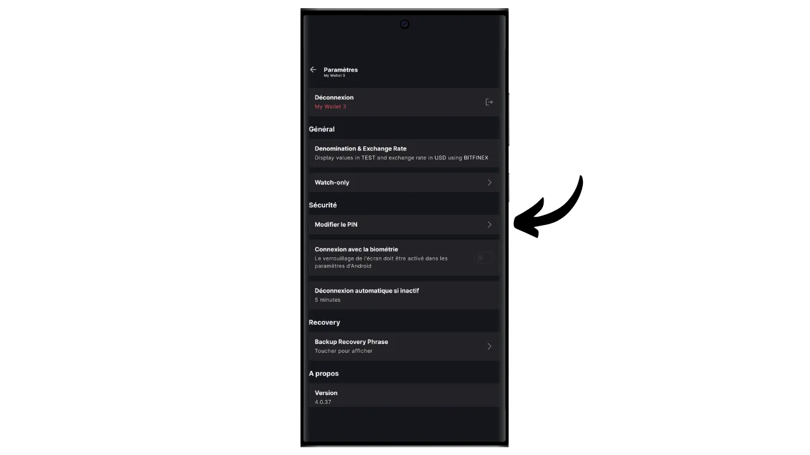
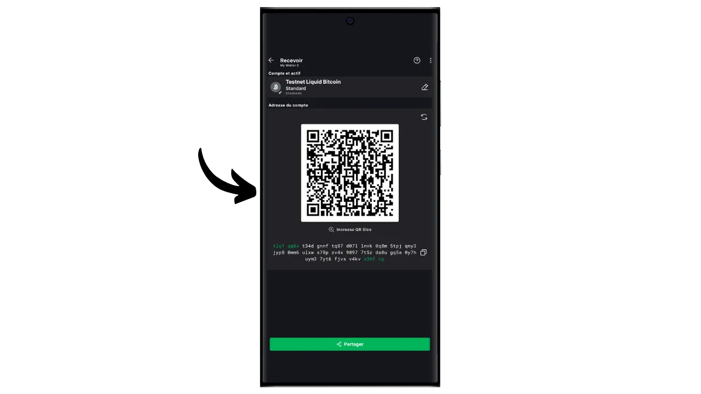

Bitcoin-protokollaan liittyy tarkoituksellisia teknisiä rajoituksia, joiden avulla ylläpidetään verkon hajautuneisuutta ja varmistetaan, että turvallisuus jakautuu kaikkien käyttäjien kesken. Nämä rajoitukset voivat kuitenkin joskus turhauttaa käyttäjiä, erityisesti ruuhkautumisen aikana, joka johtuu suuresta määrästä samanaikaisia transaktioita. Bitcoinin skaalautuvuutta koskeva keskustelu on jakanut yhteisöä pitkään, erityisesti Blocksize Warin aikana. Tämän episodin jälkeen Bitcoin-yhteisössä on laajalti tunnustettu, että skaalautuvuus on varmistettava ketjun ulkopuolisilla ratkaisuilla, toisen kerroksen järjestelmissä. Näitä ratkaisuja ovat muun muassa sivuketjut, jotka ovat vielä suhteellisen tuntemattomia ja vähän käytettyjä verrattuna muihin järjestelmiin, kuten Lightning Networkiin.

Sivuketju on itsenäinen lohkoketju, joka toimii rinnakkain Bitcoinin päälohkoketjun kanssa. Se käyttää Bitcoinia tiliyksikkönä "*two-way peg*" -nimisen mekanismin ansiosta. Tämä järjestelmä mahdollistaa bitcoinien lukitsemisen pääketjussa, jotta niiden arvo voidaan monistaa sivuketjussa, jossa ne kiertävät tokenien muodossa, joiden vakuutena ovat alkuperäiset bitcoinit. Nämä rahakkeet säilyttävät yleensä arvonsa pääketjuun lukittujen bitcoinien kanssa, ja prosessi voidaan kääntää päinvastaiseksi Bitcoin-varojen takaisin saamiseksi.

Sivuketjujen tavoitteena on tarjota lisätoimintoja tai teknisiä parannuksia, kuten nopeampia transaktioita, alhaisempia maksuja tai tukea älykkäitä sopimuksia. Näitä innovaatioita ei aina voida toteuttaa suoraan Bitcoin-lohkoketjuun vaarantamatta sen hajautusta tai turvallisuutta. Sivuketjut mahdollistavat siis uusien ratkaisujen testaamisen ja tutkimisen Bitcoinin eheyden säilyttäen. Nämä protokollat edellyttävät kuitenkin usein kompromisseja erityisesti hajautuksen ja turvallisuuden osalta riippuen valitusta hallintomallista ja konsensusmekanismista.

Nykyään tunnetuin sivuketju on luultavasti Liquid. Tässä opetusohjelmassa kerron ensin, mikä Liquid on, ja opastan sitten, miten voit aloittaa sen käytön helposti Blockstream Green -sovelluksella, jotta voit nauttia kaikista sen eduista.

## Mikä on Liquid Network?

Liquid on Blockstreamin Bitcoinille kehittämä federoitu sivuketjujen päällekkäiskäyttö, jonka tarkoituksena on parantaa transaktioiden nopeutta, luottamuksellisuutta ja toiminnallisuutta. Se käyttää federaatioon perustuvaa kahdenvälistä ankkurointimekanismia, jolla lukitaan bitcoineja pääketjuun ja luodaan vastineeksi Liquid-bitcoineja (L-BTC), jotka ovat Liquidissa kiertäviä tokeneita, mutta joiden takana ovat edelleen alkuperäiset bitcoinit.

Liquid-verkko perustuu osallistujien liittoon, joka koostuu Bitcoin-ekosysteemin tunnustetuista yhteisöistä, jotka validoivat lohkoja ja hallinnoivat kahdenvälistä kytkentää. L-BTC:n lisäksi Liquid mahdollistaa myös muiden digitaalisten omaisuuserien, kuten stablecoinien ja muiden kryptovaluuttojen, liikkeeseenlaskun.

## Esittelyssä Blockstream Green

Blockstream Green on ohjelmistolompakko, joka on saatavilla mobiililaitteissa ja työpöydillä. Tämä lompakko tunnettiin aiemmin nimellä *Green Address*, ja siitä tuli Blockstream-projekti sen jälkeen, kun se ostettiin vuonna 2016.

Green on erityisen helppokäyttöinen sovellus, mikä tekee siitä mielenkiintoisen aloittelijoille. Se tarjoaa kaikki hyvän Bitcoin-lompakon olennaiset ominaisuudet, mukaan lukien RBF (*Replace-by-Fee*), Tor-yhteysvaihtoehto, mahdollisuus liittää oma solmu, SPV (*Simple Payment Verification*), kolikoiden merkitseminen ja valvonta.

Blockstream Green tukee myös Liquid-verkkoa, ja se selviää tässä oppaassa. Jos haluat käyttää Greeniä muihin sovelluksiin, suosittelen tutustumaan myös näihin muihin opetusohjelmiin:

https://planb.network/tutorials/wallet/desktop/blockstream-green-desktop-c1503adf-1404-4328-b814-aa97fcf0d5da
https://planb.network/tutorials/wallet/mobile/blockstream-green-e84edaa9-fb65-48c1-a357-8a5f27996143
https://planb.network/tutorials/wallet/mobile/blockstream-green-watch-only-66c3bc5a-5fa1-40ef-9998-6d6f7f2810fb
## Blockstream Green -sovelluksen asentaminen ja määrittäminen

Ensimmäinen vaihe on tietenkin Green-sovelluksen lataaminen. Mene sovelluskauppaan:

- [Androidille](https://play.google.com/store/apps/details?id=com.greenaddress.greenbits_android_wallet);
- [Applen puolesta](https://apps.apple.com/us/app/green-bitcoin-wallet/id1402243590).

Android-käyttäjät voivat asentaa sovelluksen myös .apk-tiedoston kautta [saatavilla Blockstreamin GitHubissa](https://github.com/Blockstream/green_android/releases).

Käynnistä sovellus ja ruksaa "Hyväksyn ehdot...*" -ruutu.

Kun avaat Greenin ensimmäistä kertaa, aloitusnäyttö tulee näkyviin ilman määritettyä salkkua. Jos myöhemmin luot tai tuot portfolioita, ne näkyvät tässä käyttöliittymässä. Ennen kuin jatkat portfolion luomista, suosittelen, että säädät sovelluksen asetukset tarpeisiisi sopiviksi. Napsauta "Sovellusasetukset".

Vain Androidissa käytettävissä oleva "*Parannettu yksityisyys*" -vaihtoehto parantaa yksityisyyttä poistamalla kuvakaappaukset käytöstä ja piilottamalla sovellusten esikatselukuvat. Se myös lukitsee automaattisesti sovellusten käyttöoikeudet heti, kun puhelin lukitaan, jolloin tietojasi on vaikeampi paljastaa.

Niille, jotka haluavat parantaa yksityisyyttään, sovellus tarjoaa mahdollisuuden ohjata liikennettäsi Tor-verkon kautta, joka salaa kaikki yhteytesi ja tekee toiminnastasi vaikeasti jäljitettävää. Vaikka tämä vaihtoehto saattaa hieman hidastaa sovelluksen toimintaa, se on erittäin suositeltavaa yksityisyytesi suojaamiseksi, varsinkin jos et käytä omaa kokonaista solmua.

Käyttäjille, joilla on oma kokonainen solmu, Green Wallet tarjoaa mahdollisuuden muodostaa siihen yhteys Electrum-palvelimen kautta, mikä takaa täydellisen hallinnan Bitcoin-verkkotietojen ja transaktioiden levittämisen suhteen. Tämä ominaisuus on kuitenkin tarkoitettu klassisille Bitcoin-lompakoille, joten et tarvitse sitä, jos käytät Liquidia.

Toinen vaihtoehtoinen ominaisuus on "*SPV Verification*" -vaihtoehto, jonka avulla voit tarkistaa tietyt lohkoketjujen tiedot suoraan ja siten vähentää tarvetta luottaa Blockstreamin oletussolmuun, vaikka tämä menetelmä ei tarjoa kaikkia täyden solmun takuita. Jälleen kerran, tämä vaikuttaa vain onchain Bitcoin-lompakkoihisi, ei Liquidiin.

Kun olet säätänyt nämä asetukset tarpeisiisi, napsauta "*Tallenna*"-painiketta ja käynnistä sovellus uudelleen.

## Luo Liquid portfolio Blockstream Greenissä

Olet nyt valmis luomaan Liquid-portfolion. Napsauta "*Get Started*" -painiketta.

Voit valita, luotko paikallisen ohjelmistolompakon vai hallinnoitko kylmää lompakkoa laitteistolompakon avulla. Tässä oppaassa keskitymme luomaan kuuman lompakon Liquidiin, joten sinun on valittava "*Tällä laitteella*" -vaihtoehto. Voit myös käyttää yhteensopivaa laitteistolompakkoa, kuten Blockstream Jadea, Liquid-lompakon suojaamiseen.

Voit sitten valita, palautatko olemassa olevan Bitcoin-lompakon vai luotko uuden. Tässä ohjeessa luomme uuden lompakon. Jos sinun on kuitenkin palautettava olemassa oleva Liquid-lompakko sen muistilausekkeesta, esimerkiksi laitteistolompakon menetyksen jälkeen, sinun on valittava toinen vaihtoehto.

Voit sitten valita joko 12- tai 24-sanaisen muistilausekkeen. Tämän lauseen avulla voit palauttaa lompakkosi mistä tahansa yhteensopivasta ohjelmistosta, jos puhelimessasi ilmenee ongelmia. Tällä hetkellä 24-sanaisen lauseen valitseminen ei tarjoa enempää turvallisuutta kuin 12-sanaisen lauseen valitseminen. Siksi suosittelen, että valitset 12-sanaisen muistilausekkeen.

Green antaa sinulle sitten muistisanan. Ennen kuin jatkat, varmista, ettei sinua tarkkailla. Napsauta "*Näytä palautuslause*" näyttääksesi sen näytöllä.

**Tämä muistisääntö antaa sinulle täyden, rajoittamattoman pääsyn kaikkiin bitcoineihisi ** Kuka tahansa, jolla on tämä muistisääntö hallussaan, voi varastaa varojasi, vaikka hänellä ei olisi fyysistä pääsyä puhelimeesi.

Se palauttaa pääsyn bitcoineihisi, jos puhelimesi katoaa, varastetaan tai rikkoutuu. On siis erittäin tärkeää varmuuskopioida se huolellisesti **fyysiselle välineelle (ei digitaaliselle)** ja säilyttää se turvallisessa paikassa. Voit kirjoittaa sen paperille, tai jos kyseessä on suuri lompakko, suosittelen lisäturvallisuuden vuoksi kaiverruttamaan sen ruostumattomasta teräksestä valmistettuun tukeen, joka suojaa sitä tulipalon, tulvan tai romahduksen vaaralta (pienen bitcoin-määrän turvaamiseen suunnitellulle kuumalle lompakolle riittää luultavasti pelkkä paperivarmistus).

*Näitä sanoja ei tietenkään saa koskaan jakaa internetissä, kuten minä teen tässä ohjeessa. Tätä esimerkkisalkkua käytetään vain Liquidin Testnetissä, ja se poistetaan opetusohjelman päätyttyä.*

Kun olet tallentanut muistisääntösi oikein fyysiselle tietovälineelle, napsauta "*Jatka*". Tämän jälkeen Green Wallet pyytää sinua vahvistamaan joitakin muistilauseen sanoja varmistaaksesi, että olet tallentanut ne oikein. Täytä tyhjät kohdat puuttuvilla sanoilla.

Valitse laitteesi PIN-koodi, jota käytetään vihreän lompakon lukituksen avaamiseen. Tämä suojaa sinua luvattomalta fyysiseltä käytöltä. Tämä PIN-koodi ei osallistu lompakkosi kryptografisten avainten johtamiseen. Vaikka PIN-koodia ei olisikaan saatavilla, 12- tai 24-sanaisen muistilausekkeen avulla voit saada bitcoinisi takaisin haltuusi, vaikka sinulla ei olisikaan pääsyä siihen.

Suosittelemme valitsemaan 6-numeroisen PIN-koodin, joka on mahdollisimman satunnainen. Muista tallentaa tämä koodi, jotta et unohda sitä, muuten joudut hakemaan lompakkosi muistitikusta. Voit sitten lisätä biometrisen eston, jotta PIN-koodia ei tarvitse syöttää joka kerta, kun käytät sitä. Yleisesti ottaen biometriikka on paljon vähemmän turvallinen kuin itse PIN-koodi. Suosittelen siis oletusarvoisesti olemaan asettamatta tätä lukituksen avaamisvaihtoehtoa.

Vahvista PIN-koodi syöttämällä se toisen kerran.

Odota, että portfoliosi luodaan, ja napsauta sitten "*Luo tili*" -painiketta.

Valitse "*Aktiivinen*"-ruudusta "*Liquid Bitcoin*". Tämän jälkeen voit valita joko tavallisen yhden allekirjoituksen lompakon, jota käytämme tässä ohjeessa, tai kaksitekijätodennuksella (2FA) suojatun lompakon.

Ja se siitä, Liquid-lompakkosi on luotu Green-sovelluksella!

Ennen kuin saat ensimmäiset bitcoinit Liquid-lompakkoosi, **suositan sinua tekemään tyhjän palautustestin**. Merkitse muistiin joitakin viitetietoja, kuten xpub- tai ensimmäinen vastaanottava osoitteesi, ja poista sitten lompakkosi Green-sovelluksessa, kun se on vielä tyhjä. Yritä sitten palauttaa lompakkosi Greenissä käyttämällä paperisia varmuuskopioita. Tarkista, että palautuksen jälkeen luotu evästetieto vastaa alun perin kirjoittamaasi. Jos ne täsmäävät, voit olla varma, että paperiset varmuuskopiot ovat luotettavia. Jos haluat lisätietoja testipalautuksen suorittamisesta, tutustu tähän toiseen ohjeeseen:

https://planb.network/tutorials/wallet/backup/recovery-test-5a75db51-a6a1-4338-a02a-164a8d91b895
## Nestemäisen salkun perustaminen

Jos haluat muokata salkkuasi, napsauta kolmea pientä pistettä oikeassa yläkulmassa.

"*Rename*"-vaihtoehdon avulla voit muokata portfolion nimeä, mikä on erityisen hyödyllistä, jos hallinnoit useita portfolioita samassa sovelluksessa.

"*Yksikkö*"-valikossa voit vaihtaa lompakon perusyksikön. Voit esimerkiksi valita, näytetäänkö se satosheina eikä bitcoineina.

"*Settings*"-valikosta pääset Bitcoin-lompakkosi eri vaihtoehtoihin.

Täältä löydät esimerkiksi *descriptor*:n, joka voi olla kätevä, jos aiot perustaa vain kelloa käyttävän salkun tästä Liquid-salkusta.

Voit myös vaihtaa lompakon PIN-koodin ja aktivoida biometrisen yhteyden.

## Nestemäisen salkun käyttö

Nyt kun Liquid-salkkusi on perustettu, olet valmis vastaanottamaan ensimmäiset L-satsisi!

Jos sinulla ei vielä ole L-BTC:tä, sinulla on useita vaihtoehtoja. Ensimmäinen vaihtoehto on lähettää niitä suoraan sinulle. Jos joku haluaa maksaa sinulle bitcoineja Liquidissa, anna hänelle vastaanottoosoite. Toinen vaihtoehto on vaihtaa bitcoinit ketjussa tai Lightning-verkossa L-BTC:ksi. Voit tehdä tämän [Boltzin kaltaisen sillan](https://boltz.exchange/) avulla. Anna yksinkertaisesti Liquid-osoitteesi sivustolla ja suorita sitten maksu joko Lightning-verkon tai onchainin kautta.

Voit luoda Liquid-osoitteen napsauttamalla "*Vastaanottaa*"-painiketta.

Vihreä näyttää sitten lompakkosi ensimmäisen tyhjän vastaanotto-osoitteen. Voit joko skannata siihen liittyvän QR-koodin tai kopioida osoitteen suoraan lähettääksesi L-BTC:tä.

Kun transaktio lähetetään verkossa, se näkyy lompakossasi.

Odota, kunnes olet saanut tarpeeksi vahvistuksia, jotta voit pitää tapahtumaa lopullisena. Liquidissa vahvistusten pitäisi olla nopeita, sillä lohko julkaistaan minuutin välein.

Kun L-satelliitit ovat Liquid-salkussasi, voit nyt myös lähettää niitä. Klikkaa "*lähettää*".

Kirjoita seuraavalla sivulla vastaanottajan Liquid-osoite. Voit syöttää sen manuaalisesti tai skannata sen QR-koodin.

Valitse maksun määrä.

Klikkaa "*Seuraava*" siirtyäksesi tapahtumien yhteenvetonäyttöön. Tarkista, että osoite, summa ja maksut ovat oikein.

Jos kaikki sujuu hyvin, liu'uta näytön alareunassa olevaa vihreää painiketta oikealle allekirjoittaaksesi ja lähettääksesi tapahtuman Bitcoin-verkkoon.

Tapahtumasi näkyy nyt Bitcoin-lompakkosi kojelaudalla ja odottaa vahvistusta.

Ja nyt osaat käyttää Liquid sidechainia helposti Blockstream Green -sovelluksen avulla!

Jos löysit tämän ohjeen hyödylliseksi, olisin kiitollinen, jos jättäisit vihreän peukalon alle. Voit vapaasti jakaa tämän artikkelin sosiaalisissa verkostoissa. Kiitos paljon!

Suosittelen myös tutustumaan tähän muuhun kattavaan opetusohjelmaan Blockstream Green -mobiilisovelluksesta onchain Bitcoin hot walletin perustamiseksi:

https://planb.network/tutorials/wallet/mobile/blockstream-green-e84edaa9-fb65-48c1-a357-8a5f27996143