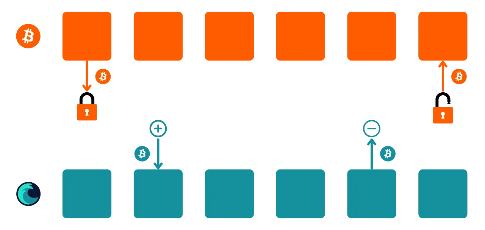
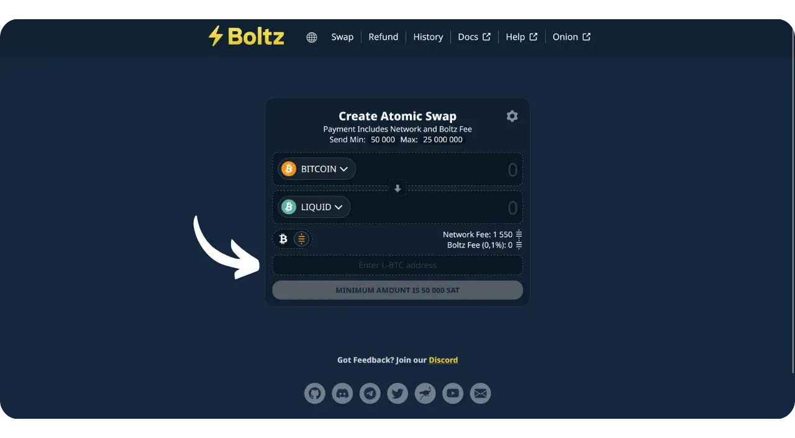

Protokol Bitcoin memiliki batasan teknis yang disengaja yang membantu menjaga desentralisasi jaringan dan memastikan keamanan terdistribusi di antara semua pengguna. Akan tetapi, keterbatasan ini terkadang dapat membuat pengguna frustasi, terutama pada saat terjadi kemacetan karena tingginya volume transaksi simultan. Perdebatan mengenai skalabilitas Bitcoin telah lama memecah belah komunitas, terutama selama Perang Blocksize. Sejak kejadian tersebut, telah diakui secara luas di dalam komunitas Bitcoin bahwa skalabilitas harus dipastikan dengan solusi off-chain, pada sistem lapisan kedua. Solusi ini termasuk sidechain, yang masih relatif tidak dikenal dan masih sedikit digunakan dibandingkan dengan sistem lain seperti Lightning Network.

Sidechain adalah sebuah blockchain independen yang beroperasi secara paralel dengan blockchain utama Bitcoin. Blockchain ini menggunakan bitcoin sebagai unit akun, berkat mekanisme yang disebut "*two-way peg*". Sistem ini memungkinkan untuk mengunci bitcoin pada rantai utama untuk mereproduksi nilainya pada sidechain, di mana mereka beredar dalam bentuk token yang didukung oleh bitcoin asli. Token-token ini biasanya memiliki nilai yang sama dengan bitcoin yang terkunci pada rantai utama, dan prosesnya dapat dibalik untuk memulihkan dana pada Bitcoin.

Tujuan dari sidechain adalah untuk menawarkan fungsi tambahan atau peningkatan teknis, seperti transaksi yang lebih cepat, biaya yang lebih rendah, atau dukungan untuk smart contract. Inovasi-inovasi ini tidak selalu dapat diimplementasikan secara langsung pada blockchain Bitcoin tanpa mengorbankan desentralisasi atau keamanannya. Oleh karena itu, sidechain memungkinkan untuk menguji dan mengeksplorasi solusi baru dengan tetap menjaga integritas Bitcoin. Akan tetapi, protokol ini sering kali membutuhkan kompromi, terutama dalam hal desentralisasi dan keamanan, tergantung pada model tata kelola dan mekanisme konsensus yang dipilih.

Saat ini, sidechain yang paling terkenal mungkin adalah Liquid. Dalam tutorial ini, pertama-tama saya akan memberi tahu Anda apa itu Liquid, dan kemudian memandu Anda tentang cara mulai menggunakannya dengan mudah menggunakan aplikasi Blockstream Green, sehingga Anda dapat menikmati semua manfaatnya.

## Apa yang dimaksud dengan Liquid Network?

Liquid adalah hamparan sidechain federasi untuk Bitcoin, yang dikembangkan oleh Blockstream untuk meningkatkan kecepatan, kerahasiaan, dan fungsionalitas transaksi. Ini menggunakan mekanisme penahan bilateral yang dibuat pada federasi untuk mengunci bitcoin pada rantai utama dan membuat Liquid-bitcoin (L-BTC) sebagai gantinya, token yang beredar di Liquid sambil tetap didukung oleh bitcoin asli.

Jaringan Liquid bergantung pada federasi peserta, yang terdiri dari entitas yang diakui dari ekosistem Bitcoin, yang memvalidasi blok dan mengelola pengelompokan bilateral. Selain L-BTC, Liquid juga memungkinkan penerbitan aset digital lainnya, seperti stablecoin dan mata uang kripto lainnya.

## Memperkenalkan Blockstream Green

Blockstream Green adalah dompet perangkat lunak yang tersedia di ponsel dan desktop. Sebelumnya dikenal sebagai *Green Address*, dompet ini menjadi proyek Blockstream setelah diakuisisi pada tahun 2016.

Green merupakan aplikasi yang sangat mudah digunakan, yang membuatnya menarik untuk pemula. Aplikasi ini menawarkan semua fitur penting dari dompet Bitcoin yang bagus, termasuk RBF (*Replace-by-Fee*), opsi koneksi Tor, kemampuan untuk menghubungkan node Anda sendiri, SPV (*Simple Payment Verification*), penandaan dan kontrol koin.

Blockstream Green juga mendukung jaringan Liquid, dan itulah yang akan kita pelajari dalam tutorial ini. Jika Anda ingin menggunakan Green untuk aplikasi lain, saya sarankan Anda juga melihat tutorial lainnya:

https://planb.network/tutorials/wallet/desktop/blockstream-green-desktop-c1503adf-1404-4328-b814-aa97fcf0d5da
https://planb.network/tutorials/wallet/mobile/blockstream-green-e84edaa9-fb65-48c1-a357-8a5f27996143
https://planb.network/tutorials/wallet/mobile/blockstream-green-watch-only-66c3bc5a-5fa1-40ef-9998-6d6f7f2810fb
## Menginstal dan mengonfigurasi aplikasi Blockstream Green

Langkah pertama tentu saja mengunduh aplikasi Green. Buka toko aplikasi Anda:

- [Untuk Android](https://play.google.com/store/apps/details?id=com.greenaddress.greenbits_android_wallet);
- [Untuk Apple](https://apps.apple.com/us/app/green-bitcoin-wallet/id1402243590).

Untuk pengguna Android, Anda juga dapat menginstal aplikasi melalui file `.apk` [tersedia di GitHub Blockstream](https://github.com/Blockstream/green_android/releases).

Luncurkan aplikasi, lalu centang kotak "Saya menerima ketentuan...*".

Apabila Anda membuka Green untuk pertama kali, layar beranda muncul tanpa portofolio yang dikonfigurasi. Nanti, jika Anda membuat atau mengimpor portofolio, portofolio akan muncul dalam antarmuka ini. Sebelum melanjutkan untuk membuat portofolio, saya sarankan Anda menyesuaikan pengaturan aplikasi agar sesuai dengan kebutuhan Anda. Klik pada "Pengaturan aplikasi".

Opsi "*Privasi yang Ditingkatkan*", yang hanya tersedia di Android, meningkatkan privasi dengan menonaktifkan tangkapan layar dan menyembunyikan pratinjau aplikasi. Opsi ini juga secara otomatis mengunci akses aplikasi segera setelah ponsel Anda terkunci, sehingga data Anda lebih sulit untuk diekspos.

Bagi mereka yang ingin meningkatkan privasi mereka, aplikasi ini menawarkan opsi untuk melakukan rooting pada lalu lintas Anda melalui Tor, sebuah jaringan yang mengenkripsi semua koneksi Anda dan membuat aktivitas Anda sulit dilacak. Meskipun opsi ini mungkin sedikit memperlambat operasi aplikasi, ini sangat disarankan untuk melindungi privasi Anda, terutama jika Anda tidak menggunakan simpul lengkap Anda sendiri.

Untuk pengguna yang memiliki node lengkap mereka sendiri, Green Wallet menawarkan opsi untuk menghubungkannya melalui server Electrum, menjamin kontrol penuh atas informasi jaringan Bitcoin dan penyebaran transaksi. Tetapi fitur ini hanya untuk dompet Bitcoin klasik, jadi Anda tidak memerlukannya jika Anda menggunakan Liquid.

Fitur alternatif lainnya adalah opsi "*SPV Verification*", yang memungkinkan Anda untuk memverifikasi data blockchain tertentu secara langsung dan dengan demikian mengurangi kebutuhan untuk mempercayai node default Blockstream, meskipun metode ini tidak memberikan semua jaminan dari sebuah node yang lengkap. Sekali lagi, ini hanya akan mempengaruhi dompet Bitcoin onchain Anda, bukan Liquid.

Setelah Anda menyesuaikan pengaturan ini dengan kebutuhan Anda, klik tombol "*Save*" dan mulai ulang aplikasi.

## Buat portofolio Liquid di Blockstream Green

Anda sekarang siap untuk membuat portofolio Liquid. Klik tombol "*Mulai*".

Anda dapat memilih antara membuat dompet perangkat lunak lokal atau mengelola dompet dingin melalui dompet perangkat keras. Untuk tutorial ini, kita akan berfokus pada pembuatan hot wallet di Liquid, jadi Anda harus memilih opsi "*On This Device*". Anda juga dapat menggunakan dompet perangkat keras yang kompatibel, seperti Blockstream Jade, untuk mengamankan dompet Liquid Anda.

Anda kemudian bisa memilih untuk memulihkan dompet Bitcoin yang sudah ada atau membuat yang baru. Untuk keperluan tutorial ini, kita akan membuat dompet baru. Akan tetapi, jika Anda perlu membuat ulang dompet Liquid yang sudah ada dari frasa mnemoniknya, misalnya setelah kehilangan dompet perangkat keras Anda, Anda harus memilih opsi kedua.

Anda kemudian dapat memilih antara frasa mnemonik 12 kata atau 24 kata. Frasa ini akan memungkinkan Anda untuk memulihkan akses ke dompet Anda dari perangkat lunak yang kompatibel jika terjadi masalah pada ponsel Anda. Saat ini, memilih frasa 24 kata tidak memberikan keamanan yang lebih baik daripada frasa 12 kata. Oleh karena itu, saya sarankan Anda memilih frasa mnemonik 12 kata.

Hijau kemudian akan memberikan frasa mnemonik Anda. Sebelum melanjutkan, pastikan Anda tidak sedang diawasi. Klik "*Tampilkan frasa pemulihan*" untuk menampilkannya di layar.

**Mnemonik ini memberikan Anda akses penuh dan tidak terbatas ke semua bitcoin Anda ** Siapa pun yang memiliki mnemonik ini dapat mencuri dana Anda, bahkan tanpa akses fisik ke ponsel Anda.

Ini akan mengembalikan akses ke bitcoin Anda jika terjadi kehilangan, pencurian, atau kerusakan pada ponsel Anda. Jadi, sangat penting untuk mencadangkannya dengan hati-hati **pada media fisik (bukan digital)** dan menyimpannya di tempat yang aman. Anda bisa menuliskannya di selembar kertas, atau untuk keamanan tambahan, jika ini adalah dompet yang besar, saya sarankan untuk mengukirnya di atas penyangga baja tahan karat untuk melindunginya dari risiko kebakaran, banjir, atau kehancuran (untuk hot wallet yang dirancang untuk mengamankan sejumlah kecil bitcoin, cadangan kertas sederhana mungkin sudah cukup).

*Tentu saja, Anda tidak boleh membagikan kata-kata ini di Internet, seperti yang saya lakukan dalam tutorial ini. Portofolio sampel ini hanya akan digunakan di Testnet Liquid dan akan dihapus di akhir tutorial.*

Setelah Anda merekam frasa mnemonik Anda dengan benar pada media fisik, klik "*Lanjutkan*". Green Wallet kemudian akan meminta Anda untuk mengonfirmasi beberapa kata dalam frasa mnemonik Anda untuk memastikan Anda telah merekamnya dengan benar. Isi bagian yang kosong dengan kata-kata yang hilang.

Pilih kode PIN perangkat Anda, yang akan digunakan untuk membuka kunci Green wallet Anda. Ini adalah perlindungan Anda terhadap akses fisik yang tidak sah. Kode PIN ini tidak terlibat dalam penurunan kunci kriptografi dompet Anda. Jadi, bahkan tanpa akses ke kode PIN ini, dengan memiliki frasa mnemonik 12 atau 24 kata, Anda bisa mendapatkan kembali akses ke bitcoin Anda.

Kami menyarankan untuk memilih kode PIN 6 digit yang dibuat seacak mungkin. Pastikan untuk menyimpan kode ini agar Anda tidak lupa, jika tidak, Anda akan dipaksa untuk mengambil dompet Anda dari mnemonik. Anda bisa menambahkan opsi pemblokiran biometrik untuk menghindari keharusan memasukkan PIN setiap kali Anda menggunakannya. Secara umum, biometrik jauh lebih tidak aman dibandingkan dengan PIN itu sendiri. Jadi, secara default, saya menyarankan Anda untuk tidak mengatur opsi pembukaan kunci ini.

Masukkan PIN Anda untuk kedua kalinya untuk mengonfirmasikannya.

Tunggu hingga portofolio Anda dibuat, lalu klik tombol "*Buat akun*".

Pada kotak "*Aktif*", pilih "*Bitcoin Cair*". Anda kemudian bisa memilih antara dompet tanda tangan tunggal standar, yang akan kita gunakan dalam tutorial ini, atau dompet yang dilindungi oleh autentikasi dua faktor (2FA).

Dan itu saja, dompet Liquid Anda telah dibuat menggunakan aplikasi Green!

Sebelum Anda menerima bitcoin pertama Anda di dompet Liquid, **Saya sangat menyarankan Anda untuk melakukan tes pemulihan kosong**. Catatlah beberapa informasi referensi, seperti xpub atau alamat penerima pertama Anda, kemudian hapus dompet Anda di aplikasi Green saat masih kosong. Kemudian coba pulihkan dompet Anda di Green menggunakan cadangan kertas Anda. Periksa apakah informasi cookie yang dihasilkan setelah pemulihan sesuai dengan yang Anda tulis sebelumnya. Jika sesuai, Anda bisa yakin bahwa cadangan kertas Anda dapat diandalkan. Untuk mengetahui lebih lanjut mengenai cara melakukan uji coba pemulihan, silakan baca tutorial lainnya:

https://planb.network/tutorials/wallet/backup/recovery-test-5a75db51-a6a1-4338-a02a-164a8d91b895
## Menyiapkan portofolio Liquid Anda

Jika Anda ingin mempersonalisasi portofolio Anda, klik pada tiga titik kecil di sudut kanan atas.

Opsi "*Rename*" memungkinkan Anda menyesuaikan nama portofolio Anda, yang sangat berguna jika Anda mengelola beberapa portofolio pada aplikasi yang sama.

Menu "*Unit*" memungkinkan Anda untuk mengubah satuan dasar dompet Anda. Sebagai contoh, Anda bisa memilih untuk menampilkannya dalam satoshi daripada bitcoin.

Menu "*Pengaturan*" menyediakan akses ke berbagai opsi dompet Bitcoin Anda.

Di sini, misalnya, Anda akan menemukan *descriptor* Anda, yang mungkin berguna jika Anda berencana untuk membuat portofolio watch-only dari portofolio Liquid ini.

Anda juga dapat mengubah PIN dompet dan mengaktifkan koneksi biometrik.

## Menggunakan portofolio Liquid Anda

Setelah portofolio Liquid Anda diatur, Anda siap menerima L-sat pertama Anda!

Jika Anda belum memiliki L-BTC, Anda memiliki beberapa opsi. Yang pertama adalah meminta beberapa dikirim langsung kepada Anda. Jika seseorang ingin membayar Anda dengan bitcoin di Liquid, cukup berikan alamat penerima. Opsi lainnya adalah menukarkan bitcoin Anda di chain atau di jaringan Lightning dengan L-BTC. Untuk melakukan ini, Anda dapat menggunakan [jembatan seperti Boltz] (https://boltz.exchange/). Cukup masukkan alamat Liquid Anda di situs tersebut, lalu lakukan pembayaran baik melalui jaringan Lightning atau onchain.

Untuk membuat alamat Liquid, klik tombol "*Terima*".

Warna hijau kemudian akan menampilkan alamat penerima pertama yang kosong di dompet Anda. Anda bisa memindai kode QR yang terkait, atau menyalin alamat tersebut secara langsung untuk mengirim L-BTC.

Ketika transaksi disiarkan di jaringan, transaksi tersebut akan muncul di dompet Anda.

Tunggu hingga Anda menerima konfirmasi yang cukup untuk menganggap transaksi sudah pasti. Di Liquid, konfirmasi seharusnya cepat, karena sebuah blok diterbitkan setiap menit.

Dengan L-sat dalam portofolio Liquid Anda, Anda sekarang juga dapat mengirimnya. Klik "*Kirim*".

Pada halaman berikutnya, masukkan alamat Liquid penerima. Anda dapat memasukkannya secara manual atau memindai kode QR.

Pilih jumlah pembayaran.

Klik "*Selanjutnya*" untuk mengakses layar ringkasan transaksi. Periksa apakah alamat, jumlah, dan biaya sudah benar.

Jika semua berjalan lancar, geser tombol hijau di bagian bawah layar ke kanan untuk menandatangani dan menyiarkan transaksi di jaringan Bitcoin.

Transaksi Anda sekarang akan muncul di dasbor dompet Bitcoin Anda, menunggu konfirmasi.

Dan sekarang Anda tahu cara menggunakan sidechain Liquid dengan mudah dengan aplikasi Blockstream Green!

Jika Anda merasa tutorial ini bermanfaat, saya akan sangat berterima kasih jika Anda memberikan jempol hijau di bawah ini. Jangan ragu untuk membagikan artikel ini di jejaring sosial Anda. Terima kasih banyak!

Saya juga menyarankan Anda untuk melihat tutorial komprehensif lainnya di aplikasi seluler Blockstream Green untuk menyiapkan dompet Bitcoin onchain:

https://planb.network/tutorials/wallet/mobile/blockstream-green-e84edaa9-fb65-48c1-a357-8a5f27996143