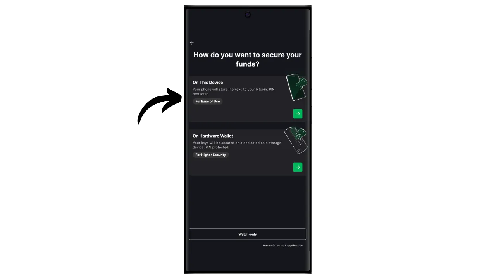
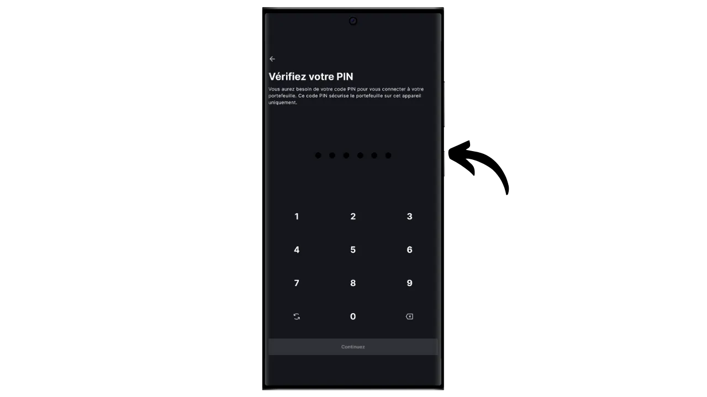

Il protocollo Bitcoin ha limitazioni tecniche intenzionali che aiutano a mantenere la decentralizzazione della rete e a garantire che la sicurezza sia distribuita tra tutti gli utenti. Tuttavia, queste limitazioni possono talvolta frustrare gli utenti, soprattutto in caso di congestione dovuta a un elevato volume di transazioni simultanee. Il dibattito sulla scalabilità di Bitcoin ha a lungo diviso la comunità, in particolare durante la Blocksize War. Dopo questo episodio, è ampiamente riconosciuto dalla comunità Bitcoin che la scalabilità deve essere garantita da soluzioni fuori catena, su sistemi di secondo livello. Queste soluzioni includono le sidechain, che sono ancora relativamente sconosciute e poco utilizzate rispetto ad altri sistemi come la Lightning Network.

Una sidechain è una blockchain indipendente che opera in parallelo alla blockchain principale di Bitcoin. Utilizza il bitcoin come unità di conto, grazie a un meccanismo chiamato "*two-way peg*". Questo sistema permette di bloccare i bitcoin sulla catena principale per riprodurne il valore sulla sidechain, dove circolano sotto forma di token sostenuti dai bitcoin originali. Questi token mantengono normalmente la parità di valore con i bitcoin bloccati sulla catena principale e il processo può essere invertito per recuperare i fondi su Bitcoin.

L'obiettivo delle sidechain è quello di offrire funzionalità aggiuntive o miglioramenti tecnici, come transazioni più veloci, commissioni più basse o supporto per i contratti intelligenti. Queste innovazioni non possono sempre essere implementate direttamente sulla blockchain di Bitcoin senza comprometterne la decentralizzazione o la sicurezza. Le sidechain permettono quindi di testare ed esplorare nuove soluzioni preservando l'integrità di Bitcoin. Tuttavia, questi protocolli richiedono spesso dei compromessi, soprattutto in termini di decentralizzazione e sicurezza, a seconda del modello di governance e del meccanismo di consenso scelto.

Oggi, la sidechain più conosciuta è probabilmente Liquid. In questo tutorial vi spiegherò innanzitutto cos'è Liquid e poi vi guiderò su come iniziare a usarlo facilmente con l'applicazione Blockstream Green, in modo da poterne sfruttare tutti i vantaggi.

## Che cos'è la Rete liquida?

Liquid è una sidechain federata per Bitcoin, sviluppata da Blockstream per migliorare la velocità, la riservatezza e la funzionalità delle transazioni. Utilizza un meccanismo di ancoraggio bilaterale stabilito su una federazione per bloccare i bitcoin sulla catena principale e creare in cambio Liquid-bitcoin (L-BTC), token che circolano su Liquid pur rimanendo sostenuti dai bitcoin originali.

La rete Liquid si basa su una federazione di partecipanti, composta da entità riconosciute dell'ecosistema Bitcoin, che convalidano i blocchi e gestiscono il pegging bilaterale. Oltre a L-BTC, Liquid consente anche l'emissione di altri asset digitali, come le stablecoin e altre criptovalute.

## Presentazione di Blockstream Green

Blockstream Green è un portafoglio software disponibile su mobile e desktop. Precedentemente noto come *Green Address*, questo portafoglio è diventato un progetto di Blockstream in seguito alla sua acquisizione nel 2016.

Green è un'applicazione particolarmente facile da usare, il che la rende interessante per i principianti. Offre tutte le caratteristiche essenziali di un buon portafoglio Bitcoin, tra cui RBF (*Replace-by-Fee*), un'opzione di connessione Tor, la possibilità di collegare il proprio nodo, SPV (*Simple Payment Verification*), etichettatura e controllo delle monete.

Blockstream Green supporta anche la rete Liquid, come scopriremo in questo tutorial. Se desiderate utilizzare Green per altre applicazioni, vi consiglio di dare un'occhiata anche a queste altre esercitazioni:

https://planb.network/tutorials/wallet/desktop/blockstream-green-desktop-c1503adf-1404-4328-b814-aa97fcf0d5da
https://planb.network/tutorials/wallet/mobile/blockstream-green-e84edaa9-fb65-48c1-a357-8a5f27996143
https://planb.network/tutorials/wallet/mobile/blockstream-green-watch-only-66c3bc5a-5fa1-40ef-9998-6d6f7f2810fb
## Installazione e configurazione dell'applicazione Blockstream Green

Il primo passo è ovviamente quello di scaricare l'applicazione Green. Andate nel vostro negozio di applicazioni:

- [Per Android](https://play.google.com/store/apps/details?id=com.greenaddress.greenbits_android_wallet);
- [Per Apple](https://apps.apple.com/us/app/green-bitcoin-wallet/id1402243590).

Per gli utenti Android, è possibile installare l'applicazione anche tramite il file `.apk` [disponibile su GitHub di Blockstream](https://github.com/Blockstream/green_android/releases).

Avviare l'applicazione, quindi selezionare la casella "Accetto le condizioni...*".

Quando si apre Green per la prima volta, la schermata iniziale appare senza un portafoglio configurato. In seguito, se si creano o importano portafogli, questi appariranno in questa interfaccia. Prima di procedere alla creazione di un portafoglio, si consiglia di regolare le impostazioni dell'applicazione in base alle proprie esigenze. Cliccare su "Impostazioni dell'applicazione".

L'opzione "*Privacy avanzata*", disponibile solo su Android, migliora la privacy disabilitando gli screenshot e nascondendo le anteprime delle applicazioni. Inoltre, blocca automaticamente l'accesso alle applicazioni non appena il telefono viene bloccato, rendendo più difficile l'esposizione dei dati.

Per coloro che desiderano migliorare la propria privacy, l'applicazione offre la possibilità di effettuare il rooting del traffico tramite Tor, una rete che cripta tutte le connessioni e rende le attività difficili da rintracciare. Sebbene questa opzione possa rallentare leggermente il funzionamento dell'applicazione, è altamente consigliata per proteggere la propria privacy, soprattutto se non si utilizza un proprio nodo completo.

Per gli utenti che dispongono di un proprio nodo completo, Green Wallet offre la possibilità di collegarsi ad esso tramite un server Electrum, garantendo un controllo totale sulle informazioni della rete Bitcoin e sulla diffusione delle transazioni. Questa funzione è però riservata ai portafogli Bitcoin classici, quindi non è necessaria se si utilizza Liquid.

Un'altra funzione alternativa è l'opzione "*Verifica SPV*", che consente di verificare direttamente alcuni dati della blockchain e quindi di ridurre la necessità di fidarsi del nodo predefinito di Blockstream, sebbene questo metodo non fornisca tutte le garanzie di un nodo completo. Anche in questo caso, ciò influisce solo sui portafogli Bitcoin onchain, non su Liquid.

Dopo aver regolato le impostazioni in base alle proprie esigenze, fare clic sul pulsante "*Salva*" e riavviare l'applicazione.

## Creare un portafoglio di liquidi su Blockstream Green

Ora siete pronti a creare un portafoglio Liquid. Cliccate sul pulsante "*Iniziare*".

È possibile scegliere tra la creazione di un portafoglio software locale o la gestione di un portafoglio freddo tramite un portafoglio hardware. Per questa esercitazione, ci concentreremo sulla creazione di un portafoglio a caldo su Liquid, quindi dovrete selezionare l'opzione "*Su questo dispositivo*". È inoltre possibile utilizzare un portafoglio hardware compatibile, come Blockstream Jade, per proteggere il proprio portafoglio Liquid.

Si può quindi scegliere di ripristinare un portafoglio Bitcoin esistente o di crearne uno nuovo. Ai fini di questa esercitazione, creeremo un nuovo portafoglio. Tuttavia, se avete bisogno di rigenerare un portafoglio Liquid esistente dalla sua frase mnemonica, ad esempio in seguito alla perdita del vostro portafoglio hardware, dovrete scegliere la seconda opzione.

È possibile scegliere tra una frase mnemonica di 12 o 24 parole. Questa frase vi permetterà di recuperare l'accesso al vostro portafoglio da qualsiasi software compatibile in caso di problemi con il vostro telefono. Attualmente, la scelta di una frase di 24 parole non offre maggiore sicurezza di una frase di 12 parole. Vi consiglio quindi di scegliere una frase mnemonica di 12 parole.

Green vi fornirà la vostra frase mnemonica. Prima di continuare, assicuratevi di non essere osservati. Cliccate su "*Mostra la frase di recupero*" per visualizzarla sullo schermo.

**Questo mnemonico vi dà accesso completo e illimitato a tutti i vostri bitcoin ** Chiunque sia in possesso di questo mnemonico può rubare i vostri fondi, anche senza accedere fisicamente al vostro telefono.

Ripristina l'accesso ai bitcoin in caso di perdita, furto o rottura del telefono. È quindi molto importante eseguire un backup accurato **su un supporto fisico (non digitale)** e conservarlo in un luogo sicuro. Potete scriverlo su un pezzo di carta o, per maggiore sicurezza, se si tratta di un portafoglio di grandi dimensioni, vi consiglio di inciderlo su un supporto in acciaio inossidabile per proteggerlo dal rischio di incendi, inondazioni o crolli (per un portafoglio caldo progettato per proteggere una piccola quantità di bitcoin, un semplice backup cartaceo è probabilmente sufficiente).

*Ovviamente, non dovete mai condividere queste parole su Internet, come sto facendo io in questo tutorial. Questo portfolio di esempio sarà utilizzato solo su Testnet di Liquid e sarà cancellato alla fine del tutorial.*

Dopo aver registrato correttamente la frase mnemonica su un supporto fisico, fare clic su "*Continua*". Green Wallet vi chiederà di confermare alcune parole della vostra frase mnemonica per assicurarsi che siano state registrate correttamente. Riempite gli spazi vuoti con le parole mancanti.

Scegliere il codice PIN del dispositivo, che verrà utilizzato per sbloccare il portafoglio verde. Si tratta di una protezione contro l'accesso fisico non autorizzato. Il codice PIN non partecipa alla creazione delle chiavi crittografiche del portafoglio. Pertanto, anche senza accesso a questo codice PIN, il possesso della frase mnemonica di 12 o 24 parole vi permetterà di riavere accesso ai vostri bitcoin.

Si consiglia di scegliere un codice PIN di 6 cifre il più casuale possibile. Assicuratevi di salvare questo codice per non dimenticarlo, altrimenti sarete costretti a recuperare il portafoglio dalla mnemonica. È possibile aggiungere un'opzione di blocco biometrico per evitare di dover inserire il PIN ogni volta che lo si utilizza. In generale, la biometria è molto meno sicura del PIN stesso. Pertanto, per impostazione predefinita, vi consiglio di non impostare questa opzione di sblocco.

Immettere il PIN una seconda volta per confermarlo.

Attendere la creazione del portafoglio, quindi fare clic sul pulsante "*Crea un account*".

Nella casella "*Active*", selezionare "*Liquid Bitcoin*". È possibile scegliere tra un portafoglio standard a firma singola, che utilizzeremo in questo tutorial, o un portafoglio protetto da autenticazione a due fattori (2FA).

Ed ecco che il vostro portafoglio liquido è stato creato con l'applicazione Green!

Prima di ricevere i primi bitcoin sul vostro portafoglio Liquid, **vi consiglio vivamente di eseguire un test di recupero del vuoto**. Prendete nota di alcune informazioni di riferimento, come il vostro indirizzo xpub o il primo indirizzo di ricezione, quindi cancellate il vostro portafoglio sull'app Green quando è ancora vuoto. Quindi provare a ripristinare il portafoglio su Green utilizzando i backup cartacei. Verificate che le informazioni del cookie generate dopo il ripristino corrispondano a quelle annotate in origine. Se è così, potete essere certi che i vostri backup cartacei sono affidabili. Per saperne di più su come effettuare un ripristino di prova, consultate quest'altro tutorial:

https://planb.network/tutorials/wallet/backup/recovery-test-5a75db51-a6a1-4338-a02a-164a8d91b895
## Impostazione del portafoglio liquidi

Se si desidera personalizzare il proprio portafoglio, cliccare sui tre puntini in alto a destra.

L'opzione "*Rename*" consente di personalizzare il nome del portafoglio, particolarmente utile se si gestiscono diversi portafogli sulla stessa applicazione.

Il menu "*Unit*" consente di modificare l'unità di base del portafoglio. Ad esempio, si può scegliere di visualizzarlo in satoshi anziché in bitcoin.

Il menu "*Impostazioni*" consente di accedere alle varie opzioni del portafoglio Bitcoin.

Qui, ad esempio, si trova il *descrittore*, che può essere utile se si intende impostare un portafoglio di soli orologi da questo portafoglio Liquid.

È inoltre possibile modificare il PIN del portafoglio e attivare una connessione biometrica.

## Utilizzo del portafoglio liquidi

Ora che il vostro portafoglio Liquid è stato configurato, siete pronti a ricevere i vostri primi L-sat!

Se non avete ancora L-BTC, avete diverse opzioni. La prima è quella di farseli inviare direttamente. Se qualcuno vuole pagarvi in bitcoin su Liquid, basta fornirgli un indirizzo di ricezione. L'altra opzione è quella di scambiare i vostri bitcoin onchain o sulla rete Lightning con L-BTC. Per farlo, è possibile utilizzare [un bridge come Boltz](https://boltz.exchange/). È sufficiente inserire il proprio indirizzo Liquid sul sito, quindi effettuare il pagamento tramite la rete Lightning o onchain.

Per generare un indirizzo liquido, fare clic sul pulsante "*Ricevi*".

Green visualizzerà quindi il primo indirizzo di ricezione vuoto nel vostro portafoglio. È possibile scansionare il codice QR associato o copiare direttamente l'indirizzo per inviare L-BTC.

Quando la transazione viene trasmessa alla rete, appare nel vostro portafoglio.

Aspettate di ricevere un numero sufficiente di conferme per considerare la transazione definitiva. Su Liquid, le conferme dovrebbero essere rapide, poiché ogni minuto viene pubblicato un blocco.

Con gli L-sat nel vostro portafoglio Liquid, ora potete anche inviarli. Cliccate su "*Invio*".

Nella pagina successiva, inserire l'indirizzo Liquid del destinatario. È possibile inserirlo manualmente o scansionare il suo codice QR.

Scegliere l'importo del pagamento.

Cliccare su "*Avanti*" per accedere alla schermata di riepilogo della transazione. Verificare che l'indirizzo, l'importo e le spese siano corretti.

Se tutto va bene, fate scorrere verso destra il pulsante verde in fondo allo schermo per firmare e trasmettere la transazione sulla rete Bitcoin.

La transazione apparirà ora sulla dashboard del vostro portafoglio Bitcoin, in attesa di conferma.

E ora sapete come utilizzare facilmente la sidechain di Liquid con l'applicazione Blockstream Green!

Se avete trovato utile questa guida, vi sarei grato se lasciaste un pollice verde qui sotto. Sentitevi liberi di condividere questo articolo sui vostri social network. Grazie mille!

Vi consiglio anche di dare un'occhiata a quest'altro tutorial completo sull'applicazione mobile Blockstream Green per configurare un hot wallet Bitcoin onchain:

https://planb.network/tutorials/wallet/mobile/blockstream-green-e84edaa9-fb65-48c1-a357-8a5f27996143