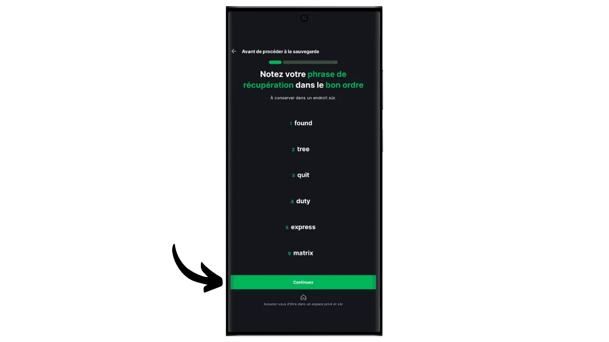
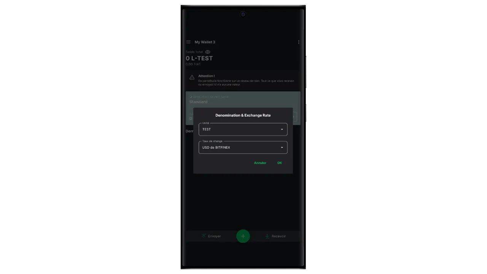
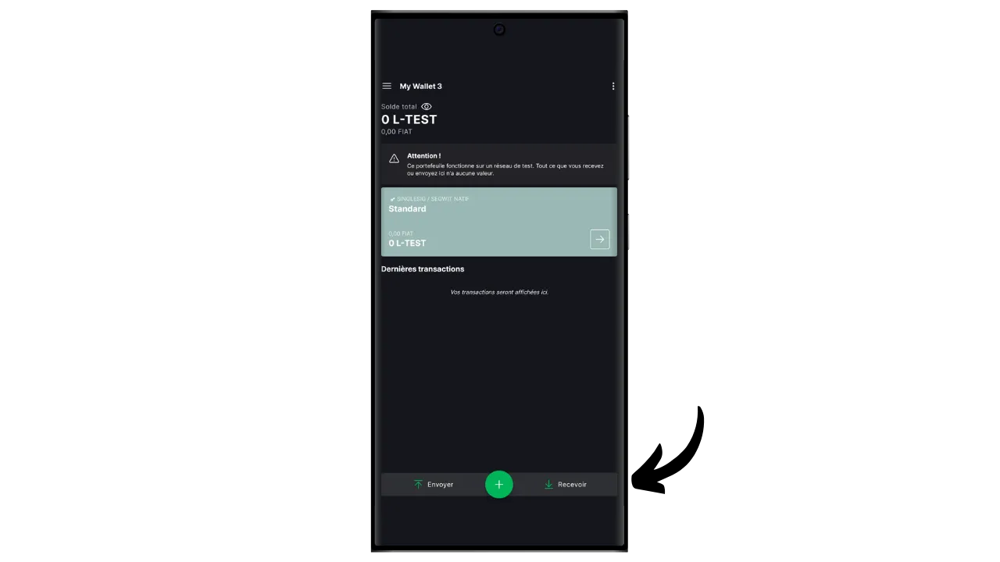
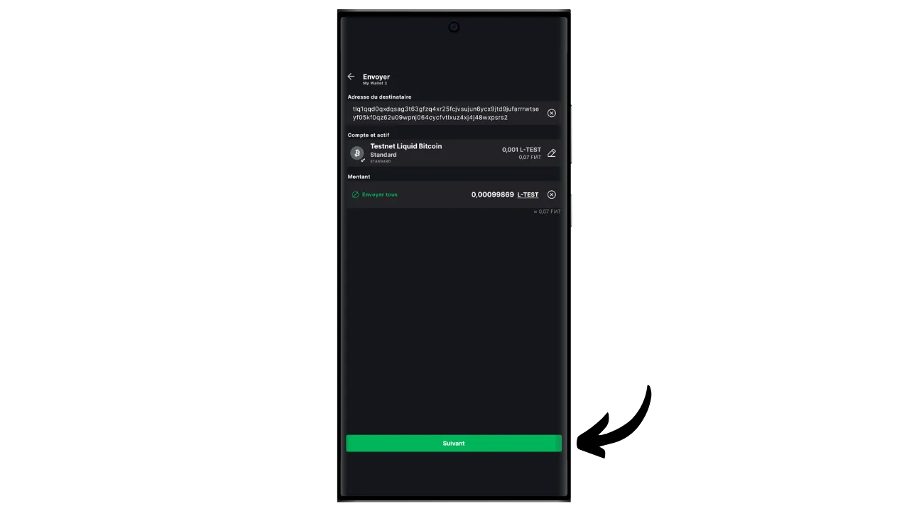

Bitcoin-protokollen har tilsiktede tekniske begrensninger som bidrar til å opprettholde nettverkets desentralisering og sørge for at sikkerheten fordeles på alle brukere. Disse begrensningene kan imidlertid noen ganger frustrere brukerne, særlig ved overbelastning på grunn av et høyt volum av samtidige transaksjoner. Debatten om Bitcoins skalerbarhet har lenge splittet samfunnet, særlig under Blocksize-krigen. Siden denne episoden er det allment anerkjent i Bitcoin-miljøet at skalerbarhet må sikres ved hjelp av off-chain-løsninger, på andre lags systemer. Disse løsningene inkluderer sidekjeder, som fortsatt er relativt ukjente og lite brukt sammenlignet med andre systemer som Lightning Network.

En sidekjede er en uavhengig blokkjede som opererer parallelt med hovedblokkjeden Bitcoin. Den bruker bitcoin som en regningsenhet, takket være en mekanisme som kalles "*two-way peg*". Dette systemet gjør det mulig å låse bitcoins i hovedkjeden for å reprodusere verdien deres i sidekjeden, der de sirkulerer i form av tokens støttet av de opprinnelige bitcoinsene. Disse tokens beholder normalt samme verdi som bitcoinsene som er låst på hovedkjeden, og prosessen kan reverseres for å få tilbake midler på Bitcoin.

Målet med sidekjeder er å tilby ekstra funksjonalitet eller tekniske forbedringer, for eksempel raskere transaksjoner, lavere avgifter eller støtte for smartkontrakter. Disse innovasjonene kan ikke alltid implementeres direkte i Bitcoin-blokkjeden uten at det går på bekostning av desentraliseringen eller sikkerheten. Sidekjeder gjør det derfor mulig å teste og utforske nye løsninger samtidig som Bitcoins integritet bevares. Disse protokollene krever imidlertid ofte kompromisser, særlig når det gjelder desentralisering og sikkerhet, avhengig av hvilken styringsmodell og konsensusmekanisme som velges.

I dag er den mest kjente sidekjeden sannsynligvis Liquid. I denne veiledningen vil jeg først fortelle deg hva Liquid er, og deretter veilede deg gjennom hvordan du enkelt kan begynne å bruke det med Blockstream Green-applikasjonen, slik at du kan dra nytte av alle fordelene.

## Hva er Liquid Network?

Liquid er en føderert sidekjede for Bitcoin, utviklet av Blockstream for å forbedre transaksjonshastighet, konfidensialitet og funksjonalitet. Den bruker en bilateral forankringsmekanisme etablert på en føderasjon for å låse bitcoins på hovedkjeden og skape Liquid-bitcoins (L-BTC) i retur, tokens som sirkulerer på Liquid mens de forblir støttet av de opprinnelige bitcoinsene.

Liquid-nettverket er avhengig av en føderasjon av deltakere, som består av anerkjente enheter fra Bitcoin-økosystemet, som validerer blokker og administrerer bilateral pegging. I tillegg til L-BTC muliggjør Liquid også utstedelse av andre digitale aktiva, som stablecoins og andre kryptovalutaer.

## Vi introduserer Blockstream Green

Blockstream Green er en programvarelommebok som er tilgjengelig på mobil og PC. Tidligere kjent som *Green Address*, ble denne lommeboken et Blockstream-prosjekt etter oppkjøpet i 2016.

Green er et spesielt brukervennlig program, noe som gjør det interessant for nybegynnere. Den tilbyr alle de viktigste funksjonene i en god Bitcoin-lommebok, inkludert RBF (*Replace-by-Fee*), et Tor-tilkoblingsalternativ, muligheten til å koble til din egen node, SPV (*Simple Payment Verification*), myntmerking og -kontroll.

Blockstream Green støtter også Liquid-nettverket, og det er det vi skal finne ut av i denne veiledningen. Hvis du ønsker å bruke Green til andre applikasjoner, anbefaler jeg at du også tar en titt på disse andre veiledningene:

https://planb.network/tutorials/wallet/desktop/blockstream-green-desktop-c1503adf-1404-4328-b814-aa97fcf0d5da
https://planb.network/tutorials/wallet/mobile/blockstream-green-e84edaa9-fb65-48c1-a357-8a5f27996143
https://planb.network/tutorials/wallet/mobile/blockstream-green-watch-only-66c3bc5a-5fa1-40ef-9998-6d6f7f2810fb
## Installere og konfigurere Blockstream Green-applikasjonen

Det første trinnet er selvfølgelig å laste ned Green-applikasjonen. Gå til applikasjonsbutikken din:

- [For Android] (https://play.google.com/store/apps/details?id=com.greenaddress.greenbits_android_wallet);
- [For Apple] (https://apps.apple.com/us/app/green-bitcoin-wallet/id1402243590).

For Android-brukere kan du også installere applikasjonen via `.apk`-filen [tilgjengelig på Blockstreams GitHub] (https://github.com/Blockstream/green_android/releases).

Start programmet, og kryss av i boksen "Jeg godtar vilkårene...*".

Når du åpner Green for første gang, vises startskjermbildet uten en konfigurert portefølje. Hvis du senere oppretter eller importerer porteføljer, vil de vises i dette grensesnittet. Før du går videre til å opprette en portefølje, anbefaler jeg at du justerer programinnstillingene slik at de passer til dine behov. Klikk på "Programinnstillinger".

Alternativet "*Avansert personvern*", som kun er tilgjengelig på Android, forbedrer personvernet ved å deaktivere skjermbilder og skjule forhåndsvisninger av applikasjoner. Det låser også automatisk tilgangen til applikasjoner så snart telefonen låses, noe som gjør det vanskeligere å eksponere dataene dine.

For de som ønsker å forbedre personvernet sitt, tilbyr applikasjonen muligheten til å roote trafikken din via Tor, et nettverk som krypterer alle forbindelsene dine og gjør det vanskelig å spore aktivitetene dine. Selv om dette alternativet kan gjøre applikasjonen litt tregere, anbefales det på det sterkeste for å beskytte personvernet ditt, spesielt hvis du ikke bruker din egen komplette node.

For brukere som har sin egen komplette node, tilbyr Green Wallet muligheten til å koble seg til den via en Electrum-server, noe som garanterer total kontroll over Bitcoin-nettverksinformasjon og transaksjonsformidling. Men denne funksjonen er for klassiske Bitcoin-lommebøker, så du trenger den ikke hvis du bruker Liquid.

En annen alternativ funksjon er alternativet "*SPV Verification*", som lar deg verifisere visse blockchain-data direkte og dermed redusere behovet for å stole på Blockstreams standardnode, selv om denne metoden ikke gir alle garantiene til en full node. Igjen, dette vil bare påvirke dine Bitcoin-lommebøker i kjeden, ikke Liquid.

Når du har tilpasset disse innstillingene til dine behov, klikker du på "*Lagre*"-knappen og starter programmet på nytt.

## Opprett en Liquid-portefølje på Blockstream Green

Du er nå klar til å opprette en Liquid-portefølje. Klikk på knappen "*Gå i gang*".

Du kan velge mellom å opprette en lokal programvarelommebok eller administrere en kald lommebok via en maskinvarelommebok. I denne veiledningen fokuserer vi på å opprette en varm lommebok på Liquid, så du må velge alternativet "*På denne enheten*". Du kan også bruke en kompatibel maskinvarelommebok, for eksempel Blockstream Jade, for å sikre Liquid-lommeboken din.

Du kan deretter velge å gjenopprette en eksisterende Bitcoin-lommebok eller opprette en ny. I denne veiledningen skal vi opprette en ny lommebok. Men hvis du trenger å regenerere en eksisterende Liquid-lommebok fra den mnemoniske frasen, for eksempel etter at du har mistet maskinvarelommeboken din, må du velge det andre alternativet.

Du kan deretter velge mellom en minnefrase på 12 eller 24 ord. Med denne frasen kan du få tilgang til lommeboken din fra hvilken som helst kompatibel programvare hvis det skulle oppstå et problem med telefonen din. For øyeblikket gir det ikke mer sikkerhet å velge en 24 ords frase enn en 12 ords frase. Jeg anbefaler derfor at du velger en mnemoteknisk frase på 12 ord.

Green vil da gi deg den mnemoniske frasen din. Før du fortsetter, må du forsikre deg om at du ikke blir overvåket. Klikk på "*Vis gjenopprettingsfrase*" for å vise den på skjermen.

**Denne huskeregelen gir deg full, ubegrenset tilgang til alle bitcoinsene dine ** Alle som er i besittelse av denne huskeregelen, kan stjele pengene dine, selv uten fysisk tilgang til telefonen din.

Den gjenoppretter tilgangen til bitcoinsene dine i tilfelle tap, tyveri eller ødeleggelse av telefonen din. Det er derfor svært viktig å sikkerhetskopiere den nøye **på et fysisk medium (ikke digitalt)** og oppbevare den på et sikkert sted. Du kan skrive det ned på et stykke papir, eller for ekstra sikkerhet, hvis dette er en stor lommebok, anbefaler jeg å gravere det på en støtte i rustfritt stål for å beskytte den mot brann, oversvømmelse eller kollaps (for en varm lommebok designet for å sikre en liten mengde bitcoins, er en enkel papirbackup sannsynligvis tilstrekkelig).

*Du må selvsagt aldri dele disse ordene på Internett, slik jeg gjør i denne veiledningen. Denne eksempelporteføljen vil kun bli brukt på Liquids Testnet og vil bli slettet ved slutten av opplæringen*

Når du har registrert huskefrasen din på et fysisk medium, klikker du på "*Fortsett*". Green Wallet ber deg da om å bekrefte noen av ordene i huskesetningen for å forsikre deg om at du har registrert dem riktig. Fyll ut de tomme feltene med de manglende ordene.

Velg enhetens PIN-kode, som vil bli brukt til å låse opp den grønne lommeboken. Dette er din beskyttelse mot uautorisert fysisk tilgang. Denne PIN-koden er ikke involvert i utledningen av lommebokens kryptografiske nøkler. Så selv uten tilgang til denne PIN-koden vil du kunne få tilgang til bitcoinsene dine igjen hvis du har den mnemoniske frasen på 12 eller 24 ord.

Vi anbefaler at du velger en sekssifret PIN-kode som er så tilfeldig som mulig. Husk å lagre denne koden slik at du ikke glemmer den, ellers vil du bli tvunget til å hente lommeboken din fra huskelappen. Du kan deretter legge til en biometrisk blokkering for å unngå å måtte taste inn PIN-koden hver gang du bruker den. Generelt sett er biometri langt mindre sikkert enn selve PIN-koden. Så som standard anbefaler jeg at du ikke konfigurerer dette opplåsingsalternativet.

Tast inn PIN-koden en gang til for å bekrefte den.

Vent til porteføljen din er opprettet, og klikk deretter på knappen "*Opprett en konto*".

I boksen "*Active*" velger du "*Liquid Bitcoin*". Du kan deretter velge mellom en standard lommebok med én signatur, som vi bruker i denne veiledningen, eller en lommebok som er beskyttet av tofaktorautentisering (2FA).

Og det var det, Liquid-lommeboken din har blitt opprettet ved hjelp av Green-applikasjonen!

Før du mottar dine første bitcoins i Liquid-lommeboken din, anbefaler jeg deg på det sterkeste å utføre en tom gjenopprettingstest**. Noter litt referanseinformasjon, for eksempel din xpub eller første mottaksadresse, og slett deretter lommeboken din i Green-appen mens den fortsatt er tom. Prøv deretter å gjenopprette lommeboken din på Green ved hjelp av papirsikkerhetskopiene dine. Sjekk at cookie-informasjonen som genereres etter gjenopprettingen, stemmer overens med den du opprinnelig skrev ned. Hvis den gjør det, kan du være sikker på at papirsikkerhetskopiene dine er pålitelige. Hvis du vil vite mer om hvordan du utfører en testgjenoppretting, kan du lese denne andre veiledningen:

https://planb.network/tutorials/wallet/backup/recovery-test-5a75db51-a6a1-4338-a02a-164a8d91b895
## Sette opp Liquid-porteføljen din

Hvis du ønsker å tilpasse porteføljen din, klikker du på de tre små prikkene øverst i høyre hjørne.

Med alternativet "*Rename*" kan du tilpasse navnet på porteføljen din, noe som er spesielt nyttig hvis du administrerer flere porteføljer i samme program.

I menyen "*Unit*" kan du endre basisenheten for lommeboken din. Du kan for eksempel velge å vise den i satoshier i stedet for bitcoins.

Menyen "*Settings*" gir tilgang til de ulike alternativene i Bitcoin-lommeboken din.

Her finner du for eksempel *descriptor*, som kan være nyttig hvis du planlegger å sette opp en portefølje med kun overvåking fra denne Liquid-porteføljen.

Du kan også endre PIN-koden for lommeboken og aktivere en biometrisk tilkobling.

## Bruk av Liquid-porteføljen din

Nå som Liquid-porteføljen din er satt opp, er du klar til å motta dine første L-sats!

Hvis du ikke har L-BTC ennå, har du flere alternativer. Den første er å få noen sendt direkte til deg. Hvis noen ønsker å betale deg i bitcoins på Liquid, er det bare å gi dem en mottaksadresse. Det andre alternativet er å veksle bitcoinsene dine i kjeden eller på Lightning-nettverket mot L-BTC. For å gjøre dette kan du bruke [en bro som Boltz] (https://boltz.exchange/). Bare skriv inn Liquid-adressen din på nettstedet, og foreta deretter betaling enten via Lightning-nettverket eller på kjeden.

For å generere en Liquid-adresse klikker du på knappen "*Mottak*".

Green vil da vise den første tomme mottakeradressen i lommeboken din. Du kan enten skanne den tilhørende QR-koden, eller kopiere adressen direkte for å sende L-BTC.

Når transaksjonen sendes ut i nettverket, vises den i lommeboken din.

Vent til du har mottatt nok bekreftelser til å anse transaksjonen som endelig. På Liquid bør bekreftelsene komme raskt, ettersom det publiseres en blokk hvert minutt.

Når du har L-sats i Liquid-porteføljen din, kan du nå også sende dem. Klikk på "*Send*".

På neste side skriver du inn mottakerens Liquid-adresse. Du kan skrive den inn manuelt eller skanne QR-koden.

Velg betalingsbeløpet.

Klikk på "*Neste*" for å komme til skjermbildet med transaksjonsoversikten. Kontroller at adressen, beløpet og kostnadene er korrekte.

Hvis alt går bra, skyver du den grønne knappen nederst på skjermen til høyre for å signere og kringkaste transaksjonen på Bitcoin-nettverket.

Transaksjonen vises nå på dashbordet i Bitcoin-lommeboken din, i påvente av bekreftelse.

Og nå vet du hvordan du enkelt kan bruke Liquid-sidekjeden med Blockstream Green-applikasjonen!

Hvis du fant denne opplæringen nyttig, ville jeg være takknemlig hvis du legger igjen en grønn tommel nedenfor. Del gjerne denne artikkelen på dine sosiale nettverk. Tusen takk skal du ha!

Jeg anbefaler også at du sjekker ut denne andre omfattende veiledningen om Blockstream Green-mobilappen for å sette opp en onchain Bitcoin hot wallet :

https://planb.network/tutorials/wallet/mobile/blockstream-green-e84edaa9-fb65-48c1-a357-8a5f27996143