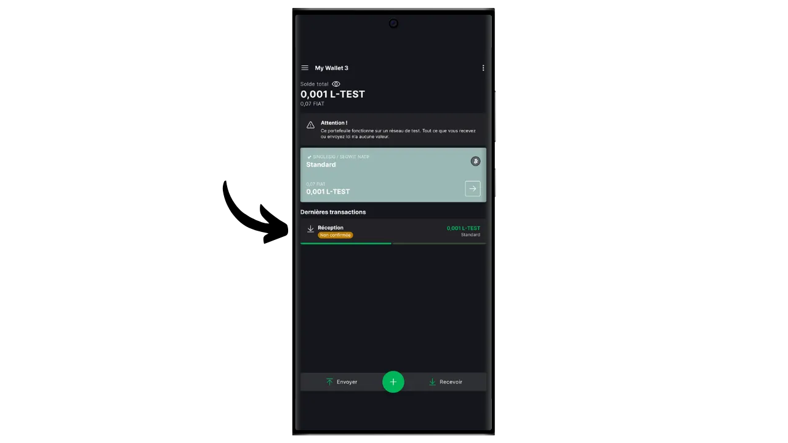

O protocolo Bitcoin tem limitações técnicas intencionais que ajudam a manter a descentralização da rede e a garantir que a segurança é distribuída por todos os utilizadores. No entanto, estas limitações podem por vezes frustrar os utilizadores, particularmente durante o congestionamento devido a um elevado volume de transacções simultâneas. O debate sobre a escalabilidade do Bitcoin há muito divide a comunidade, particularmente durante a Guerra dos Blocos. Desde esse episódio, é amplamente reconhecido dentro da comunidade Bitcoin que a escalabilidade deve ser assegurada por soluções fora da cadeia, em sistemas de segunda camada. Essas soluções incluem sidechains, que ainda são relativamente desconhecidas e pouco usadas em comparação com outros sistemas, como a Lightning Network.

Uma sidechain é uma blockchain independente que funciona em paralelo com a blockchain principal da Bitcoin. Utiliza a bitcoin como unidade de conta, graças a um mecanismo chamado "*two-way peg*". Este sistema permite bloquear bitcoins na cadeia principal para reproduzir o seu valor na cadeia lateral, onde circulam sob a forma de tokens apoiados pelos bitcoins originais. Estes tokens mantêm normalmente a paridade de valor com os bitcoins bloqueados na cadeia principal, e o processo pode ser revertido para recuperar fundos em Bitcoin.

O objetivo das sidechains é oferecer funcionalidades adicionais ou melhorias técnicas, tais como transacções mais rápidas, taxas mais baixas ou suporte para contratos inteligentes. Estas inovações nem sempre podem ser implementadas diretamente na blockchain da Bitcoin sem comprometer a sua descentralização ou segurança. As sidechains permitem, portanto, testar e explorar novas soluções, preservando a integridade do Bitcoin. No entanto, estes protocolos exigem muitas vezes compromissos, nomeadamente em termos de descentralização e de segurança, em função do modelo de governação e do mecanismo de consenso escolhidos.

Atualmente, a sidechain mais conhecida é provavelmente a Liquid. Neste tutorial, vou começar por dizer o que é o Liquid e, em seguida, vou guiá-lo através de como começar a usá-lo facilmente com a aplicação Blockstream Green, para que possa desfrutar de todos os seus benefícios.

## O que é a Liquid Network?

Liquid é uma sobreposição de sidechain federada para Bitcoin, desenvolvida pela Blockstream para melhorar a velocidade, confidencialidade e funcionalidade das transacções. Utiliza um mecanismo de ancoragem bilateral estabelecido numa federação para bloquear bitcoins na cadeia principal e criar Liquid-bitcoins (L-BTC) em troca, tokens que circulam no Liquid, mantendo-se apoiados pelos bitcoins originais.

A rede Liquid assenta numa federação de participantes, constituída por entidades reconhecidas do ecossistema Bitcoin, que validam os blocos e gerem a pegging bilateral. Para além do L-BTC, a Liquid também permite a emissão de outros activos digitais, como stablecoins e outras criptomoedas.

## Apresentação da Blockstream Green

A Blockstream Green é uma carteira de software disponível para telemóvel e computador. Anteriormente conhecida como *Green Address*, esta carteira tornou-se um projeto Blockstream após a sua aquisição em 2016.

Green é uma aplicação particularmente fácil de utilizar, o que a torna interessante para os principiantes. Oferece todas as caraterísticas essenciais de uma boa carteira Bitcoin, incluindo RBF (*Replace-by-Fee*), uma opção de ligação Tor, a possibilidade de ligar o seu próprio nó, SPV (*Simple Payment Verification*), marcação e controlo de moedas.

O Blockstream Green também suporta a rede Liquid, e é isso que vamos descobrir neste tutorial. Se quiser utilizar o Green para outras aplicações, recomendo que dê uma vista de olhos a estes outros tutoriais:

https://planb.network/tutorials/wallet/desktop/blockstream-green-desktop-c1503adf-1404-4328-b814-aa97fcf0d5da
https://planb.network/tutorials/wallet/mobile/blockstream-green-e84edaa9-fb65-48c1-a357-8a5f27996143
https://planb.network/tutorials/wallet/mobile/blockstream-green-watch-only-66c3bc5a-5fa1-40ef-9998-6d6f7f2810fb
## Instalar e configurar a aplicação Blockstream Green

O primeiro passo é, obviamente, descarregar a aplicação Green. Aceda à sua loja de aplicações:

- [Para Android](https://play.google.com/store/apps/details?id=com.greenaddress.greenbits_android_wallet);
- [Para a Apple](https://apps.apple.com/us/app/green-bitcoin-wallet/id1402243590).

Para os utilizadores de Android, também é possível instalar a aplicação através do ficheiro `.apk` [disponível no GitHub da Blockstream] (https://github.com/Blockstream/green_android/releases).

Inicie a aplicação e selecione a caixa "Aceito as condições...*".

Quando abre o Green pela primeira vez, o ecrã inicial aparece sem um portefólio configurado. Mais tarde, se criar ou importar portefólios, estes aparecerão nesta interface. Antes de começar a criar uma carteira, recomendo que ajuste as definições da aplicação de acordo com as suas necessidades. Clique em "Definições da aplicação".

A opção "*Privacidade melhorada*", disponível apenas no Android, melhora a privacidade ao desativar as capturas de ecrã e ao ocultar as pré-visualizações de aplicações. Também bloqueia automaticamente o acesso a aplicações assim que o telefone é bloqueado, tornando os seus dados mais difíceis de expor.

Para aqueles que desejam melhorar a sua privacidade, a aplicação oferece a opção de enraizar o seu tráfego através do Tor, uma rede que encripta todas as suas ligações e torna as suas actividades difíceis de rastrear. Embora esta opção possa abrandar ligeiramente o funcionamento da aplicação, é altamente recomendada para proteger a sua privacidade, especialmente se não estiver a utilizar o seu próprio nó completo.

Para os utilizadores que têm o seu próprio nó completo, a Green Wallet oferece a opção de se ligar a ele através de um servidor Electrum, garantindo um controlo total sobre a informação da rede Bitcoin e a disseminação das transacções. Mas esta funcionalidade destina-se às carteiras Bitcoin clássicas, pelo que não é necessária se estiver a utilizar a Liquid.

Outro recurso alternativo é a opção "*SPV Verification*", que permite verificar certos dados da blockchain diretamente e, assim, reduzir a necessidade de confiar no nó padrão do Blockstream, embora esse método não forneça todas as garantias de um nó completo. Novamente, isso só afetará suas carteiras Bitcoin onchain, não o Liquid.

Depois de ter ajustado estas definições às suas necessidades, clique no botão "*Guardar*" e reinicie a aplicação.

## Criar uma carteira líquida na Blockstream Green

Está agora pronto para criar uma carteira Liquid. Clique no botão "*Começar*".

Você pode escolher entre criar uma carteira de software local ou gerenciar uma carteira fria por meio de uma carteira de hardware. Para este tutorial, estamos nos concentrando em criar uma carteira quente no Liquid, então você precisará selecionar a opção "*Neste dispositivo*". Você também pode usar uma carteira de hardware compatível, como Blockstream Jade, para proteger sua carteira Liquid.

Pode então optar por restaurar uma carteira Bitcoin existente ou criar uma nova. Para os fins deste tutorial, criaremos uma nova carteira. No entanto, se precisar de regenerar uma carteira Liquid existente a partir da sua frase mnemónica, por exemplo, após a perda da sua carteira de hardware, terá de escolher a segunda opção.

Pode então escolher entre uma frase mnemónica de 12 ou 24 palavras. Esta frase permitir-lhe-á recuperar o acesso à sua carteira a partir de qualquer software compatível, em caso de problema com o seu telemóvel. Atualmente, a escolha de uma frase de 24 palavras não oferece mais segurança do que uma frase de 12 palavras. Por isso, recomendo que escolha uma frase mnemónica de 12 palavras.

Green vai então fornecer-lhe a sua frase mnemónica. Antes de continuar, certifique-se de que não está a ser observado. Clique em "*Mostrar a frase de recuperação*" para a visualizar no ecrã.

**Esta mnemónica dá-lhe acesso total e irrestrito a todos os seus bitcoins ** Qualquer pessoa na posse desta mnemónica pode roubar os seus fundos, mesmo sem acesso físico ao seu telefone.

Restaura o acesso aos seus bitcoins em caso de perda, roubo ou quebra do seu telemóvel. Por isso, é muito importante fazer uma cópia de segurança cuidadosa **num suporte físico (não digital)** e guardá-la num local seguro. Pode escrevê-la num pedaço de papel ou, para maior segurança, se se tratar de uma carteira grande, recomendo gravá-la num suporte de aço inoxidável para a proteger do risco de incêndio, inundação ou desmoronamento (para uma carteira quente concebida para proteger uma pequena quantidade de bitcoins, uma simples cópia de segurança em papel é provavelmente suficiente).

*Obviamente, nunca se deve partilhar estas palavras na Internet, como estou a fazer neste tutorial. Este exemplo de portefólio será utilizado apenas na Testnet do Liquid e será eliminado no final do tutorial

Depois de ter gravado corretamente a sua frase mnemónica num suporte físico, clique em "*Continuar*". A Green Wallet pedir-lhe-á então que confirme algumas das palavras da sua frase mnemónica para se certificar de que as gravou corretamente. Preencha os espaços em branco com as palavras em falta.

Escolha o código PIN do seu dispositivo, que será utilizado para desbloquear a sua carteira verde. Esta é a sua proteção contra o acesso físico não autorizado. Este código PIN não está envolvido na derivação das chaves criptográficas da sua carteira. Assim, mesmo sem acesso a este código PIN, a posse da sua frase mnemónica de 12 ou 24 palavras permitir-lhe-á recuperar o acesso aos seus bitcoins.

Recomendamos que escolha um código PIN de 6 dígitos que seja o mais aleatório possível. Não se esqueça de guardar este código para não o esquecer, caso contrário será obrigado a recuperar a sua carteira a partir da mnemónica. Pode então adicionar uma opção de bloqueio biométrico para evitar ter de introduzir o PIN sempre que a utilizar. De um modo geral, a biometria é muito menos segura do que o próprio PIN. Por isso, por defeito, aconselho-o a não configurar esta opção de desbloqueio.

Introduza o seu PIN uma segunda vez para o confirmar.

Aguarde que a sua carteira seja criada e, em seguida, clique no botão "*Criar uma conta*".

Na caixa "*Active*", selecione "*Liquid Bitcoin*". Pode então escolher entre uma carteira padrão de assinatura única, que utilizaremos neste tutorial, ou uma carteira protegida por autenticação de dois factores (2FA).

E já está, a sua carteira líquida foi criada com a aplicação Green!

Antes de receberes os teus primeiros bitcoins na tua carteira Liquid, **aconselho-te vivamente a fazeres um teste de recuperação vazio**. Tome nota de algumas informações de referência, como o seu xpub ou o primeiro endereço de receção, depois apague a sua carteira na aplicação Green enquanto ainda está vazia. Em seguida, tente restaurar a sua carteira na aplicação Green utilizando as suas cópias de segurança em papel. Verifique se as informações do cookie geradas após a restauração correspondem às que você anotou originalmente. Se corresponder, pode ter a certeza de que as suas cópias de segurança em papel são fiáveis. Para saber mais sobre como efetuar um teste de recuperação, consulte este outro tutorial:

https://planb.network/tutorials/wallet/backup/recovery-test-5a75db51-a6a1-4338-a02a-164a8d91b895
## Criar a sua carteira líquida

Se pretender personalizar a sua carteira, clique nos três pequenos pontos no canto superior direito.

A opção "*Renomear*" permite-lhe personalizar o nome da sua carteira, o que é particularmente útil se gerir várias carteiras na mesma aplicação.

O menu "*Unidade*" permite-lhe alterar a unidade base da sua carteira. Por exemplo, pode escolher mostrá-la em satoshis em vez de bitcoins.

O menu "*Settings*" dá acesso às várias opções da sua carteira Bitcoin.

Aqui, por exemplo, encontrará o seu *descriptor*, que pode ser útil se planear criar uma carteira só de observação a partir desta carteira Liquid.

Pode também alterar o PIN da sua carteira e ativar uma ligação biométrica.

## Utilizar a sua carteira líquida

Agora que a sua carteira Liquid está configurada, está pronto para receber os seus primeiros L-sats!

Se ainda não tens L-BTC, tens várias opções. A primeira é receber alguns diretamente para você. Se alguém quiser pagar-lhe em bitcoins na Liquid, basta fornecer-lhe um endereço de receção. A outra opção é trocar seus bitcoins onchain ou na rede Lightning por L-BTC. Para o fazer, pode utilizar [uma ponte como a Boltz] (https://boltz.exchange/). Basta introduzir o seu endereço Liquid no sítio e, em seguida, efetuar o pagamento através da rede Lightning ou onchain.

Para gerar um endereço líquido, clique no botão "*Receber*".

Green mostrará então o primeiro endereço de receção em branco na sua carteira. Você pode escanear o código QR associado ou copiar o endereço diretamente para enviar L-BTC.

Quando a transação for transmitida na rede, aparecerá na sua carteira.

Espere até receber confirmações suficientes para considerar a transação definitiva. No Liquid, as confirmações devem ser rápidas, pois um bloco é publicado a cada minuto.

Com L-sats na sua carteira Liquid, pode agora também enviá-los. Clique em "*Enviar*".

Na página seguinte, introduza o endereço líquido do destinatário. Pode introduzi-lo manualmente ou digitalizar o seu código QR.

Selecionar o montante do pagamento.

Clique em "*Próximo*" para aceder ao ecrã de resumo da transação. Verifique se o endereço, o montante e os encargos estão corretos.

Se tudo correr bem, deslize o botão verde na parte inferior do ecrã para a direita para assinar e transmitir a transação na rede Bitcoin.

A sua transação aparecerá agora no painel de controlo da sua carteira Bitcoin, aguardando confirmação.

E agora já sabes como usar a sidechain Liquid facilmente com a aplicação Blockstream Green!

Se achou este tutorial útil, agradecia que deixasse um polegar verde abaixo. Sinta-se à vontade para partilhar este artigo nas suas redes sociais. Muito obrigado!

Também recomendo que você verifique este outro tutorial abrangente sobre o aplicativo móvel Blockstream Green para configurar uma carteira quente Bitcoin onchain :

https://planb.network/tutorials/wallet/mobile/blockstream-green-e84edaa9-fb65-48c1-a357-8a5f27996143