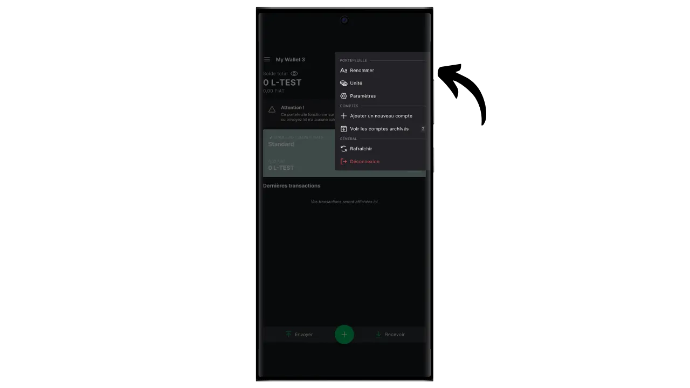
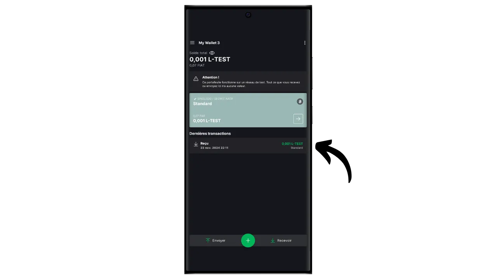

Протокол Bitcoin имеет преднамеренные технические ограничения, которые помогают поддерживать децентрализацию сети и обеспечивают распределение безопасности между всеми пользователями. Однако иногда эти ограничения могут разочаровывать пользователей, особенно во время перегруженности сети из-за большого количества одновременных транзакций. Споры о масштабируемости Биткойна долгое время разделяли сообщество, особенно во время Войны блоков. После этого эпизода в сообществе Биткойна стало широко признано, что масштабируемость должна обеспечиваться решениями вне цепочки, на системах второго уровня. К таким решениям относятся сайдчейны, которые все еще относительно неизвестны и мало используются по сравнению с другими системами, такими как Lightning Network.

Сайдчейн - это независимый блокчейн, который работает параллельно с основным блокчейном Bitcoin. Он использует биткоин в качестве расчетной единицы благодаря механизму, называемому "двусторонней привязкой". Эта система позволяет заблокировать биткоины на основной цепи, чтобы воспроизвести их стоимость на боковой цепи, где они циркулируют в виде токенов, обеспеченных оригинальными биткоинами. Эти токены обычно сохраняют паритет стоимости с биткоинами, заблокированными на основной цепочке, и процесс можно обратить вспять, чтобы вернуть средства на Bitcoin.

Цель сайдчейнов - предложить дополнительные функциональные возможности или технические усовершенствования, такие как ускорение транзакций, снижение комиссий или поддержка смарт-контрактов. Эти инновации не всегда могут быть реализованы непосредственно в блокчейне Биткойна без ущерба для его децентрализации или безопасности. Поэтому сайдчейны позволяют тестировать и исследовать новые решения, сохраняя целостность Биткойна. Однако эти протоколы часто требуют компромиссов, особенно в плане децентрализации и безопасности, в зависимости от выбранной модели управления и механизма консенсуса.

На сегодняшний день самым известным сайдчейном, пожалуй, является Liquid. В этом руководстве я сначала расскажу вам, что такое Liquid, а затем проведу вас через приложение Blockstream Green, чтобы вы смогли воспользоваться всеми его преимуществами.

## Что такое Liquid Network?

Liquid - это федеративный сайдчейн-оверлей для биткоина, разработанный компанией Blockstream для повышения скорости, конфиденциальности и функциональности транзакций. Он использует двусторонний механизм привязки, созданный на федерации, для блокировки биткоинов в основной цепи и создания взамен биткоинов Liquid (L-BTC) - токенов, циркулирующих на Liquid, но при этом обеспеченных исходными биткоинами.

Сеть Liquid опирается на федерацию участников, состоящую из признанных организаций из экосистемы биткоина, которые подтверждают блоки и управляют двусторонней привязкой. Помимо L-BTC, Liquid позволяет выпускать и другие цифровые активы, такие как стейблкоины и другие криптовалюты.

## Представляем блокчейн Green

Blockstream Green - это программный кошелек, доступный на мобильных и настольных компьютерах. Ранее известный как *Green Address*, этот кошелек стал проектом Blockstream после его приобретения в 2016 году.

Green - особенно простое в использовании приложение, что делает его интересным для новичков. Оно предлагает все основные функции хорошего биткойн-кошелька, включая RBF (*Replace-by-Fee*), возможность подключения через Tor, возможность подключения собственного узла, SPV (*Simple Payment Verification*), маркировку монет и управление ими.

Blockstream Green также поддерживает сеть Liquid, и именно это мы узнаем в этом руководстве. Если вы хотите использовать Green для других приложений, я рекомендую вам также взглянуть на эти другие руководства:

https://planb.network/tutorials/wallet/desktop/blockstream-green-desktop-c1503adf-1404-4328-b814-aa97fcf0d5da
https://planb.network/tutorials/wallet/mobile/blockstream-green-e84edaa9-fb65-48c1-a357-8a5f27996143
https://planb.network/tutorials/wallet/mobile/blockstream-green-watch-only-66c3bc5a-5fa1-40ef-9998-6d6f7f2810fb
## Установка и настройка приложения Blockstream Green

Первым делом, конечно же, нужно загрузить приложение Green. Перейдите в магазин приложений:

- [Для Android](https://play.google.com/store/apps/details?id=com.greenaddress.greenbits_android_wallet);
- [Для Apple] (https://apps.apple.com/us/app/green-bitcoin-wallet/id1402243590).

Пользователи Android также могут установить приложение с помощью файла `.apk` [доступен на GitHub компании Blockstream] (https://github.com/Blockstream/green_android/releases).

Запустите приложение, затем установите флажок "Я принимаю условия...*".

Когда вы открываете Green в первый раз, на главном экране не будет настроенного портфолио. В дальнейшем, если вы будете создавать или импортировать портфели, они будут отображаться в этом интерфейсе. Прежде чем перейти к созданию портфеля, я рекомендую настроить параметры приложения в соответствии с вашими потребностями. Нажмите на "Настройки приложения".

Опция "*Улучшенная конфиденциальность*", доступная только на Android, повышает уровень конфиденциальности, отключая скриншоты и скрывая предварительный просмотр приложений. Кроме того, она автоматически блокирует доступ к приложениям, как только телефон заблокирован, что усложняет раскрытие данных.

Для тех, кто хочет повысить уровень конфиденциальности, в приложении предусмотрена возможность маршрутизации трафика через Tor - сеть, которая шифрует все ваши соединения и делает вашу деятельность трудноотслеживаемой. Хотя эта опция может несколько замедлить работу приложения, она настоятельно рекомендуется для защиты вашей конфиденциальности, особенно если вы не используете собственный полноценный узел.

Для пользователей, у которых есть собственный полноценный узел, Green Wallet предлагает возможность подключиться к нему через сервер Electrum, гарантируя полный контроль над информацией о сети Биткойн и распространением транзакций. Но эта функция предназначена для классических кошельков Bitcoin, поэтому она вам не нужна, если вы используете Liquid.

Другой альтернативной функцией является опция "*SPV Verification*", которая позволяет напрямую проверять определенные данные блокчейна и тем самым уменьшать необходимость доверять узлу Blockstream по умолчанию, хотя этот метод не дает всех гарантий полноценного узла. Опять же, это повлияет только на ваши ончейн-кошельки Bitcoin, а не на Liquid.

После того как вы настроите эти параметры в соответствии с вашими потребностями, нажмите на кнопку "*Сохранить*" и перезапустите приложение.

## Создайте ликвидный портфель на Blockstream Green

Теперь вы готовы к созданию портфолио Liquid. Нажмите на кнопку "*Начать*".

Вы можете выбрать между созданием локального программного кошелька и управлением холодным кошельком через аппаратный кошелек. В этом руководстве мы сосредоточимся на создании горячего кошелька на Liquid, поэтому вам нужно будет выбрать опцию "*На этом устройстве*". Вы также можете использовать совместимый аппаратный кошелек, например Blockstream Jade, для защиты своего кошелька Liquid.

Затем вы можете выбрать восстановление существующего кошелька Bitcoin или создание нового. В рамках данного руководства мы будем создавать новый кошелек. Однако если вам нужно восстановить существующий кошелек Liquid из его мнемонической фразы, например, после потери аппаратного кошелька, вам нужно выбрать второй вариант.

Затем вы можете выбрать мнемоническую фразу из 12 или 24 слов. Эта фраза позволит вам восстановить доступ к кошельку с помощью любого совместимого программного обеспечения в случае проблем с телефоном. В настоящее время выбор фразы из 24 слов не обеспечивает большей безопасности, чем фраза из 12 слов. Поэтому я рекомендую вам выбрать мнемоническую фразу из 12 слов.

После этого Грин сообщит вам мнемоническую фразу. Прежде чем продолжить, убедитесь, что за вами не наблюдают. Нажмите на кнопку "*Показать фразу восстановления*", чтобы вывести ее на экран.

**Эта мнемоника дает вам полный, неограниченный доступ ко всем вашим биткоинам ** Любой человек, владеющий этой мнемоникой, может украсть ваши средства, даже не имея физического доступа к вашему телефону.

Она восстанавливает доступ к вашим биткоинам в случае потери, кражи или поломки телефона. Поэтому очень важно тщательно создать резервную копию **на физическом носителе (не цифровом)** и хранить ее в надежном месте. Вы можете записать ее на листе бумаги, а для дополнительной безопасности, если это большой кошелек, я рекомендую выгравировать ее на подставке из нержавеющей стали, чтобы защитить ее от риска пожара, наводнения или обрушения (для горячего кошелька, предназначенного для хранения небольшого количества биткоинов, вероятно, будет достаточно простой бумажной резервной копии).

*Разумеется, вы никогда не должны делиться этими словами в Интернете, как это делаю я в данном уроке. Этот образец портфолио будет использоваться только в Testnet компании Liquid и будет удален по окончании урока.*

После того как вы правильно записали свою мнемоническую фразу на физический носитель, нажмите "*Продолжить*". Затем Green Wallet попросит вас подтвердить некоторые слова в вашей мнемонической фразе, чтобы убедиться, что вы записали их правильно. Заполните пропуски недостающими словами.

Выберите PIN-код вашего устройства, который будет использоваться для разблокировки Green wallet. Это ваша защита от несанкционированного физического доступа. Этот PIN-код не участвует в создании криптографических ключей вашего кошелька. Поэтому, даже не имея доступа к этому PIN-коду, владение мнемонической фразой из 12 или 24 слов позволит вам восстановить доступ к своим биткоинам.

Мы рекомендуем выбрать 6-значный PIN-код, который должен быть как можно более случайным. Обязательно сохраните этот код, чтобы не забыть его, иначе вам придется восстанавливать кошелек по мнемонике. Вы можете добавить опцию биометрической блокировки, чтобы не вводить PIN-код при каждом использовании. Вообще говоря, биометрические данные гораздо менее безопасны, чем сам PIN-код. Поэтому по умолчанию я не советую устанавливать эту опцию разблокировки.

Введите PIN-код второй раз, чтобы подтвердить его.

Дождитесь создания портфолио, а затем нажмите на кнопку "*Создать учетную запись*".

В поле "*Активный*" выберите "*Жидкий биткоин*". Затем вы можете выбрать между стандартным кошельком с одной подписью, который мы будем использовать в этом руководстве, и кошельком, защищенным двухфакторной аутентификацией (2FA).

Вот и все, ваш жидкий кошелек создан с помощью приложения Green!

Прежде чем вы получите свои первые биткоины на кошелек Liquid, **я настоятельно рекомендую вам провести тест на восстановление пустого кошелька**. Запишите какую-нибудь справочную информацию, например, свой xpub или адрес первого получения, затем удалите кошелек в приложении Green, пока он еще пуст. Затем попробуйте восстановить кошелек в Green, используя свои бумажные резервные копии. Проверьте, совпадает ли информация cookie, полученная после восстановления, с той, которую вы записали изначально. Если совпадает, то вы можете быть уверены, что ваши бумажные резервные копии надежны. Чтобы узнать больше о том, как провести тестовое восстановление, обратитесь к другому руководству:

https://planb.network/tutorials/wallet/backup/recovery-test-5a75db51-a6a1-4338-a02a-164a8d91b895
## Создание ликвидного портфеля

Если вы хотите персонализировать свое портфолио, нажмите на три маленькие точки в правом верхнем углу.

Опция "*Переименовать*" позволяет настроить название портфеля, что особенно удобно, если вы управляете несколькими портфелями в одном приложении.

Меню "*Unit*" позволяет изменить базовую единицу вашего кошелька. Например, вы можете выбрать отображение в сатоши, а не в биткоинах.

Меню "*Настройки*" предоставляет доступ к различным опциям вашего кошелька Bitcoin.

Здесь, например, вы найдете свой *дескриптор*, который может пригодиться, если вы планируете создать портфель только для часов из этого портфеля Liquid.

Вы также можете изменить PIN-код своего кошелька и активировать биометрическое соединение.

## Использование ликвидного портфеля

Теперь, когда ваше портфолио Liquid создано, вы готовы получить свои первые L-саты!

Если у вас еще нет L-BTC, у вас есть несколько вариантов. Первый - это отправить немного непосредственно вам. Если кто-то хочет заплатить вам в биткоинах на Liquid, просто укажите ему адрес получения. Другой вариант - обменять ваши биткоины в сети Lightning на L-BTC. Для этого вы можете использовать [мост, например Boltz](https://boltz.exchange/). Просто введите свой адрес Liquid на сайте, а затем произведите оплату либо через сеть Lightning, либо через onchain.

Чтобы сгенерировать жидкий адрес, нажмите на кнопку "*Получить*".

Затем зеленый цвет отобразит первый пустой адрес приема в вашем кошельке. Вы можете либо отсканировать соответствующий QR-код, либо скопировать адрес напрямую, чтобы отправить L-BTC.

Когда транзакция будет транслироваться в сети, она появится в вашем кошельке.

Подождите, пока вы не получите достаточно подтверждений, чтобы считать транзакцию окончательной. На Liquid подтверждения должны быть быстрыми, поскольку блок публикуется каждую минуту.

Если в вашем портфолио Liquid есть L-саты, теперь вы можете их отправлять. Нажмите на "*Отправить*".

На следующей странице введите Liquid-адрес получателя. Вы можете ввести его вручную или отсканировать его QR-код.

Выберите сумму платежа.

Нажмите "*Следующее*", чтобы перейти к экрану сводки транзакций. Проверьте правильность адреса, суммы и расходов.

Если все прошло успешно, сдвиньте зеленую кнопку в нижней части экрана вправо, чтобы подписать и транслировать транзакцию в сети Bitcoin.

Теперь ваша транзакция появится на панели вашего кошелька Bitcoin и будет ожидать подтверждения.

И теперь вы знаете, как легко использовать сайдчейн Liquid с помощью приложения Blockstream Green!

Если вы нашли этот урок полезным, я буду благодарен, если вы оставите свой отзыв о нем ниже. Не стесняйтесь поделиться этой статьей в своих социальных сетях. Большое спасибо!

Я также рекомендую вам ознакомиться с другим полным руководством по мобильному приложению Blockstream Green для создания горячего кошелька Bitcoin на цепочке:

https://planb.network/tutorials/wallet/mobile/blockstream-green-e84edaa9-fb65-48c1-a357-8a5f27996143