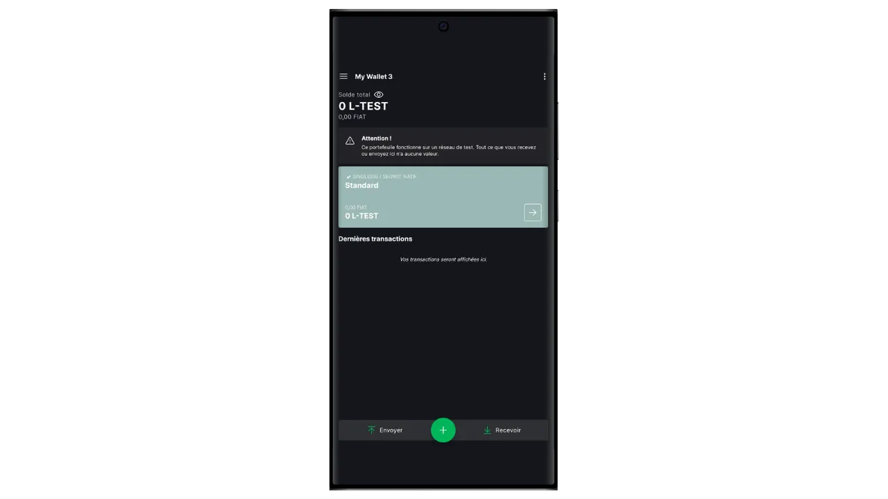

The Bitcoin protocol has intentional technical limitations which help to maintain the network's decentralization and ensure security is distributed among all users. However, these limitations can sometimes frustrate users, particularly during congestion due to a high volume of simultaneous transactions. The debate over Bitcoin's scalability has long divided the community, particularly during the Blocksize War. Since this episode, it is widely recognized within the Bitcoin community that scalability must be ensured by off-chain solutions, on second-layer systems. These solutions include sidechains, which are still relatively unknown and little used compared to other systems such as the Lightning Network.

A sidechain is an independent blockchain that operates in parallel with the main Bitcoin blockchain. It uses bitcoin as a unit of account, thanks to a mechanism called "*two-way peg*". This system makes it possible to lock bitcoins on the main chain in order to reproduce their value on the sidechain, where they circulate in the form of tokens backed by the original bitcoins. These tokens normally retain parity of value with the bitcoins locked on the main chain, and the process can be reversed to recover funds on Bitcoin.

The aim of sidechains is to offer additional functionalities or technical improvements, such as faster transactions, lower fees or support for smart contracts. These innovations cannot always be implemented directly on the Bitcoin blockchain without compromising its decentralization or security. Sidechains therefore make it possible to test and explore new solutions while preserving Bitcoin's integrity. However, these protocols often require compromises, particularly in terms of decentralization and security, depending on the governance model and consensus mechanism chosen.

Today, the best-known sidechain is probably Liquid. In this tutorial, I'll first tell you what Liquid is, and then guide you through how to start using it easily with the Blockstream Green application, so you can enjoy all its benefits.

## What is Liquid Network?

Liquid is a federated sidechain overlay for Bitcoin, developed by Blockstream to improve transaction speed, confidentiality and functionality. It uses a bilateral anchoring mechanism established on a federation to lock bitcoins on the main chain and create Liquid-bitcoins (L-BTC) in return, tokens circulating on Liquid while remaining backed by the original bitcoins.

The Liquid network relies on a federation of participants, made up of recognized entities from the Bitcoin ecosystem, who validate blocks and manage bilateral pegging. In addition to L-BTC, Liquid also enables the issuance of other digital assets, such as stablecoins and other cryptocurrencies.

## Introducing Blockstream Green

Blockstream Green is a software wallet available on mobile and desktop. Formerly known as *Green Address*, this wallet became a Blockstream project following its acquisition in 2016.

Green is a particularly easy-to-use application, which makes it interesting for beginners. It offers all the essential features of a good Bitcoin wallet, including RBF (*Replace-by-Fee*), a Tor connection option, the ability to connect your own node, SPV (*Simple Payment Verification*), coin tagging and control.

Blockstream Green also supports the Liquid network, and that's what we're going to find out in this tutorial. If you'd like to use Green for other applications, I recommend you also take a look at these other tutorials:

https://planb.network/tutorials/wallet/desktop/blockstream-green-desktop-c1503adf-1404-4328-b814-aa97fcf0d5da
https://planb.network/tutorials/wallet/mobile/blockstream-green-e84edaa9-fb65-48c1-a357-8a5f27996143
https://planb.network/tutorials/wallet/mobile/blockstream-green-watch-only-66c3bc5a-5fa1-40ef-9998-6d6f7f2810fb
## Installing and configuring the Blockstream Green application

The first step is of course to download the Green application. Go to your application store:

- [For Android](https://play.google.com/store/apps/details?id=com.greenaddress.greenbits_android_wallet);
- [For Apple](https://apps.apple.com/us/app/green-bitcoin-wallet/id1402243590).

For Android users, you can also install the application via the `.apk` file [available on Blockstream's GitHub](https://github.com/Blockstream/green_android/releases).

Launch the application, then check the "I accept the conditions...*" box.

When you open Green for the first time, the home screen appears without a configured portfolio. Later, if you create or import portfolios, they will appear in this interface. Before going on to create a portfolio, I recommend that you adjust the application settings to suit your needs. Click on "Application settings".

The "*Enhanced Privacy*" option, available only on Android, enhances privacy by disabling screenshots and hiding application previews. It also automatically locks application access as soon as your phone is locked, making your data more difficult to expose.

For those wishing to enhance their privacy, the application offers the option of rooting your traffic via Tor, a network that encrypts all your connections and makes your activities difficult to trace. Although this option may slightly slow down the application's operation, it's highly recommended to protect your privacy, especially if you're not using your own complete node.

For users who have their own complete node, Green Wallet offers the option of connecting to it via an Electrum server, guaranteeing total control over Bitcoin network information and transaction dissemination. But this feature is for classic Bitcoin wallets, so you don't need it if you're using Liquid.

Another alternative feature is the "*SPV Verification*" option, which allows you to verify certain blockchain data directly and thus reduce the need to trust Blockstream's default node, although this method doesn't provide all the guarantees of a full node. Again, this will only affect your onchain Bitcoin wallets, not Liquid.

Once you've adjusted these settings to your needs, click on the "*Save*" button and restart the application.

## Create a Liquid portfolio on Blockstream Green

You are now ready to create a Liquid portfolio. Click on the "*Get Started*" button.

You can choose between creating a local software wallet or managing a cold wallet via a hardware wallet. For this tutorial, we're focusing on creating a hot wallet on Liquid, so you'll need to select the "*On This Device*" option. You can also use a compatible hardware wallet, such as Blockstream Jade, to secure your Liquid wallet.

You can then choose to restore an existing Bitcoin wallet or create a new one. For the purposes of this tutorial, we'll be creating a new wallet. However, if you need to regenerate an existing Liquid wallet from its mnemonic phrase, for example following the loss of your hardware wallet, you'll need to choose the second option.

You can then choose between a 12-word or 24-word mnemonic phrase. This phrase will enable you to recover access to your wallet from any compatible software in the event of a problem with your phone. At present, opting for a 24-word phrase offers no more security than a 12-word phrase. I therefore recommend that you choose a 12-word mnemonic phrase.

Green will then provide you with your mnemonic phrase. Before continuing, make sure you're not being watched. Click on "*Show recovery phrase*" to display it on the screen.

**This mnemonic gives you full, unrestricted access to all your bitcoins ** Anyone in possession of this mnemonic can steal your funds, even without physical access to your phone.

It restores access to your bitcoins in the event of loss, theft or breakage of your phone. So it's very important to back it up carefully **on a physical medium (not digital)** and store it in a secure place. You can write it down on a piece of paper, or for added security, if this is a large wallet, I recommend engraving it on a stainless steel support to protect it from the risk of fire, flood or collapse (for a hot wallet designed to secure a small quantity of bitcoins, a simple paper backup is probably sufficient).

*Obviously, you must never share these words on the Internet, as I'm doing in this tutorial. This sample portfolio will be used only on Liquid's Testnet and will be deleted at the end of the tutorial.*

Once you have correctly recorded your mnemonic phrase on a physical medium, click on "*Continue*". Green Wallet will then ask you to confirm some of the words in your mnemonic phrase to make sure you've recorded them correctly. Fill in the blanks with the missing words.

Choose your device's PIN code, which will be used to unlock your Green wallet. This is your protection against unauthorized physical access. This PIN code is not involved in the derivation of your wallet's cryptographic keys. So, even without access to this PIN code, possession of your 12- or 24-word mnemonic phrase will enable you to regain access to your bitcoins.

We recommend choosing a 6-digit PIN code that is as random as possible. Be sure to save this code so you don't forget it, otherwise you'll be forced to retrieve your wallet from the mnemonic. You can then add a biometric blocking option to avoid having to enter the PIN every time you use it. Generally speaking, biometrics are far less secure than the PIN itself. So, by default, I advise you not to set up this unlocking option.

Enter your PIN a second time to confirm it.

Wait for your portfolio to be created, then click on the "*Create an account*" button.

In the "*Active*" box, select "*Liquid Bitcoin*". You can then choose between a standard single-signature wallet, which we'll use in this tutorial, or a wallet protected by two-factor authentication (2FA).

And that's it, your Liquid wallet has been created using the Green application!

Before you receive your first bitcoins on your Liquid wallet, **I strongly advise you to perform an empty recovery test**. Make a note of some reference information, such as your xpub or first receiving address, then delete your wallet on the Green app while it's still empty. Then try to restore your wallet on Green using your paper backups. Check that the cookie information generated after the restore matches the one you originally wrote down. If it does, you can rest assured that your paper backups are reliable. To find out more about how to carry out a test recovery, please consult this other tutorial:

https://planb.network/tutorials/wallet/backup/recovery-test-5a75db51-a6a1-4338-a02a-164a8d91b895
## Setting up your Liquid portfolio

If you wish to personalize your portfolio, click on the three small dots in the top right-hand corner.

The "*Rename*" option lets you customize the name of your portfolio, which is particularly useful if you manage several portfolios on the same application.

The "*Unit*" menu lets you change the base unit of your wallet. For example, you can choose to display it in satoshis rather than bitcoins.

The "*Settings*" menu provides access to the various options of your Bitcoin wallet.

Here, for example, you'll find your *descriptor*, which may come in handy if you plan to set up a watch-only portfolio from this Liquid portfolio.

You can also change your wallet PIN and activate a biometric connection.

## Using your Liquid portfolio

Now that your Liquid portfolio is set up, you're ready to receive your first L-sats!

If you don't yet have L-BTC, you have several options. The first is to have some sent directly to you. If someone wants to pay you in bitcoins on Liquid, simply give them a receiving address. The other option is to exchange your bitcoins onchain or on the Lightning network for L-BTC. To do this, you can use [a bridge such as Boltz](https://boltz.exchange/). Simply enter your Liquid address on the site, then make payment either via the Lightning network or onchain.

To generate a Liquid address, click on the "*Receive*" button.

Green will then display the first blank receiving address in your wallet. You can either scan the associated QR code, or copy the address directly to send L-BTC.

When the transaction is broadcast on the network, it will appear in your wallet.

Wait until you've received enough confirmations to consider the transaction definitive. On Liquid, confirmations should be quick, as a block is published every minute.

With L-sats in your Liquid portfolio, you can now also send them. Click on "*Send*".

On the next page, enter the recipient's Liquid address. You can enter it manually or scan its QR code.

Choose the payment amount.

Click on "*Next*" to access the transaction summary screen. Check that the address, amount and charges are correct.

If all goes well, slide the green button at the bottom of the screen to the right to sign and broadcast the transaction on the Bitcoin network.

Your transaction will now appear on your Bitcoin wallet dashboard, awaiting confirmation.

And now you know how to use the Liquid sidechain easily with the Blockstream Green application!

If you found this tutorial useful, I'd be grateful if you'd leave a green thumb below. Feel free to share this article on your social networks. Thank you very much!

I also recommend you check out this other comprehensive tutorial on the Blockstream Green mobile app to set up an onchain Bitcoin hot wallet :

https://planb.network/tutorials/wallet/mobile/blockstream-green-e84edaa9-fb65-48c1-a357-8a5f27996143