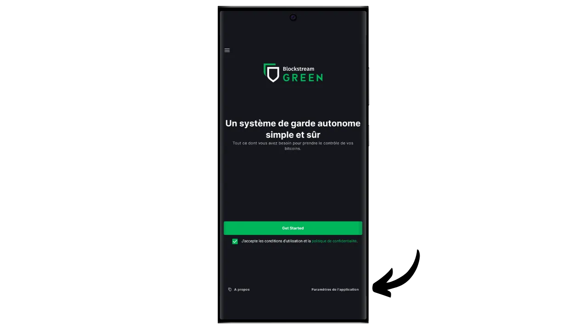

V tomto návodu se dozvíte, jak snadno nastavit "watch-only" portfolio na mobilním telefonu pomocí aplikace Blockstream Green.

## Co je peněženka pouze pro hodinky?

Peněženka pouze pro čtení nebo "peněženka pouze pro sledování" je typ softwaru, který umožňuje uživateli sledovat transakce spojené s jedním nebo více konkrétními veřejnými klíči Bitcoinu, aniž by měl přístup k odpovídajícím soukromým klíčům.

Tento typ aplikace ukládá pouze data potřebná ke sledování peněženky Bitcoin, zejména k zobrazení jejího zůstatku a historie transakcí, ale nemá přístup k soukromým klíčům. V důsledku toho není možné v aplikaci určené pouze ke sledování utrácet bitcoiny, které peněženka drží.

Watch-only se obvykle používá ve spojení s hardwarovou peněženkou. To umožňuje bezpečné uložení soukromých klíčů peněženky na hardwaru, který není připojen k internetu a má velmi malý povrch útoku, čímž jsou soukromé klíče izolovány od potenciálně zranitelného prostředí. Naproti tomu aplikace určená pouze pro hlídání ukládá výhradně rozšířený veřejný klíč (`xpub`, `zpub` atd.) bitcoinové peněženky. Tento nadřazený klíč nelze použít k nalezení přidružených soukromých klíčů, a proto jej nelze použít k utrácení Bitcoinů. Umožňuje však odvození podřízených veřejných klíčů a přijímacích adres. Díky tomu, že hardwarová peněženka zná bezpečné adresy peněženek, může aplikace určená pouze ke sledování těchto transakcí v síti Bitcoin, což uživateli umožňuje sledovat jeho zůstatek a generovat nové přijímací adresy, aniž by musel pokaždé připojovat svou hardwarovou peněženku.

V tomto návodu bych vám rád představil jedno z nejoblíbenějších řešení mobilní peněženky pouze pro hodinky: **Blockstream Green**.

## Představujeme Blockstream Green

Blockstream Green je softwarová aplikace dostupná na mobilních zařízeních a počítačích. Toto portfolio, dříve známé jako Green Address, se po akvizici v roce 2016 stalo projektem společnosti Blockstream.

Zelená je velmi snadno použitelná aplikace, takže je vhodná zejména pro začátečníky. Nabízí řadu funkcí, jako je správa hot wallet, hardwarových peněženek a Liquid sidechain wallet.

V tomto návodu se zaměříme pouze na vytvoření portfolia pouze hodinek. Chcete-li se seznámit s dalšími způsoby využití zelené barvy, přečtěte si naše další specializované výukové programy:

https://planb.network/tutorials/wallet/desktop/blockstream-green-desktop-c1503adf-1404-4328-b814-aa97fcf0d5da
https://planb.network/tutorials/wallet/mobile/blockstream-green-e84edaa9-fb65-48c1-a357-8a5f27996143
## Instalace a konfigurace aplikace Blockstream Green

Prvním krokem je samozřejmě stažení zelené aplikace. Přejděte do svého obchodu s aplikacemi:

- [Pro Android](https://play.google.com/store/apps/details?id=com.greenaddress.greenbits_android_wallet);
- [Pro Apple](https://apps.apple.com/us/app/green-bitcoin-wallet/id1402243590).

Uživatelé systému Android mohou aplikaci nainstalovat také prostřednictvím souboru `.apk` [dostupného na GitHubu společnosti Blockstream](https://github.com/Blockstream/green_android/releases).

Spusťte aplikaci a zaškrtněte políčko "Souhlasím s podmínkami...*".

Při prvním otevření aplikace Green se zobrazí domovská obrazovka bez nakonfigurovaného portfolia. Pokud později vytvoříte nebo importujete portfolia, zobrazí se v tomto rozhraní. Než se pustíte do vytváření portfolia, doporučuji upravit nastavení aplikace tak, aby vyhovovalo vašim potřebám. Klepněte na tlačítko "Nastavení aplikace".

Možnost "*Zvýšené soukromí*", která je k dispozici pouze v systému Android, zvyšuje soukromí tím, že vypíná snímky obrazovky a skrývá náhledy aplikací. Automaticky také uzamkne přístup k aplikacím, jakmile je telefon uzamčen, čímž ztíží odhalení vašich dat.

Pro ty, kteří chtějí zvýšit své soukromí, nabízí aplikace možnost zakořenit svůj provoz prostřednictvím sítě Tor, která šifruje všechna vaše připojení a ztěžuje vysledování vašich aktivit. Ačkoli tato možnost může mírně zpomalit provoz aplikace, pro ochranu vašeho soukromí ji vřele doporučujeme, zejména pokud nepoužíváte vlastní kompletní uzel.

Uživatelům, kteří mají vlastní kompletní uzel, nabízí Zelená peněženka možnost připojit se k němu prostřednictvím serveru Electrum, což zaručuje úplnou kontrolu nad informacemi v síti Bitcoin a distribucí transakcí.

Další alternativní funkcí je možnost "*SPV Verification*", která umožňuje přímo ověřit určitá data blockchainu a snížit tak potřebu důvěřovat výchozímu uzlu Blockstream, ačkoli tato metoda neposkytuje všechny záruky plnohodnotného uzlu.

Po úpravě těchto nastavení podle svých potřeb klikněte na tlačítko "*Uložit*" a restartujte aplikaci.

## Vytvoření pouze sledovaného portfolia na Blockstream Green

Nyní jste připraveni vytvořit portfolio pouze pro hodinky. Klikněte na tlačítko "*Začít*".

Budete si moci vybrat z několika typů peněženek. Pro tento návod chceme vytvořit portfolio pouze pro hodinky, takže klikněte na příslušné tlačítko.

Vyberte možnost "Single signature".

Poté vyberte možnost "*Bitcoin*". Z mé strany dělám tento návod na peněžence v testnetu, ale postup zůstává totožný i na mainnetu.

Budete požádáni o zadání rozšířeného veřejného klíče (`xpub`, `zpub` atd.) nebo popisovače výstupního skriptu.

Tyto informace proto musíte získat z peněženky, kterou chcete sledovat, prostřednictvím peněženky určené pouze pro hodinky. Rozšířený veřejný klíč není citlivý z hlediska bezpečnosti, protože neumožňuje přístup k soukromým klíčům, ale je citlivý z hlediska vaší důvěrnosti, protože odhaluje všechny vaše veřejné klíče, a tedy i všechny vaše bitcoinové transakce.

Řekněme, že používáte Sparrow Wallet ke správě peněženky v hardwarové peněžence, tyto informace najdete v části "*Nastavení*". Nalezení této informace závisí na softwaru pro správu peněženky, který používáte, ale obvykle se nachází v nastavení.

Zkopírujte svůj rozšířený veřejný klíč, zadejte jej do zelené aplikace a klikněte na tlačítko "Připojit".

Poté budete moci zobrazit zůstatek spojený s tímto klíčem a historii transakcí.

Kliknutím na "*Příjem*" můžete vygenerovat adresu pro příjem bitcoinů do své hardwarové peněženky. Tuto možnost bych však nedoporučoval používat, aniž byste před jejím použitím k uzamčení bitcoinů nejprve na obrazovce hardwarové peněženky zkontrolovali, zda má k dispozici soukromý klíč spojený s vygenerovanou adresou. To je dobrý postup, který je třeba dodržovat.

Možnost "*Balayer*" umožňuje ruční zadání soukromého klíče pro utrácení finančních prostředků přímo ze zelené aplikace. S výjimkou velmi specifických případů nedoporučuji tuto funkci používat, protože vyžaduje odhalení soukromého klíče v telefonu, který je mnohem zranitelnější vůči počítačovým útokům než hardwarová peněženka.

Teď už víte, jak si v chytrém telefonu snadno nastavit peněženku pouze pro hodinky! Je to šikovný nástroj pro sledování peněženky na hardwarové peněžence, aniž byste ji museli pokaždé připojovat a odemykat.

Pokud pro vás byl tento návod užitečný, budu vám vděčný, když mi níže zanecháte zelený palec. Neváhejte tento článek sdílet na svých sociálních sítích. Moc vám děkuji!

Doporučuji vám také podívat se na tento další komplexní návod na aplikaci Blockstream Green pro nastavení horké peněženky:

https://planb.network/tutorials/wallet/mobile/blockstream-green-e84edaa9-fb65-48c1-a357-8a5f27996143