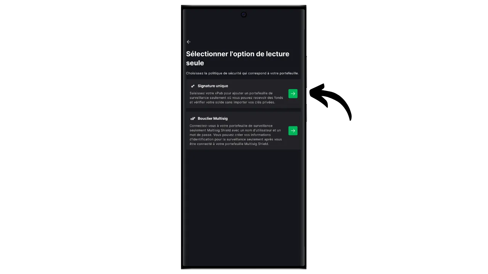
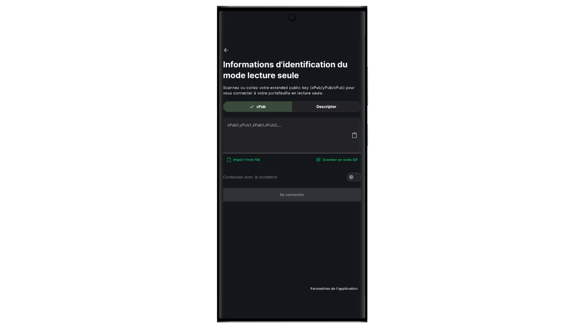

In diesem Tutorial erfahren Sie, wie Sie mit der Anwendung Blockstream Green ganz einfach ein "Watch-only"-Portfolio auf dem Handy einrichten können.

## Was ist eine Watch-Only-Wallet?

Eine Read-Only-Wallet oder "Watch-Only-Wallet" ist eine Art von Software, die es dem Benutzer ermöglicht, Transaktionen zu beobachten, die mit einem oder mehreren bestimmten öffentlichen Bitcoin-Schlüsseln verbunden sind, ohne Zugang zu den entsprechenden privaten Schlüsseln zu haben.

Diese Art von Anwendung speichert nur die Daten, die zur Überwachung einer Bitcoin-Wallet benötigt werden, insbesondere um den Kontostand und den Transaktionsverlauf einzusehen, hat aber keinen Zugriff auf die privaten Schlüssel. Folglich ist es nicht möglich, Bitcoins, die sich in der Wallet befinden, mit der reinen Überwachungsanwendung auszugeben.

Watch-only wird in der Regel in Verbindung mit einer Hardware-Wallet verwendet. Dies ermöglicht es, die privaten Schlüssel der Wallet sicher auf einer Hardware zu speichern, die nicht mit dem Internet verbunden ist und eine sehr kleine Angriffsfläche bietet, wodurch die privaten Schlüssel von potenziell gefährdeten Umgebungen isoliert werden. Die Watch-Only-Anwendung hingegen speichert ausschließlich den erweiterten öffentlichen Schlüssel (`xpub`, `zpub`, etc.) der Bitcoin-Wallet. Dieser übergeordnete Schlüssel kann nicht verwendet werden, um die zugehörigen privaten Schlüssel zu finden, und kann daher nicht verwendet werden, um Bitcoins auszugeben. Er ermöglicht jedoch die Ableitung untergeordneter öffentlicher Schlüssel und Empfangsadressen. Dank der Kenntnis der sicheren Wallet-Adressen durch die Hardware-Wallet kann die "Watch-Only"-Anwendung diese Transaktionen im Bitcoin-Netzwerk verfolgen, so dass der Benutzer seinen Kontostand überwachen und neue Empfangsadressen generieren kann, ohne jedes Mal seine Hardware-Wallet anschließen zu müssen.

In diesem Tutorial möchte ich Ihnen eine der beliebtesten Lösungen für mobile Geldbörsen vorstellen, die nur auf Uhren basieren: **Blockstream Green**.

## Einführung von Blockstream Green

Blockstream Green ist eine Softwareanwendung, die auf dem Handy und dem Desktop verfügbar ist. Früher als Green Address bekannt, wurde dieses Portfolio nach der Übernahme im Jahr 2016 ein Blockstream-Projekt.

Green ist eine sehr einfach zu bedienende Anwendung, die sich besonders für Anfänger eignet. Sie bietet eine Reihe von Funktionen, wie die Verwaltung von Hot Wallets, Hardware Wallets und Liquid Sidechain Wallets.

In diesem Lernprogramm konzentrieren wir uns auf die Erstellung eines reinen Uhrenportfolios. Wenn Sie andere Einsatzmöglichkeiten von Green erkunden möchten, lesen Sie bitte unsere anderen Tutorials:

https://planb.network/tutorials/wallet/desktop/blockstream-green-desktop-c1503adf-1404-4328-b814-aa97fcf0d5da
https://planb.network/tutorials/wallet/mobile/blockstream-green-e84edaa9-fb65-48c1-a357-8a5f27996143
## Installieren und Konfigurieren der Blockstream Green Anwendung

Der erste Schritt besteht natürlich darin, die Green-Anwendung herunterzuladen. Gehen Sie zu Ihrem Anwendungsspeicher:

- [Für Android] (https://play.google.com/store/apps/details?id=com.greenaddress.greenbits_android_wallet);
- [Für Apple] (https://apps.apple.com/us/app/green-bitcoin-wallet/id1402243590).

Android-Benutzer können die Anwendung auch über die .apk-Datei [verfügbar auf Blockstreams GitHub] (https://github.com/Blockstream/green_android/releases) installieren.

Starten Sie die Anwendung und markieren Sie das Feld "Ich akzeptiere die Bedingungen...*".

Wenn Sie Green zum ersten Mal öffnen, erscheint der Startbildschirm ohne ein konfiguriertes Portfolio. Wenn Sie später Portfolios erstellen oder importieren, werden sie in dieser Oberfläche angezeigt. Bevor Sie mit der Erstellung eines Portfolios beginnen, sollten Sie die Anwendungseinstellungen an Ihre Bedürfnisse anpassen. Klicken Sie auf "Anwendungseinstellungen".

Die Option "*Erweiterte Privatsphäre*", die nur unter Android verfügbar ist, verbessert die Privatsphäre, indem sie Screenshots deaktiviert und Anwendungsvorschauen ausblendet. Außerdem wird der Zugriff auf Anwendungen automatisch gesperrt, sobald das Telefon gesperrt wird, sodass Ihre Daten nicht mehr so leicht zu finden sind.

Für diejenigen, die ihre Privatsphäre schützen möchten, bietet die Anwendung die Möglichkeit, ihren Datenverkehr über Tor zu leiten, ein Netzwerk, das alle ihre Verbindungen verschlüsselt und ihre Aktivitäten schwer nachvollziehbar macht. Obwohl diese Option den Betrieb der Anwendung etwas verlangsamen kann, ist sie sehr empfehlenswert, um Ihre Privatsphäre zu schützen, insbesondere wenn Sie keinen eigenen vollständigen Knoten verwenden.

Für Nutzer, die über einen eigenen kompletten Node verfügen, bietet Green Wallet die Möglichkeit, sich mit diesem über einen Electrum-Server zu verbinden, wodurch die vollständige Kontrolle über die Bitcoin-Netzwerkinformationen und die Verteilung der Transaktionen gewährleistet wird.

Eine weitere alternative Funktion ist die Option "*SPV Verification*", die es Ihnen ermöglicht, bestimmte Blockchain-Daten direkt zu verifizieren und somit die Notwendigkeit zu verringern, dem Standardknoten von Blockstream zu vertrauen, obwohl diese Methode nicht alle Garantien eines vollständigen Knotens bietet.

Wenn Sie diese Einstellungen Ihren Wünschen entsprechend angepasst haben, klicken Sie auf die Schaltfläche "*Speichern*" und starten Sie die Anwendung neu.

## Erstellen Sie ein reines Beobachtungsportfolio auf Blockstream Green

Sie sind nun bereit, ein reines Uhrenportfolio zu erstellen. Klicken Sie auf die Schaltfläche "*Get Started*".

Sie können zwischen verschiedenen Arten von Brieftaschen wählen. In diesem Tutorial möchten wir ein Portfolio erstellen, das nur aus Uhren besteht. Klicken Sie also auf die entsprechende Schaltfläche.

Wählen Sie die Option "Einzelsignatur".

Wählen Sie dann "*Bitcoin*". Ich für meinen Teil mache dieses Tutorial auf einer Testnet-Wallet, aber das Verfahren bleibt identisch auf dem Mainnet.

Sie werden aufgefordert, entweder einen erweiterten öffentlichen Schlüssel (`xpub`, `zpub`, etc.) oder einen Deskriptor für das Ausgabeskript anzugeben.

Daher müssen Sie diese Informationen von der Wallet, die Sie verfolgen möchten, über Ihre Watch-Only-Wallet abrufen. Der erweiterte öffentliche Schlüssel ist in Bezug auf die Sicherheit nicht sensibel, da er keinen Zugriff auf private Schlüssel erlaubt, aber er ist sensibel für Ihre Vertraulichkeit, da er alle Ihre öffentlichen Schlüssel und damit alle Ihre Bitcoin-Transaktionen offenlegt.

Angenommen, Sie verwenden Sparrow Wallet, um Ihre Wallet auf einer Hardware-Wallet zu verwalten, dann finden Sie diese Informationen im Abschnitt "*Einstellungen*". Wo Sie diese Informationen finden, hängt von der von Ihnen verwendeten Wallet-Verwaltungssoftware ab, aber normalerweise finden Sie sie in den Einstellungen.

Kopieren Sie Ihren erweiterten öffentlichen Schlüssel, geben Sie ihn in die Anwendung Green ein und klicken Sie dann auf "Verbinden".

Sie können dann den mit dieser Taste verbundenen Saldo sowie die Transaktionshistorie einsehen.

Wenn Sie auf "*Empfangen*" klicken, können Sie eine Empfangsadresse generieren, um Bitcoins auf Ihrer Hardware-Wallet zu empfangen. Ich würde jedoch davon abraten, diese Option zu verwenden, ohne vorher auf dem Bildschirm der Hardware-Wallet zu überprüfen, ob sie den privaten Schlüssel hat, der mit der generierten Adresse verbunden ist, bevor Sie sie zum Sperren von Bitcoins verwenden. Dies ist eine gute Vorgehensweise.

Mit der Option "*Balayer*" können Sie manuell einen privaten Schlüssel eingeben, um Geld direkt aus Ihrer Green-Anwendung auszugeben. Außer in sehr speziellen Fällen empfehle ich Ihnen nicht, diese Funktion zu verwenden, da Sie Ihren privaten Schlüssel auf einem Telefon preisgeben müssen, das viel anfälliger für Computerangriffe ist als Ihre Hardware-Geldbörse.

Jetzt wissen Sie, wie Sie eine reine Uhren-Geldbörse auf Ihrem Smartphone einrichten können! Es ist ein praktisches Tool, um eine Geldbörse auf einer Hardware-Wallet zu überwachen, ohne sie jedes Mal verbinden und entsperren zu müssen.

Wenn Sie diese Anleitung nützlich fanden, wäre ich Ihnen dankbar, wenn Sie unten einen grünen Daumen hinterlassen würden. Sie können diesen Artikel auch gerne in Ihren sozialen Netzwerken teilen. Ich danke Ihnen sehr!

Ich empfehle Ihnen auch, sich dieses andere umfassende Tutorial über die Blockstream Green-Anwendung zur Einrichtung einer Hot Wallet anzusehen:

https://planb.network/tutorials/wallet/mobile/blockstream-green-e84edaa9-fb65-48c1-a357-8a5f27996143