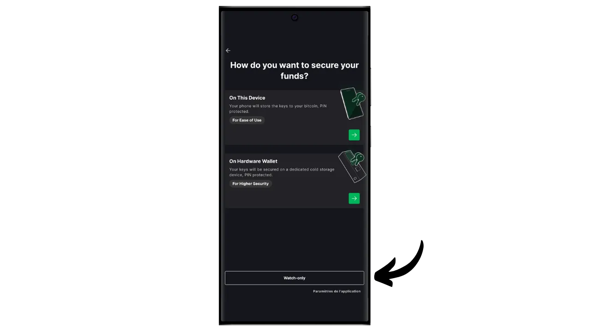
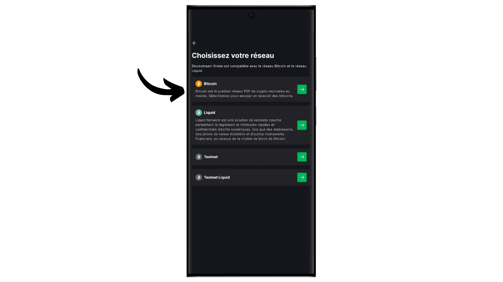

Selles õpetuses saate teada, kuidas hõlpsasti luua "watch-only" portfelli mobiilis, kasutades Blockstream Green'i rakendust.

## Mis on ainult kellaga rahakott?

Ainult lugemiseks mõeldud rahakott ehk "ainult vaatamiseks mõeldud rahakott" on teatud tüüpi tarkvara, mis võimaldab kasutajal jälgida ühe või mitme konkreetse Bitcoini avaliku võtmega seotud tehinguid, ilma et tal oleks juurdepääs vastavatele privaatvõtmetele.

Seda tüüpi rakendus salvestab ainult Bitcoini rahakoti jälgimiseks vajalikke andmeid, eelkõige selle saldo ja tehinguloo vaatamiseks, kuid sellel ei ole juurdepääsu privaatvõtmetele. Seetõttu ei ole võimalik ainult jälgimisrakenduses rahakotis hoitavaid bitcoin'e kulutada.

Watch-only kasutatakse tavaliselt koos riistvaralise rahakotiga. See võimaldab rahakoti privaatvõtmeid turvaliselt salvestada riistvaras, mis ei ole ühendatud internetti ja millel on väga väike ründepind, isoleerides seega privaatvõtmed potentsiaalselt haavatavatest keskkondadest. Ainult valvega rakendus seevastu salvestab ainult Bitcoini rahakoti laiendatud avalikku võtit (`xpub`, `zpub` jne). Seda vanemvõtit ei saa kasutada seotud privaatvõtmete leidmiseks ja seega ei saa seda kasutada Bitcoini kulutamiseks. Siiski võimaldab see tuletada laps-avalikke võtmeid ja vastuvõtuaadresse. Tänu sellele, et riistvaraline rahakott teab turvalisi rahakoti aadresse, saab watch-only rakendus jälgida neid tehinguid Bitcoini võrgus, võimaldades kasutajal jälgida oma saldot ja luua uusi vastuvõtuaadresse, ilma et ta peaks iga kord oma riistvaralist rahakotti ühendama.

Selles õpetuses tutvustan teile ühte kõige populaarsemat ainult kellale mõeldud mobiilse rahakoti lahendust: **Blockstream Green**.

## Blockstream Green'i tutvustamine

Blockstream Green on tarkvararakendus, mis on saadaval mobiilis ja lauaarvutis. Varem tuntud kui Green Address, muutus see portfell pärast selle omandamist 2016. aastal Blockstream'i projektiks.

Green on väga lihtsasti kasutatav rakendus, mis teeb selle eriti sobivaks algajatele. See pakub mitmesuguseid funktsioone, näiteks kuumade rahakottide, riistvaraliste rahakottide ja Liquid sidechaini rahakottide haldamist.

Selles õpetuses keskendume ainult ainult kellade portfelli loomisele. Green'i muude kasutusviiside uurimiseks vaadake meie teisi spetsiaalseid õpetusi:

https://planb.network/tutorials/wallet/desktop/blockstream-green-desktop-c1503adf-1404-4328-b814-aa97fcf0d5da
https://planb.network/tutorials/wallet/mobile/blockstream-green-e84edaa9-fb65-48c1-a357-8a5f27996143
## Blockstream Green rakenduse paigaldamine ja konfigureerimine

Esimene samm on loomulikult rohelise rakenduse allalaadimine. Mine oma rakenduste poodi:

- [Androidile](https://play.google.com/store/apps/details?id=com.greenaddress.greenbits_android_wallet);
- [Apple](https://apps.apple.com/us/app/green-bitcoin-wallet/id1402243590).

Androidi kasutajate jaoks saate rakenduse paigaldada ka `.apk` faili kaudu [saadaval Blockstream'i GitHubis](https://github.com/Blockstream/green_android/releases).

Käivitage rakendus, seejärel märgistage ruut "Nõustun tingimustega...*".

Kui avate Greeni esimest korda, ilmub avakuva ilma seadistatud portfooliota. Hiljem, kui loote või impordite portfooliosid, ilmuvad need sellesse kasutajaliidesesse. Enne portfelli loomist soovitan teil kohandada rakenduse seaded vastavalt oma vajadustele. Klõpsake nuppu "Rakenduse seaded".

Valik "*Tõhustatud privaatsus*", mis on saadaval ainult Androidi puhul, suurendab privaatsust, keelates ekraanipiltide tegemise ja rakenduste eelvaate varjamise. Samuti lukustab see automaatselt rakenduste juurdepääsu kohe, kui teie telefon on lukustatud, mis muudab teie andmete paljastamise keerulisemaks.

Neile, kes soovivad suurendada oma privaatsust, pakub rakendus võimalust juurida oma liiklust Tor'i kaudu, mis on võrk, mis krüpteerib kõik teie ühendused ja muudab teie tegevuse raskesti jälgitavaks. Kuigi see võimalus võib rakenduse tööd veidi aeglustada, on see oma privaatsuse kaitsmiseks väga soovitatav, eriti kui te ei kasuta oma täielikku sõlme.

Kasutajatele, kellel on oma terviklik sõlme, pakub Green Wallet võimalust ühendada see Electrumi serveri kaudu, tagades täieliku kontrolli Bitcoini võrguandmete ja tehingute jaotamise üle.

Teine alternatiivne funktsioon on valik "*SPV Verification*", mis võimaldab teil kontrollida teatud plokiahela andmeid otse ja seega vähendada vajadust usaldada Blockstream'i vaikimisi sõlme, kuigi see meetod ei paku kõiki täieliku sõlme garantiisid.

Kui olete need seaded oma vajadustele vastavaks muutnud, klõpsake nupule "*Save*" ja käivitage rakendus uuesti.

## Looge Blockstream Green'ile ainult jälgimisportfell

Nüüd olete valmis looma ainult kellade portfelli. Vajutage nupule "*Alusta*".

Teil on võimalik valida mitut tüüpi rahakoti vahel. Selle õpetuse jaoks soovime luua ainult kellade portfelli, seega klõpsake vastaval nupul.

Valige valik "Üksikallkiri".

Seejärel valige "*Bitcoin*". Omalt poolt teen seda õpetust testneti rahakotis, kuid protseduur jääb samaks ka mainnetis.

Teil palutakse esitada kas laiendatud avalik võti (`xpub`, `zpub` jne.) või väljundscripti kirjeldus.

Seetõttu peate selle teabe saama sellest rahakotist, mida soovite jälgida, ainult kella rahakoti kaudu. Laiendatud avalik võti ei ole turvalisuse seisukohast tundlik, kuna see ei võimalda juurdepääsu privaatvõtmetele, kuid see on tundlik teie konfidentsiaalsuse seisukohast, kuna see paljastab kõik teie avalikud võtmed ja seega ka kõik teie Bitcoini tehingud.

Oletame, et kasutate Sparrow Wallet'i oma rahakoti haldamiseks riistvara rahakotis, siis leiate selle teabe jaotisest "*Settings*". Selle teabe leidmine sõltub kasutatavast rahakoti haldamise tarkvarast, kuid tavaliselt on see seadetes.

Kopeerige oma laiendatud avalik võti ja sisestage see rohelisse rakendusse, seejärel klõpsake nuppu "Connect".

Seejärel näete selle võtmega seotud saldot ja tehinguajalugu.

Klõpsates "*Vaata*", saate luua vastuvõtuaadressi, et saada bitcoine oma riistvara rahakotti. Siiski soovitan seda võimalust mitte kasutada, ilma et enne selle kasutamist bitcoinide lukustamiseks kontrolliksite riistvara rahakoti ekraanil, et sellel oleks loodud aadressiga seotud privaatne võti. See on hea tava, mida tuleks järgida.

Valik "*Balayer*" võimaldab teil käsitsi sisestada isikliku võtme, et kulutada raha otse teie Green-rakendusest. Välja arvatud väga spetsiifilistel juhtudel, ei soovita ma seda funktsiooni kasutada, kuna see nõuab teie privaatvõtme avalikustamist telefonis, mis on arvutirünnakute suhtes palju haavatavam kui teie riistvaraline rahakott.

Nii et nüüd tead, kuidas hõlpsasti luua ainult kellale mõeldud rahakott oma nutitelefonis! See on mugav vahend riistvaralise rahakoti jälgimiseks, ilma et peaksid seda iga kord ühendama ja lahti lukustama.

Kui leidsid selle õpetuse kasulikuks, oleksin tänulik, kui jätaksid alla rohelise pöidla. Jaga seda artiklit julgelt oma suhtlusvõrgustikes. Tänan teid väga!

Samuti soovitan teil vaadata seda teist põhjalikku õpetust Blockstream Green rakenduse kohta, et luua kuum rahakott:

https://planb.network/tutorials/wallet/mobile/blockstream-green-e84edaa9-fb65-48c1-a357-8a5f27996143