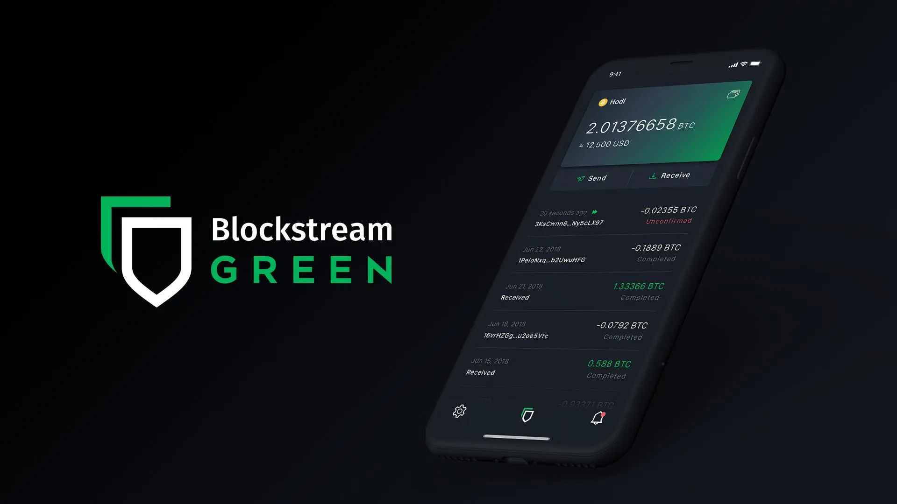

Tässä opetusohjelmassa opit, miten voit helposti luoda "watch-only"-salkun mobiilissa Blockstream Green -sovelluksen avulla.

## Mikä on Watch-Only-lompakko?

Vain lukemiseen tarkoitettu lompakko on ohjelmistotyyppi, joka on suunniteltu siten, että käyttäjä voi tarkkailla yhteen tai useampaan tiettyyn Bitcoinin julkiseen avaimeen liittyviä tapahtumia ilman, että hänellä on pääsy vastaaviin yksityisiin avaimiin.

Tämäntyyppiset sovellukset tallentavat vain tiedot, joita tarvitaan Bitcoin-lompakon valvomiseen, erityisesti sen saldon ja tapahtumahistorian tarkasteluun, mutta niillä ei ole pääsyä yksityisiin avaimiin. Tämän vuoksi lompakossa olevia Bitcoineja ei voi käyttää vain vahtimiseen tarkoitetussa sovelluksessa.

Watch-only-järjestelmää käytetään yleensä yhdessä laitteistolompakon kanssa. Näin lompakon yksityiset avaimet voidaan tallentaa turvallisesti laitteistoon, joka ei ole yhteydessä Internetiin ja jolla on hyvin pieni hyökkäyspinta, jolloin yksityiset avaimet eristetään mahdollisesti haavoittuvista ympäristöistä. Watch-only-sovellus puolestaan tallentaa yksinomaan Bitcoin-lompakon laajennetun julkisen avaimen (`xpub`, `zpub` jne.). Tätä kanta-avainta ei voida käyttää siihen liittyvien yksityisten avainten löytämiseen, eikä sitä näin ollen voida käyttää Bitcoineja. Sen avulla voidaan kuitenkin johtaa julkisia lapsiavaimia ja vastaanottoosoitteita. Koska laitteistolompakko tuntee turvalliset lompakko-osoitteet, watch-only-sovellus voi seurata näitä tapahtumia Bitcoin-verkossa, jolloin käyttäjä voi seurata saldoaan ja luoda uusia vastaanottoosoitteita ilman, että hänen tarvitsee joka kerta yhdistää laitteistolompakkoaan.

Tässä oppaassa esittelen sinulle yhden suosituimmista vain kelloa käyttävistä mobiililompakkoratkaisuista: **Blockstream Green**.

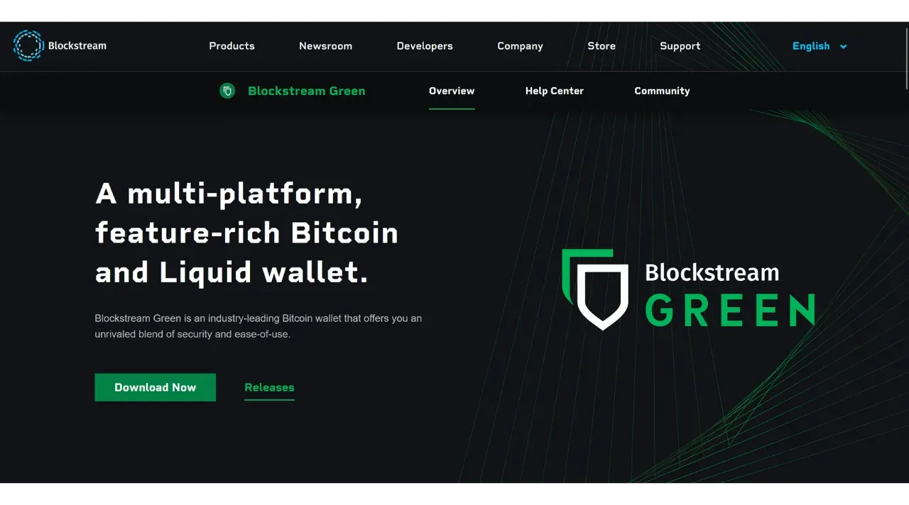

## Esittelyssä Blockstream Green

Blockstream Green on ohjelmistosovellus, joka on saatavilla mobiililaitteissa ja työpöydällä. Aiemmin Green Address -nimellä tunnetusta salkusta tuli Blockstream-projekti sen jälkeen, kun se ostettiin vuonna 2016.

Green on erittäin helppokäyttöinen sovellus, joten se sopii erityisesti aloittelijoille. Se tarjoaa useita toimintoja, kuten kuumien lompakoiden, laitteistolompakoiden ja Liquid sidechain -lompakoiden hallinnan.

Tässä oppaassa keskitymme pelkästään pelkän kellosalkun luomiseen. Jos haluat tutustua Greenin muihin käyttötapoihin, tutustu muihin aiheeseen erikoistuneisiin opetusohjelmiimme:

https://planb.network/tutorials/wallet/desktop/blockstream-green-desktop-c1503adf-1404-4328-b814-aa97fcf0d5da
https://planb.network/tutorials/wallet/mobile/blockstream-green-e84edaa9-fb65-48c1-a357-8a5f27996143
## Blockstream Green -sovelluksen asentaminen ja määrittäminen

Ensimmäinen vaihe on tietenkin Green-sovelluksen lataaminen. Mene sovelluskauppaan:

- [Androidille](https://play.google.com/store/apps/details?id=com.greenaddress.greenbits_android_wallet);
- [Applen puolesta] (https://apps.apple.com/us/app/green-bitcoin-wallet/id1402243590).
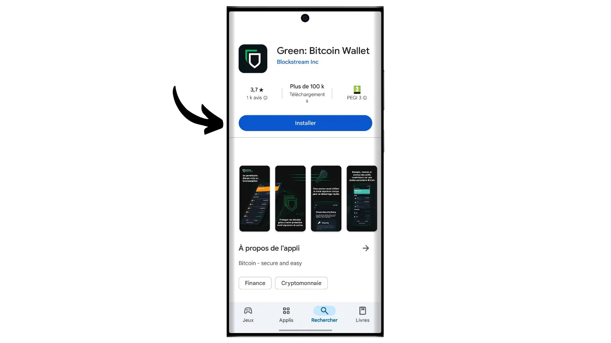

Android-käyttäjät voivat asentaa sovelluksen myös .apk-tiedoston kautta [saatavilla Blockstreamin GitHubissa](https://github.com/Blockstream/green_android/releases).

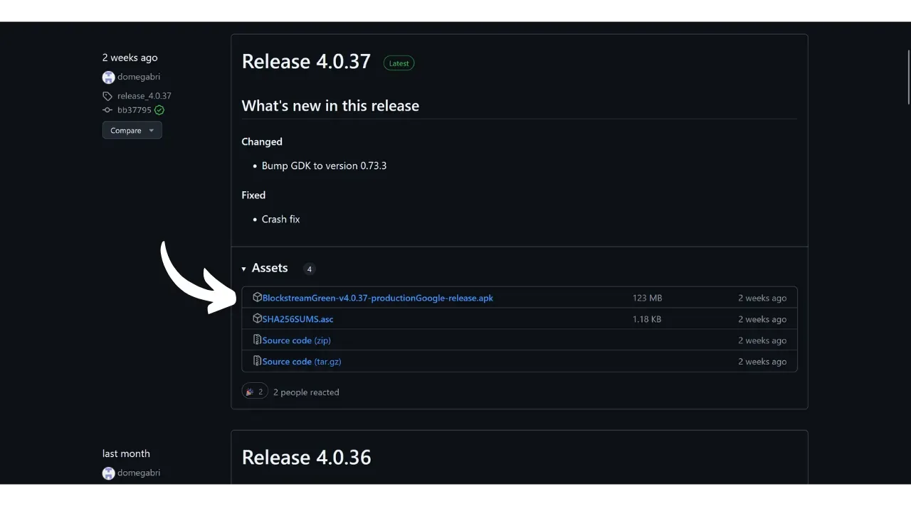

Käynnistä sovellus ja ruksaa "Hyväksyn ehdot...*" -ruutu.

Kun avaat Greenin ensimmäistä kertaa, aloitusnäyttö tulee näkyviin ilman määritettyä salkkua. Jos myöhemmin luot tai tuot portfolioita, ne näkyvät tässä käyttöliittymässä. Ennen kuin jatkat portfolion luomista, suosittelen sinua säätämään sovelluksen asetukset tarpeisiisi sopiviksi. Napsauta "Sovellusasetukset".

Vain Androidissa käytettävissä oleva "*Parannettu yksityisyys*" -vaihtoehto parantaa yksityisyyttä poistamalla kuvakaappaukset käytöstä ja piilottamalla sovellusten esikatselukuvat. Se myös lukitsee automaattisesti sovellusten käytön heti, kun puhelin lukitaan, jolloin tietojasi on vaikeampi paljastaa.

Niille, jotka haluavat parantaa yksityisyyttään, sovellus tarjoaa mahdollisuuden ohjata liikennettäsi Tor-verkon kautta, joka salaa kaikki yhteytesi ja tekee toiminnastasi vaikeasti jäljitettävää. Vaikka tämä vaihtoehto saattaa hieman hidastaa sovelluksen toimintaa, se on erittäin suositeltavaa yksityisyytesi suojaamiseksi, varsinkin jos et käytä omaa kokonaista solmua.

Käyttäjille, joilla on oma kokonainen solmu, Green Wallet tarjoaa mahdollisuuden muodostaa siihen yhteys Electrum-palvelimen kautta, mikä takaa täydellisen hallinnan Bitcoin-verkon tietojen ja transaktioiden jakelun suhteen.

Toinen vaihtoehtoinen ominaisuus on "*SPV Verification*" -vaihtoehto, jonka avulla voit tarkistaa tietyt lohkoketjujen tiedot suoraan ja siten vähentää tarvetta luottaa Blockstreamin oletussolmuun, vaikka tämä menetelmä ei tarjoa kaikkia täyden solmun takuita.

Kun olet säätänyt nämä asetukset tarpeisiisi, napsauta "*Tallenna*"-painiketta ja käynnistä sovellus uudelleen.

## Luo vain Watch-only-salkku Blockstream Greenissä

Olet nyt valmis luomaan pelkän kellosalkun. Napsauta "*Get Started*" -painiketta.

Voit valita useiden lompakkotyyppien välillä. Tätä opetusohjelmaa varten haluamme luoda vain kelloa käyttävän salkun, joten napsauta vastaavaa painiketta.

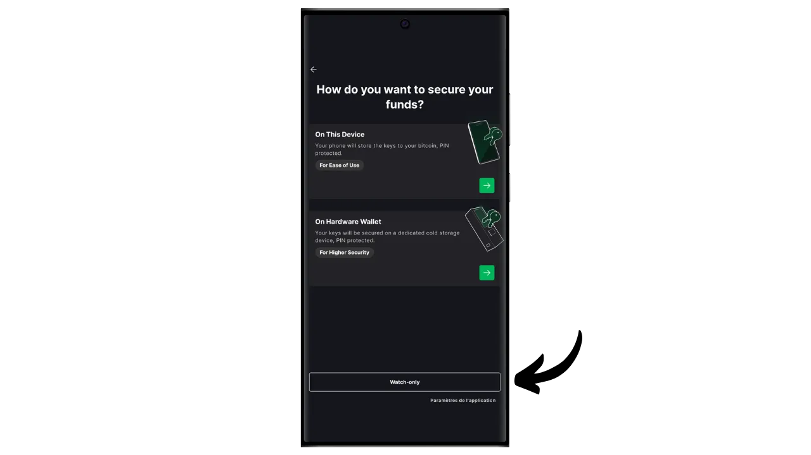

Valitse vaihtoehto "Yksittäinen allekirjoitus".

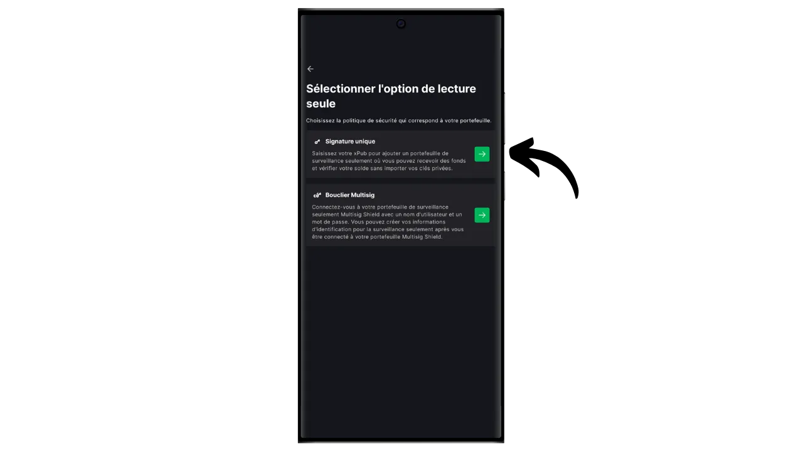

Valitse sitten "*Bitcoin*". Omalta osaltani teen tämän ohjeen testiverkon lompakolla, mutta menettely on identtinen myös mainnetissä.

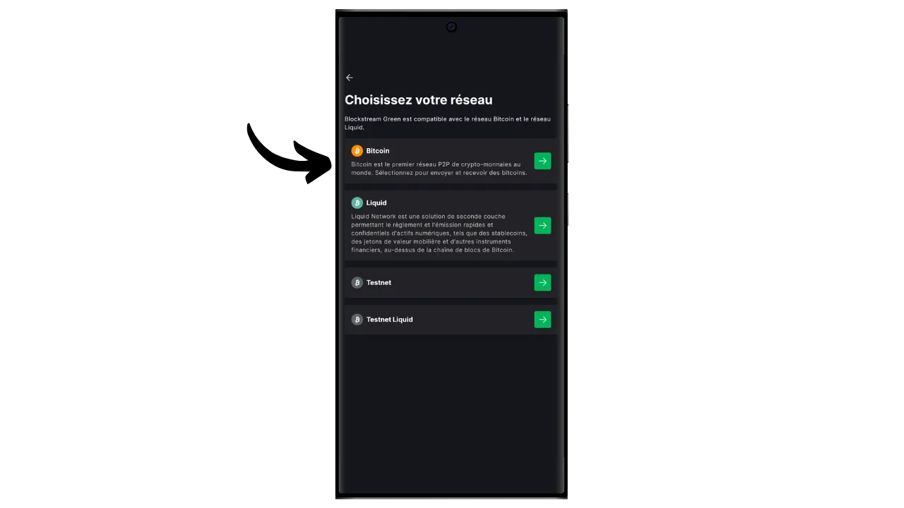

Sinua pyydetään antamaan joko laajennettu julkinen avain (`xpub`, `zpub` jne.) tai tulostusskriptin kuvaaja.

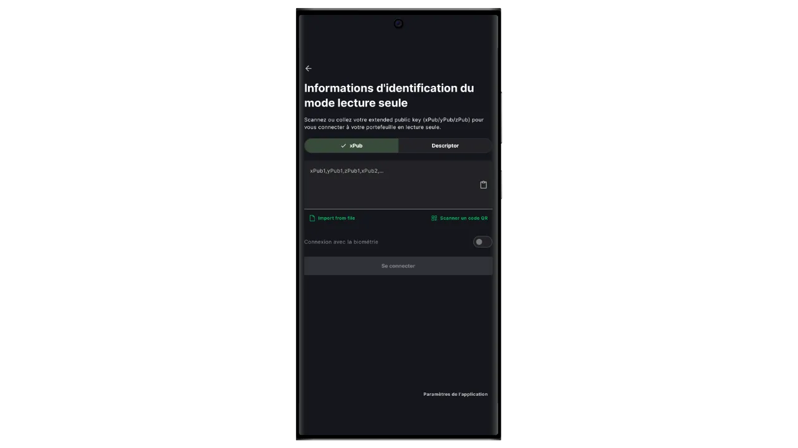

Sinun on siis haettava nämä tiedot lompakosta, jota haluat seurata vain kellon lompakon kautta. Laajennettu julkinen avain ei ole arkaluonteinen turvallisuuden kannalta, koska se ei salli pääsyä yksityisiin avaimiin, mutta se on arkaluonteinen luottamuksellisuutesi kannalta, koska se paljastaa kaikki julkiset avaimesi ja siten kaikki Bitcoin-tapahtumasi.

Oletetaan, että käytät Sparrow Wallet -lompakkoa lompakkosi hallintaan laitteistolompakossa, löydät nämä tiedot "*asetukset*"-osiosta. Näiden tietojen löytäminen riippuu käyttämästäsi lompakonhallintaohjelmistosta, mutta yleensä ne löytyvät asetuksista.

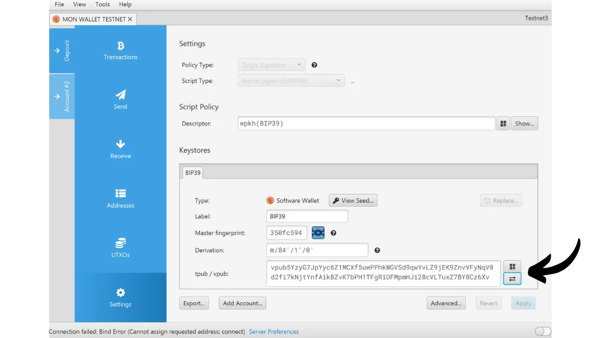

Kopioi laajennettu julkinen avaimesi ja syötä se Green-sovellukseen ja napsauta sitten "Yhdistä".

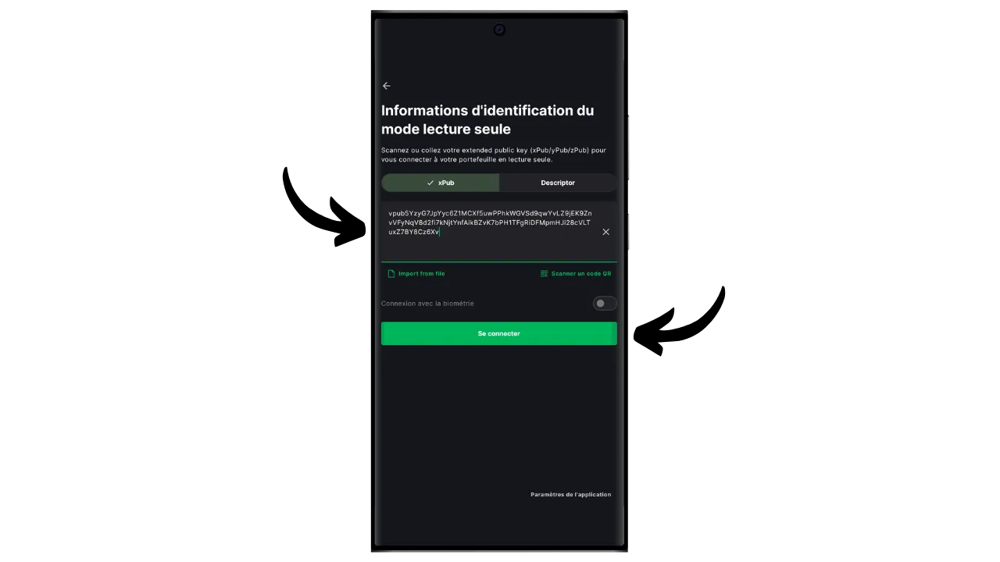

Tämän jälkeen näet tähän avaimeen liittyvän saldon sekä tapahtumahistorian.

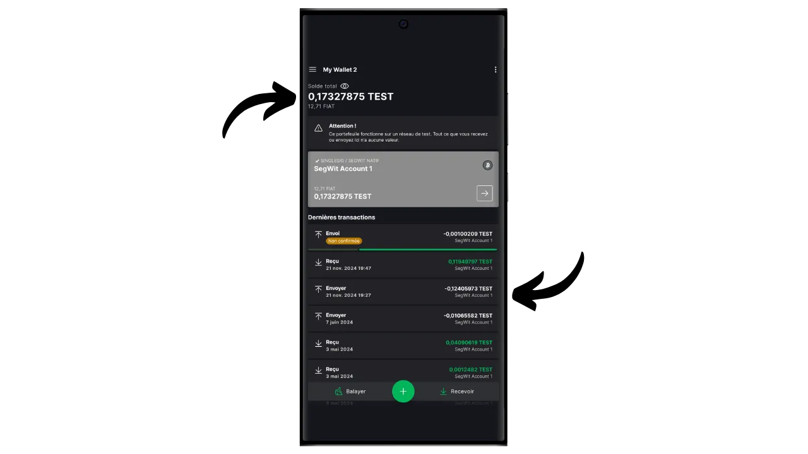

Napsauttamalla "*Vastaanottaa*" voit luoda vastaanotto-osoitteen, josta voit vastaanottaa bitcoineja laitteistosi lompakkoon. Neuvoisin kuitenkin olemaan käyttämättä tätä vaihtoehtoa tarkistamatta ensin laitteiston lompakon näytöltä, että sillä on luotuun osoitteeseen liittyvä yksityinen avain, ennen kuin käytät sitä bitcoinien lukitsemiseen. Tämä on hyvä käytäntö.

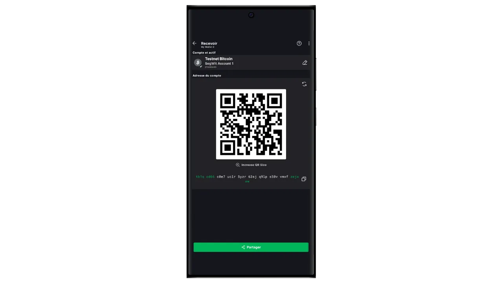

"*Balayer*"-vaihtoehdon avulla voit syöttää yksityisen avaimen manuaalisesti ja käyttää varoja suoraan Green-sovelluksestasi. En suosittele tämän toiminnon käyttämistä hyvin erityisiä tapauksia lukuun ottamatta, sillä se edellyttää, että paljastat yksityisen avaimesi puhelimessa, joka on paljon alttiimpi tietokonehyökkäyksille kuin laitteistolompakkosi.

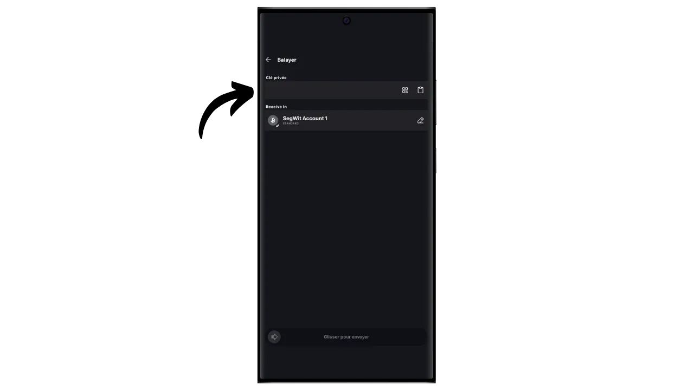

Nyt tiedät siis, miten voit helposti perustaa vain kellon käyttävän lompakon älypuhelimeesi! Se on kätevä työkalu, jonka avulla voit seurata laitteistolompakon lompakkoa ilman, että sinun tarvitsee joka kerta yhdistää ja avata lompakon lukitus.

Jos löysit tämän ohjeen hyödylliseksi, olisin kiitollinen, jos jättäisit vihreän peukalon alle. Voit vapaasti jakaa tämän artikkelin sosiaalisissa verkostoissa. Kiitos paljon!

Suosittelen myös tutustumaan tähän muuhun kattavaan oppaaseen, joka koskee Blockstream Green -sovellusta kuuman lompakon perustamiseksi:

https://planb.network/tutorials/wallet/mobile/blockstream-green-e84edaa9-fb65-48c1-a357-8a5f27996143