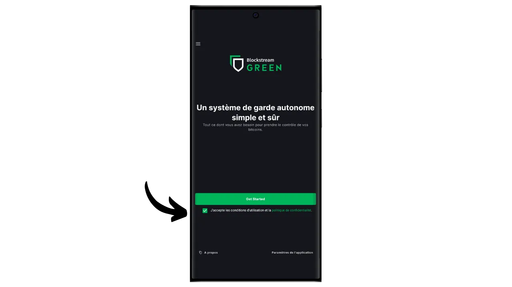
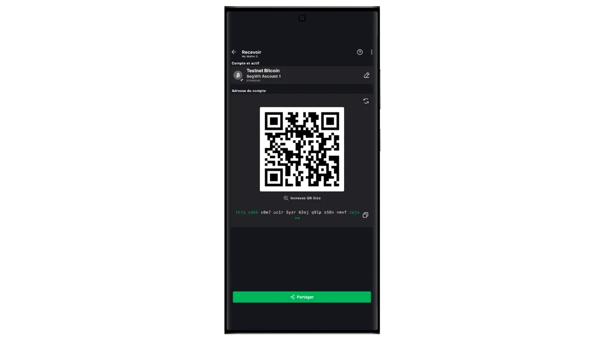

Dalam tutorial ini, Anda akan menemukan cara mudah mengatur portofolio "hanya tontonan" di ponsel menggunakan aplikasi Blockstream Green.

## Apa yang dimaksud dengan Dompet Khusus Jam Tangan?

Dompet hanya-baca, atau "dompet hanya-waspada", adalah sebuah jenis perangkat lunak yang dirancang untuk memungkinkan pengguna mengamati transaksi yang terkait dengan satu atau beberapa kunci publik Bitcoin tertentu, tanpa memiliki akses ke kunci privat yang sesuai.

Jenis aplikasi ini hanya menyimpan data yang diperlukan untuk memantau dompet Bitcoin, terutama untuk melihat saldo dan riwayat transaksinya, tetapi tidak memiliki akses ke private key. Akibatnya, tidak mungkin membelanjakan Bitcoin yang disimpan di dompet pada aplikasi watch-only.

Watch-only umumnya digunakan bersama dengan dompet perangkat keras. Hal ini memungkinkan kunci pribadi dompet disimpan dengan aman, pada perangkat keras yang tidak terhubung ke Internet dan memiliki permukaan serangan yang sangat kecil, sehingga mengisolasi kunci pribadi dari lingkungan yang berpotensi rentan. Di sisi lain, aplikasi watch-only secara eksklusif menyimpan kunci publik yang diperluas (`xpub`, `zpub`, dll) dari dompet Bitcoin. Kunci induk ini tidak dapat digunakan untuk menemukan kunci privat yang terkait, dan oleh karena itu tidak dapat digunakan untuk membelanjakan Bitcoin. Akan tetapi, kunci ini memungkinkan untuk menurunkan kunci publik anak dan alamat penerima. Berkat pengetahuan dompet perangkat keras mengenai alamat dompet yang aman, aplikasi watch-only dapat melacak transaksi-transaksi ini di jaringan Bitcoin, sehingga pengguna dapat memonitor saldonya dan membuat alamat-alamat penerima yang baru, tanpa perlu menghubungkan dompet perangkat kerasnya setiap kali.

Dalam tutorial ini, saya ingin memperkenalkan Anda pada salah satu solusi dompet seluler khusus jam tangan yang paling populer: **Blockstream Green**.

## Memperkenalkan Blockstream Green

Blockstream Green adalah aplikasi perangkat lunak yang tersedia di ponsel dan desktop. Sebelumnya dikenal sebagai Green Address, portofolio ini menjadi proyek Blockstream setelah diakuisisi pada tahun 2016.

Green adalah aplikasi yang sangat mudah digunakan, membuatnya sangat cocok untuk pemula. Aplikasi ini menawarkan berbagai fungsi, seperti pengelolaan hot wallet, dompet perangkat keras, dan dompet sidechain Liquid.

Dalam tutorial ini, kita hanya akan berkonsentrasi pada pembuatan portofolio khusus jam tangan. Untuk menjelajahi penggunaan Green lainnya, silakan baca tutorial khusus kami yang lain:

https://planb.network/tutorials/wallet/desktop/blockstream-green-desktop-c1503adf-1404-4328-b814-aa97fcf0d5da
https://planb.network/tutorials/wallet/mobile/blockstream-green-e84edaa9-fb65-48c1-a357-8a5f27996143
## Menginstal dan mengonfigurasi aplikasi Blockstream Green

Langkah pertama tentu saja mengunduh aplikasi Green. Buka toko aplikasi Anda:

- [Untuk Android](https://play.google.com/store/apps/details?id=com.greenaddress.greenbits_android_wallet);
- [Untuk Apple](https://apps.apple.com/us/app/green-bitcoin-wallet/id1402243590).

Untuk pengguna Android, Anda juga dapat menginstal aplikasi melalui file `.apk` [tersedia di GitHub Blockstream](https://github.com/Blockstream/green_android/releases).

Luncurkan aplikasi, lalu centang kotak "Saya menerima ketentuan...*".

Apabila Anda membuka Green untuk pertama kali, layar beranda muncul tanpa portofolio yang dikonfigurasi. Nanti, jika Anda membuat atau mengimpor portofolio, portofolio akan muncul dalam antarmuka ini. Sebelum melanjutkan untuk membuat portofolio, saya sarankan Anda untuk menyesuaikan pengaturan aplikasi agar sesuai dengan kebutuhan Anda. Klik pada "Pengaturan aplikasi".

Opsi "*Privasi yang Ditingkatkan*", yang hanya tersedia di Android, meningkatkan privasi dengan menonaktifkan tangkapan layar dan menyembunyikan pratinjau aplikasi. Opsi ini juga secara otomatis mengunci akses aplikasi segera setelah ponsel Anda terkunci, sehingga data Anda lebih sulit untuk diekspos.

Bagi mereka yang ingin meningkatkan privasi mereka, aplikasi ini menawarkan opsi untuk melakukan rooting pada lalu lintas Anda melalui Tor, sebuah jaringan yang mengenkripsi semua koneksi Anda dan membuat aktivitas Anda sulit dilacak. Meskipun opsi ini mungkin sedikit memperlambat operasi aplikasi, ini sangat disarankan untuk melindungi privasi Anda, terutama jika Anda tidak menggunakan simpul lengkap Anda sendiri.

Untuk pengguna yang memiliki node lengkap mereka sendiri, Green Wallet menawarkan kemungkinan untuk menghubungkannya melalui server Electrum, menjamin kontrol penuh atas informasi jaringan Bitcoin dan distribusi transaksi.

Fitur alternatif lainnya adalah opsi "*Verifikasi SPV*", yang memungkinkan Anda untuk memverifikasi data blockchain tertentu secara langsung dan dengan demikian mengurangi kebutuhan untuk mempercayai node default Blockstream, meskipun metode ini tidak memberikan semua jaminan dari sebuah node yang lengkap.

Setelah Anda menyesuaikan pengaturan ini dengan kebutuhan Anda, klik tombol "*Save*" dan mulai ulang aplikasi.

## Buat portofolio khusus tontonan di Blockstream Green

Anda sekarang siap untuk membuat portofolio khusus jam tangan. Klik tombol "*Mulai*".

Anda akan dapat memilih di antara beberapa jenis dompet. Untuk tutorial ini, kita ingin membuat portofolio khusus jam tangan, jadi klik tombol yang sesuai.

Pilih opsi "Tanda tangan tunggal".

Kemudian pilih "*Bitcoin*". Untuk bagian saya, saya melakukan tutorial ini di dompet testnet, tetapi prosedurnya tetap sama di mainnet.

Anda akan diminta untuk menyediakan kunci publik yang diperluas (`xpub`, `zpub`, dll.) atau deskriptor skrip keluaran.

Oleh karena itu, Anda perlu mengambil informasi ini dari dompet yang ingin Anda lacak melalui dompet khusus jam tangan. Kunci publik yang diperluas tidak sensitif dalam hal keamanan, karena tidak mengizinkan akses ke kunci privat, tetapi sensitif untuk kerahasiaan Anda, karena kunci publik ini mengungkapkan semua kunci publik Anda dan oleh karena itu semua transaksi Bitcoin Anda.

Katakanlah Anda menggunakan Sparrow Wallet untuk mengelola dompet Anda di dompet perangkat keras, Anda akan menemukan informasi ini di bagian "*Pengaturan*". Menemukan informasi ini akan tergantung pada perangkat lunak manajemen dompet yang Anda gunakan, tetapi biasanya ada di pengaturan.

Salin kunci publik Anda yang telah diperluas dan masukkan di aplikasi Hijau, lalu klik "Hubungkan".

Anda kemudian dapat melihat saldo yang terkait dengan kunci ini, serta riwayat transaksi.

Dengan mengklik "*Receive*", Anda bisa membuat sebuah alamat penerimaan untuk menerima bitcoin pada dompet perangkat keras Anda. Akan tetapi, saya menyarankan untuk tidak menggunakan opsi ini tanpa terlebih dahulu memeriksa pada layar dompet perangkat keras bahwa ia memiliki kunci pribadi yang terkait dengan alamat yang dihasilkan, sebelum menggunakannya untuk mengunci bitcoin. Ini adalah praktik yang baik untuk diikuti.

Opsi "*Balayer*" memungkinkan Anda untuk secara manual memasukkan private key untuk membelanjakan dana langsung dari aplikasi Green. Kecuali dalam kasus yang sangat spesifik, saya tidak menyarankan untuk menggunakan fungsi ini, karena fungsi ini mengharuskan Anda untuk membuka kunci pribadi Anda di ponsel, yang jauh lebih rentan terhadap serangan komputer dibandingkan dengan dompet perangkat keras Anda.

Jadi, sekarang Anda tahu cara mudah mengatur dompet khusus jam tangan di ponsel cerdas Anda! Ini adalah alat yang praktis untuk memantau dompet di dompet perangkat keras tanpa harus menghubungkan dan membukanya setiap saat.

Jika Anda merasa tutorial ini bermanfaat, saya akan sangat berterima kasih jika Anda memberikan jempol hijau di bawah ini. Jangan ragu untuk membagikan artikel ini di jejaring sosial Anda. Terima kasih banyak!

Saya juga menyarankan Anda untuk melihat tutorial komprehensif lainnya pada aplikasi Blockstream Green untuk menyiapkan hot wallet:

https://planb.network/tutorials/wallet/mobile/blockstream-green-e84edaa9-fb65-48c1-a357-8a5f27996143