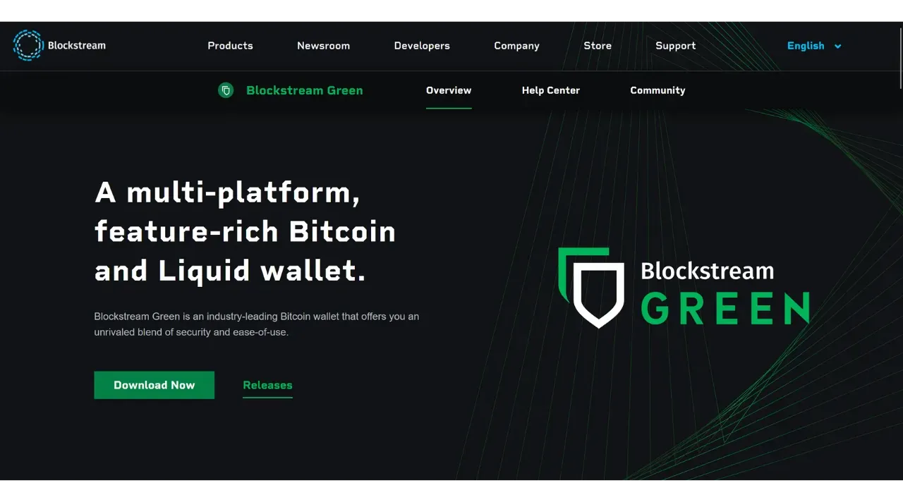
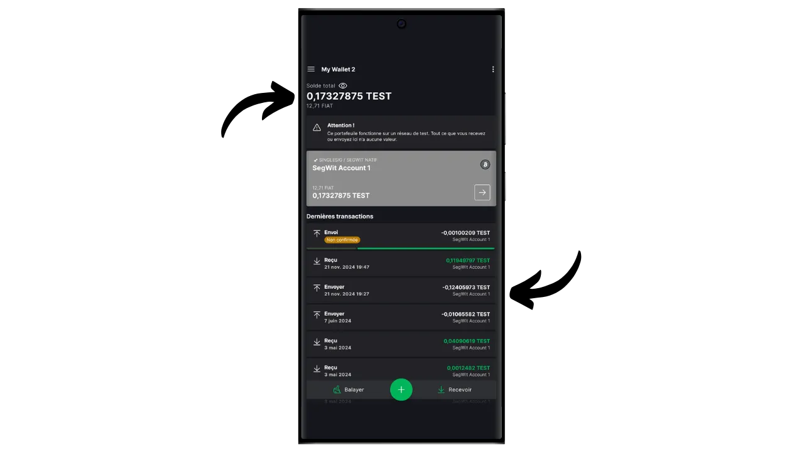

In questo tutorial scoprirete come impostare facilmente un portafoglio "watch-only" su mobile utilizzando l'applicazione Blockstream Green.

## Che cos'è un portafoglio per soli orologi?

Un portafoglio di sola lettura, o "watch-only wallet", è un tipo di software progettato per consentire all'utente di osservare le transazioni associate a una o più chiavi pubbliche Bitcoin specifiche, senza avere accesso alle chiavi private corrispondenti.

Questo tipo di applicazione memorizza solo i dati necessari per monitorare un portafoglio Bitcoin, in particolare per visualizzare il saldo e la cronologia delle transazioni, ma non ha accesso alle chiavi private. Di conseguenza, è impossibile spendere i Bitcoin detenuti dal portafoglio sull'applicazione di solo monitoraggio.

Watch-only viene generalmente utilizzato insieme a un portafoglio hardware. Ciò consente di memorizzare le chiavi private del portafoglio in modo sicuro, su un hardware non connesso a Internet e con una superficie di attacco molto ridotta, isolando così le chiavi private da ambienti potenzialmente vulnerabili. L'applicazione watch-only, invece, memorizza esclusivamente la chiave pubblica estesa (`xpub`, `zpub`, ecc.) del portafoglio Bitcoin. Questa chiave principale non può essere usata per trovare le chiavi private associate e quindi non può essere usata per spendere Bitcoin. Tuttavia, consente di ricavare le chiavi pubbliche dei figli e gli indirizzi di ricezione. Grazie alla conoscenza degli indirizzi sicuri del portafoglio hardware, l'applicazione watch-only è in grado di tracciare queste transazioni sulla rete Bitcoin, consentendo all'utente di monitorare il proprio saldo e di generare nuovi indirizzi di ricezione, senza dover collegare ogni volta il proprio portafoglio hardware.

In questo tutorial, vorrei presentarvi una delle soluzioni di portafoglio mobile per soli orologi più popolari: **Blockstream Green**.

## Presentazione di Blockstream Green

Blockstream Green è un'applicazione software disponibile su mobile e desktop. Precedentemente noto come Green Address, questo portafoglio è diventato un progetto Blockstream in seguito alla sua acquisizione nel 2016.

Green è un'applicazione molto semplice da usare, particolarmente adatta ai principianti. Offre una serie di funzioni, come la gestione di portafogli hot, portafogli hardware e portafogli Liquid sidechain.

In questo tutorial ci concentreremo esclusivamente sulla creazione di un portafoglio di soli orologi. Per esplorare altri usi di Green, consultate le nostre altre esercitazioni dedicate:

https://planb.network/tutorials/wallet/desktop/blockstream-green-desktop-c1503adf-1404-4328-b814-aa97fcf0d5da
https://planb.network/tutorials/wallet/mobile/blockstream-green-e84edaa9-fb65-48c1-a357-8a5f27996143
## Installazione e configurazione dell'applicazione Blockstream Green

Il primo passo è ovviamente quello di scaricare l'applicazione Green. Andate nel vostro negozio di applicazioni:

- [Per Android](https://play.google.com/store/apps/details?id=com.greenaddress.greenbits_android_wallet);
- [Per Apple](https://apps.apple.com/us/app/green-bitcoin-wallet/id1402243590).

Per gli utenti Android, è possibile installare l'applicazione anche tramite il file `.apk` [disponibile su GitHub di Blockstream](https://github.com/Blockstream/green_android/releases).

Avviare l'applicazione, quindi selezionare la casella "Accetto le condizioni...*".

Quando si apre Green per la prima volta, la schermata iniziale appare senza un portafoglio configurato. In seguito, se si creano o importano portafogli, questi appariranno in questa interfaccia. Prima di procedere alla creazione di un portafoglio, vi consiglio di regolare le impostazioni dell'applicazione in base alle vostre esigenze. Cliccare su "Impostazioni dell'applicazione".

L'opzione "*Privacy avanzata*", disponibile solo su Android, migliora la privacy disabilitando gli screenshot e nascondendo le anteprime delle applicazioni. Inoltre, blocca automaticamente l'accesso alle applicazioni non appena il telefono viene bloccato, rendendo più difficile l'esposizione dei dati.

Per coloro che desiderano migliorare la propria privacy, l'applicazione offre la possibilità di effettuare il rooting del traffico tramite Tor, una rete che cripta tutte le connessioni e rende le attività difficili da rintracciare. Sebbene questa opzione possa rallentare leggermente il funzionamento dell'applicazione, è altamente consigliata per proteggere la propria privacy, soprattutto se non si utilizza un proprio nodo completo.

Per gli utenti che dispongono di un proprio nodo completo, Green Wallet offre la possibilità di collegarsi ad esso tramite un server Electrum, garantendo un controllo totale sulle informazioni della rete Bitcoin e sulla distribuzione delle transazioni.

Un'altra funzione alternativa è l'opzione "*Verifica SPV*", che consente di verificare direttamente alcuni dati della blockchain e quindi di ridurre la necessità di fidarsi del nodo predefinito di Blockstream, anche se questo metodo non fornisce tutte le garanzie di un nodo completo.

Dopo aver regolato le impostazioni in base alle proprie esigenze, fare clic sul pulsante "*Salva*" e riavviare l'applicazione.

## Creare un portafoglio di sola osservazione su Blockstream Green

Ora siete pronti a creare un portafoglio di soli orologi. Fare clic sul pulsante "*Iniziare*".

Sarà possibile scegliere tra diversi tipi di portafoglio. Per questa esercitazione, vogliamo creare un portafoglio di soli orologi, quindi cliccate sul pulsante corrispondente.

Scegliere l'opzione "Firma singola".

Quindi selezionare "*Bitcoin*". Per quanto mi riguarda, sto svolgendo questo tutorial su un portafoglio di testnet, ma la procedura rimane identica sulla mainnet.

Verrà richiesto di fornire una chiave pubblica estesa (`xpub`, `zpub`, ecc.) o un descrittore dello script di output.

È quindi necessario recuperare queste informazioni dal portafoglio che si desidera monitorare tramite il portafoglio dell'orologio. La chiave pubblica estesa non è sensibile in termini di sicurezza, in quanto non consente l'accesso alle chiavi private, ma è sensibile per la vostra riservatezza, in quanto rivela tutte le vostre chiavi pubbliche e quindi tutte le vostre transazioni Bitcoin.

Nel caso in cui si utilizzi Sparrow Wallet per gestire il proprio portafoglio su un portafoglio hardware, si troveranno queste informazioni nella sezione "*Impostazioni*". La ricerca di queste informazioni dipende dal software di gestione del portafoglio utilizzato, ma di solito si trova nelle impostazioni.

Copiare la chiave pubblica estesa e inserirla nell'applicazione verde, quindi fare clic su "Connetti".

Sarà quindi possibile visualizzare il saldo associato a questa chiave e lo storico delle transazioni.

Facendo clic su "*Receive*", è possibile generare un indirizzo di ricezione per ricevere bitcoin sul proprio portafoglio hardware. Tuttavia, vi sconsiglio di utilizzare questa opzione senza aver prima controllato nella schermata del portafoglio hardware che sia presente la chiave privata associata all'indirizzo generato, prima di utilizzarla per bloccare i bitcoin. Questa è una buona pratica da seguire.

L'opzione "*Balayer*" consente di inserire manualmente una chiave privata per spendere i fondi direttamente dall'applicazione Green. Tranne che in casi molto specifici, non consiglio di utilizzare questa funzione, poiché richiede di rivelare la chiave privata su un telefono, che è molto più vulnerabile agli attacchi informatici rispetto al portafoglio hardware.

Ora sapete come impostare facilmente un portafoglio per soli orologi sul vostro smartphone! Si tratta di un comodo strumento per monitorare un portafoglio su un hardware wallet senza doverlo collegare e sbloccare ogni volta.

Se avete trovato utile questa guida, vi sarei grato se lasciaste un pollice verde qui sotto. Sentitevi liberi di condividere questo articolo sui vostri social network. Grazie mille!

Vi consiglio anche di dare un'occhiata a quest'altro tutorial completo sull'applicazione Blockstream Green per configurare un portafoglio caldo:

https://planb.network/tutorials/wallet/mobile/blockstream-green-e84edaa9-fb65-48c1-a357-8a5f27996143