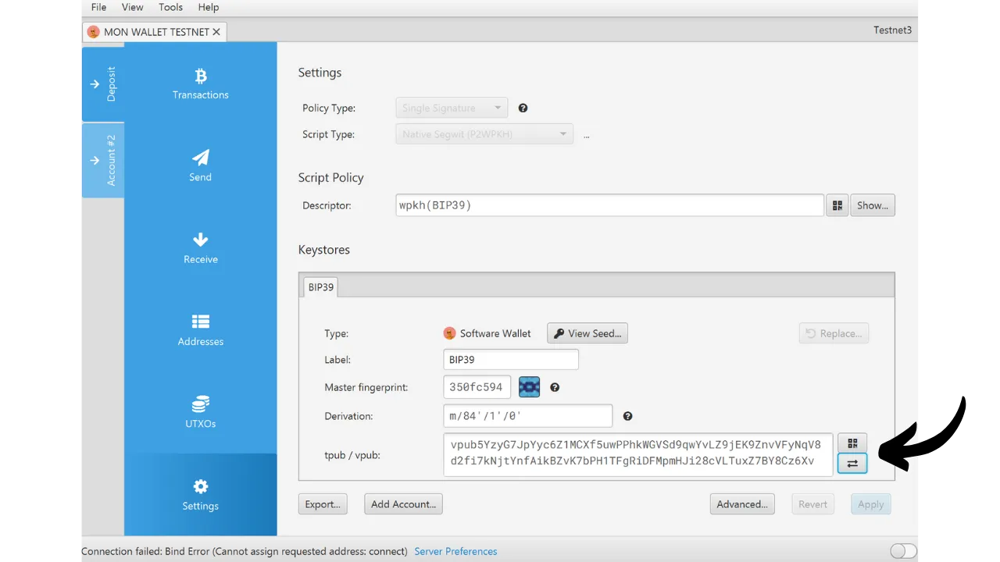

このチュートリアルでは、Blockstream Greenアプリケーションを使用して、モバイルで「ウォッチ・オンリー」のポートフォリオを簡単に設定する方法をご紹介します。

## 時計専用ウォレットとは？

読み取り専用ウォレット、または「監視専用ウォレット」は、ユーザーが対応する秘密鍵にアクセスすることなく、1つまたは複数の特定のビットコイン公開鍵に関連するトランザクションを観察できるように設計されたソフトウェアの一種です。

このタイプのアプリケーションは、ビットコイン・ウォレットを監視するのに必要なデータのみを保存し、特にその残高と取引履歴を見ることができるが、秘密鍵にはアクセスできない。その結果、監視専用アプリケーションでウォレットが保有するビットコインを使用することは不可能である。

ウォッチ・オンリーは通常、ハードウェア・ウォレットと組み合わせて使用される。これにより、ウォレットの秘密鍵は、インターネットに接続されておらず、攻撃対象が非常に小さいハードウェア上に安全に保管され、潜在的に脆弱な環境から秘密鍵を隔離することができます。一方、ウォッチ専用アプリケーションは、ビットコイン・ウォレットの拡張公開鍵（`xpub`、`zpub`など）を排他的に保存する。この親鍵は関連する秘密鍵を見つけるために使用することはできず、したがってビットコインを使用するために使用することはできない。しかし、子公開鍵と受信アドレスの導出は可能です。ハードウェアウォレットが安全なウォレットアドレスを知っているおかげで、ウォッチ専用アプリケーションはビットコインネットワーク上のこれらのトランザクションを追跡することができ、ユーザーは自分の残高を監視し、毎回ハードウェアウォレットを接続することなく、新しい受信アドレスを生成することができます。

このチュートリアルでは、最も人気のある時計専用のおサイフケータイをご紹介します： **ブロックストリーム・グリーン

## ブロックストリーム・グリーンの紹介

Blockstream Greenはモバイルとデスクトップで利用可能なソフトウェア・アプリケーションである。以前はGreen Addressとして知られていたこのポートフォリオは、2016年の買収後、Blockstreamのプロジェクトとなった。

Greenは非常に使いやすいアプリケーションで、特に初心者に適しています。ホットウォレット、ハードウェアウォレット、リキッドサイドチェーンウォレットの管理など、様々な機能を提供しています。

このチュートリアルでは、時計専用のポートフォリオを作成することに集中します。Greenの他の使い方については、他の専用チュートリアルをご参照ください：

https://planb.network/tutorials/wallet/desktop/blockstream-green-desktop-c1503adf-1404-4328-b814-aa97fcf0d5da
https://planb.network/tutorials/wallet/mobile/blockstream-green-e84edaa9-fb65-48c1-a357-8a5f27996143
## Blockstream Greenアプリケーションのインストールと設定

最初のステップは、もちろんGreenアプリケーションをダウンロードすることです。アプリケーションストアにアクセスしてください：

- [Android用](https://play.google.com/store/apps/details?id=com.greenaddress.greenbits_android_wallet)；
- [アップルのために](https://apps.apple.com/us/app/green-bitcoin-wallet/id1402243590)。

アンドロイド・ユーザーの場合は、`.apk`ファイル[BlockstreamのGitHubで入手可能](https://github.com/Blockstream/green_android/releases)を使ってアプリケーションをインストールすることもできる。

アプリケーションを起動し、"I accept the conditions...*"にチェックを入れる。

初めてGreenを開いたときは、ポートフォリオが設定されていない状態でホーム画面が表示されます。その後、ポートフォリオを作成またはインポートすると、このインターフェイスに表示されます。ポートフォリオを作成する前に、アプリケーションの設定を調整することをお勧めします。アプリケーション設定」をクリックしてください。

Androidでのみ利用可能な「*プライバシー強化*」オプションは、スクリーンショットを無効にし、アプリケーションのプレビューを非表示にすることで、プライバシーを強化します。また、携帯電話がロックされると同時にアプリケーションへのアクセスも自動的にロックされ、データの流出がより困難になります。

プライバシーを強化したい人のために、このアプリケーションは、すべての接続を暗号化し、あなたの活動を追跡することを困難にするネットワークであるTor経由であなたのトラフィックをルート化するオプションを提供しています。このオプションはアプリケーションの動作を若干遅くするかもしれませんが、あなたのプライバシーを保護するために、特にあなた自身の完全なノードを使用していない場合は、強くお勧めします。

自分の完全なノードを持つユーザーのために、グリーンウォレットは、ビットコインのネットワーク情報とトランザクションの配布の完全な制御を保証するElectrumサーバーを介してそれに接続する可能性を提供します。

これは特定のブロックチェーン・データを直接検証することができるため、ブロックストリームのデフォルト・ノードを信頼する必要性を減らすことができますが、この方法ではフル・ノードのすべての保証を提供することはできません。

これらの設定をあなたのニーズに合わせて調整したら、「*保存*」ボタンをクリックし、アプリケーションを再起動します。

## ブロックストリーム・グリーンでウォッチ専用ポートフォリオを作成する

これで時計専用のポートフォリオを作成する準備が整いました。Started*" ボタンをクリックしてください。

いくつかのタイプの財布から選ぶことができます。このチュートリアルでは、時計専用のポートフォリオを作成したいと思いますので、対応するボタンをクリックしてください。

単一署名」オプションを選択する。

次に "*Bitcoin*"を選択する。私はこのチュートリアルをテストネットのウォレットで行っていますが、メインネットでも手順は同じです。

拡張公開鍵 (`xpub`、`zpub` など) または出力スクリプトの記述子のいずれかを指定するよう求められる。

そのため、追跡したいウォレットからウォッチ専用ウォレット経由でこの情報を取得する必要があります。拡張公開鍵は、秘密鍵へのアクセスを許可しないため、セキュリティの点では機密ではありませんが、すべての公開鍵、したがってすべてのビットコイン取引を明らかにするため、機密性の点では機密です。

ハードウェアウォレットでウォレットを管理するためにSparrow Walletを使用しているとすると、この情報は「*設定*」セクションにあります。この情報を見つけるのは、使用しているウォレット管理ソフトウェアによりますが、通常は設定の中にあります。

拡張公開鍵をコピーしてGreenアプリケーションに入力し、「Connect」をクリックします。

すると、このキーに関連する残高と取引履歴を見ることができます。

受信*」をクリックすると、ハードウェアウォレットでビットコインを受け取るための受信アドレスを生成することができます。しかし、ビットコインをロックするために使用する前に、まずハードウェアウォレットの画面で、生成されたアドレスに関連付けられた秘密鍵を持っていることを確認せずに、このオプションを使用することはお勧めしません。これは良い習慣です。

Balayer*」オプションでは、Greenアプリケーションから直接資金を使うために、秘密鍵を手動で入力することができます。非常に特殊な場合を除き、この機能を使用することはお勧めしません。なぜなら、ハードウェアウォレットよりもコンピュータ攻撃に対してはるかに脆弱な携帯電話で秘密鍵を公開する必要があるからです。

これで、スマートフォンで時計専用のウォレットを簡単に設定する方法がお分かりいただけただろう！いちいちウォレットに接続してロックを解除しなくても、ハードウェアウォレットのウォレットをモニターできる便利なツールだ。

このチュートリアルが役に立ったと思ったら、下に緑の親指を残してくれるとありがたい。この記事をソーシャルネットワークでシェアしてください。ありがとうございました！

また、ホットウォレットをセットアップするためのBlockstream Greenアプリケーションに関する他の包括的なチュートリアルをチェックすることをお勧めします：

https://planb.network/tutorials/wallet/mobile/blockstream-green-e84edaa9-fb65-48c1-a357-8a5f27996143