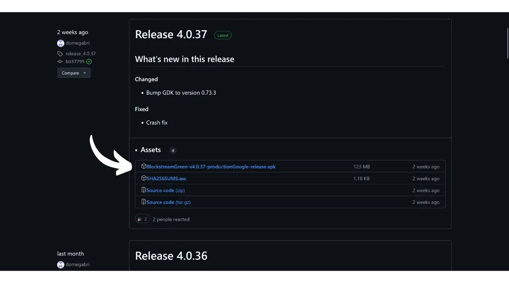
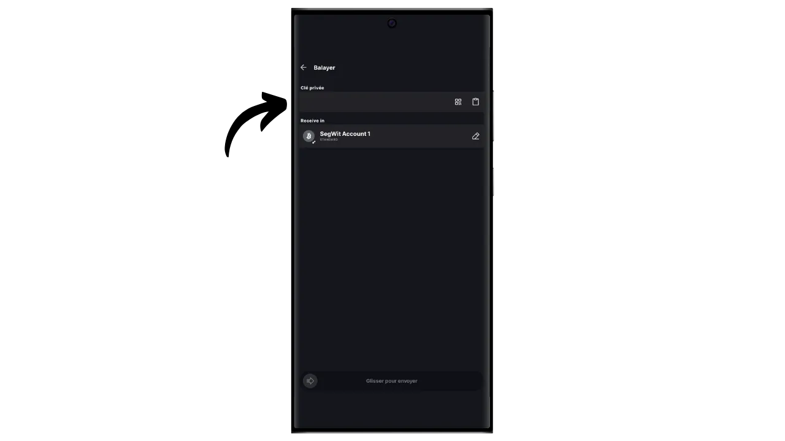

在本教程中，您将了解如何使用 Blockstream Green 应用程序在移动设备上轻松设置 "仅限观看 "的投资组合。

## 什么是手表专用钱包？

只读钱包或 "只看钱包 "是一种软件，旨在让用户观察与一个或多个特定比特币公钥相关的交易，而无需访问相应的私钥。

这种应用程序只存储监控比特币钱包所需的数据，特别是查看其余额和交易历史，但无法访问私钥。因此，在纯监视应用程序上无法花费钱包持有的比特币。

只看不买通常与硬件钱包结合使用。这使得钱包的私钥可以安全地存储在不连接互联网且攻击面很小的硬件上，从而将私钥与潜在的脆弱环境隔离开来。另一方面，纯看管应用程序只存储比特币钱包的扩展公钥（"xpub"、"zpub "等）。这个父密钥不能用来查找相关的私钥，因此也不能用来消费比特币。不过，它可以用来推导子公钥和接收地址。借助硬件钱包对安全钱包地址的了解，只看不买的应用程序可以在比特币网络上跟踪这些交易，使用户能够监控自己的余额并生成新的接收地址，而无需每次都连接硬件钱包。

在本教程中，我将向您介绍最受欢迎的手表专用移动钱包解决方案之一： **Blockstream Green**。

## 绿色 Blockstream 介绍

Blockstream Green是一款应用软件，可在手机和桌面上使用。其前身为 "绿色地址"，在2016年被收购后成为Blockstream项目。

Green 是一款非常易于使用的应用程序，因此特别适合初学者。它提供一系列功能，如管理热钱包、硬件钱包和液体侧链钱包。

在本教程中，我们将只专注于创建手表投资组合。如需了解 Green 的其他用途，请参阅我们的其他专门教程：

https://planb.network/tutorials/wallet/desktop/blockstream-green-desktop-c1503adf-1404-4328-b814-aa97fcf0d5da
https://planb.network/tutorials/wallet/mobile/blockstream-green-e84edaa9-fb65-48c1-a357-8a5f27996143
## 安装和配置 Blockstream Green 应用程序

第一步当然是下载绿色应用程序。前往应用程序商店：

- [Android版](https://play.google.com/store/apps/details?id=com.greenaddress.greenbits_android_wallet)；
- [苹果公司](https://apps.apple.com/us/app/green-bitcoin-wallet/id1402243590)。

对于安卓用户，您也可以通过`.apk`文件[可在 Blockstream 的 GitHub 上获取](https://github.com/Blockstream/green_android/releases)安装应用程序。

启动应用程序，然后勾选 "我接受条件...*"框。

首次打开 Green 时，主屏幕上不会出现已配置的投资组合。之后，如果创建或导入投资组合，它们就会出现在这个界面中。在创建投资组合之前，我建议你调整应用程序设置，以满足自己的需要。点击 "应用程序设置"。

仅适用于 Android 系统的 "*增强隐私*"选项可通过禁用屏幕截图和隐藏应用程序预览来增强隐私。一旦手机被锁定，它还会自动锁定应用程序的访问权限，使你的数据更难暴露。

对于那些希望加强隐私保护的用户，程序提供了通过 Tor（一个对所有连接进行加密的网络，使你的活动难以被追踪）根植流量的选项。虽然这个选项可能会略微减慢程序的运行速度，但还是强烈建议使用它来保护你的隐私，尤其是在你不使用自己的完整节点时。

对于拥有自己完整节点的用户，绿色钱包提供通过 Electrum 服务器与之连接的可能性，从而保证对比特币网络信息和交易分配的完全控制。

另一个替代功能是 "*SPV 验证*"选项，它允许您直接验证某些区块链数据，从而减少对 Blockstream 默认节点的信任，不过这种方法并不能提供完整节点的所有保证。

根据需要调整这些设置后，点击 "*保存*"按钮并重新启动应用程序。

## 在 Blockstream Green 上创建仅供观察的投资组合

现在您已准备好创建仅供观看的投资组合。点击 "*开始*"按钮。

您可以选择几种类型的钱包。在本教程中，我们要创建一个纯手表投资组合，因此请点击相应的按钮。

选择 "单一签名 "选项。

然后选择 "*比特币*"。就我而言，我是在测试网钱包上完成本教程的，但在主网上的操作步骤完全相同。

系统会要求您提供扩展公钥（`xpub`、`zpub` 等）或输出脚本描述符。

因此，您需要通过您的纯手表钱包从您想要追踪的钱包中获取这些信息。扩展公钥在安全性方面并不敏感，因为它不允许访问私钥，但在保密性方面却很敏感，因为它会泄露你所有的公钥，从而泄露你所有的比特币交易。

如果您使用 Sparrow Wallet 管理硬件钱包，您可以在 "*设置*"部分找到此信息。能否找到这些信息取决于您使用的钱包管理软件，但通常都在设置中。

复制你的扩展公钥并将其输入绿色应用程序，然后点击 "连接"。

然后，您就可以看到与该密钥相关的余额以及交易历史记录。

点击 "*接收*"，就可以生成一个接收地址，在硬件钱包上接收比特币。不过，我建议在使用该选项锁定比特币之前，不要先在硬件钱包屏幕上检查它是否拥有与生成地址相关的私钥。这是一个很好的做法。

通过 "*Balayer*"选项，您可以手动输入私钥，直接从绿色应用程序中支出资金。除非在非常特殊的情况下，否则我不建议使用这个功能，因为它要求你在手机上透露私钥，而手机比硬件钱包更容易受到电脑攻击。

现在您知道如何在智能手机上轻松设置手表专用钱包了吧！它是一个监控硬件钱包的便捷工具，无需每次连接和解锁。

如果您觉得本教程有用，请在下方留下绿色拇指，我将不胜感激。欢迎在您的社交网络上分享本文。非常感谢

我还建议您查看关于 Blockstream Green 应用程序设置热钱包的其他综合教程：

https://planb.network/tutorials/wallet/mobile/blockstream-green-e84edaa9-fb65-48c1-a357-8a5f27996143