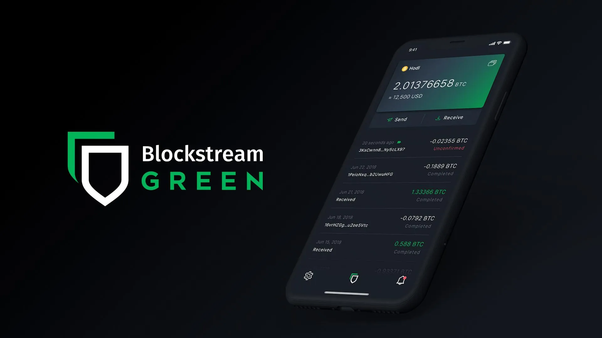
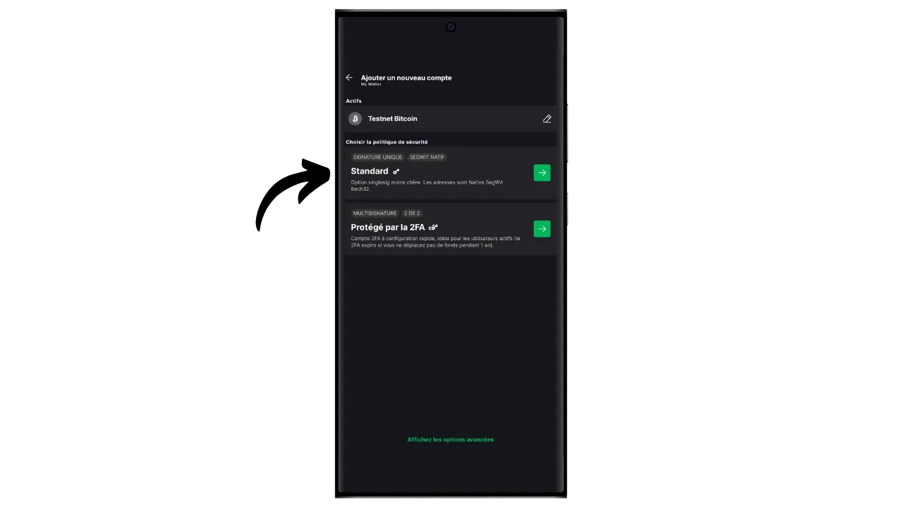
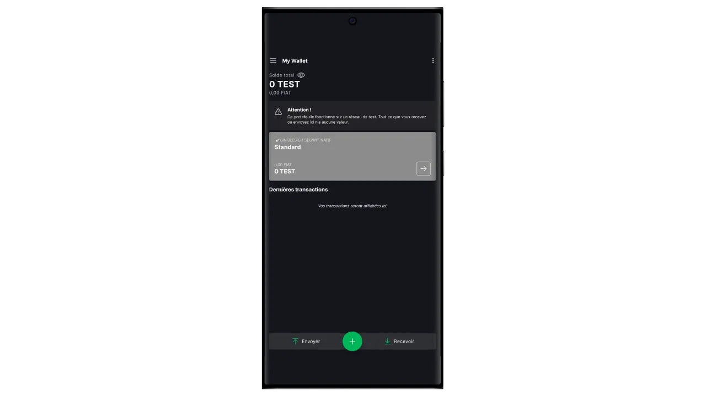
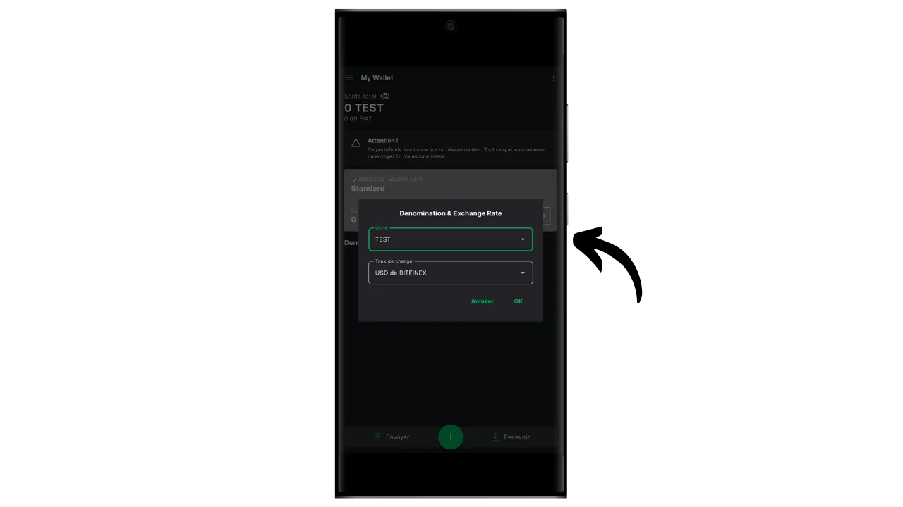
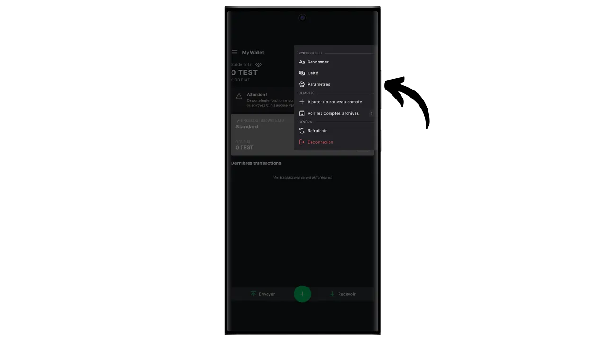
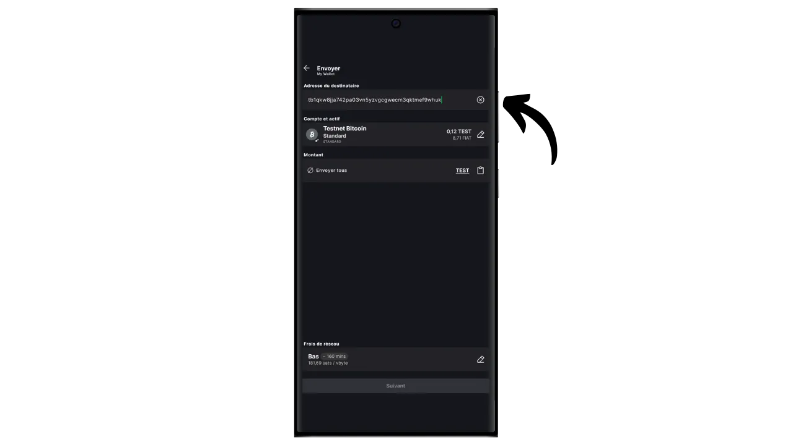
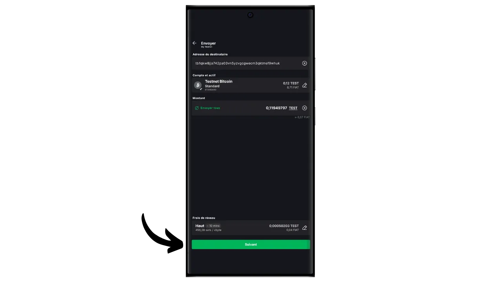

Eine Software-Wallet ist eine Anwendung, die auf einem Computer, Smartphone oder einem anderen mit dem Internet verbundenen Gerät installiert wird und es Ihnen ermöglicht, Ihre Bitcoin-Wallet-Schlüssel zu verwalten und zu sichern. Im Gegensatz zu Hardware-Wallets, die private Schlüssel isolieren, arbeiten "heiße" Wallets daher in einer Umgebung, die potenziell Cyberangriffen ausgesetzt ist, was das Risiko von Piraterie und Diebstahl erhöht.

Software-Wallets sollten für die Verwaltung angemessener Bitcoin-Mengen verwendet werden, insbesondere für alltägliche Transaktionen. Sie können auch eine interessante Option für Menschen mit begrenztem Bitcoin-Vermögen sein, für die die Investition in eine Hardware-Wallet unverhältnismäßig erscheinen mag. Da sie jedoch ständig dem Internet ausgesetzt sind, sind sie für die Aufbewahrung langfristiger Ersparnisse oder großer Gelder weniger sicher. Für letztere ist es am besten, sich für sicherere Lösungen zu entscheiden, wie etwa Hardware-Wallets.

In diesem Tutorial möchte ich Ihnen eine der besten mobilen Software-Wallet-Lösungen vorstellen: **Blockstream Green**.

Wenn Sie wissen möchten, wie Sie Blockstream Green auf Ihrem Computer verwenden können, lesen Sie bitte diese andere Anleitung:

https://planb.network/tutorials/wallet/desktop/blockstream-green-desktop-c1503adf-1404-4328-b814-aa97fcf0d5da
## Einführung von Blockstream Green

Blockstream Green ist eine Software-Wallet, die auf dem Handy und dem Desktop verfügbar ist. Früher als *Green Address* bekannt, wurde diese Wallet nach der Übernahme durch Blockstream im Jahr 2016 ein eigenes Projekt.

Green ist eine besonders einfach zu bedienende Anwendung, was sie auch für Anfänger interessant macht. Sie bietet alle wesentlichen Funktionen einer guten Bitcoin-Wallet, darunter RBF (*Replace-by-Fee*), eine Tor-Verbindungsoption, die Möglichkeit, einen eigenen Node zu verbinden, SPV (*Simple Payment Verification*), Coin-Tagging und Kontrolle.

Blockstream Green unterstützt auch das Liquid-Netzwerk, eine von Blockstream entwickelte Bitcoin-Sidechain für schnelle, vertrauliche Transaktionen außerhalb der Hauptblockchain. Dieses Tutorial konzentriert sich ausschließlich auf Bitcoin, aber ein späteres Tutorial wird die Verwendung von Liquid behandeln.

## Installieren und Konfigurieren der Blockstream Green Anwendung

Der erste Schritt besteht natürlich darin, die Green-Anwendung herunterzuladen. Gehen Sie zu Ihrem Anwendungsspeicher:

- [Für Android] (https://play.google.com/store/apps/details?id=com.greenaddress.greenbits_android_wallet);
- [Für Apple] (https://apps.apple.com/us/app/green-bitcoin-wallet/id1402243590).

Android-Benutzer können die Anwendung auch über die .apk-Datei [verfügbar auf Blockstreams GitHub] (https://github.com/Blockstream/green_android/releases) installieren.

Starten Sie die Anwendung und markieren Sie das Feld "Ich akzeptiere die Bedingungen...*".

Wenn Sie Green zum ersten Mal öffnen, erscheint der Startbildschirm ohne ein konfiguriertes Portfolio. Wenn Sie später Portfolios erstellen oder importieren, werden sie in dieser Oberfläche angezeigt. Bevor Sie mit der Erstellung eines Portfolios beginnen, sollten Sie die Anwendungseinstellungen an Ihre Bedürfnisse anpassen. Klicken Sie auf "Anwendungseinstellungen".

Die Option "*Erweiterte Privatsphäre*", die nur unter Android verfügbar ist, verbessert die Privatsphäre, indem sie Screenshots deaktiviert und Anwendungsvorschauen ausblendet. Außerdem wird der Zugriff auf Anwendungen automatisch gesperrt, sobald das Telefon gesperrt wird, sodass Ihre Daten nicht mehr so leicht zu finden sind.

Für diejenigen, die ihre Privatsphäre schützen möchten, bietet die Anwendung die Möglichkeit, ihren Datenverkehr über Tor zu leiten, ein Netzwerk, das alle ihre Verbindungen verschlüsselt und ihre Aktivitäten schwer nachvollziehbar macht. Obwohl diese Option den Betrieb der Anwendung etwas verlangsamen kann, ist sie sehr empfehlenswert, um Ihre Privatsphäre zu schützen, insbesondere wenn Sie keinen eigenen vollständigen Knoten verwenden.

Für Nutzer, die über einen eigenen kompletten Node verfügen, bietet Green Wallet die Möglichkeit, sich mit diesem über einen Electrum-Server zu verbinden, wodurch die vollständige Kontrolle über die Bitcoin-Netzwerkinformationen und die Verteilung der Transaktionen gewährleistet wird.

Eine weitere alternative Funktion ist die Option "*SPV Verification*", die es Ihnen ermöglicht, bestimmte Blockchain-Daten direkt zu verifizieren und somit die Notwendigkeit zu verringern, dem Standardknoten von Blockstream zu vertrauen, obwohl diese Methode nicht alle Garantien eines vollständigen Knotens bietet.

Wenn Sie diese Einstellungen Ihren Wünschen entsprechend angepasst haben, klicken Sie auf die Schaltfläche "*Speichern*" und starten Sie die Anwendung neu.

## Erstellen Sie eine Bitcoin-Brieftasche auf Blockstream Green

Sie sind nun bereit, eine Bitcoin-Wallet zu erstellen. Klicken Sie auf die Schaltfläche "*Get Started*".

Sie haben die Wahl zwischen der Erstellung einer lokalen Software-Wallet oder der Verwaltung einer Cold Wallet über eine Hardware-Wallet. In diesem Tutorial konzentrieren wir uns auf die Erstellung einer Hot Wallet, daher müssen Sie die Option "*Auf diesem Gerät*" wählen. In einem späteren Tutorial werde ich Ihnen zeigen, wie Sie die andere Option verwenden.

Mit der Option "*Nur beobachten*" können Sie einen erweiterten öffentlichen Schlüssel (`xpub`) importieren, um die Transaktionen eines Portfolios einzusehen, ohne die zugehörigen Gelder ausgeben zu können, was z. B. für die Überwachung eines Portfolios auf einer Hardware-Wallet praktisch ist.

Sie können dann wählen, ob Sie eine bestehende Bitcoin-Wallet wiederherstellen oder eine neue erstellen möchten. Für die Zwecke dieses Tutorials werden wir eine neue Wallet erstellen. Wenn Sie jedoch eine bestehende Bitcoin-Wallet anhand ihrer mnemonischen Phrase wiederherstellen müssen, zum Beispiel nach dem Verlust Ihrer Hardware-Wallet, müssen Sie die zweite Option wählen.

Sie können dann zwischen einer Gedächtnisstütze mit 12 oder 24 Wörtern wählen. Mit dieser Phrase können Sie im Falle eines Problems mit Ihrem Telefon von jeder kompatiblen Software aus wieder auf Ihre Brieftasche zugreifen. Gegenwärtig bietet die Wahl einer 24-Wörter-Phrase nicht mehr Sicherheit als eine 12-Wörter-Phrase. Ich empfehle Ihnen daher, eine Phrase mit 12 Wörtern zu wählen.

Green gibt Ihnen dann Ihre Eselsbrücke. Bevor Sie fortfahren, vergewissern Sie sich, dass Sie nicht beobachtet werden. Klicken Sie auf "*Wiederherstellungsphrase anzeigen*", um sie auf dem Bildschirm anzuzeigen.

**Mit dieser Gedächtnishilfe haben Sie uneingeschränkten Zugriff auf alle Ihre Bitcoins ** Jeder, der im Besitz dieser Gedächtnishilfe ist, kann Ihr Geld stehlen, auch ohne physischen Zugriff auf Ihr Telefon.

Es stellt den Zugang zu Ihren Bitcoins im Falle von Verlust, Diebstahl oder Bruch Ihres Telefons wieder her. Es ist also sehr wichtig, sie sorgfältig zu sichern **auf einem physischen Medium (nicht digital)** und sie an einem sicheren Ort aufzubewahren. Sie können sie auf ein Stück Papier schreiben, oder für zusätzliche Sicherheit, wenn es sich um eine große Geldbörse handelt, empfehle ich, sie auf einen Edelstahlträger zu gravieren, um sie vor Feuer, Überschwemmung oder Einsturz zu schützen (für eine heiße Geldbörse, die eine kleine Menge an Bitcoins sichern soll, ist ein einfaches Papier-Backup wahrscheinlich ausreichend).

*Natürlich dürfen Sie diese Worte niemals im Internet weitergeben, wie ich es in diesem Tutorium tue. Dieses Musterportfolio wird nur im Testnet verwendet und am Ende des Tutoriums gelöscht.*

Wenn Sie Ihre Eselsbrücke korrekt auf einem physischen Medium aufgezeichnet haben, klicken Sie auf "*Fortfahren*". Green Wallet bittet Sie dann, einige der Wörter in Ihrer Gedächtnisstütze zu bestätigen, um sicherzustellen, dass Sie sie richtig aufgezeichnet haben. Füllen Sie die Lücken mit den fehlenden Wörtern aus.

Wählen Sie den PIN-Code Ihres Geräts aus, der zum Entsperren Ihrer grünen Brieftasche verwendet wird. Dies ist Ihr Schutz gegen unbefugten physischen Zugriff. Dieser PIN-Code ist nicht an der Ableitung der kryptografischen Schlüssel Ihrer Brieftasche beteiligt. Selbst wenn Sie keinen Zugang zu diesem PIN-Code haben, können Sie mit Ihrer 12- oder 24-Wort-Mnemonik wieder Zugang zu Ihren Bitcoins erhalten.

Wir empfehlen, einen 6-stelligen PIN-Code zu wählen, der möglichst zufällig ist. Achten Sie darauf, diesen Code zu speichern, damit Sie ihn nicht vergessen, da Sie sonst gezwungen sind, Ihr Portemonnaie über die Eselsbrücke abzurufen. Sie können dann eine biometrische Sperroption hinzufügen, um zu vermeiden, dass Sie die PIN jedes Mal eingeben müssen, wenn Sie sie benutzen. Im Allgemeinen sind biometrische Daten weit weniger sicher als die PIN selbst. Daher empfehle ich Ihnen, diese Entsperrungsoption standardmäßig nicht einzurichten.

Geben Sie Ihre PIN ein zweites Mal ein, um sie zu bestätigen.

Warten Sie, bis Ihr Portfolio erstellt wurde, und klicken Sie dann auf die Schaltfläche "*Konto erstellen*".

Sie haben dann die Wahl zwischen einer Standard-Geldbörse mit einer einzigen Unterschrift, die wir in diesem Tutorial verwenden, und einer Geldbörse, die durch eine Zwei-Faktor-Authentifizierung (2FA) geschützt ist.

Die 2FA-Option auf Green erstellt eine 2/2-Multisignatur-Wallet mit einem Schlüssel, der von Blockstream gehalten wird. Das bedeutet, dass zur Durchführung einer Transaktion beide Schlüssel erforderlich sind: ein lokaler Schlüssel, der durch Ihren PIN-Code auf Ihrem Telefon geschützt ist, und ein Remote-Schlüssel, der durch die 2FA auf den Servern von Blockstream gesichert ist. Bei Verlust des Zugangs zur 2FA oder bei Nichtverfügbarkeit der Blockstream-Dienste sorgen Wiederherstellungsmechanismen auf der Grundlage von Zeitschloss-Skripten dafür, dass Ihre Gelder eigenständig wiederhergestellt werden können. Obwohl diese Konfiguration das Risiko des Diebstahls Ihrer Bitcoins deutlich reduziert, ist sie komplexer zu verwalten und teilweise von Blockstream abhängig. Für dieses Tutorial entscheiden wir uns für ein klassisches Single-Signature-Wallet, bei dem die Schlüssel lokal auf dem Telefon gespeichert sind.

Ihre Bitcoin-Brieftasche wurde jetzt mit der Green-Anwendung erstellt!

Bevor Sie Ihre ersten Bitcoins in Ihrer Wallet erhalten, **empfehle ich Ihnen dringend, einen leeren Recovery-Test** durchzuführen. Notieren Sie sich einige Referenzinformationen, z. B. Ihre xpub- oder erste Empfangsadresse, und löschen Sie dann Ihre Geldbörse in der Green-App, solange sie noch leer ist. Versuchen Sie dann, Ihre Brieftasche auf Green mit Hilfe Ihrer Papier-Backups wiederherzustellen. Überprüfen Sie, ob die nach der Wiederherstellung generierten Cookie-Informationen mit denen übereinstimmen, die Sie ursprünglich aufgeschrieben haben. Wenn dies der Fall ist, können Sie sicher sein, dass Ihre Papier-Backups zuverlässig sind. Wenn Sie mehr darüber erfahren möchten, wie Sie eine Testwiederherstellung durchführen können, lesen Sie bitte diesen anderen Leitfaden:

https://planb.network/tutorials/wallet/backup/recovery-test-5a75db51-a6a1-4338-a02a-164a8d91b895
## Einrichten Ihres Portfolios auf Blockstream Green

Wenn Sie Ihr Portfolio personalisieren möchten, klicken Sie auf die drei kleinen Punkte in der oberen rechten Ecke.

Mit der Option "*Umbenennen*" können Sie den Namen Ihres Portfolios anpassen, was besonders nützlich ist, wenn Sie mehrere Portfolios in derselben Anwendung verwalten.

Über das Menü "*Einheit*" können Sie die Basiseinheit Ihrer Geldbörse ändern. Sie können zum Beispiel wählen, dass sie in Satoshis statt in Bitcoins angezeigt wird.

Das Menü "*Einstellungen*" bietet Zugang zu den verschiedenen Optionen Ihrer Bitcoin-Wallet.

Hier finden Sie z. B. Ihren erweiterten öffentlichen Schlüssel und seinen *Deskriptor*, der nützlich ist, wenn Sie von dieser Brieftasche aus eine Brieftasche im Nur-Überwachungs-Modus einrichten wollen.

Sie können auch Ihre Brieftaschen-PIN ändern und eine biometrische Verbindung aktivieren.

## Verwendung von Blockstream Green

Jetzt, wo Ihre Bitcoin-Brieftasche eingerichtet ist, sind Sie bereit, Ihre ersten Sats zu empfangen! Klicken Sie einfach auf die Schaltfläche "*Empfangen*".

Green zeigt dann die erste leere Empfängeradresse in Ihrer Brieftasche an. Sie können entweder den zugehörigen QR-Code scannen oder die Adresse direkt kopieren, um Bitcoins zu senden. Bei dieser Art von Adresse wird der vom Zahler zu sendende Betrag nicht angegeben. Sie können jedoch eine Adresse generieren, die einen bestimmten Betrag anfordert, indem Sie auf die drei kleinen Punkte in der oberen rechten Ecke und dann auf "*Betrag anfordern*" klicken und den gewünschten Betrag eingeben.

Da Sie ein Segwit v0-Konto (BIP84) verwenden, beginnt Ihre Adresse mit `bc1q...`. In meinem Beispiel verwende ich ein Testnet-Portfolio, daher ist der Präfix etwas anders.

Wenn die Transaktion im Netzwerk übertragen wird, erscheint sie in Ihrer Brieftasche.

Warten Sie, bis Sie genügend Bestätigungen erhalten haben, um die Transaktion als endgültig zu betrachten.

Mit Bitcoins in Ihrer Brieftasche können Sie nun auch Bitcoins versenden. Klicken Sie auf "*Senden*".

Auf der nächsten Seite geben Sie die Adresse des Empfängers ein. Sie können sie manuell eingeben oder einen QR-Code scannen.

Wählen Sie den Zahlungsbetrag.

Am unteren Rand des Bildschirms können Sie den Gebührensatz für diese Transaktion auswählen. Sie haben die Wahl, ob Sie den Empfehlungen der Anwendung folgen oder Ihre eigenen Gebühren festlegen wollen. Je höher die Gebühr im Verhältnis zu anderen anstehenden Transaktionen ist, desto schneller wird Ihre Transaktion bearbeitet. Informationen zum Gebührenmarkt finden Sie unter [Mempool.space](https://mempool.space/) im Abschnitt "*Transaktionsgebühren*".

Klicken Sie auf "*Weiter*", um den Bildschirm mit der Transaktionsübersicht aufzurufen. Überprüfen Sie, ob die Adresse, der Betrag und die Gebühren korrekt sind.

Wenn alles gut geht, schieben Sie die grüne Schaltfläche am unteren Rand des Bildschirms nach rechts, um die Transaktion zu signieren und im Bitcoin-Netzwerk zu veröffentlichen.

Ihre Transaktion wird nun auf dem Dashboard Ihrer Bitcoin-Wallet angezeigt und wartet auf die Bestätigung.

*Dieses Tutorial basiert auf [einer Originalversion von Bitstack] (https://www.bitstack-app.com/blog/installer-portefeuille-bitcoin-green-wallet), geschrieben von Loïc Morel. Bitstack ist eine französische Bitcoin-Neobank, die die Möglichkeit bietet, in Bitcoins zu sparen, entweder in DCA (Dollar Cost Averaging), oder über ein automatisches Rundungssystem für tägliche Ausgaben.* Bitstack ist eine französische Bitcoin-Neobank, die die Möglichkeit bietet, in Bitcoins zu sparen, entweder in DCA (Dollar Cost Averaging), oder über ein automatisches Rundungssystem für tägliche Ausgaben