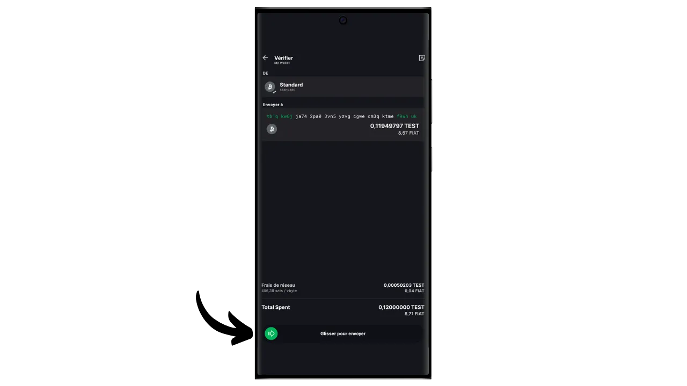

A software wallet is an application installed on a computer, smartphone or other Internet-connected device, enabling you to manage and secure your Bitcoin wallet keys. Unlike hardware wallets, which isolate private keys, "hot" wallets therefore operate in an environment potentially exposed to cyber-attacks, increasing the risk of piracy and theft.

Software wallets should be used to manage reasonable amounts of bitcoins, especially for everyday transactions. They can also be an interesting option for people with limited bitcoin assets, for whom investment in a hardware wallet may seem disproportionate. However, their constant exposure to the Internet makes them less secure for storing your long-term savings or large funds. For the latter, it's best to opt for more secure solutions, such as hardware wallets.

In this tutorial, I'd like to introduce you to one of the best mobile software wallet solutions: **Blockstream Green**.

If you would like to find out how to use Blockstream Green on your computer, please refer to this other tutorial:

https://planb.network/tutorials/wallet/desktop/blockstream-green-desktop-c1503adf-1404-4328-b814-aa97fcf0d5da
## Introducing Blockstream Green

Blockstream Green is a software wallet available on mobile and desktop. Formerly known as *Green Address*, this wallet became a Blockstream project following its acquisition in 2016.

Green is a particularly easy-to-use application, which makes it interesting for beginners. It offers all the essential features of a good Bitcoin wallet, including RBF (*Replace-by-Fee*), a Tor connection option, the ability to connect your own node, SPV (*Simple Payment Verification*), coin tagging and control.

Blockstream Green also supports the Liquid network, a Bitcoin sidechain developed by Blockstream for fast, confidential transactions outside the main blockchain. This tutorial focuses exclusively on Bitcoin, but a later one will cover the use of Liquid.

## Installing and configuring the Blockstream Green application

The first step is of course to download the Green application. Go to your application store:

- [For Android](https://play.google.com/store/apps/details?id=com.greenaddress.greenbits_android_wallet);
- [For Apple](https://apps.apple.com/us/app/green-bitcoin-wallet/id1402243590).

For Android users, you can also install the application via the `.apk` file [available on Blockstream's GitHub](https://github.com/Blockstream/green_android/releases).

Launch the application, then check the "I accept the conditions...*" box.

When you open Green for the first time, the home screen appears without a configured portfolio. Later, if you create or import portfolios, they will appear in this interface. Before going on to create a portfolio, I advise you to adjust the application settings to suit your needs. Click on "Application settings".

The "*Enhanced Privacy*" option, available only on Android, enhances privacy by disabling screenshots and hiding application previews. It also automatically locks application access as soon as your phone is locked, making your data more difficult to expose.

For those wishing to enhance their privacy, the application offers the option of rooting your traffic via Tor, a network that encrypts all your connections and makes your activities difficult to trace. Although this option may slightly slow down the application's operation, it's highly recommended to protect your privacy, especially if you're not using your own complete node.

For users who have their own complete node, Green Wallet offers the possibility of connecting to it via an Electrum server, guaranteeing total control over Bitcoin network information and the distribution of transactions.

Another alternative feature is the "*SPV Verification*" option, which allows you to verify certain blockchain data directly and thus reduce the need to trust Blockstream's default node, although this method does not provide all the guarantees of a full node.

Once you've adjusted these settings to your needs, click on the "*Save*" button and restart the application.

## Create a Bitcoin wallet on Blockstream Green

You're now ready to create a Bitcoin wallet. Click on the "*Get Started*" button.

You can choose between creating a local software wallet or managing a cold wallet via a hardware wallet. For this tutorial, we'll concentrate on creating a hot wallet, so you'll need to select the "*On This Device*" option. In a future tutorial, I'll show you how to use the other option.

The "*Watch-only*" option, meanwhile, lets you import an extended public key (`xpub`) to view a portfolio's transactions without being able to spend the associated funds, which is handy for tracking a portfolio on a hardware wallet, for example.

You can then choose to restore an existing Bitcoin wallet or create a new one. For the purposes of this tutorial, we'll be creating a new wallet. However, if you need to regenerate an existing Bitcoin wallet from its mnemonic phrase, for example following the loss of your hardware wallet, you'll need to choose the second option.

You can then choose between a 12-word or 24-word mnemonic phrase. This phrase will enable you to recover access to your wallet from any compatible software in the event of a problem with your phone. At present, opting for a 24-word phrase offers no more security than a 12-word phrase. I therefore recommend that you choose a 12-word mnemonic phrase.

Green will then provide you with your mnemonic phrase. Before continuing, make sure you're not being watched. Click on "*Show recovery phrase*" to display it on the screen.

**This mnemonic gives you full, unrestricted access to all your bitcoins ** Anyone in possession of this mnemonic can steal your funds, even without physical access to your phone.

It restores access to your bitcoins in the event of loss, theft or breakage of your phone. So it's very important to back it up carefully **on a physical medium (not digital)** and store it in a secure place. You can write it down on a piece of paper, or for added security, if this is a large wallet, I recommend engraving it on a stainless steel support to protect it from the risk of fire, flood or collapse (for a hot wallet designed to secure a small quantity of bitcoins, a simple paper backup is probably sufficient).

*Obviously, you must never share these words on the Internet, as I do in this tutorial. This sample portfolio will be used only on Testnet and will be deleted at the end of the tutorial.*

Once you have correctly recorded your mnemonic phrase on a physical medium, click on "*Continue*". Green Wallet will then ask you to confirm some of the words in your mnemonic phrase to make sure you've recorded them correctly. Fill in the blanks with the missing words.

Choose your device's PIN code, which will be used to unlock your Green wallet. This is your protection against unauthorized physical access. This PIN code is not involved in the derivation of your wallet's cryptographic keys. So, even without access to this PIN code, possession of your 12- or 24-word mnemonic phrase will enable you to regain access to your bitcoins.

We recommend choosing a 6-digit PIN code that is as random as possible. Be sure to save this code so you don't forget it, otherwise you'll be forced to retrieve your wallet from the mnemonic. You can then add a biometric blocking option to avoid having to enter the PIN every time you use it. Generally speaking, biometrics are far less secure than the PIN itself. So, by default, I advise you not to set up this unlocking option.

Enter your PIN a second time to confirm it.

Wait for your portfolio to be created, then click on the "*Create an account*" button.

You can then choose between a standard single-signature wallet, which we'll use in this tutorial, or a wallet protected by two-factor authentication (2FA).

The 2FA option on Green creates a 2/2 multisignature wallet, with one key held by Blockstream. This means that to carry out a transaction, both keys are required: a local key protected by your PIN code on your phone, and a remote key secured by the 2FA on Blockstream's servers. In the event of loss of access to the 2FA or unavailability of Blockstream's services, recovery mechanisms based on time-lock scripts ensure that your funds can be recovered autonomously. Although this configuration significantly reduces the risk of theft of your bitcoins, it is more complex to manage and partly dependent on Blockstream. For this tutorial, we'll opt for a classic single-signature wallet, with the keys stored locally on the phone.

Your Bitcoin wallet has now been created using the Green application!

Before you receive your first bitcoins in your wallet, **I strongly advise you to perform an empty recovery test**. Make a note of some reference information, such as your xpub or first receiving address, then delete your wallet on the Green app while it's still empty. Then try to restore your wallet on Green using your paper backups. Check that the cookie information generated after the restore matches the one you originally wrote down. If it does, you can rest assured that your paper backups are reliable. To find out more about how to carry out a test recovery, please consult this other tutorial:

https://planb.network/tutorials/wallet/backup/recovery-test-5a75db51-a6a1-4338-a02a-164a8d91b895
## Setting up your portfolio on Blockstream Green

If you wish to personalize your portfolio, click on the three small dots in the top right-hand corner.

The "*Rename*" option lets you customize the name of your portfolio, which is particularly useful if you manage several portfolios on the same application.

The "*Unit*" menu lets you change the base unit of your wallet. For example, you can choose to display it in satoshis rather than bitcoins.

The "*Settings*" menu provides access to the various options of your Bitcoin wallet.

Here, for example, you'll find your extended public key and its *descriptor*, useful if you plan to set up a wallet in watch-only mode from this wallet.

You can also change your wallet PIN and activate a biometric connection.

## Using Blockstream Green

Now that your Bitcoin wallet is set up, you're ready to receive your first sats! Simply click on the "*Receive*" button.

Green will then display the first blank receiving address in your wallet. You can either scan the associated QR code, or copy the address directly to send bitcoins. This type of address does not specify the amount to be sent by the payer. You can, however, generate an address that requests a specific amount, by clicking on the three small dots in the top right-hand corner, then on "*Request amount*", and entering the desired amount.

Since you're using a Segwit v0 account (BIP84), your address will start with `bc1q...`. In my example, I'm using a Testnet portfolio, so the prefix is slightly different.

When the transaction is broadcast on the network, it will appear in your wallet.

Wait until you've received enough confirmations to consider the transaction definitive.

With bitcoins in your wallet, you can now also send bitcoins. Click on "*Send*".

On the next page, enter the recipient's address. You can enter it manually or scan a QR code.

Choose the payment amount.

At the bottom of the screen, you can select the fee rate for this transaction. You have the choice of following the application's recommendations or customizing your fees. The higher the fee in relation to other pending transactions, the faster your transaction will be processed. For fee market information, please visit [Mempool.space](https://mempool.space/) in the "*Transaction Fees*" section.

Click on "*Next*" to access the transaction summary screen. Check that the address, amount and charges are correct.

If all goes well, slide the green button at the bottom of the screen to the right to sign and broadcast the transaction on the Bitcoin network.

Your transaction will now appear on your Bitcoin wallet dashboard, awaiting confirmation.

*This tutorial is based on [an original version belonging to Bitstack](https://www.bitstack-app.com/blog/installer-portefeuille-bitcoin-green-wallet) written by Loïc Morel. Bitstack is a French Bitcoin neo-bank that offers the possibility of saving in bitcoins, either in DCA (Dollar Cost Averaging), or via an automatic rounding system for daily expenses.* Bitstack is a French Bitcoin neo-bank that offers the possibility of saving in bitcoins, either in DCA (Dollar Cost Averaging), or via an automatic rounding system for daily expenses