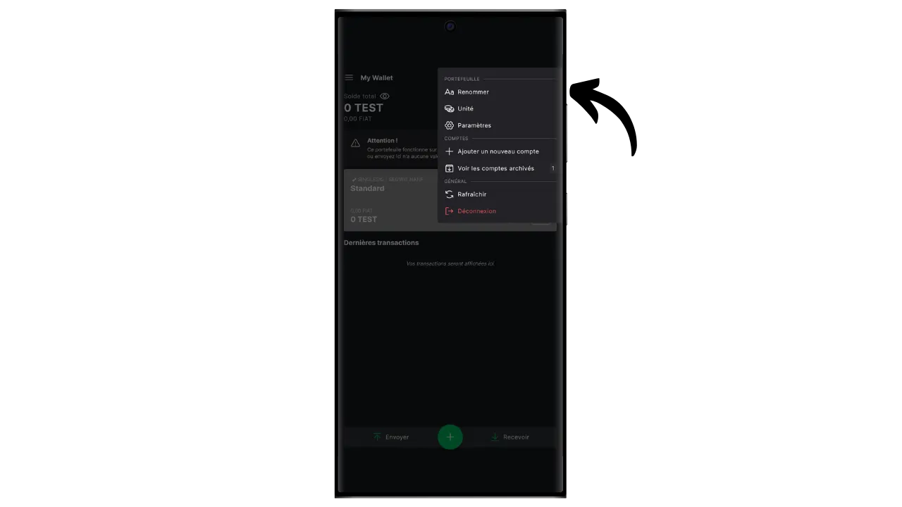
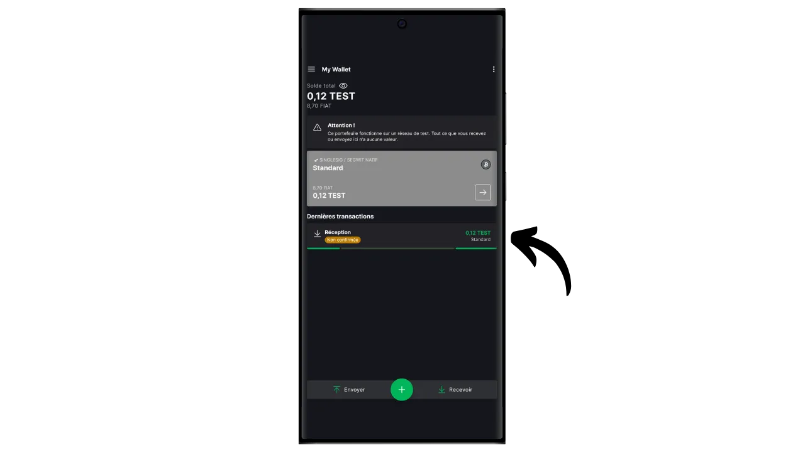

Tarkvaraline rahakott on arvutisse, nutitelefoni või muusse internetiühendusega seadmesse paigaldatud rakendus, mis võimaldab teil hallata ja kaitsta oma Bitcoini rahakoti võtmeid. Erinevalt riistvaralistest rahakottidest, mis isoleerivad privaatseid võtmeid, töötavad "kuumad" rahakotid seega keskkonnas, mis on potentsiaalselt avatud küberrünnakutele, suurendades piraatluse ja varguse ohtu.

Tarkvara rahakotte tuleks kasutada mõistlike bitcoinide koguste haldamiseks, eriti igapäevaste tehingute tegemiseks. Samuti võivad need olla huvitav valik piiratud bitcoin-vara omavate inimeste jaoks, kelle jaoks investeeringud riistvara rahakotti võivad tunduda ebaproportsionaalselt suured. Nende pidev kokkupuude internetiga muudab need aga vähem turvaliseks pikaajaliste säästude või suurte rahaliste vahendite hoidmiseks. Viimaste puhul on parem valida turvalisemad lahendused, näiteks riistvaralised rahakotid.

Selles õpetuses tutvustan teile üht parimat mobiilse tarkvara rahakoti lahendust: **Blockstream Green**.

Kui soovite teada saada, kuidas kasutada Blockstream Green'i oma arvutis, vaadake seda teist õpetust:

https://planb.network/tutorials/wallet/desktop/blockstream-green-desktop-c1503adf-1404-4328-b814-aa97fcf0d5da
## Blockstream Green'i tutvustamine

Blockstream Green on tarkvara rahakott, mis on saadaval mobiilis ja töölaual. Varem tuntud kui *Green Address*, sai see rahakott pärast selle omandamist 2016. aastal Blockstreami projektiks.

Green on eriti lihtsasti kasutatav rakendus, mis teeb selle huvitavaks ka algajatele. See pakub kõiki hea Bitcoini rahakoti olulisi funktsioone, sealhulgas RBF (*Replace-by-Fee*), Tor-ühenduse võimalus, võimalus ühendada oma sõlme, SPV (*Simple Payment Verification*), mündi märgistamine ja kontroll.

Blockstream Green toetab ka Liquid võrgu, Bitcoin sidechain poolt välja töötatud Blockstream kiire, konfidentsiaalsete tehingute väljaspool peamine blockchain. See õpetus keskendub ainult Bitcoinile, kuid hilisemas õpetuses käsitletakse Liquid'i kasutamist.

## Blockstream Green rakenduse paigaldamine ja konfigureerimine

Esimene samm on loomulikult rohelise rakenduse allalaadimine. Mine oma rakenduste poodi:

- [Androidile](https://play.google.com/store/apps/details?id=com.greenaddress.greenbits_android_wallet);
- [Apple](https://apps.apple.com/us/app/green-bitcoin-wallet/id1402243590).

Androidi kasutajate jaoks saate rakenduse paigaldada ka `.apk` faili kaudu [saadaval Blockstream'i GitHubis](https://github.com/Blockstream/green_android/releases).

Käivitage rakendus, seejärel märgistage ruut "Nõustun tingimustega...*".

Kui avate Greeni esimest korda, ilmub avakuva ilma seadistatud portfooliota. Hiljem, kui loote või impordite portfooliosid, ilmuvad need sellesse kasutajaliidesesse. Enne portfelli loomist soovitan teil kohandada rakenduse seaded vastavalt oma vajadustele. Klõpsake nuppu "Rakenduse seaded".

Valik "*Tõhustatud privaatsus*", mis on saadaval ainult Androidi puhul, suurendab privaatsust, keelates ekraanipiltide tegemise ja rakenduste eelvaate varjamise. Samuti lukustab see automaatselt rakenduste juurdepääsu kohe, kui teie telefon on lukustatud, mis muudab teie andmete paljastamise keerulisemaks.

Neile, kes soovivad suurendada oma privaatsust, pakub rakendus võimalust juurida oma liiklust Tori kaudu, mis on võrk, mis krüpteerib kõik teie ühendused ja muudab teie tegevuse raskesti jälgitavaks. Kuigi see võimalus võib rakenduse tööd veidi aeglustada, on see oma privaatsuse kaitsmiseks väga soovitatav, eriti kui te ei kasuta oma täielikku sõlme.

Kasutajatele, kellel on oma terviklik sõlme, pakub Green Wallet võimalust ühendada see Electrumi serveri kaudu, tagades täieliku kontrolli Bitcoini võrguandmete ja tehingute jaotamise üle.

Teine alternatiivne funktsioon on valik "*SPV Verification*", mis võimaldab teil kontrollida teatud plokiahela andmeid otse ja seega vähendada vajadust usaldada Blockstream'i vaikimisi sõlme, kuigi see meetod ei paku kõiki täieliku sõlme garantiisid.

Kui olete need seaded oma vajadustele vastavaks muutnud, klõpsake nupule "*Save*" ja käivitage rakendus uuesti.

## Bitcoin rahakoti loomine Blockstream Green'is

Nüüd olete valmis Bitcoini rahakoti loomiseks. Vajutage nupule "*Alusta*".

Saate valida, kas luua lokaalne tarkvaraline rahakott või hallata külma rahakotti riistvaralise rahakoti kaudu. Selles õpetuses keskendume kuuma rahakoti loomisele, seega peate valima valiku "*See seade*". Tulevases õpetuses näitan teile, kuidas kasutada teist võimalust.

Valik "*Watch-only*" võimaldab teil vahepeal importida laiendatud avaliku võtme (`xpub`), et vaadata portfelli tehinguid, ilma et saaksite sellega seotud raha kulutada, mis on kasulik näiteks portfelli jälgimiseks riistvaralise rahakoti kaudu.

Seejärel saate valida, kas taastada olemasolev Bitcoini rahakott või luua uus. Selle õpetuse jaoks loome uue rahakoti. Kui teil on aga vaja olemasolevat Bitcoini rahakotti selle mälulause põhjal taastada, näiteks pärast riistvaralise rahakoti kadumist, peate valima teise võimaluse.

Seejärel saate valida kas 12- või 24-sõnalise mnemofraasi. See fraas võimaldab teil taastada juurdepääsu oma rahakotile mis tahes ühilduva tarkvara abil, kui teie telefoniga tekib probleem. Praegu ei paku 24-sõnalise fraasi valimine suuremat turvalisust kui 12-sõnaline fraas. Seepärast soovitan teil valida 12-sõnaline mnemooniline fraas.

Green annab teile seejärel oma mnemoonilise fraasi. Enne jätkamist veenduge, et teid ei jälgita. Klõpsake "*Montaažifraasi näitamine*", et see ekraanile kuvada.

**See mnemoonik annab teile täieliku ja piiramatu juurdepääsu kõigile teie bitcoinidele ** Igaüks, kes seda mnemoonikut valdab, võib teie raha varastada, isegi ilma füüsilise juurdepääsuta teie telefonile.

See taastab juurdepääsu teie bitcoinidele telefoni kadumise, varguse või purunemise korral. Seega on väga oluline teha hoolikalt **füüsilisel andmekandjal (mitte digitaalsel)** varukoopia ja hoida seda turvalises kohas. Võite selle paberile kirjutada või täiendava turvalisuse tagamiseks, kui tegemist on suure rahakotiga, soovitan selle graveerida roostevabast terasest kandjale, et kaitsta seda tulekahju, üleujutuse või varingu ohu eest (väikese hulga bitcoinide kaitsmiseks mõeldud kuuma rahakoti puhul piisab tõenäoliselt lihtsast paberist varukoopiast).

*Loomulikult ei tohi te neid sõnu kunagi internetis jagada, nagu ma seda käesolevas õpetuses teen. Seda näidisportfelli kasutatakse ainult Testnetis ja see kustutatakse õpetuse lõpus.*

Kui olete oma mnemoonilise fraasi füüsilisel andmekandjal õigesti salvestanud, klõpsake nupule "*Jätka*". Green Wallet palub teil seejärel kinnitada mõned sõnad teie mnemoonilises fraasis, et veenduda, et olete need õigesti salvestanud. Täitke tühjad kohad puuduvate sõnadega.

Valige oma seadme PIN-kood, mida kasutatakse rohelise rahakoti avamiseks. See on teie kaitse volitamata füüsilise juurdepääsu eest. See PIN-kood ei ole seotud teie rahakoti krüptograafiliste võtmete tuletamisega. Seega, isegi kui teil puudub juurdepääs sellele PIN-koodile, võimaldab teie 12- või 24-sõnalise mnemoonilise fraasi omamine taastada juurdepääsu oma bitcoinidele.

Soovitame valida võimalikult juhusliku 6-kohalise PIN-koodi. Kindlasti salvestage see kood, et te seda ei unustaks, sest muidu olete sunnitud oma rahakoti mälupaberist välja otsima. Seejärel saate lisada biomeetrilise blokeerimise võimaluse, et vältida PIN-koodi sisestamist iga kord, kui seda kasutate. Üldiselt on biomeetria palju vähem turvaline kui PIN-kood ise. Seega soovitan ma vaikimisi seda avamisvõimalust mitte seadistada.

Sisestage PIN-kood teist korda, et seda kinnitada.

Oodake, kuni teie portfoolio on loodud, seejärel klõpsake nupule "*Loo konto*".

Seejärel saate valida tavalise ühe allkirjaga rahakoti vahel, mida me kasutame selles õpetuses, või kahefaktorilise autentimisega (2FA) kaitstud rahakoti vahel.

Greeni 2FA-variant loob 2/2 mitme allkirjaga rahakoti, mille üks võti on Blockstream'i käes. See tähendab, et tehingu sooritamiseks on vaja mõlemat võtit: telefoni PIN-koodiga kaitstud kohalikku võtit ja Blockstream'i serverites asuva 2FAga kaitstud kaugvõtit. 2FA juurdepääsu kaotamise või Blockstream'i teenuste kättesaamatuse korral tagavad ajaluku skriptidel põhinevad taastamismehhanismid, et teie raha on võimalik iseseisvalt taastada. Kuigi selline konfiguratsioon vähendab märkimisväärselt teie bitcoinide varguse ohtu, on selle haldamine keerulisem ja osaliselt sõltuv Blockstreamist. Selle õpetuse jaoks valime klassikalise ühe allkirjaga rahakoti, mille võtmeid hoitakse lokaalselt telefonis.

Teie Bitcoini rahakott on nüüd loodud, kasutades rohelist rakendust!

Enne esimeste bitcoinide saamist oma rahakotti, ** soovitan teil tungivalt teha tühja taastamistesti**. Pange kirja mõned võrdlusandmed, näiteks oma xpub või esimene vastuvõtuaadress, seejärel kustutage oma rahakott rohelises rakenduses, kui see on veel tühi. Seejärel proovige taastada oma rahakott Greenis, kasutades oma paberkandjal varukoopiaid. Kontrollige, et pärast taastamist genereeritud küpsisteave vastab sellele, mille te algselt kirja panite. Kui see vastab, võite olla kindel, et teie paberkandjal varukoopiad on usaldusväärsed. Lisateavet selle kohta, kuidas teha testtaastamine, leiate sellest teisest juhendmaterjalist:

https://planb.network/tutorials/wallet/backup/recovery-test-5a75db51-a6a1-4338-a02a-164a8d91b895
## Portfelli loomine Blockstream Green'is

Kui soovite oma portfelli isikupärastada, klõpsake kolmel väikesel punktil üleval paremas nurgas.

Valik "*Rename*" võimaldab teil kohandada oma portfelli nime, mis on eriti kasulik, kui haldate samas rakenduses mitut portfelli.

Menüü "*Unit*" võimaldab teil muuta oma rahakoti põhiühikut. Näiteks saate valida, kas see kuvatakse bitcoinide asemel satoshides.

Menüü "*Settings*" pakub juurdepääsu teie Bitcoini rahakoti erinevatele valikutele.

Siit leiate näiteks oma laiendatud avaliku võtme ja selle *deskriptori*, mis on kasulik, kui kavatsete sellest rahakotist luua ainult valverežiimi rahakoti.

Samuti saate muuta oma rahakoti PIN-koodi ja aktiveerida biomeetrilise ühenduse.

## Kasutades Blockstream Green

Nüüd, kui teie Bitcoini rahakott on loodud, olete valmis saama oma esimesi sati! Vajutage lihtsalt nupule "*Vaata*".

Seejärel kuvatakse rohelise värviga esimene tühi vastuvõtuaadress teie rahakotis. Võite kas skannida sellega seotud QR-koodi või kopeerida aadressi otse, et bitcoine saata. Seda tüüpi aadress ei määra maksja poolt saadetavat summat. Saate aga luua aadressi, mis nõuab konkreetset summat, klõpsates paremas ülemises nurgas olevatel kolmel väikesel punktil, seejärel "*Request amount*" ja sisestades soovitud summa.

Kuna sa kasutad Segwit v0 kontot (BIP84), algab sinu aadressiga `bc1q...`. Minu näites kasutan Testnet portfelli, seega on eesliide veidi erinev.

Kui tehing edastatakse võrgus, ilmub see teie rahakotis.

Oodake, kuni olete saanud piisavalt kinnitusi, et pidada tehingut lõplikuks.

Kui teie rahakotis on bitcoine, saate nüüd ka bitcoine saata. Klõpsake nupule "*Sendama*".

Järgmisel leheküljel sisestage saaja aadress. Selle saate sisestada käsitsi või skannida QR-koodi.

Valige maksesumma.

Ekraani allosas saate valida selle tehingu tasumäärad. Teil on võimalus valida, kas järgida rakenduse soovitusi või kohandada oma tasud. Mida kõrgem on tasu võrreldes teiste pooleliolevate tehingutega, seda kiiremini töödeldakse teie tehingut. Teavet tasuturu kohta leiate [Mempool.space](https://mempool.space/) jaotises "*Tehingutasud*".

Klõpsake "*Järgmine*", et pääseda tehingu kokkuvõtte ekraanile. Kontrollige, et aadress, summa ja tasud on õiged.

Kui kõik läheb hästi, libistage ekraani allosas olevat rohelist nuppu paremale, et allkirjastada ja edastada tehing Bitcoini võrgus.

Teie tehing ilmub nüüd teie Bitcoini rahakoti armatuurlauale ja ootab kinnitust.

*See õpetus põhineb [Bitstackile kuuluval originaalversioonil](https://www.bitstack-app.com/blog/installer-portefeuille-bitcoin-green-wallet), mille on kirjutanud Loïc Morel. Bitstack on Prantsuse Bitcoini neopank, mis pakub võimalust säästa bitcoinides, kas DCA (Dollar Cost Averaging) või automaatse ümardamise süsteemi kaudu igapäevaste kulude jaoks.* Bitstack on Prantsuse Bitcoini neopank, mis pakub võimalust säästa bitcoinides, kas DCA (Dollar Cost Averaging) või automaatse ümardamise süsteemi kaudu igapäevaste kulude jaoks