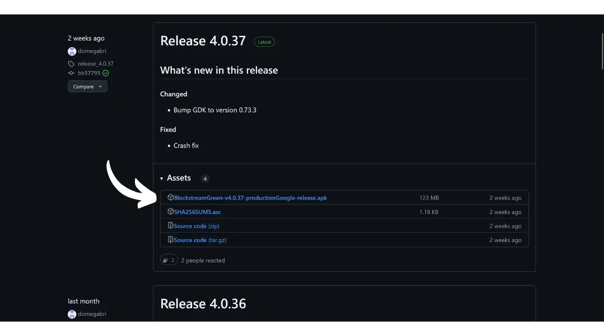
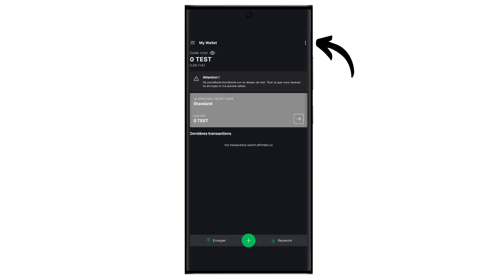

Ohjelmistolompakko on tietokoneeseen, älypuhelimeen tai muuhun Internet-yhteydellä varustettuun laitteeseen asennettu sovellus, jonka avulla voit hallita ja suojata Bitcoin-lompakon avaimia. Toisin kuin laitteistolompakot, jotka eristävät yksityiset avaimet, "kuumat" lompakot toimivat ympäristössä, joka voi olla alttiina verkkohyökkäyksille, mikä lisää piratismin ja varkauksien riskiä.

Ohjelmistolompakoita tulisi käyttää kohtuullisten bitcoin-määrien hallintaan, erityisesti jokapäiväisissä transaktioissa. Ne voivat myös olla kiinnostava vaihtoehto ihmisille, joilla on vain vähän bitcoin-varoja ja joille investointi laitteistolompakkoon voi tuntua suhteettomalta. Niiden jatkuva altistuminen Internetille tekee niistä kuitenkin vähemmän turvallisia pitkäaikaisten säästöjen tai suurten varojen säilyttämiseen. Jälkimmäisiä varten on parasta valita turvallisempia ratkaisuja, kuten laitteistolompakot.

Tässä oppaassa esittelen sinulle yhden parhaista mobiililompakkoratkaisuista: **Blockstream Green**.

Jos haluat tietää, miten Blockstream Greeniä käytetään tietokoneellasi, tutustu tähän muuhun ohjeeseen:

https://planb.network/tutorials/wallet/desktop/blockstream-green-desktop-c1503adf-1404-4328-b814-aa97fcf0d5da
## Esittelyssä Blockstream Green

Blockstream Green on ohjelmistolompakko, joka on saatavilla mobiililaitteissa ja työpöydillä. Tämä lompakko tunnettiin aiemmin nimellä *Green Address*, ja siitä tuli Blockstream-projekti sen jälkeen, kun se ostettiin vuonna 2016.

Green on erityisen helppokäyttöinen sovellus, mikä tekee siitä mielenkiintoisen aloittelijoille. Se tarjoaa kaikki hyvän Bitcoin-lompakon olennaiset ominaisuudet, mukaan lukien RBF (*Replace-by-Fee*), Tor-yhteysvaihtoehto, mahdollisuus liittää oma solmu, SPV (*Simple Payment Verification*), kolikoiden merkitseminen ja valvonta.

Blockstream Green tukee myös Liquid-verkkoa, joka on Blockstreamin kehittämä Bitcoin-sivuketju nopeisiin ja luottamuksellisiin transaktioihin päälohkoketjun ulkopuolella. Tässä opetusohjelmassa keskitytään yksinomaan Bitcoiniin, mutta myöhemmässä opetusohjelmassa käsitellään Liquidin käyttöä.

## Blockstream Green -sovelluksen asentaminen ja määrittäminen

Ensimmäinen vaihe on tietenkin Green-sovelluksen lataaminen. Mene sovelluskauppaan:

- [Androidille](https://play.google.com/store/apps/details?id=com.greenaddress.greenbits_android_wallet);
- [Applen puolesta] (https://apps.apple.com/us/app/green-bitcoin-wallet/id1402243590).

Android-käyttäjät voivat asentaa sovelluksen myös .apk-tiedoston kautta [saatavilla Blockstreamin GitHubissa](https://github.com/Blockstream/green_android/releases).

Käynnistä sovellus ja ruksaa "Hyväksyn ehdot...*" -ruutu.

Kun avaat Greenin ensimmäistä kertaa, aloitusnäyttö tulee näkyviin ilman määritettyä salkkua. Jos myöhemmin luot tai tuot portfolioita, ne näkyvät tässä käyttöliittymässä. Ennen kuin jatkat portfolion luomista, suosittelen sinua säätämään sovelluksen asetukset tarpeisiisi sopiviksi. Napsauta "Sovellusasetukset".

Vain Androidissa käytettävissä oleva "*Parannettu yksityisyys*" -vaihtoehto parantaa yksityisyyttä poistamalla kuvakaappaukset käytöstä ja piilottamalla sovellusten esikatselukuvat. Se myös lukitsee automaattisesti sovellusten käyttöoikeudet heti, kun puhelin lukitaan, jolloin tietojasi on vaikeampi paljastaa.

Niille, jotka haluavat parantaa yksityisyyttään, sovellus tarjoaa mahdollisuuden ohjata liikennettäsi Tor-verkon kautta, joka salaa kaikki yhteytesi ja tekee toiminnastasi vaikeasti jäljitettävää. Vaikka tämä vaihtoehto saattaa hieman hidastaa sovelluksen toimintaa, se on erittäin suositeltavaa yksityisyytesi suojaamiseksi, varsinkin jos et käytä omaa kokonaista solmua.

Käyttäjille, joilla on oma kokonainen solmu, Green Wallet tarjoaa mahdollisuuden muodostaa siihen yhteys Electrum-palvelimen kautta, mikä takaa täydellisen hallinnan Bitcoin-verkkotietojen ja transaktioiden jakelun suhteen.

Toinen vaihtoehtoinen ominaisuus on "*SPV Verification*" -vaihtoehto, jonka avulla voit tarkistaa tietyt lohkoketjujen tiedot suoraan ja siten vähentää tarvetta luottaa Blockstreamin oletussolmuun, vaikka tämä menetelmä ei tarjoa kaikkia täyden solmun takuita.

Kun olet säätänyt nämä asetukset tarpeisiisi, napsauta "*Tallenna*"-painiketta ja käynnistä sovellus uudelleen.

## Luo Bitcoin-lompakko Blockstream Greenissä

Olet nyt valmis luomaan Bitcoin-lompakon. Napsauta "*Aloita*"-painiketta.

Voit valita, luotko paikallisen ohjelmistolompakon vai hallinnoitko kylmää lompakkoa laitteistolompakon avulla. Tässä ohjeessa keskitymme kuuman lompakon luomiseen, joten sinun on valittava "*Tällä laitteella*" -vaihtoehto. Tulevassa opetusohjelmassa näytän, miten voit käyttää toista vaihtoehtoa.

"*Watch-only*"-vaihtoehdon avulla voit puolestaan tuoda laajennetun julkisen avaimen (`xpub`) ja tarkastella salkun tapahtumia ilman, että voit käyttää siihen liittyviä varoja, mikä on kätevää esimerkiksi salkun seurannassa laitteistolompakossa.

Voit sitten valita, palautatko olemassa olevan Bitcoin-lompakon vai luotko uuden. Tässä ohjeessa luomme uuden lompakon. Jos sinun on kuitenkin palautettava olemassa oleva Bitcoin-lompakko sen muistilausekkeesta esimerkiksi laitteistolompakon menetyksen jälkeen, sinun on valittava toinen vaihtoehto.

Voit sitten valita joko 12- tai 24-sanaisen muistilausekkeen. Tämän lauseen avulla voit palauttaa lompakkosi mistä tahansa yhteensopivasta ohjelmistosta, jos puhelimessasi ilmenee ongelmia. Tällä hetkellä 24-sanaisen lauseen valitseminen ei tarjoa enempää turvallisuutta kuin 12-sanaisen lauseen valitseminen. Siksi suosittelen, että valitset 12-sanaisen muistilausekkeen.

Green antaa sinulle sitten muistisanan. Ennen kuin jatkat, varmista, ettei sinua tarkkailla. Napsauta "*Näytä palautuslause*" näyttääksesi sen näytöllä.

**Tämä muistisääntö antaa sinulle täyden, rajoittamattoman pääsyn kaikkiin bitcoineihisi ** Kuka tahansa, jolla on tämä muistisääntö hallussaan, voi varastaa varojasi, vaikka hänellä ei olisi fyysistä pääsyä puhelimeesi.

Se palauttaa pääsyn bitcoineihisi, jos puhelimesi katoaa, varastetaan tai rikkoutuu. On siis erittäin tärkeää varmuuskopioida se huolellisesti **fyysiselle välineelle (ei digitaaliselle)** ja säilyttää se turvallisessa paikassa. Voit kirjoittaa sen paperille, tai jos kyseessä on suuri lompakko, suosittelen lisäturvallisuuden vuoksi kaiverruttamaan sen ruostumattomasta teräksestä valmistettuun tukeen, joka suojaa sitä tulipalon, tulvan tai romahduksen vaaralta (pienen bitcoin-määrän turvaamiseen suunnitellulle kuumalle lompakolle riittää luultavasti pelkkä paperivarmistus).

*Näitä sanoja ei tietenkään saa koskaan jakaa internetissä, kuten minä teen tässä ohjeessa. Tätä esimerkkisalkkua käytetään vain Testnetissä, ja se poistetaan ohjeen päätyttyä.*

Kun olet tallentanut muistisääntösi oikein fyysiselle tietovälineelle, napsauta "*Jatka*". Tämän jälkeen Green Wallet pyytää sinua vahvistamaan joitakin muistilauseen sanoja varmistaaksesi, että olet tallentanut ne oikein. Täytä tyhjät kohdat puuttuvilla sanoilla.

Valitse laitteesi PIN-koodi, jota käytetään vihreän lompakon lukituksen avaamiseen. Tämä suojaa sinua luvattomalta fyysiseltä käytöltä. Tämä PIN-koodi ei osallistu lompakkosi kryptografisten avainten johtamiseen. Vaikka PIN-koodia ei olisikaan saatavilla, 12- tai 24-sanaisen muistilausekkeen avulla voit saada bitcoinisi takaisin haltuusi, vaikka sinulla ei olisikaan pääsyä siihen.

Suosittelemme valitsemaan 6-numeroisen PIN-koodin, joka on mahdollisimman satunnainen. Muista tallentaa tämä koodi, jotta et unohda sitä, muuten joudut hakemaan lompakkosi muistitikusta. Voit sitten lisätä biometrisen eston, jotta PIN-koodia ei tarvitse syöttää joka kerta, kun käytät sitä. Yleisesti ottaen biometriikka on paljon vähemmän turvallinen kuin itse PIN-koodi. Suosittelen siis oletusarvoisesti olemaan asettamatta tätä lukituksen avaamisvaihtoehtoa.

Vahvista PIN-koodi syöttämällä se toisen kerran.

Odota, että portfoliosi luodaan, ja napsauta sitten "*Luo tili*" -painiketta.

Tämän jälkeen voit valita joko tavallisen yhden allekirjoituksen lompakon, jota käytämme tässä oppaassa, tai lompakon, joka on suojattu kaksitekijätodennuksella (2FA).

Greenin 2FA-vaihtoehto luo 2/2-monisignatuurilompakon, jonka yksi avain on Blockstreamin hallussa. Tämä tarkoittaa, että tapahtuman suorittamiseen tarvitaan molemmat avaimet: paikallinen avain, joka on suojattu puhelimen PIN-koodilla, ja etäavain, joka on suojattu 2FA:lla Blockstreamin palvelimilla. Jos 2FA:n käyttöoikeus katoaa tai Blockstreamin palvelut eivät ole käytettävissä, aikalukitusskripteihin perustuvat palautusmekanismit varmistavat, että varasi voidaan palauttaa itsenäisesti. Vaikka tämä kokoonpano vähentää merkittävästi bitcoinien varastamisen riskiä, se on monimutkaisempi hallita ja osittain riippuvainen Blockstreamista. Tässä opetusohjelmassa valitsemme klassisen yhden allekirjoituksen lompakon, jossa avaimet tallennetaan paikallisesti puhelimeen.

Bitcoin-lompakkosi on nyt luotu Green-sovelluksella!

Ennen kuin saat ensimmäiset bitcoinit lompakkoosi, **neuvon sinua tekemään tyhjän palautustestin**. Kirjoita muistiin joitakin viitetietoja, kuten xpub- tai ensimmäinen vastaanottava osoite, ja poista lompakkosi Green-sovelluksessa, kun se on vielä tyhjä. Yritä sitten palauttaa lompakkosi Greenissä käyttämällä paperisia varmuuskopioita. Tarkista, että palautuksen jälkeen luodut evästetiedot vastaavat alun perin muistiin kirjoittamiasi tietoja. Jos ne täsmäävät, voit olla varma, että paperiset varmuuskopiot ovat luotettavia. Jos haluat lisätietoja testipalautuksen suorittamisesta, tutustu tähän toiseen ohjeeseen:

https://planb.network/tutorials/wallet/backup/recovery-test-5a75db51-a6a1-4338-a02a-164a8d91b895
## Salkun perustaminen Blockstream Greeniin

Jos haluat muokata salkkuasi, napsauta kolmea pientä pistettä oikeassa yläkulmassa.

"*Rename*"-vaihtoehdon avulla voit muokata portfoliosi nimeä, mikä on erityisen hyödyllistä, jos hallinnoit useita portfolioita samassa sovelluksessa.

"*Yksikkö*"-valikossa voit vaihtaa lompakon perusyksikön. Voit esimerkiksi valita, näytetäänkö se satosheina eikä bitcoineina.

"*Settings*"-valikosta pääset Bitcoin-lompakkosi eri vaihtoehtoihin.

Täältä löydät esimerkiksi laajennetun julkisen avaimesi ja sen *kuvaajan*, joka on hyödyllinen, jos aiot perustaa lompakon watch-only-tilassa tästä lompakosta.

Voit myös vaihtaa lompakon PIN-koodin ja aktivoida biometrisen yhteyden.

## Blockstream Greenin käyttäminen

Nyt kun Bitcoin-lompakkosi on perustettu, olet valmis vastaanottamaan ensimmäiset satsisi! Napsauta yksinkertaisesti "*Vastaanota*"-painiketta.

Vihreä näyttää sitten lompakkosi ensimmäisen tyhjän vastaanotto-osoitteen. Voit joko skannata siihen liittyvän QR-koodin tai kopioida osoitteen suoraan lähettääksesi bitcoineja. Tämäntyyppisessä osoitteessa ei määritetä maksajan lähettämää summaa. Voit kuitenkin luoda osoitteen, jossa pyydetään tiettyä summaa, napsauttamalla kolmea pientä pistettä oikeassa yläkulmassa, sitten "*Pyydä summaa*" ja syöttämällä haluamasi summan.

Koska käytät Segwit v0 -tiliä (BIP84), osoitteesi alkaa kirjaimella `bc1q...`. Esimerkissäni käytän Testnet-salkkua, joten etuliite on hieman erilainen.

Kun transaktio lähetetään verkossa, se näkyy lompakossasi.

Odota, kunnes olet saanut tarpeeksi vahvistuksia, jotta voit pitää tapahtumaa lopullisena.

Kun lompakossasi on bitcoineja, voit nyt myös lähettää bitcoineja. Klikkaa "*lähettää*".

Kirjoita seuraavalla sivulla vastaanottajan osoite. Voit syöttää sen manuaalisesti tai skannata QR-koodin.

Valitse maksun määrä.

Näytön alareunassa voit valita maksutapahtuman maksun. Voit joko noudattaa sovelluksen suosituksia tai mukauttaa maksuja. Mitä korkeampi maksu on suhteessa muihin vireillä oleviin tapahtumiin, sitä nopeammin tapahtuma käsitellään. Maksumarkkinoita koskevia tietoja löydät [Mempool.space](https://mempool.space/) kohdasta "*Transaktiomaksut*".

Klikkaa "*Seuraava*" siirtyäksesi tapahtumien yhteenvetonäyttöön. Tarkista, että osoite, summa ja maksut ovat oikein.

Jos kaikki sujuu hyvin, liu'uta näytön alareunassa olevaa vihreää painiketta oikealle allekirjoittaaksesi ja lähettääksesi tapahtuman Bitcoin-verkkoon.

Tapahtumasi näkyy nyt Bitcoin-lompakkosi kojelaudalla ja odottaa vahvistusta.

*Tämä opetusohjelma perustuu Loïc Morelin kirjoittamaan [alkuperäiseen versioon, joka kuuluu Bitstackille](https://www.bitstack-app.com/blog/installer-portefeuille-bitcoin-green-wallet). Bitstack on ranskalainen Bitcoin-neopankki, joka tarjoaa mahdollisuuden säästää bitcoineissa joko DCA:na (Dollar Cost Averaging) tai automaattisen pyöristysjärjestelmän avulla päivittäisiä kuluja varten.* Bitstack on ranskalainen Bitcoin-neopankki, joka tarjoaa mahdollisuuden säästää bitcoineissa joko DCA:na (Dollar Cost Averaging) tai automaattisen pyöristysjärjestelmän avulla päivittäisiä kuluja varten