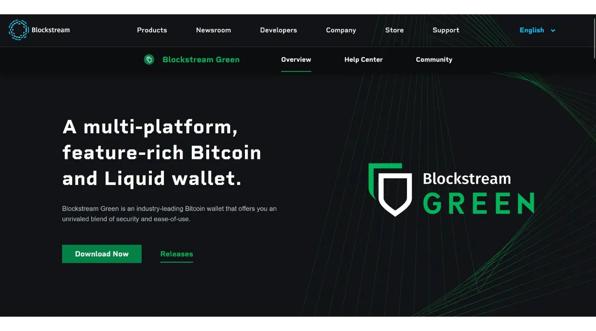

Dompet perangkat lunak adalah sebuah aplikasi yang dipasang pada komputer, smartphone atau perangkat lain yang terhubung ke Internet, yang memungkinkan Anda untuk mengelola dan mengamankan kunci dompet Bitcoin Anda. Tidak seperti dompet perangkat keras, yang mengisolasi kunci pribadi, dompet "panas" beroperasi di lingkungan yang berpotensi terkena serangan siber, sehingga meningkatkan risiko pembajakan dan pencurian.

Dompet perangkat lunak sebaiknya digunakan untuk mengelola jumlah bitcoin yang wajar, terutama untuk transaksi sehari-hari. Dompet perangkat lunak juga dapat menjadi pilihan yang menarik untuk orang-orang dengan aset bitcoin yang terbatas, yang mungkin merasa bahwa investasi pada dompet perangkat keras tidak proporsional. Akan tetapi, aksesnya yang terus menerus ke Internet membuat dompet ini kurang aman untuk menyimpan simpanan jangka panjang atau dana besar. Untuk yang terakhir ini, yang terbaik adalah memilih solusi yang lebih aman, seperti dompet perangkat keras.

Dalam tutorial ini, saya ingin memperkenalkan Anda pada salah satu solusi dompet perangkat lunak seluler terbaik: **Blockstream Green**.

Jika Anda ingin mengetahui cara menggunakan Blockstream Green di komputer Anda, silakan lihat tutorial lainnya:

https://planb.network/tutorials/wallet/desktop/blockstream-green-desktop-c1503adf-1404-4328-b814-aa97fcf0d5da
## Memperkenalkan Blockstream Green

Blockstream Green adalah dompet perangkat lunak yang tersedia di ponsel dan desktop. Sebelumnya dikenal sebagai *Green Address*, dompet ini menjadi proyek Blockstream setelah diakuisisi pada tahun 2016.

Green merupakan aplikasi yang sangat mudah digunakan, yang membuatnya menarik untuk pemula. Aplikasi ini menawarkan semua fitur penting dari dompet Bitcoin yang bagus, termasuk RBF (*Replace-by-Fee*), opsi koneksi Tor, kemampuan untuk menghubungkan node Anda sendiri, SPV (*Simple Payment Verification*), penandaan dan kontrol koin.

Blockstream Green juga mendukung jaringan Liquid, sebuah sidechain Bitcoin yang dikembangkan oleh Blockstream untuk transaksi yang cepat dan rahasia di luar blockchain utama. Tutorial ini hanya berfokus pada Bitcoin, tetapi tutorial selanjutnya akan membahas penggunaan Liquid.

## Menginstal dan mengonfigurasi aplikasi Blockstream Green

Langkah pertama tentu saja mengunduh aplikasi Green. Buka toko aplikasi Anda:

- [Untuk Android](https://play.google.com/store/apps/details?id=com.greenaddress.greenbits_android_wallet);
- [Untuk Apple](https://apps.apple.com/us/app/green-bitcoin-wallet/id1402243590).

Untuk pengguna Android, Anda juga dapat menginstal aplikasi melalui file `.apk` [tersedia di GitHub Blockstream](https://github.com/Blockstream/green_android/releases).

Luncurkan aplikasi, lalu centang kotak "Saya menerima ketentuan...*".

Apabila Anda membuka Green untuk pertama kali, layar beranda muncul tanpa portofolio yang dikonfigurasi. Nanti, jika Anda membuat atau mengimpor portofolio, portofolio akan muncul dalam antarmuka ini. Sebelum melanjutkan untuk membuat portofolio, saya sarankan Anda untuk menyesuaikan pengaturan aplikasi agar sesuai dengan kebutuhan Anda. Klik pada "Pengaturan aplikasi".

Opsi "*Privasi yang Ditingkatkan*", yang hanya tersedia di Android, meningkatkan privasi dengan menonaktifkan tangkapan layar dan menyembunyikan pratinjau aplikasi. Opsi ini juga secara otomatis mengunci akses aplikasi segera setelah ponsel Anda terkunci, sehingga data Anda lebih sulit untuk diekspos.

Bagi mereka yang ingin meningkatkan privasi mereka, aplikasi ini menawarkan opsi untuk melakukan rooting pada lalu lintas Anda melalui Tor, sebuah jaringan yang mengenkripsi semua koneksi Anda dan membuat aktivitas Anda sulit dilacak. Meskipun opsi ini mungkin sedikit memperlambat operasi aplikasi, ini sangat disarankan untuk melindungi privasi Anda, terutama jika Anda tidak menggunakan simpul lengkap Anda sendiri.

Untuk pengguna yang memiliki node lengkap mereka sendiri, Green Wallet menawarkan kemungkinan untuk menghubungkannya melalui server Electrum, menjamin kontrol penuh atas informasi jaringan Bitcoin dan distribusi transaksi.

Fitur alternatif lainnya adalah opsi "*Verifikasi SPV*", yang memungkinkan Anda untuk memverifikasi data blockchain tertentu secara langsung dan dengan demikian mengurangi kebutuhan untuk mempercayai node default Blockstream, meskipun metode ini tidak memberikan semua jaminan dari sebuah node yang lengkap.

Setelah Anda menyesuaikan pengaturan ini dengan kebutuhan Anda, klik tombol "*Save*" dan mulai ulang aplikasi.

## Buat dompet Bitcoin di Blockstream Green

Anda sekarang siap untuk membuat dompet Bitcoin. Klik tombol "*Mulai*".

Anda dapat memilih antara membuat dompet perangkat lunak lokal atau mengelola dompet dingin melalui dompet perangkat keras. Untuk tutorial ini, kita akan berkonsentrasi untuk membuat hot wallet, jadi Anda harus memilih opsi "*On This Device*". Di tutorial selanjutnya, saya akan menunjukkan kepada Anda bagaimana cara menggunakan opsi lainnya.

Sementara itu, opsi "*Watch-only*" memungkinkan Anda untuk mengimpor kunci publik yang diperluas (`xpub`) untuk melihat transaksi portofolio tanpa dapat menggunakan dana yang terkait, yang berguna untuk melacak portofolio pada dompet perangkat keras, misalnya.

Anda kemudian bisa memilih untuk memulihkan dompet Bitcoin yang sudah ada atau membuat yang baru. Untuk keperluan tutorial ini, kita akan membuat dompet baru. Akan tetapi, jika Anda perlu membuat ulang dompet Bitcoin yang sudah ada dari frasa mnemoniknya, misalnya setelah kehilangan dompet perangkat keras Anda, Anda harus memilih opsi kedua.

Anda kemudian dapat memilih antara frasa mnemonik 12 kata atau 24 kata. Frasa ini akan memungkinkan Anda untuk memulihkan akses ke dompet Anda dari perangkat lunak yang kompatibel jika terjadi masalah pada ponsel Anda. Saat ini, memilih frasa 24 kata tidak memberikan keamanan yang lebih baik daripada frasa 12 kata. Oleh karena itu, saya sarankan Anda memilih frasa mnemonik 12 kata.

Hijau kemudian akan memberikan frasa mnemonik Anda. Sebelum melanjutkan, pastikan Anda tidak sedang diawasi. Klik "*Tampilkan frasa pemulihan*" untuk menampilkannya di layar.

**Mnemonik ini memberikan Anda akses penuh dan tidak terbatas ke semua bitcoin Anda ** Siapa pun yang memiliki mnemonik ini dapat mencuri dana Anda, bahkan tanpa akses fisik ke ponsel Anda.

Ini akan mengembalikan akses ke bitcoin Anda jika terjadi kehilangan, pencurian, atau kerusakan pada ponsel Anda. Jadi, sangat penting untuk mencadangkannya dengan hati-hati **pada media fisik (bukan digital)** dan menyimpannya di tempat yang aman. Anda bisa menuliskannya di selembar kertas, atau untuk keamanan tambahan, jika ini adalah dompet yang besar, saya sarankan untuk mengukirnya di atas penyangga baja tahan karat untuk melindunginya dari risiko kebakaran, banjir, atau kehancuran (untuk hot wallet yang dirancang untuk mengamankan sejumlah kecil bitcoin, cadangan kertas sederhana mungkin sudah cukup).

*Tentu saja, Anda tidak boleh membagikan kata-kata ini di Internet, seperti yang saya lakukan dalam tutorial ini. Portofolio contoh ini hanya akan digunakan di Testnet dan akan dihapus di akhir tutorial.*

Setelah Anda merekam frasa mnemonik Anda dengan benar pada media fisik, klik "*Lanjutkan*". Green Wallet kemudian akan meminta Anda untuk mengonfirmasi beberapa kata dalam frasa mnemonik Anda untuk memastikan Anda telah merekamnya dengan benar. Isi bagian yang kosong dengan kata-kata yang hilang.

Pilih kode PIN perangkat Anda, yang akan digunakan untuk membuka kunci Green wallet Anda. Ini adalah perlindungan Anda terhadap akses fisik yang tidak sah. Kode PIN ini tidak terlibat dalam penurunan kunci kriptografi dompet Anda. Jadi, bahkan tanpa akses ke kode PIN ini, dengan memiliki frasa mnemonik 12 atau 24 kata, Anda bisa mendapatkan kembali akses ke bitcoin Anda.

Kami menyarankan untuk memilih kode PIN 6 digit yang dibuat seacak mungkin. Pastikan untuk menyimpan kode ini agar Anda tidak lupa, jika tidak, Anda akan dipaksa untuk mengambil dompet Anda dari mnemonik. Anda bisa menambahkan opsi pemblokiran biometrik untuk menghindari keharusan memasukkan PIN setiap kali Anda menggunakannya. Secara umum, biometrik jauh lebih tidak aman dibandingkan dengan PIN itu sendiri. Jadi, secara default, saya menyarankan Anda untuk tidak mengatur opsi pembukaan kunci ini.

Masukkan PIN Anda untuk kedua kalinya untuk mengonfirmasikannya.

Tunggu hingga portofolio Anda dibuat, lalu klik tombol "*Buat akun*".

Anda kemudian dapat memilih antara dompet tanda tangan tunggal standar, yang akan kita gunakan dalam tutorial ini, atau dompet yang dilindungi oleh autentikasi dua faktor (2FA).

Opsi 2FA pada Green menciptakan dompet multisignature 2/2, dengan satu kunci dipegang oleh Blockstream. Ini berarti bahwa untuk melakukan transaksi, kedua kunci diperlukan: kunci lokal yang dilindungi oleh kode PIN pada ponsel Anda, dan kunci jarak jauh yang diamankan oleh 2FA pada server Blockstream. Jika terjadi kehilangan akses ke 2FA atau tidak tersedianya layanan Blockstream, mekanisme pemulihan berdasarkan skrip penguncian waktu memastikan bahwa dana Anda dapat dipulihkan secara mandiri. Walaupun konfigurasi ini secara signifikan mengurangi risiko pencurian bitcoin Anda, konfigurasi ini lebih kompleks untuk dikelola dan sebagian bergantung pada Blockstream. Untuk tutorial ini, kita akan memilih dompet tanda tangan tunggal klasik, dengan kunci yang disimpan secara lokal di ponsel.

Dompet Bitcoin Anda sekarang telah dibuat menggunakan aplikasi Green!

Sebelum Anda menerima bitcoin pertama Anda di dompet, **Saya sangat menyarankan Anda untuk melakukan tes pemulihan kosong**. Catatlah beberapa informasi referensi, seperti xpub atau alamat penerima pertama Anda, kemudian hapus wallet Anda di aplikasi Green saat masih kosong. Kemudian coba pulihkan dompet Anda di Green menggunakan cadangan kertas Anda. Periksa apakah informasi cookie yang dihasilkan setelah pemulihan sesuai dengan yang Anda tulis sebelumnya. Jika sesuai, Anda bisa yakin bahwa cadangan kertas Anda dapat diandalkan. Untuk mengetahui lebih lanjut mengenai cara melakukan uji coba pemulihan, silakan baca tutorial lainnya:

https://planb.network/tutorials/wallet/backup/recovery-test-5a75db51-a6a1-4338-a02a-164a8d91b895
## Menyiapkan portofolio Anda di Blockstream Green

Jika Anda ingin mempersonalisasi portofolio Anda, klik pada tiga titik kecil di sudut kanan atas.

Opsi "*Rename*" memungkinkan Anda menyesuaikan nama portofolio Anda, yang sangat berguna jika Anda mengelola beberapa portofolio pada aplikasi yang sama.

Menu "*Unit*" memungkinkan Anda untuk mengubah satuan dasar dompet Anda. Sebagai contoh, Anda bisa memilih untuk menampilkannya dalam satoshi daripada bitcoin.

Menu "*Pengaturan*" menyediakan akses ke berbagai opsi dompet Bitcoin Anda.

Di sini, sebagai contoh, Anda akan menemukan kunci publik yang diperluas dan *descriptor*-nya, yang berguna jika Anda berencana untuk membuat dompet dalam mode watch-only dari dompet ini.

Anda juga dapat mengubah PIN dompet dan mengaktifkan koneksi biometrik.

## Menggunakan Blockstream Green

Setelah dompet Bitcoin Anda siap, Anda siap untuk menerima satoshi pertama Anda! Cukup klik tombol "*Terima*".

Warna hijau kemudian akan menampilkan alamat penerima pertama yang kosong di dompet Anda. Anda bisa memindai kode QR yang terkait, atau menyalin alamat tersebut secara langsung untuk mengirim bitcoin. Jenis alamat ini tidak menentukan jumlah yang akan dikirim oleh pembayar. Namun, Anda bisa membuat alamat yang meminta jumlah tertentu, dengan mengeklik tiga titik kecil di pojok kanan atas, lalu "*Request amount*", dan memasukkan jumlah yang diinginkan.

Karena Anda menggunakan akun Segwit v0 (BIP84), alamat Anda akan dimulai dengan `bc1q...`. Dalam contoh saya, saya menggunakan portofolio Testnet, jadi awalannya sedikit berbeda.

Ketika transaksi disiarkan di jaringan, transaksi tersebut akan muncul di dompet Anda.

Tunggu hingga Anda menerima konfirmasi yang cukup untuk menganggap transaksi sudah pasti.

Dengan bitcoin di dompet Anda, Anda sekarang juga dapat mengirim bitcoin. Klik "*Kirim*".

Pada halaman berikutnya, masukkan alamat penerima. Anda dapat memasukkannya secara manual atau memindai kode QR.

Pilih jumlah pembayaran.

Di bagian bawah layar, Anda dapat memilih tarif biaya untuk transaksi ini. Anda dapat memilih untuk mengikuti rekomendasi aplikasi atau menyesuaikan biaya Anda. Semakin tinggi biaya dalam kaitannya dengan transaksi tertunda lainnya, semakin cepat transaksi Anda akan diproses. Untuk informasi pasar biaya, silakan kunjungi [Mempool.space] (https://mempool.space/) di bagian "*Biaya Transaksi*".

Klik "*Selanjutnya*" untuk mengakses layar ringkasan transaksi. Periksa apakah alamat, jumlah, dan biaya sudah benar.

Jika semua berjalan lancar, geser tombol hijau di bagian bawah layar ke kanan untuk menandatangani dan menyiarkan transaksi di jaringan Bitcoin.

Transaksi Anda sekarang akan muncul di dasbor dompet Bitcoin Anda, menunggu konfirmasi.

*Tutorial ini didasarkan pada [versi asli milik Bitstack] (https://www.bitstack-app.com/blog/installer-portefeuille-bitcoin-green-wallet) yang ditulis oleh Loïc Morel. Bitstack adalah neo-bank Bitcoin Prancis yang menawarkan kemungkinan menabung dalam bitcoin, baik dalam DCA (Dollar Cost Averaging), atau melalui sistem pembulatan otomatis untuk pengeluaran harian* Bitstack adalah neo-bank Bitcoin Prancis yang menawarkan kemungkinan menabung dalam bitcoin, baik dalam DCA (Dollar Cost Averaging), atau melalui sistem pembulatan otomatis untuk pengeluaran harian