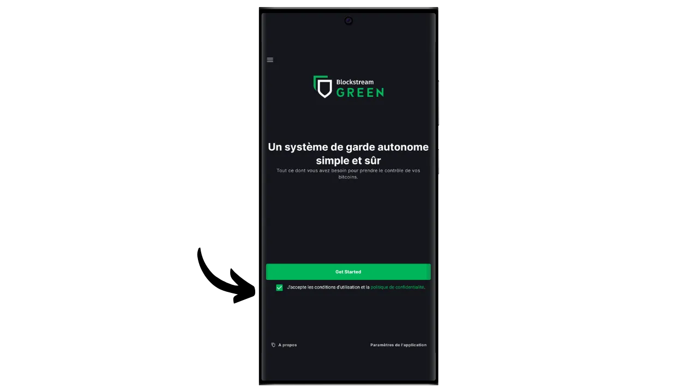
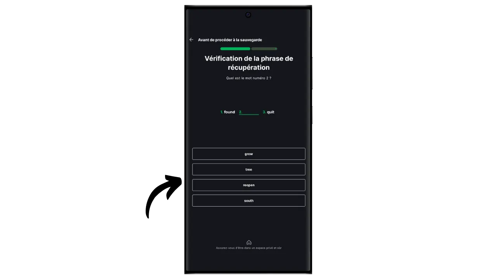
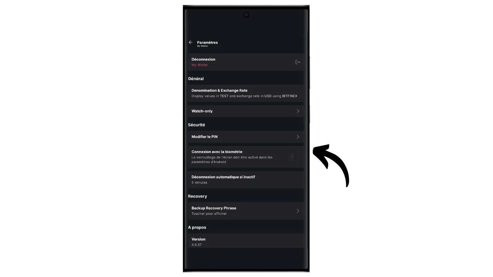
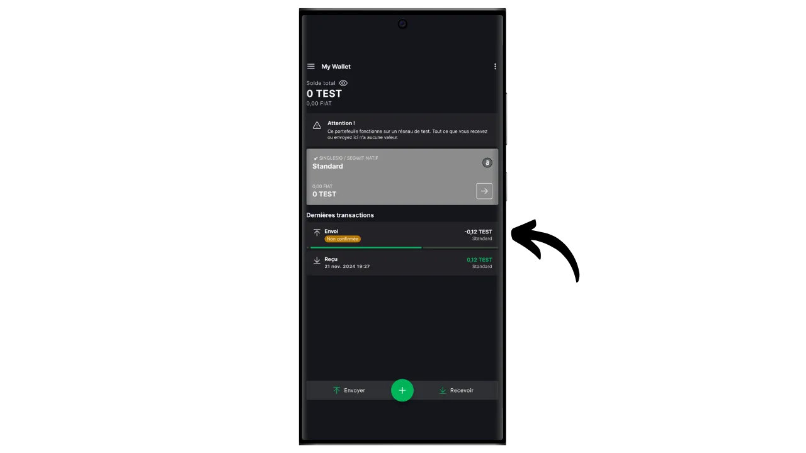

Un portafoglio software è un'applicazione installata su un computer, uno smartphone o un altro dispositivo connesso a Internet, che consente di gestire e proteggere le chiavi del portafoglio Bitcoin. A differenza dei portafogli hardware, che isolano le chiavi private, i portafogli "caldi" operano in un ambiente potenzialmente esposto agli attacchi informatici, aumentando il rischio di pirateria e furto.

I portafogli software dovrebbero essere utilizzati per gestire quantità ragionevoli di bitcoin, soprattutto per le transazioni quotidiane. Possono anche essere un'opzione interessante per le persone con un patrimonio limitato di bitcoin, per le quali l'investimento in un portafoglio hardware può sembrare sproporzionato. Tuttavia, la loro costante esposizione a Internet li rende meno sicuri per la conservazione di risparmi a lungo termine o di grandi fondi. Per questi ultimi, è meglio optare per soluzioni più sicure, come i portafogli hardware.

In questo tutorial, vorrei presentarvi una delle migliori soluzioni di portafoglio software per dispositivi mobili: **Blockstream Green**.

Se desiderate scoprire come utilizzare Blockstream Green sul vostro computer, consultate quest'altra guida:

https://planb.network/tutorials/wallet/desktop/blockstream-green-desktop-c1503adf-1404-4328-b814-aa97fcf0d5da
## Presentazione di Blockstream Green

Blockstream Green è un portafoglio software disponibile su mobile e desktop. Precedentemente noto come *Green Address*, questo portafoglio è diventato un progetto di Blockstream in seguito alla sua acquisizione nel 2016.

Green è un'applicazione particolarmente facile da usare, il che la rende interessante per i principianti. Offre tutte le caratteristiche essenziali di un buon portafoglio Bitcoin, tra cui RBF (*Replace-by-Fee*), un'opzione di connessione Tor, la possibilità di collegare il proprio nodo, SPV (*Simple Payment Verification*), etichettatura e controllo delle monete.

Blockstream Green supporta anche la rete Liquid, una sidechain di Bitcoin sviluppata da Blockstream per transazioni veloci e riservate al di fuori della blockchain principale. Questa esercitazione si concentra esclusivamente su Bitcoin, ma una successiva tratterà l'uso di Liquid.

## Installazione e configurazione dell'applicazione Blockstream Green

Il primo passo è ovviamente quello di scaricare l'applicazione Green. Andate nel vostro negozio di applicazioni:

- [Per Android](https://play.google.com/store/apps/details?id=com.greenaddress.greenbits_android_wallet);
- [Per Apple](https://apps.apple.com/us/app/green-bitcoin-wallet/id1402243590).

Per gli utenti Android, è possibile installare l'applicazione anche tramite il file `.apk` [disponibile su GitHub di Blockstream](https://github.com/Blockstream/green_android/releases).

Avviare l'applicazione, quindi selezionare la casella "Accetto le condizioni...*".

Quando si apre Green per la prima volta, la schermata iniziale appare senza un portafoglio configurato. In seguito, se si creano o importano portafogli, questi appariranno in questa interfaccia. Prima di procedere alla creazione di un portafoglio, vi consiglio di regolare le impostazioni dell'applicazione in base alle vostre esigenze. Cliccare su "Impostazioni dell'applicazione".

L'opzione "*Privacy avanzata*", disponibile solo su Android, migliora la privacy disabilitando gli screenshot e nascondendo le anteprime delle applicazioni. Inoltre, blocca automaticamente l'accesso alle applicazioni non appena il telefono viene bloccato, rendendo più difficile l'esposizione dei dati.

Per coloro che desiderano migliorare la propria privacy, l'applicazione offre la possibilità di effettuare il rooting del traffico tramite Tor, una rete che cripta tutte le connessioni e rende le attività difficili da rintracciare. Sebbene questa opzione possa rallentare leggermente il funzionamento dell'applicazione, è altamente consigliata per proteggere la propria privacy, soprattutto se non si utilizza un proprio nodo completo.

Per gli utenti che dispongono di un proprio nodo completo, Green Wallet offre la possibilità di collegarsi ad esso tramite un server Electrum, garantendo un controllo totale sulle informazioni della rete Bitcoin e sulla distribuzione delle transazioni.

Un'altra funzione alternativa è l'opzione "*Verifica SPV*", che consente di verificare direttamente alcuni dati della blockchain e quindi di ridurre la necessità di fidarsi del nodo predefinito di Blockstream, anche se questo metodo non fornisce tutte le garanzie di un nodo completo.

Dopo aver regolato le impostazioni in base alle proprie esigenze, fare clic sul pulsante "*Salva*" e riavviare l'applicazione.

## Creare un portafoglio Bitcoin su Blockstream Green

Ora siete pronti a creare un portafoglio Bitcoin. Fare clic sul pulsante "*Iniziare*".

È possibile scegliere tra la creazione di un portafoglio software locale o la gestione di un portafoglio freddo tramite un portafoglio hardware. Per questa esercitazione, ci concentreremo sulla creazione di un portafoglio caldo, quindi dovrete selezionare l'opzione "*Su questo dispositivo*". In una prossima esercitazione vi mostrerò come utilizzare l'altra opzione.

L'opzione "*Solo visione*", invece, consente di importare una chiave pubblica estesa (`xpub`) per visualizzare le transazioni di un portafoglio senza poter spendere i fondi associati, il che è utile per monitorare un portafoglio su un portafoglio hardware, ad esempio.

Si può quindi scegliere di ripristinare un portafoglio Bitcoin esistente o di crearne uno nuovo. Ai fini di questa esercitazione, creeremo un nuovo portafoglio. Tuttavia, se avete bisogno di rigenerare un portafoglio Bitcoin esistente dalla sua frase mnemonica, ad esempio in seguito alla perdita del vostro portafoglio hardware, dovrete scegliere la seconda opzione.

È possibile scegliere tra una frase mnemonica di 12 o 24 parole. Questa frase vi permetterà di recuperare l'accesso al vostro portafoglio da qualsiasi software compatibile in caso di problemi con il vostro telefono. Attualmente, la scelta di una frase di 24 parole non offre maggiore sicurezza di una frase di 12 parole. Vi consiglio quindi di scegliere una frase mnemonica di 12 parole.

Green vi fornirà la vostra frase mnemonica. Prima di continuare, assicuratevi di non essere osservati. Cliccate su "*Mostra la frase di recupero*" per visualizzarla sullo schermo.

**Questo mnemonico vi dà accesso completo e illimitato a tutti i vostri bitcoin ** Chiunque sia in possesso di questo mnemonico può rubare i vostri fondi, anche senza accedere fisicamente al vostro telefono.

Ripristina l'accesso ai bitcoin in caso di perdita, furto o rottura del telefono. È quindi molto importante eseguire un backup accurato **su un supporto fisico (non digitale)** e conservarlo in un luogo sicuro. Potete scriverlo su un pezzo di carta o, per maggiore sicurezza, se si tratta di un portafoglio di grandi dimensioni, vi consiglio di inciderlo su un supporto in acciaio inossidabile per proteggerlo dal rischio di incendi, inondazioni o crolli (per un portafoglio caldo progettato per proteggere una piccola quantità di bitcoin, un semplice backup cartaceo è probabilmente sufficiente).

*Ovviamente, non dovete mai condividere queste parole su Internet, come faccio io in questo tutorial. Questo portfolio di esempio sarà utilizzato solo su Testnet e sarà cancellato alla fine del tutorial.*

Dopo aver registrato correttamente la frase mnemonica su un supporto fisico, fare clic su "*Continua*". Green Wallet vi chiederà di confermare alcune parole della vostra frase mnemonica per assicurarsi che siano state registrate correttamente. Riempite gli spazi vuoti con le parole mancanti.

Scegliere il codice PIN del dispositivo, che verrà utilizzato per sbloccare il portafoglio verde. Si tratta di una protezione contro l'accesso fisico non autorizzato. Il codice PIN non partecipa alla creazione delle chiavi crittografiche del portafoglio. Pertanto, anche senza accesso a questo codice PIN, il possesso della frase mnemonica di 12 o 24 parole vi permetterà di riavere accesso ai vostri bitcoin.

Si consiglia di scegliere un codice PIN di 6 cifre il più casuale possibile. Assicuratevi di salvare questo codice per non dimenticarlo, altrimenti sarete costretti a recuperare il portafoglio dalla mnemonica. È possibile aggiungere un'opzione di blocco biometrico per evitare di dover inserire il PIN ogni volta che lo si utilizza. In generale, la biometria è molto meno sicura del PIN stesso. Pertanto, per impostazione predefinita, vi consiglio di non impostare questa opzione di sblocco.

Immettere il PIN una seconda volta per confermarlo.

Attendere la creazione del portafoglio, quindi fare clic sul pulsante "*Crea un account*".

È quindi possibile scegliere tra un portafoglio standard a firma singola, che utilizzeremo in questo tutorial, o un portafoglio protetto da autenticazione a due fattori (2FA).

L'opzione 2FA su Green crea un portafoglio multi-firma 2/2, con una chiave detenuta da Blockstream. Ciò significa che per effettuare una transazione sono necessarie entrambe le chiavi: una chiave locale protetta dal codice PIN sul telefono e una chiave remota protetta dalla 2FA sui server di Blockstream. In caso di perdita dell'accesso alla 2FA o di indisponibilità dei servizi di Blockstream, i meccanismi di recupero basati su script a tempo garantiscono il recupero autonomo dei fondi. Sebbene questa configurazione riduca notevolmente il rischio di furto dei vostri bitcoin, è più complessa da gestire e dipende in parte da Blockstream. Per questo tutorial, opteremo per un portafoglio classico a firma singola, con le chiavi memorizzate localmente sul telefono.

Il vostro portafoglio Bitcoin è stato creato con l'applicazione Green!

Prima di ricevere i primi bitcoin nel vostro portafoglio, **vi consiglio vivamente di eseguire un test di recupero del vuoto**. Prendete nota di alcune informazioni di riferimento, come il vostro indirizzo xpub o il primo indirizzo di ricezione, quindi cancellate il vostro portafoglio dall'app Green quando è ancora vuoto. Quindi provare a ripristinare il portafoglio su Green utilizzando i backup cartacei. Verificate che le informazioni del cookie generate dopo il ripristino corrispondano a quelle annotate in origine. Se è così, potete essere certi che i vostri backup cartacei sono affidabili. Per saperne di più su come effettuare un ripristino di prova, consultate quest'altro tutorial:

https://planb.network/tutorials/wallet/backup/recovery-test-5a75db51-a6a1-4338-a02a-164a8d91b895
## Impostazione del portafoglio su Blockstream Green

Se si desidera personalizzare il proprio portafoglio, cliccare sui tre puntini in alto a destra.

L'opzione "*Rename*" consente di personalizzare il nome del portafoglio, particolarmente utile se si gestiscono diversi portafogli sulla stessa applicazione.

Il menu "*Unit*" consente di modificare l'unità di base del portafoglio. Ad esempio, si può scegliere di visualizzarlo in satoshi anziché in bitcoin.

Il menu "*Impostazioni*" consente di accedere alle varie opzioni del portafoglio Bitcoin.

Qui, ad esempio, si trova la chiave pubblica estesa e il suo *descrittore*, utile se si intende impostare un portafoglio in modalità watch-only da questo portafoglio.

È inoltre possibile modificare il PIN del portafoglio e attivare una connessione biometrica.

## Utilizzo di Blockstream Green

Ora che il vostro portafoglio Bitcoin è stato configurato, siete pronti a ricevere i vostri primi satelliti! Basta cliccare sul pulsante "*Ricevi*".

Green visualizzerà quindi il primo indirizzo di ricezione vuoto nel portafoglio. È possibile scansionare il codice QR associato o copiare direttamente l'indirizzo per inviare bitcoin. Questo tipo di indirizzo non specifica l'importo che il pagatore deve inviare. È tuttavia possibile generare un indirizzo che richieda un importo specifico, facendo clic sui tre puntini in alto a destra, quindi su "*Richiesta importo*" e inserendo l'importo desiderato.

Poiché stai usando un conto Segwit v0 (BIP84), il tuo indirizzo inizierà con `bc1q...`. Nel mio esempio, sto usando un portafoglio Testnet, quindi il prefisso è leggermente diverso.

Quando la transazione viene trasmessa alla rete, appare nel vostro portafoglio.

Aspettate di aver ricevuto un numero sufficiente di conferme per considerare la transazione definitiva.

Con i bitcoin nel vostro portafoglio, ora potete anche inviare bitcoin. Cliccate su "*Invio*".

Nella pagina successiva, inserire l'indirizzo del destinatario. È possibile inserirlo manualmente o scansionare un codice QR.

Scegliere l'importo del pagamento.

Nella parte inferiore della schermata è possibile selezionare la tariffa per questa transazione. È possibile scegliere se seguire le raccomandazioni dell'applicazione o personalizzare le commissioni. Più alta è la tariffa rispetto alle altre transazioni in corso, più veloce sarà l'elaborazione della transazione. Per informazioni sul mercato delle commissioni, visitare [Mempool.space](https://mempool.space/) nella sezione "*Transaction Fees*".

Cliccare su "*Avanti*" per accedere alla schermata di riepilogo della transazione. Verificare che l'indirizzo, l'importo e le spese siano corretti.

Se tutto va bene, fate scorrere verso destra il pulsante verde in fondo allo schermo per firmare e trasmettere la transazione sulla rete Bitcoin.

La transazione apparirà ora sulla dashboard del vostro portafoglio Bitcoin, in attesa di conferma.

*Questo tutorial si basa su [una versione originale appartenente a Bitstack](https://www.bitstack-app.com/blog/installer-portefeuille-bitcoin-green-wallet) scritta da Loïc Morel. Bitstack è una neo-banca francese di Bitcoin che offre la possibilità di risparmiare in bitcoin, sia in DCA (Dollar Cost Averaging), sia attraverso un sistema di arrotondamento automatico per le spese giornaliere.* Bitstack è una neo-banca francese di Bitcoin che offre la possibilità di risparmiare in bitcoin, sia in DCA (Dollar Cost Averaging), sia attraverso un sistema di arrotondamento automatico per le spese giornaliere