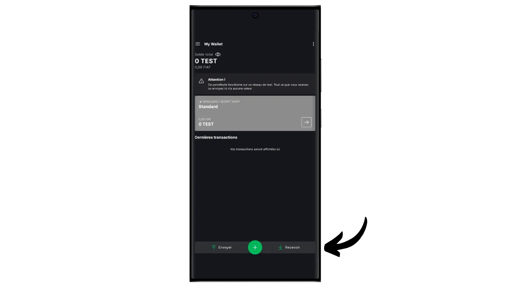
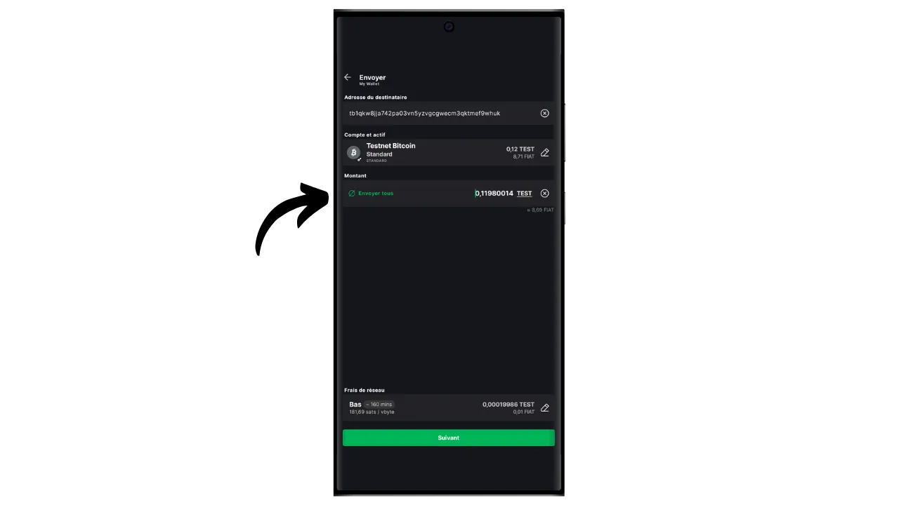
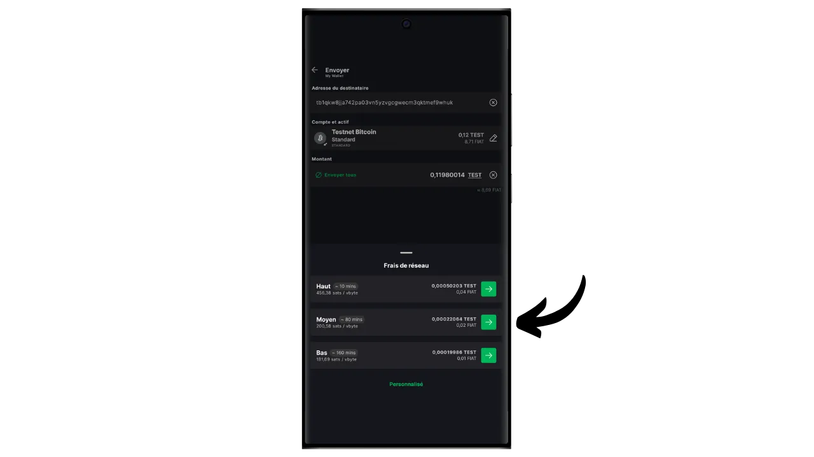

ソフトウェアウォレットは、コンピュータ、スマートフォン、またはその他のインターネット接続デバイスにインストールされるアプリケーションで、ビットコインウォレットのキーを管理し、保護することができます。秘密鍵を隔離するハードウェアウォレットとは異なり、「ホット」ウォレットはサイバー攻撃にさらされる可能性のある環境で動作するため、違法コピーや盗難のリスクが高まります。

ソフトウェアウォレットは、特に日常的な取引において、適切な量のビットコインを管理するために使用されるべきである。また、ビットコイン資産に限りがあり、ハードウェアウォレットへの投資が不釣り合いに思える人にとっても、興味深い選択肢となります。しかし、常にインターネットにさらされているため、長期的な貯蓄や多額の資金を保管するには安全性に欠ける。後者の場合は、ハードウェアウォレットのような、より安全なソリューションを選ぶのがベストです。

このチュートリアルでは、最高のモバイル・ウォレット・ソリューションの一つを紹介したい： **ブロックストリーム・グリーン

ブロックストリーム・グリーンの使用方法については、こちらのチュートリアルをご参照ください：

https://planb.network/tutorials/wallet/desktop/blockstream-green-desktop-c1503adf-1404-4328-b814-aa97fcf0d5da
## ブロックストリーム・グリーンの紹介

Blockstream Greenはモバイルとデスクトップで利用可能なソフトウェアウォレットです。以前は*Green Address*として知られていたこのウォレットは、2016年の買収後にBlockstreamのプロジェクトとなった。

Greenは特に使いやすいアプリケーションであり、初心者にとって興味深いものとなっている。RBF (*Replace-by-Fee*), Tor接続オプション, 自分のノードを接続する機能, SPV (*Simple Payment Verification*), コインのタグ付けとコントロールなど、優れたビットコインウォレットに不可欠な機能をすべて提供しています。

Blockstream Greenはまた、メインブロックチェーン外での高速で機密性の高い取引のためにBlockstreamが開発したビットコインのサイドチェーンであるLiquidネットワークもサポートしています。このチュートリアルではBitcoinのみに焦点を当てますが、後のチュートリアルではLiquidの使用についても取り上げます。

## Blockstream Greenアプリケーションのインストールと設定

最初のステップは、もちろんGreenアプリケーションをダウンロードすることです。アプリケーションストアにアクセスしてください：

- [Android用](https://play.google.com/store/apps/details?id=com.greenaddress.greenbits_android_wallet)；
- [アップルのために](https://apps.apple.com/us/app/green-bitcoin-wallet/id1402243590)。

アンドロイド・ユーザーの場合は、`.apk`ファイル[BlockstreamのGitHubで入手可能](https://github.com/Blockstream/green_android/releases)を使ってアプリケーションをインストールすることもできる。

アプリケーションを起動し、"I accept the conditions...*"にチェックを入れる。

初めてGreenを開いたときは、ポートフォリオが設定されていない状態でホーム画面が表示されます。その後、ポートフォリオを作成またはインポートすると、このインターフェイスに表示されます。ポートフォリオを作成する前に、アプリケーションの設定を調整することをお勧めします。アプリケーション設定」をクリックしてください。

Androidでのみ利用可能な「*プライバシー強化*」オプションは、スクリーンショットを無効にし、アプリケーションのプレビューを非表示にすることで、プライバシーを強化します。また、携帯電話がロックされると同時にアプリケーションへのアクセスも自動的にロックされ、データの流出がより困難になります。

プライバシーを強化したい人のために、このアプリケーションは、すべての接続を暗号化し、あなたの活動を追跡することを困難にするネットワークであるTor経由であなたのトラフィックをルート化するオプションを提供しています。このオプションはアプリケーションの動作を若干遅くするかもしれませんが、あなたのプライバシーを保護するために、特にあなた自身の完全なノードを使用していない場合は、強くお勧めします。

自分の完全なノードを持つユーザーのために、グリーンウォレットは、ビットコインのネットワーク情報とトランザクションの配布の完全な制御を保証するElectrumサーバーを介してそれに接続する可能性を提供します。

これは特定のブロックチェーン・データを直接検証することができるため、ブロックストリームのデフォルト・ノードを信頼する必要性を減らすことができますが、この方法ではフル・ノードのすべての保証を提供することはできません。

これらの設定をあなたのニーズに合わせて調整したら、「*保存*」ボタンをクリックし、アプリケーションを再起動します。

## Blockstream Greenでビットコイン・ウォレットを作成する

これでビットコイン・ウォレットを作成する準備ができました。Get Started*」ボタンをクリックしてください。

ローカルのソフトウェアウォレットを作成するか、ハードウェアウォレットでコールドウォレットを管理するかを選択できます。このチュートリアルでは、ホットウォレットの作成に集中するので、"*On This Device*"オプションを選択する必要がある。今後のチュートリアルでは、もう一つのオプションの使い方を紹介します。

一方、"*Watch-only*"オプションでは、拡張公開鍵(`xpub`)をインポートして、関連する資金を使うことなくポートフォリオのトランザクションを見ることができる。

その後、既存のビットコインウォレットを復元するか、新しいウォレットを作成するかを選択できます。このチュートリアルでは、新しいウォレットを作成します。しかし、ハードウェアウォレットを紛失した場合など、既存のビットコインウォレットをニーモニックフレーズから再生成する必要がある場合は、2番目のオプションを選択する必要があります。

その後、12単語または24単語のニーモニックフレーズを選択することができます。このフレーズは、携帯電話に問題が発生した場合に、互換性のあるソフトウェアから財布へのアクセスを回復することを可能にします。現時点では、24単語のフレーズを選択しても、12単語のフレーズ以上のセキュリティは得られません。したがって、12語のニーモニック・フレーズを選択することをお勧めします。

グリーンがあなたのニーモニックフレーズを表示します。続行する前に、監視されていないことを確認してください。リカバリーフレーズを表示*」をクリックすると、画面に表示されます。

**このニーモニックは、あなたのすべてのビットコインに完全かつ無制限にアクセスできるようにします。

これは、携帯電話の紛失、盗難、破損の際にビットコインへのアクセスを復元するものです。ですから、**（デジタルではなく）物理的な媒体で**慎重にバックアップし、安全な場所に保管することが非常に重要です。紙に書いてもいいですし、セキュリティを高めるために、これが大きなウォレットであれば、火災、洪水、倒壊のリスクから守るために、ステンレスの支柱に刻印することをお勧めします（少量のビットコインを保護するために設計されたホットウォレットであれば、シンプルな紙のバックアップで十分でしょう）。

*もちろん、このチュートリアルで私がしているように、インターネット上でこれらの言葉を決して共有してはいけません。このサンプル・ポートフォリオはTestnet上でのみ使用され、チュートリアルが終了した時点で削除されます*。

ニーモニック・フレーズを物理的媒体に正しく記録したら、"*Continue*"をクリックしてください。その後、Green Walletが、ニモニック・フレーズに含まれる単語が正しく記録されているかどうかを確認します。空欄に足りない単語を記入してください。

グリーンウォレットのロック解除に使用するPINコードをお選びください。これは不正な物理的アクセスからの保護です。このPINコードはウォレットの暗号キーの導出には関与しません。そのため、このPINコードにアクセスできなくても、12語または24語のニーモニックフレーズを持っていれば、ビットコインへのアクセスを取り戻すことができます。

できるだけランダムな6桁のPINコードを選択することをお勧めします。このコードを忘れないように必ず保存してください。そうしないと、ニーモニックから財布を取り出すことを余儀なくされます。その後、バイオメトリック・ブロック・オプションを追加すれば、使うたびにPINを入力する必要がなくなる。一般的に言って、生体認証は暗証番号そのものよりもはるかに安全性が低い。ですから、デフォルトでは、このロック解除オプションを設定しないことをお勧めします。

PINを確認するため、2回目の入力を行います。

ポートフォリオが作成されるのを待ち、「*アカウントを作成*」ボタンをクリックします。

その後、このチュートリアルで使用する標準的な単一署名ウォレットか、二要素認証（2FA）で保護されたウォレットのいずれかを選択できます。

Greenの2FAオプションは、Blockstreamが保持する1つのキーで、2/2マルチシグネチャウォレットを作成します。つまり、トランザクションを実行するには、携帯電話のPINコードで保護されたローカルキーと、Blockstreamのサーバー上の2FAで保護されたリモートキーの両方が必要です。2FAにアクセスできなくなったり、ブロックストリームのサービスが利用できなくなったりした場合は、タイムロック・スクリプトに基づくリカバリ・メカニズムにより、資金を自律的に回復することができます。この構成はビットコインの盗難リスクを大幅に低減しますが、管理がより複雑で、Blockstreamに部分的に依存します。このチュートリアルでは、クラシックなシングル署名ウォレットを選びます。

これであなたのビットコインウォレットはGreenアプリケーションを使って作成されました！

ウォレットに最初のビットコインを受け取る前に、**空のリカバリーテスト**を行うことを強くお勧めします。xpubや最初の受け取りアドレスなどの参考情報をメモし、まだ空の状態でGreenアプリ上でウォレットを削除してください。その後、紙のバックアップを使用してGreenでウォレットを復元してみてください。復元後に生成されるクッキー情報が、最初にメモしたものと一致しているか確認してください。一致していれば、紙のバックアップが信頼できるものであることが確認できます。リカバリーのテスト方法については、こちらのチュートリアルを参照してください：

https://planb.network/tutorials/wallet/backup/recovery-test-5a75db51-a6a1-4338-a02a-164a8d91b895
## ブロックストリーム・グリーンでポートフォリオを設定する

ポートフォリオをパーソナライズしたい場合は、右上にある3つの小さな点をクリックしてください。

Rename*"オプションでは、ポートフォリオの名前をカスタマイズすることができます。

Unit*"メニューでは、ウォレットの基本単位を変更することができます。例えば、ビットコインではなくサトシで表示することもできます。

設定*」メニューは、ビットコインウォレットの様々なオプションへのアクセスを提供します。

例えば、ここに拡張公開鍵とその*descriptor*があります。このウォレットからウォッチオンリーモードでウォレットをセットアップする予定がある場合に便利です。

また、財布の暗証番号を変更したり、生体認証接続を有効にしたりすることもできる。

## ブロックストリーム・グリーンの使用

ビットコイン・ウォレットがセットアップされたら、最初のサットを受け取る準備ができました！受信*」ボタンをクリックしてください。

グリーンは、あなたのウォレットに最初の空白の受信アドレスを表示します。関連するQRコードをスキャンするか、アドレスを直接コピーしてビットコインを送ることができます。このタイプのアドレスは、支払者が送信する金額を指定しません。しかし、右上にある3つの小さな点をクリックし、次に "*Request amount*"をクリックし、希望の金額を入力することで、特定の金額を要求するアドレスを生成することができます。

Segwit v0アカウント（BIP84）を使用しているので、アドレスは`bc1q...`で始まります。私の例では、Testnetのポートフォリオを使っているので、プレフィックスが若干異なります。

取引がネットワーク上でブロードキャストされると、あなたのウォレットに表示されます。

取引が確定したと判断するのに十分な確認が取れるまで待つ。

ウォレットにビットコインがあれば、ビットコインを送ることもできます。送信*」をクリックしてください。

次のページで、受取人の住所を入力します。手動で入力するか、QRコードをスキャンします。

お支払い金額をお選びください。

画面下部では、この取引の手数料率を選択することができます。アプリケーションの推奨に従うか、手数料をカスタマイズするかを選択できます。他の保留中のトランザクションとの関係で手数料が高いほど、トランザクションは迅速に処理されます。手数料相場については、[Mempool.space](https://mempool.space/)の「*取引手数料*」セクションをご覧ください。

次へ*」をクリックし、取引概要画面にアクセスします。住所、金額、手数料が正しいことを確認してください。

すべてがうまくいったら、画面下部の緑色のボタンを右にスライドさせ、ビットコインネットワーク上でトランザクションに署名し、ブロードキャストする。

取引はビットコインウォレットのダッシュボードに表示され、確認を待ちます。

*このチュートリアルは、Loïc Morelによって書かれた[Bitstackに属するオリジナルバージョン](https://www.bitstack-app.com/blog/installer-portefeuille-bitcoin-green-wallet)に基づいています。Bitstackはフランスのビットコインネオバンクで、DCA(ドルコスト平均法)または日々の出費のための自動丸めシステムによって、ビットコインで貯蓄する可能性を提供します* Bitstackはフランスのビットコインネオバンクで、DCA(ドルコスト平均法)または日々の出費のための自動丸めシステムによって、ビットコインで貯蓄する可能性を提供します