En programvarelommebok er et program som installeres på en datamaskin, smarttelefon eller annen Internett-tilkoblet enhet, slik at du kan administrere og sikre Bitcoin-lommeboknøklene dine. I motsetning til maskinvarelommebøker, som isolerer private nøkler, opererer "hot"-lommebøker derfor i et miljø som potensielt er utsatt for dataangrep, noe som øker risikoen for piratkopiering og tyveri.

Programvarelommebøker bør brukes til å håndtere rimelige mengder bitcoins, spesielt for dagligdagse transaksjoner. De kan også være et interessant alternativ for personer med begrensede bitcoin-eiendeler, for hvem investeringen i en maskinvarelommebok kan virke uforholdsmessig stor. Den konstante eksponeringen mot Internett gjør dem imidlertid mindre sikre når det gjelder lagring av langsiktige sparepenger eller store midler. For sistnevnte er det best å velge sikrere løsninger, for eksempel maskinvare-lommebøker.

I denne veiledningen vil jeg introdusere deg for en av de beste løsningene for mobile programvarelommebøker: **Blockstream Green**.

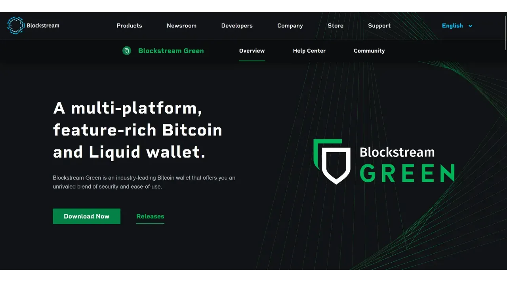

Hvis du vil finne ut hvordan du bruker Blockstream Green på datamaskinen din, kan du lese denne andre veiledningen:

https://planb.network/tutorials/wallet/desktop/blockstream-green-desktop-c1503adf-1404-4328-b814-aa97fcf0d5da
## Vi introduserer Blockstream Green

Blockstream Green er en programvarelommebok som er tilgjengelig på mobil og PC. Tidligere kjent som *Green Address*, ble denne lommeboken et Blockstream-prosjekt etter oppkjøpet i 2016.

Green er et spesielt brukervennlig program, noe som gjør det interessant for nybegynnere. Den tilbyr alle de viktigste funksjonene i en god Bitcoin-lommebok, inkludert RBF (*Replace-by-Fee*), et Tor-tilkoblingsalternativ, muligheten til å koble til din egen node, SPV (*Simple Payment Verification*), myntmerking og -kontroll.

Blockstream Green støtter også Liquid-nettverket, en Bitcoin-sidekjede utviklet av Blockstream for raske, konfidensielle transaksjoner utenfor hovedblokkjeden. Denne veiledningen fokuserer utelukkende på Bitcoin, men en senere veiledning vil ta for seg bruken av Liquid.

## Installere og konfigurere Blockstream Green-applikasjonen

Det første trinnet er selvfølgelig å laste ned Green-applikasjonen. Gå til applikasjonsbutikken din:

- [For Android] (https://play.google.com/store/apps/details?id=com.greenaddress.greenbits_android_wallet);
- [For Apple] (https://apps.apple.com/us/app/green-bitcoin-wallet/id1402243590).

For Android-brukere kan du også installere applikasjonen via `.apk`-filen [tilgjengelig på Blockstreams GitHub] (https://github.com/Blockstream/green_android/releases).

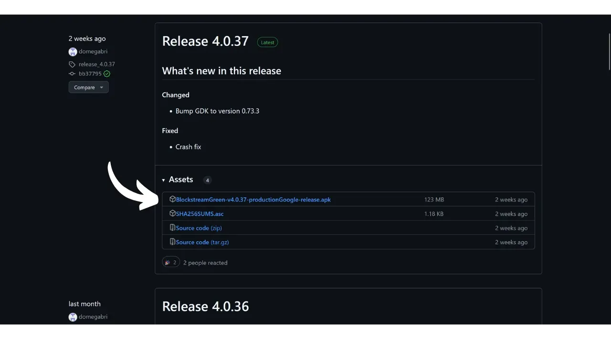

Start programmet, og kryss av i boksen "Jeg godtar vilkårene...*".

Når du åpner Green for første gang, vises startskjermbildet uten en konfigurert portefølje. Hvis du senere oppretter eller importerer porteføljer, vil de vises i dette grensesnittet. Før du går videre til å opprette en portefølje, anbefaler jeg at du justerer programinnstillingene slik at de passer til dine behov. Klikk på "Programinnstillinger".

Alternativet "*Avansert personvern*", som kun er tilgjengelig på Android, forbedrer personvernet ved å deaktivere skjermbilder og skjule forhåndsvisninger av applikasjoner. Det låser også automatisk tilgangen til applikasjoner så snart telefonen låses, noe som gjør det vanskeligere å eksponere dataene dine.

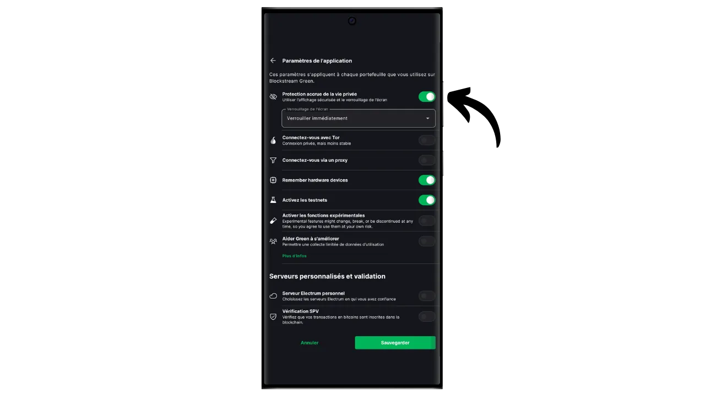

For de som ønsker å forbedre personvernet sitt, tilbyr applikasjonen muligheten til å roote trafikken din via Tor, et nettverk som krypterer alle forbindelsene dine og gjør det vanskelig å spore aktivitetene dine. Selv om dette alternativet kan gjøre applikasjonen litt tregere, anbefales det på det sterkeste for å beskytte personvernet ditt, spesielt hvis du ikke bruker din egen komplette node.

For brukere som har sin egen komplette node, tilbyr Green Wallet muligheten til å koble seg til den via en Electrum-server, noe som garanterer total kontroll over Bitcoin-nettverksinformasjon og distribusjon av transaksjoner.

En annen alternativ funksjon er alternativet "*SPV Verification*", som lar deg verifisere visse blokkjededata direkte og dermed redusere behovet for å stole på Blockstreams standardnode, selv om denne metoden ikke gir alle garantiene til en full node.

Når du har tilpasset disse innstillingene til dine behov, klikker du på "*Lagre*"-knappen og starter programmet på nytt.

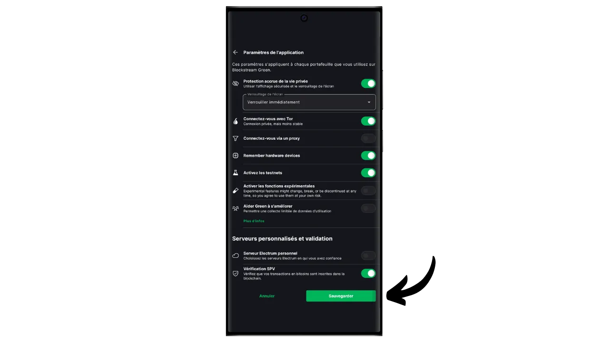

## Opprett en Bitcoin-lommebok på Blockstream Green

Du er nå klar til å opprette en Bitcoin-lommebok. Klikk på knappen "*Gå i gang*".

Du kan velge mellom å opprette en lokal programvarelommebok eller å administrere en kald lommebok via en maskinvarelommebok. I denne veiledningen skal vi konsentrere oss om å opprette en varm lommebok, så du må velge alternativet "*På denne enheten*". I en fremtidig veiledning vil jeg vise deg hvordan du bruker det andre alternativet.

Med alternativet "*Watch-only*" kan du importere en utvidet offentlig nøkkel (`xpub`) for å se en porteføljes transaksjoner uten å kunne bruke de tilknyttede midlene, noe som er praktisk for å spore en portefølje på en maskinvarelommebok, for eksempel.

Du kan deretter velge å gjenopprette en eksisterende Bitcoin-lommebok eller opprette en ny. I denne veiledningen skal vi opprette en ny lommebok. Men hvis du trenger å regenerere en eksisterende Bitcoin-lommebok fra den mnemoniske frasen, for eksempel etter at du har mistet maskinvarelommeboken din, må du velge det andre alternativet.

Du kan deretter velge mellom en minnefrase på 12 eller 24 ord. Med denne frasen kan du få tilgang til lommeboken din fra hvilken som helst kompatibel programvare hvis det skulle oppstå et problem med telefonen din. For øyeblikket gir det ikke mer sikkerhet å velge en 24 ords frase enn en 12 ords frase. Jeg anbefaler derfor at du velger en mnemoteknisk frase på 12 ord.

Green vil da gi deg den mnemoniske frasen din. Før du fortsetter, må du forsikre deg om at du ikke blir overvåket. Klikk på "*Vis gjenopprettingsfrase*" for å vise den på skjermen.

**Denne huskeregelen gir deg full, ubegrenset tilgang til alle bitcoinsene dine ** Alle som er i besittelse av denne huskeregelen, kan stjele pengene dine, selv uten fysisk tilgang til telefonen din.

Den gjenoppretter tilgangen til bitcoinsene dine i tilfelle tap, tyveri eller ødeleggelse av telefonen din. Det er derfor svært viktig å sikkerhetskopiere den nøye **på et fysisk medium (ikke digitalt)** og oppbevare den på et sikkert sted. Du kan skrive det ned på et stykke papir, eller for ekstra sikkerhet, hvis dette er en stor lommebok, anbefaler jeg å gravere det på en støtte i rustfritt stål for å beskytte den mot brann, oversvømmelse eller kollaps (for en varm lommebok designet for å sikre en liten mengde bitcoins, er en enkel papirbackup sannsynligvis tilstrekkelig).

*Du må selvsagt aldri dele disse ordene på Internett, slik jeg gjør i denne veiledningen. Denne eksempelmappen vil kun bli brukt på Testnet, og vil bli slettet ved slutten av opplæringen*

Når du har registrert huskefrasen din på et fysisk medium, klikker du på "*Fortsett*". Green Wallet ber deg da om å bekrefte noen av ordene i huskesetningen for å forsikre deg om at du har registrert dem riktig. Fyll ut de tomme feltene med de manglende ordene.

Velg enhetens PIN-kode, som vil bli brukt til å låse opp den grønne lommeboken. Dette er din beskyttelse mot uautorisert fysisk tilgang. Denne PIN-koden er ikke involvert i utledningen av lommebokens kryptografiske nøkler. Så selv uten tilgang til denne PIN-koden vil du kunne få tilgang til bitcoinsene dine igjen hvis du har den mnemoniske frasen på 12 eller 24 ord.

Vi anbefaler at du velger en sekssifret PIN-kode som er så tilfeldig som mulig. Husk å lagre denne koden slik at du ikke glemmer den, ellers vil du bli tvunget til å hente lommeboken din fra huskelappen. Du kan deretter legge til en biometrisk blokkering for å unngå å måtte taste inn PIN-koden hver gang du bruker den. Generelt sett er biometri langt mindre sikkert enn selve PIN-koden. Så som standard anbefaler jeg at du ikke konfigurerer dette opplåsingsalternativet.

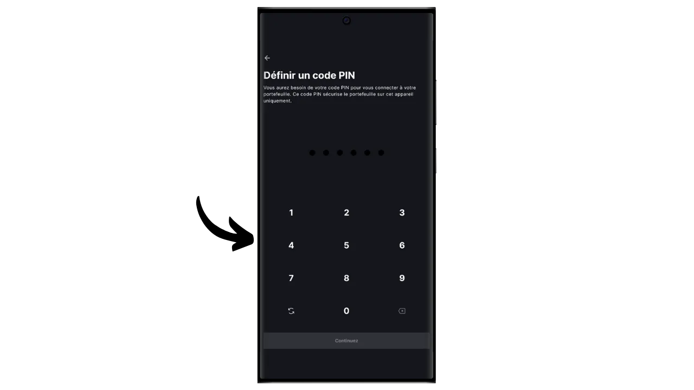

Tast inn PIN-koden en gang til for å bekrefte den.

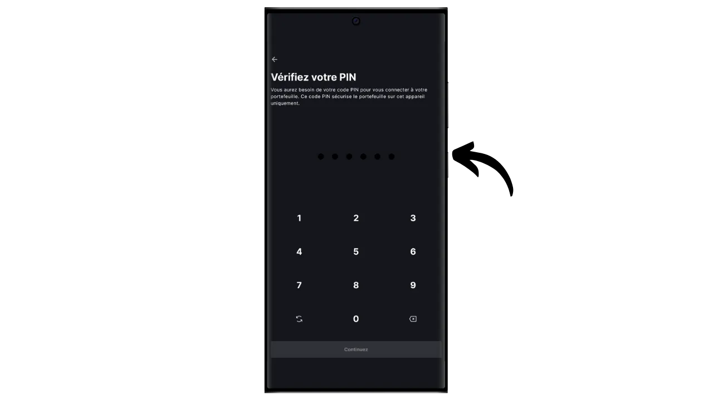

Vent til porteføljen din er opprettet, og klikk deretter på knappen "*Opprett en konto*".

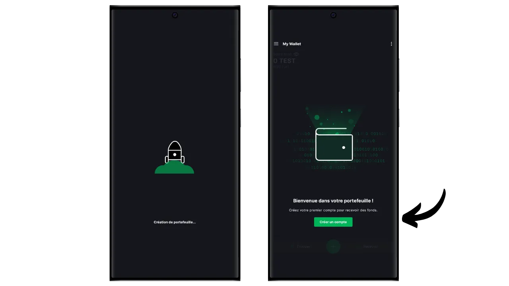

Deretter kan du velge mellom en standardlommebok med én signatur, som vi bruker i denne veiledningen, eller en lommebok som er beskyttet av tofaktorautentisering (2FA).

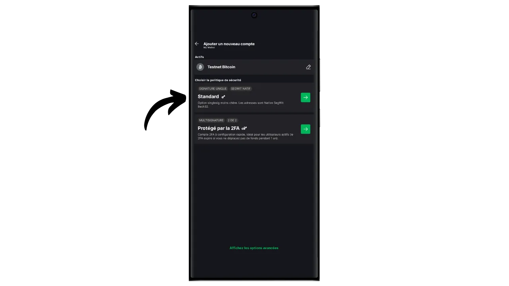

2FA-alternativet på Green oppretter en 2/2 multisignaturlommebok, med én nøkkel hos Blockstream. Dette betyr at begge nøklene kreves for å utføre en transaksjon: en lokal nøkkel beskyttet av PIN-koden din på telefonen, og en ekstern nøkkel sikret av 2FA på Blockstreams servere. I tilfelle tap av tilgang til 2FA eller utilgjengelighet av Blockstreams tjenester, sørger gjenopprettingsmekanismer basert på tidslås-skript for at pengene dine kan gjenopprettes på egen hånd. Selv om denne konfigurasjonen reduserer risikoen for tyveri av bitcoins betydelig, er den mer kompleks å administrere og delvis avhengig av Blockstream. I denne veiledningen velger vi en klassisk lommebok med én signatur, der nøklene lagres lokalt på telefonen.

Bitcoin-lommeboken din har nå blitt opprettet ved hjelp av Green-applikasjonen!

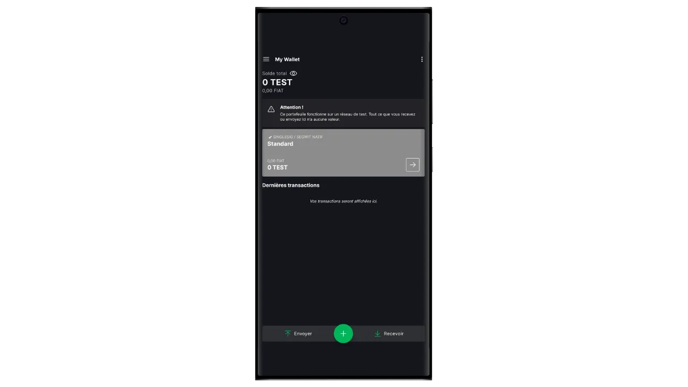

Før du mottar dine første bitcoins i lommeboken din, anbefaler jeg deg på det sterkeste å utføre en tom gjenopprettingstest**. Noter litt referanseinformasjon, for eksempel xpub-adressen din eller den første mottakeradressen, og slett deretter lommeboken din i Green-appen mens den fortsatt er tom. Prøv deretter å gjenopprette lommeboken din på Green ved hjelp av papirsikkerhetskopiene dine. Sjekk at cookie-informasjonen som genereres etter gjenopprettingen, stemmer overens med den du opprinnelig skrev ned. Hvis den gjør det, kan du være sikker på at papirsikkerhetskopiene dine er pålitelige. Hvis du vil vite mer om hvordan du utfører en testgjenoppretting, kan du lese denne andre veiledningen:

https://planb.network/tutorials/wallet/backup/recovery-test-5a75db51-a6a1-4338-a02a-164a8d91b895
## Sette opp porteføljen din på Blockstream Green

Hvis du ønsker å tilpasse porteføljen din, klikker du på de tre små prikkene øverst i høyre hjørne.

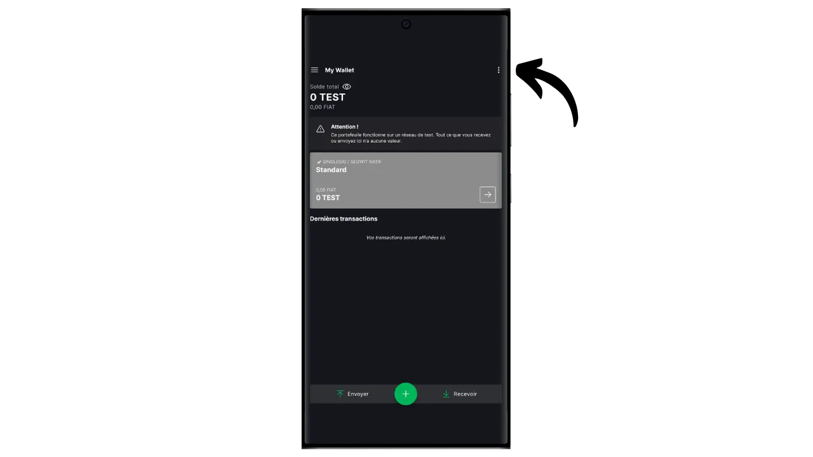

Med alternativet "*Rename*" kan du tilpasse navnet på porteføljen din, noe som er spesielt nyttig hvis du administrerer flere porteføljer i samme program.

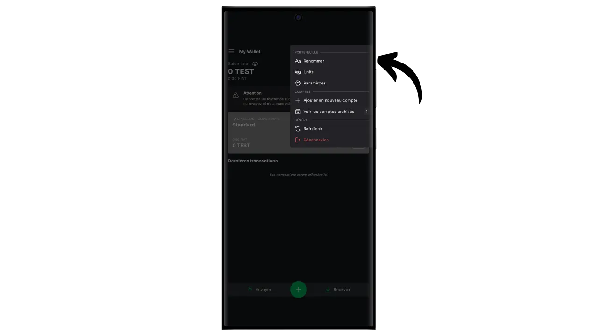

I menyen "*Unit*" kan du endre basisenheten for lommeboken din. Du kan for eksempel velge å vise den i satoshier i stedet for bitcoins.

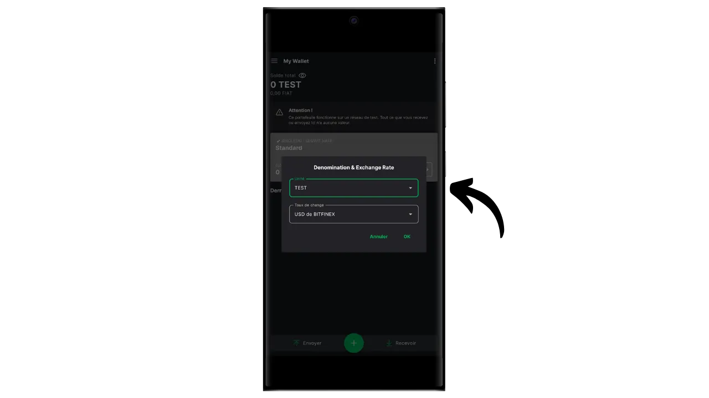

Menyen "*Settings*" gir tilgang til de ulike alternativene i Bitcoin-lommeboken din.

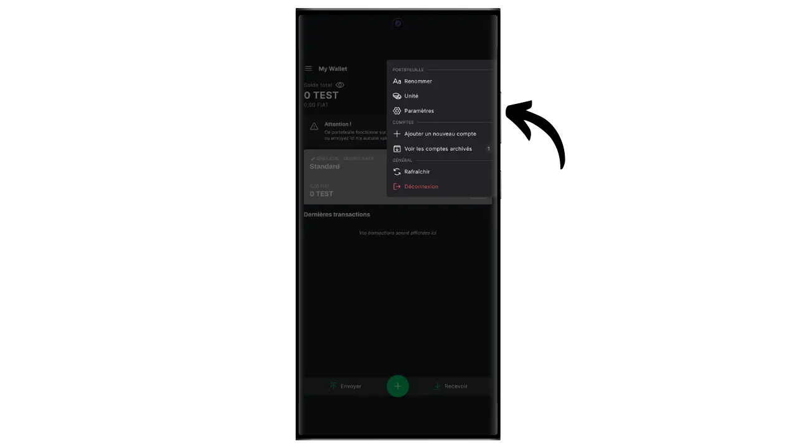

Her finner du for eksempel den utvidede offentlige nøkkelen din og dens *descriptor*, som er nyttig hvis du planlegger å sette opp en lommebok i watch-only-modus fra denne lommeboken.

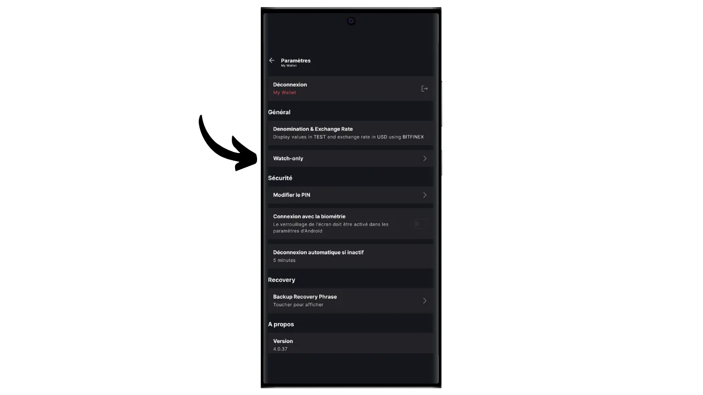

Du kan også endre PIN-koden for lommeboken og aktivere en biometrisk tilkobling.

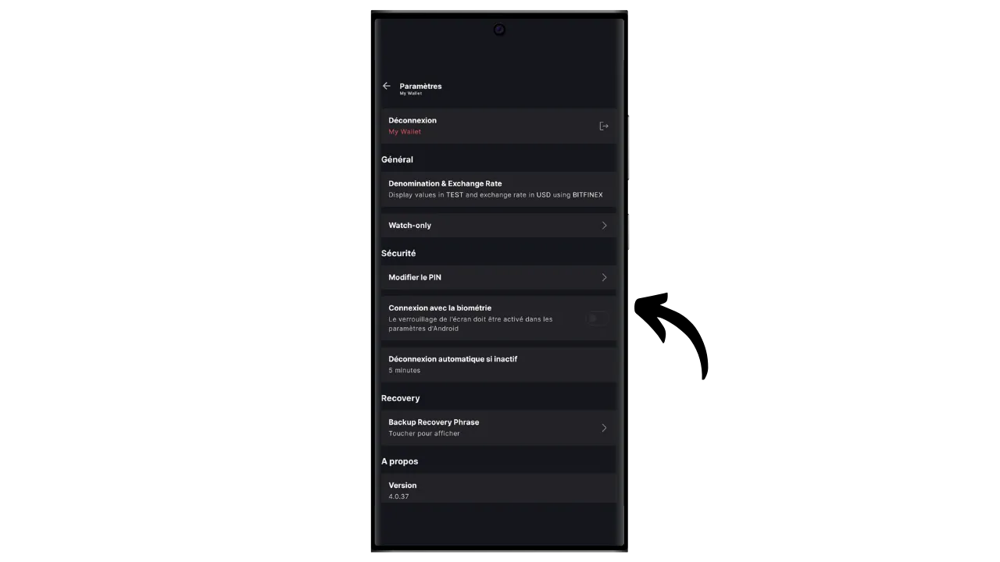

## Bruk av Blockstream Green

Nå som Bitcoin-lommeboken din er satt opp, er du klar til å motta dine første sats! Bare klikk på "*Motta*"-knappen.

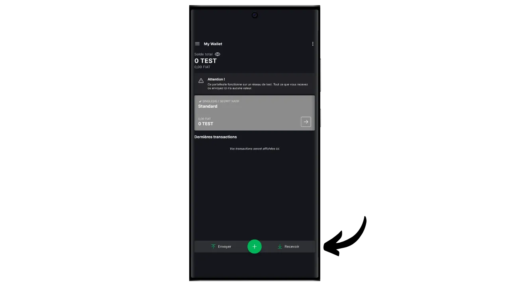

Green vil da vise den første tomme mottakeradressen i lommeboken din. Du kan enten skanne den tilhørende QR-koden, eller kopiere adressen direkte for å sende bitcoins. Denne typen adresse spesifiserer ikke beløpet som skal sendes av betaleren. Du kan imidlertid generere en adresse som ber om et bestemt beløp, ved å klikke på de tre små prikkene øverst i høyre hjørne, deretter på "*Forespør beløp*", og angi ønsket beløp.

Siden du bruker en Segwit v0-konto (BIP84), vil adressen din starte med `bc1q...`. I mitt eksempel bruker jeg en Testnet-portefølje, så prefikset er litt annerledes.

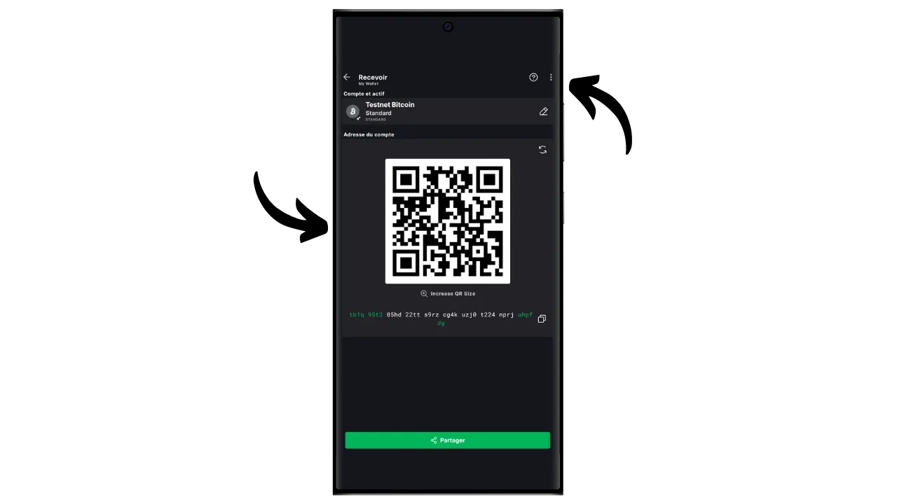

Når transaksjonen sendes ut i nettverket, vises den i lommeboken din.

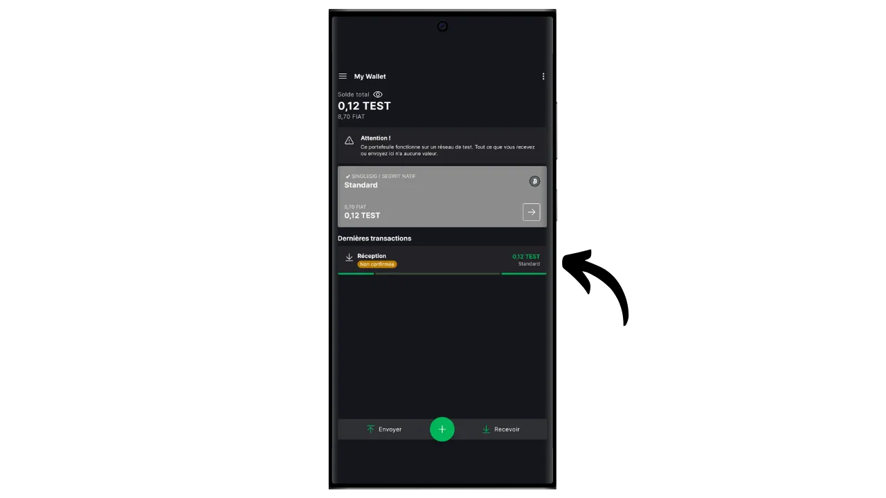

Vent til du har mottatt nok bekreftelser til å anse transaksjonen som endelig.

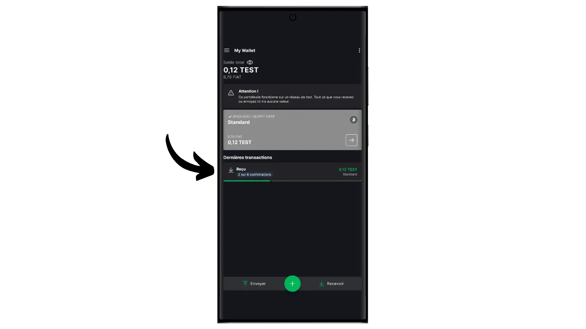

Med bitcoins i lommeboken din kan du nå også sende bitcoins. Klikk på "*Send*".

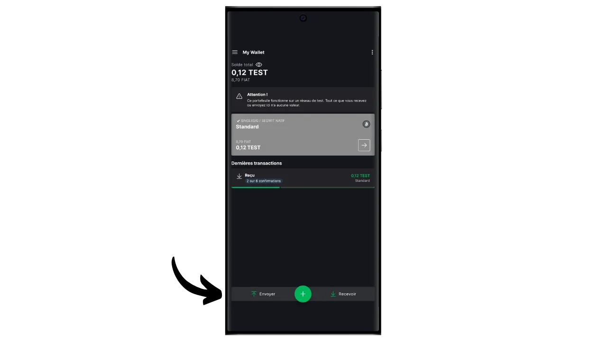

På neste side skriver du inn mottakerens adresse. Du kan skrive den inn manuelt eller skanne en QR-kode.

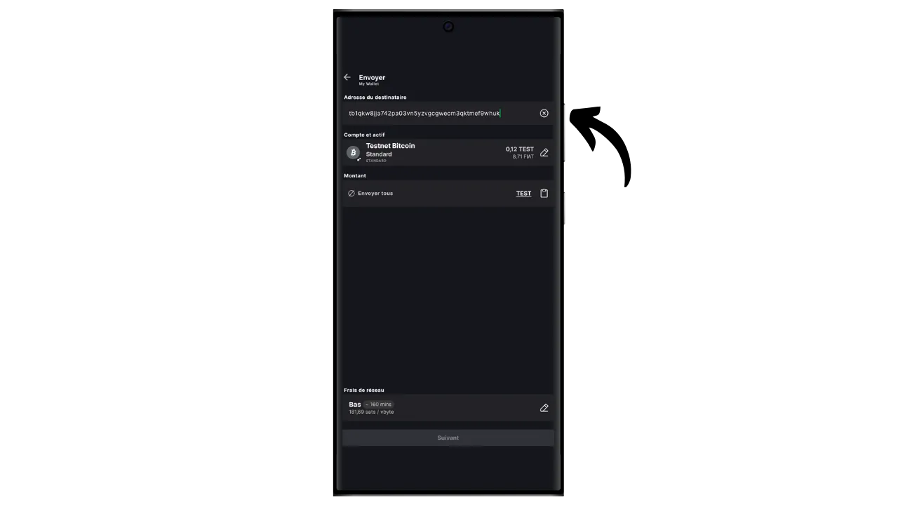

Velg betalingsbeløpet.

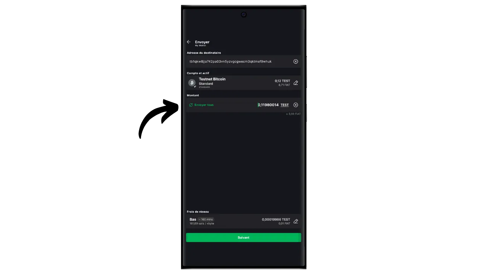

Nederst på skjermen kan du velge gebyrsats for denne transaksjonen. Du kan velge om du vil følge programmets anbefalinger eller tilpasse gebyrene selv. Jo høyere gebyret er i forhold til andre ventende transaksjoner, desto raskere vil transaksjonen bli behandlet. For informasjon om gebyrmarkedet, se [Mempool.space] (https://mempool.space/) i delen "*Transaksjonsgebyrer*".

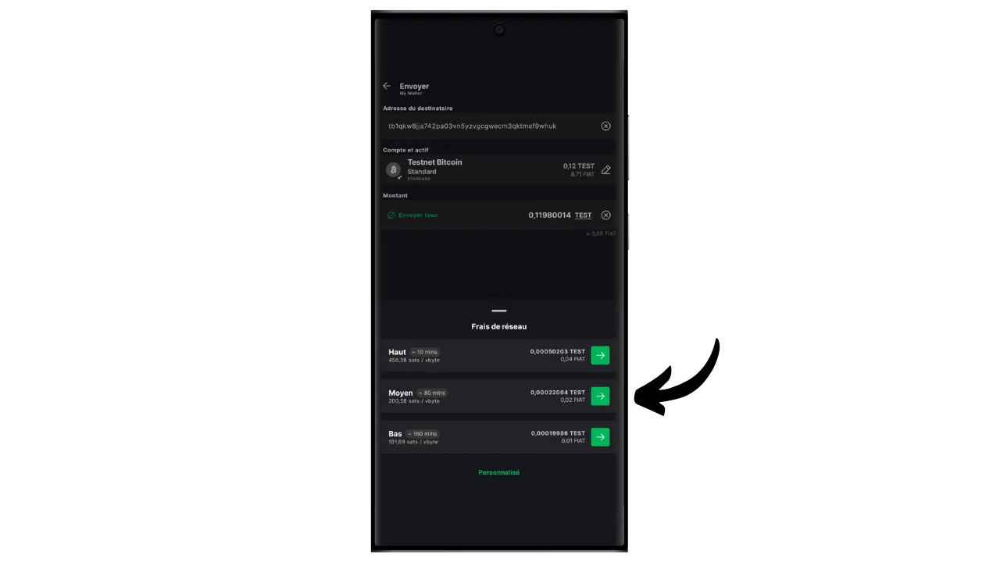

Klikk på "*Neste*" for å komme til skjermbildet med transaksjonsoversikten. Kontroller at adressen, beløpet og kostnadene er korrekte.

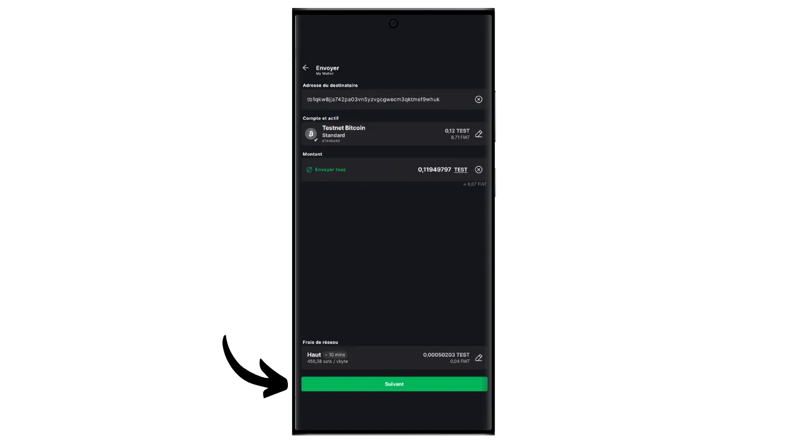

Hvis alt går bra, skyver du den grønne knappen nederst på skjermen til høyre for å signere og kringkaste transaksjonen på Bitcoin-nettverket.

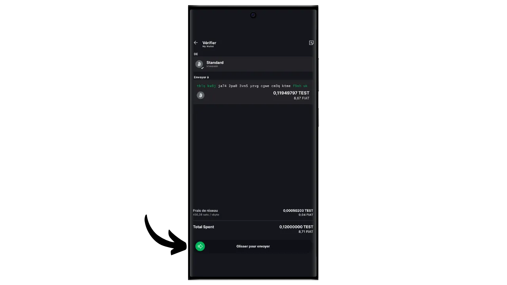

Transaksjonen vises nå på dashbordet i Bitcoin-lommeboken din, i påvente av bekreftelse.

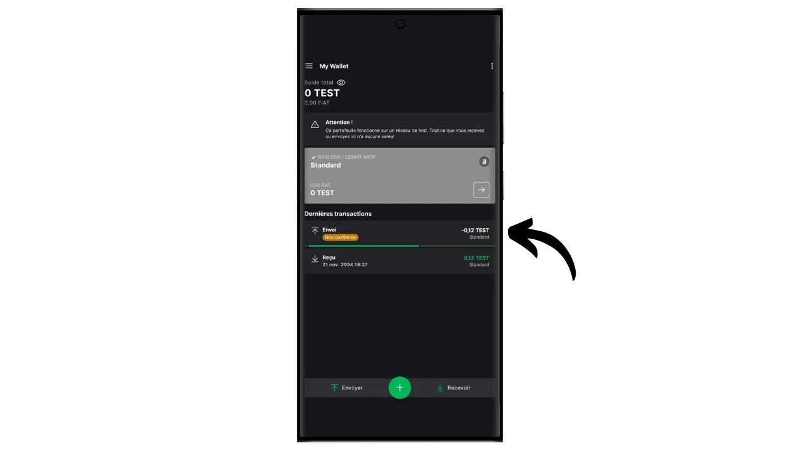

*Denne opplæringen er basert på [en originalversjon som tilhører Bitstack] (https://www.bitstack-app.com/blog/installer-portefeuille-bitcoin-green-wallet) skrevet av Loïc Morel. Bitstack er en fransk Bitcoin neo-bank som tilbyr muligheten til å spare i bitcoins, enten i DCA (Dollar Cost Averaging), eller via et automatisk avrundingssystem for daglige utgifter.* Bitstack er en fransk Bitcoin neo-bank som tilbyr muligheten til å spare i bitcoins, enten i DCA (Dollar Cost Averaging), eller via et automatisk avrundingssystem for daglige utgifter