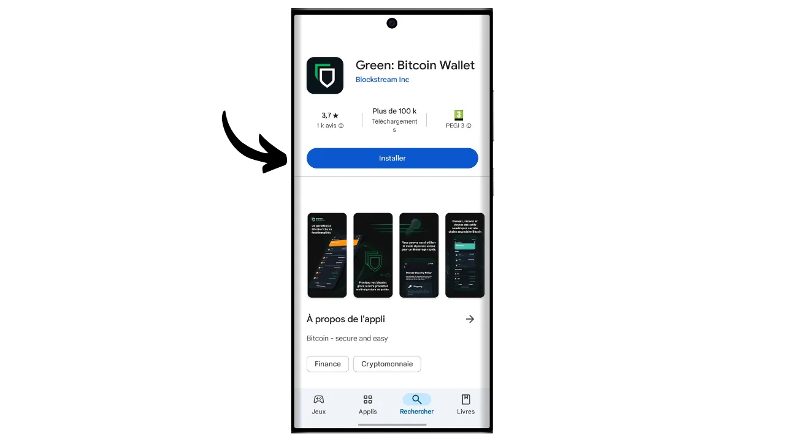
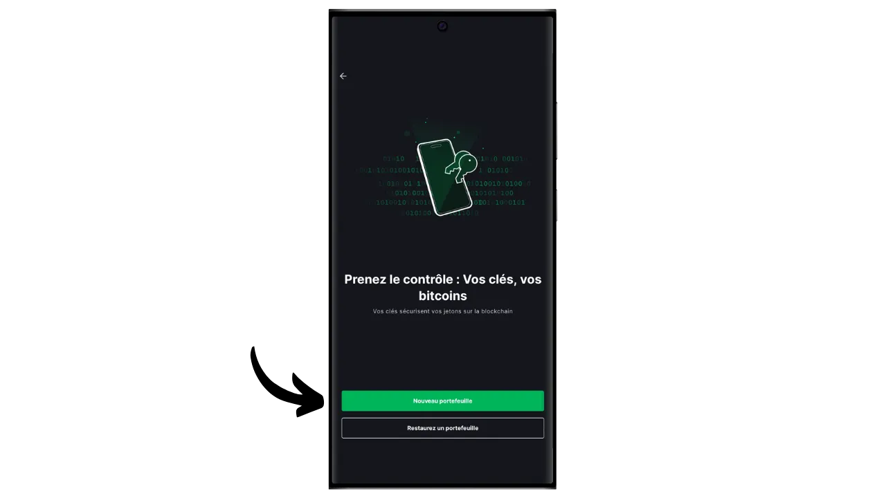
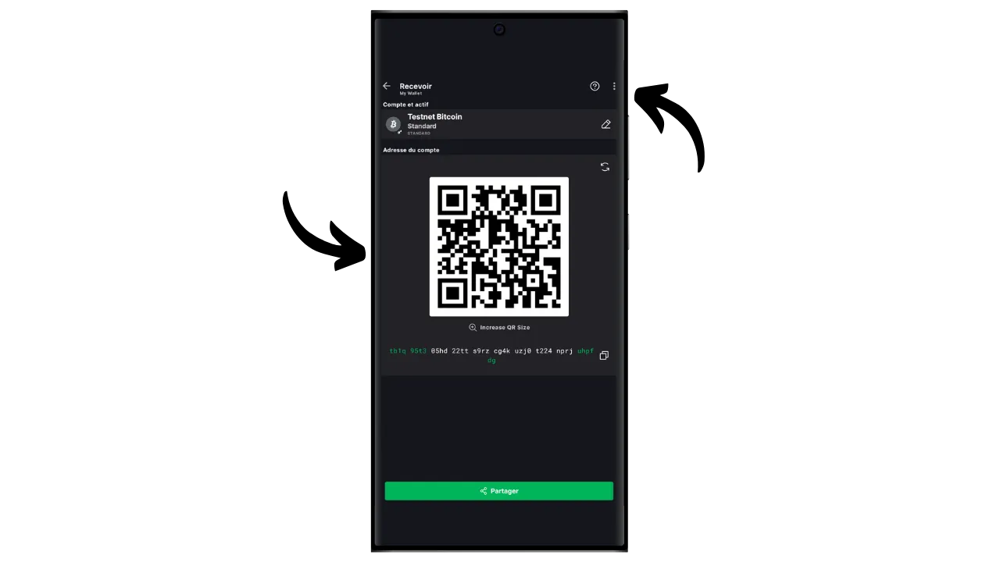
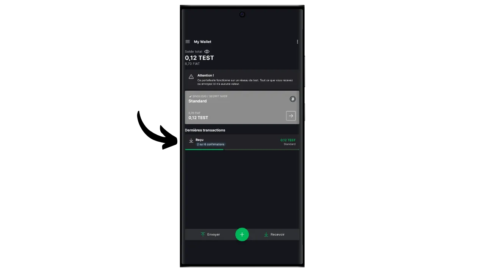

Uma carteira de software é uma aplicação instalada num computador, smartphone ou outro dispositivo ligado à Internet, que lhe permite gerir e proteger as suas chaves de carteira Bitcoin. Ao contrário das carteiras de hardware, que isolam as chaves privadas, as carteiras "quentes" funcionam, portanto, num ambiente potencialmente exposto a ciberataques, aumentando o risco de pirataria e roubo.

As carteiras de software devem ser utilizadas para gerir quantidades razoáveis de bitcoins, especialmente para transacções diárias. Podem também ser uma opção interessante para pessoas com activos bitcoin limitados, para quem o investimento numa carteira de hardware pode parecer desproporcionado. No entanto, a sua exposição constante à Internet torna-as menos seguras para armazenar as suas poupanças a longo prazo ou grandes fundos. Para estes últimos, é melhor optar por soluções mais seguras, como as carteiras de hardware.

Neste tutorial, gostaria de vos apresentar uma das melhores soluções de software para carteiras móveis: **Blockstream Green**.

Se quiser saber como utilizar o Blockstream Green no seu computador, consulte este outro tutorial:

https://planb.network/tutorials/wallet/desktop/blockstream-green-desktop-c1503adf-1404-4328-b814-aa97fcf0d5da
## Apresentação da Blockstream Green

A Blockstream Green é uma carteira de software disponível para telemóvel e computador. Anteriormente conhecida como *Green Address*, esta carteira tornou-se um projeto Blockstream após a sua aquisição em 2016.

Green é uma aplicação particularmente fácil de utilizar, o que a torna interessante para os principiantes. Oferece todas as caraterísticas essenciais de uma boa carteira Bitcoin, incluindo RBF (*Replace-by-Fee*), uma opção de ligação Tor, a possibilidade de ligar o seu próprio nó, SPV (*Simple Payment Verification*), marcação e controlo de moedas.

A Blockstream Green também suporta a rede Liquid, uma sidechain Bitcoin desenvolvida pela Blockstream para transacções rápidas e confidenciais fora da blockchain principal. Este tutorial foca exclusivamente no Bitcoin, mas um tutorial posterior cobrirá o uso do Liquid.

## Instalar e configurar a aplicação Blockstream Green

O primeiro passo é, obviamente, descarregar a aplicação Green. Aceda à sua loja de aplicações:

- [Para Android](https://play.google.com/store/apps/details?id=com.greenaddress.greenbits_android_wallet);
- [Para a Apple](https://apps.apple.com/us/app/green-bitcoin-wallet/id1402243590).

Para os utilizadores de Android, também é possível instalar a aplicação através do ficheiro `.apk` [disponível no GitHub da Blockstream] (https://github.com/Blockstream/green_android/releases).

Inicie a aplicação e selecione a caixa "Aceito as condições...*".

Quando abre o Green pela primeira vez, o ecrã inicial aparece sem um portefólio configurado. Mais tarde, se criar ou importar carteiras, estas aparecerão nesta interface. Antes de começar a criar uma carteira, aconselho-o a ajustar as definições da aplicação de acordo com as suas necessidades. Clique em "Definições da aplicação".

A opção "*Privacidade melhorada*", disponível apenas no Android, melhora a privacidade ao desativar as capturas de ecrã e ao ocultar as pré-visualizações de aplicações. Também bloqueia automaticamente o acesso a aplicações assim que o telefone é bloqueado, tornando os seus dados mais difíceis de expor.

Para aqueles que desejam melhorar a sua privacidade, a aplicação oferece a opção de enraizar o seu tráfego através do Tor, uma rede que encripta todas as suas ligações e torna as suas actividades difíceis de rastrear. Embora esta opção possa abrandar ligeiramente o funcionamento da aplicação, é altamente recomendada para proteger a sua privacidade, especialmente se não estiver a utilizar o seu próprio nó completo.

Para os utilizadores que possuem o seu próprio nó completo, a Green Wallet oferece a possibilidade de se ligarem a ele através de um servidor Electrum, garantindo um controlo total sobre as informações da rede Bitcoin e a distribuição das transacções.

Outra funcionalidade alternativa é a opção "*SPV Verification*", que permite verificar diretamente determinados dados da cadeia de blocos e, assim, reduzir a necessidade de confiar no nó predefinido da Blockstream, embora este método não ofereça todas as garantias de um nó completo.

Depois de ter ajustado estas definições às suas necessidades, clique no botão "*Guardar*" e reinicie a aplicação.

## Criar uma carteira Bitcoin na Blockstream Green

Agora está pronto para criar uma carteira Bitcoin. Clique no botão "*Get Started*".

Pode escolher entre criar uma carteira de software local ou gerir uma carteira fria através de uma carteira de hardware. Para este tutorial, vamos concentrar-nos na criação de uma hot wallet, pelo que terá de selecionar a opção "*Neste dispositivo*". Num futuro tutorial, mostrarei como utilizar a outra opção.

A opção "*Watch-only*", entretanto, permite-lhe importar uma chave pública alargada (`xpub`) para ver as transacções de uma carteira sem poder gastar os fundos associados, o que é útil para acompanhar uma carteira numa carteira de hardware, por exemplo.

Pode então optar por restaurar uma carteira Bitcoin existente ou criar uma nova. Para os propósitos deste tutorial, estaremos criando uma nova carteira. No entanto, se precisar de regenerar uma carteira Bitcoin existente a partir da sua frase mnemónica, por exemplo, após a perda da sua carteira de hardware, terá de escolher a segunda opção.

Pode então escolher entre uma frase mnemónica de 12 ou 24 palavras. Esta frase permitir-lhe-á recuperar o acesso à sua carteira a partir de qualquer software compatível, em caso de problema com o seu telemóvel. Atualmente, a escolha de uma frase de 24 palavras não oferece mais segurança do que uma frase de 12 palavras. Por isso, recomendo que escolha uma frase mnemónica de 12 palavras.

Green vai então fornecer-lhe a sua frase mnemónica. Antes de continuar, certifique-se de que não está a ser observado. Clique em "*Mostrar a frase de recuperação*" para a visualizar no ecrã.

**Esta mnemónica dá-lhe acesso total e irrestrito a todos os seus bitcoins ** Qualquer pessoa na posse desta mnemónica pode roubar os seus fundos, mesmo sem acesso físico ao seu telefone.

Restaura o acesso aos seus bitcoins em caso de perda, roubo ou quebra do seu telemóvel. Por isso, é muito importante fazer uma cópia de segurança cuidadosa **num suporte físico (não digital)** e guardá-la num local seguro. Pode escrevê-la num pedaço de papel ou, para maior segurança, se se tratar de uma carteira grande, recomendo gravá-la num suporte de aço inoxidável para a proteger do risco de incêndio, inundação ou desmoronamento (para uma carteira quente concebida para proteger uma pequena quantidade de bitcoins, uma simples cópia de segurança em papel é provavelmente suficiente).

*Obviamente, nunca deve partilhar estas palavras na Internet, como eu faço neste tutorial. Este exemplo de portefólio será utilizado apenas na Testnet e será eliminado no final do tutorial

Quando tiver gravado corretamente a sua frase mnemónica num suporte físico, clique em "*Continuar*". A Green Wallet pedir-lhe-á então que confirme algumas das palavras da sua frase mnemónica para se certificar de que as gravou corretamente. Preencha os espaços em branco com as palavras em falta.

Escolha o código PIN do seu dispositivo, que será utilizado para desbloquear a sua carteira verde. Esta é a sua proteção contra o acesso físico não autorizado. Este código PIN não está envolvido na derivação das chaves criptográficas da sua carteira. Assim, mesmo sem acesso a este código PIN, a posse da sua frase mnemónica de 12 ou 24 palavras permitir-lhe-á recuperar o acesso aos seus bitcoins.

Recomendamos que escolha um código PIN de 6 dígitos que seja o mais aleatório possível. Não se esqueça de guardar este código para não o esquecer, caso contrário, será obrigado a recuperar a sua carteira a partir da mnemónica. Pode então adicionar uma opção de bloqueio biométrico para evitar ter de introduzir o PIN sempre que a utilizar. De um modo geral, a biometria é muito menos segura do que o próprio PIN. Por isso, por defeito, aconselho-o a não configurar esta opção de desbloqueio.

Introduza o seu PIN uma segunda vez para o confirmar.

Aguarde que a sua carteira seja criada e, em seguida, clique no botão "*Criar uma conta*".

Pode então escolher entre uma carteira padrão de assinatura única, que utilizaremos neste tutorial, ou uma carteira protegida por autenticação de dois factores (2FA).

A opção 2FA no Green cria uma carteira 2/2 multisignature, com uma chave mantida pela Blockstream. Isto significa que, para efetuar uma transação, são necessárias as duas chaves: uma chave local protegida pelo seu código PIN no seu telemóvel e uma chave remota protegida pelo 2FA nos servidores da Blockstream. Em caso de perda de acesso ao 2FA ou de indisponibilidade dos serviços da Blockstream, os mecanismos de recuperação baseados em scripts de bloqueio de tempo garantem que os seus fundos podem ser recuperados de forma autónoma. Embora esta configuração reduza significativamente o risco de roubo dos seus bitcoins, é mais complexa de gerir e parcialmente dependente da Blockstream. Para este tutorial, vamos optar por uma carteira clássica de assinatura única, com as chaves armazenadas localmente no telemóvel.

A sua carteira Bitcoin foi agora criada utilizando a aplicação Green!

Antes de receberes os teus primeiros bitcoins na tua carteira, **aconselho-te vivamente a fazeres um teste de recuperação vazio**. Tome nota de algumas informações de referência, como o seu xpub ou o primeiro endereço de receção, e depois apague a sua carteira na aplicação Green enquanto ainda está vazia. Em seguida, tente restaurar a sua carteira na aplicação Green utilizando as suas cópias de segurança em papel. Verifique se as informações do cookie geradas após a restauração correspondem às que você anotou originalmente. Se corresponder, pode ter a certeza de que as suas cópias de segurança em papel são fiáveis. Para saber mais sobre como efetuar um teste de recuperação, consulte este outro tutorial:

https://planb.network/tutorials/wallet/backup/recovery-test-5a75db51-a6a1-4338-a02a-164a8d91b895
## Criar a sua carteira na Blockstream Green

Se pretender personalizar a sua carteira, clique nos três pequenos pontos no canto superior direito.

A opção "*Renomear*" permite-lhe personalizar o nome da sua carteira, o que é particularmente útil se gerir várias carteiras na mesma aplicação.

O menu "*Unidade*" permite-lhe alterar a unidade base da sua carteira. Por exemplo, pode escolher mostrá-la em satoshis em vez de bitcoins.

O menu "*Settings*" dá acesso às várias opções da sua carteira Bitcoin.

Aqui, por exemplo, encontrará a sua chave pública alargada e o seu *descritor*, útil se planear configurar uma carteira em modo só de vigilância a partir desta carteira.

Pode também alterar o PIN da sua carteira e ativar uma ligação biométrica.

## Utilização do Blockstream Green

Agora que a tua carteira Bitcoin está configurada, estás pronto para receber os teus primeiros sats! Basta clicar no botão "*Receber*".

Green mostrará então o primeiro endereço de receção em branco na sua carteira. Pode digitalizar o código QR associado ou copiar o endereço diretamente para enviar bitcoins. Este tipo de endereço não especifica o montante a ser enviado pelo pagador. Pode, no entanto, gerar um endereço que solicite um montante específico, clicando nos três pequenos pontos no canto superior direito, depois em "*Request amount*" e introduzindo o montante desejado.

Como está a utilizar uma conta Segwit v0 (BIP84), o seu endereço começará com `bc1q...`. No meu exemplo, estou a utilizar uma carteira Testnet, por isso o prefixo é ligeiramente diferente.

Quando a transação for transmitida na rede, aparecerá na sua carteira.

Aguarde até ter recebido confirmações suficientes para considerar a transação definitiva.

Com bitcoins na tua carteira, agora também podes enviar bitcoins. Clique em "*Enviar*".

Na página seguinte, introduza o endereço do destinatário. Pode introduzi-lo manualmente ou digitalizar um código QR.

Selecionar o montante do pagamento.

Na parte inferior do ecrã, pode selecionar a taxa de comissão para esta transação. Tem a opção de seguir as recomendações da aplicação ou de personalizar as suas taxas. Quanto mais elevada for a taxa em relação a outras transacções pendentes, mais rapidamente a sua transação será processada. Para obter informações sobre o mercado de comissões, visite [Mempool.space](https://mempool.space/) na secção "*Transaction Fees*".

Clique em "*Próximo*" para aceder ao ecrã de resumo da transação. Verifique se o endereço, o montante e os encargos estão corretos.

Se tudo correr bem, deslize o botão verde na parte inferior do ecrã para a direita para assinar e transmitir a transação na rede Bitcoin.

A sua transação aparecerá agora no painel de controlo da sua carteira Bitcoin, aguardando confirmação.

*Este tutorial é baseado em [uma versão original pertencente ao Bitstack](https://www.bitstack-app.com/blog/installer-portefeuille-bitcoin-green-wallet) escrito por Loïc Morel. O Bitstack é um neo-banco francês de Bitcoin que oferece a possibilidade de poupar em bitcoins, quer em DCA (Dollar Cost Averaging), quer através de um sistema de arredondamento automático para as despesas diárias.* O Bitstack é um neo-banco francês de Bitcoin que oferece a possibilidade de poupar em bitcoins, quer em DCA (Dollar Cost Averaging), quer através de um sistema de arredondamento automático para as despesas diárias