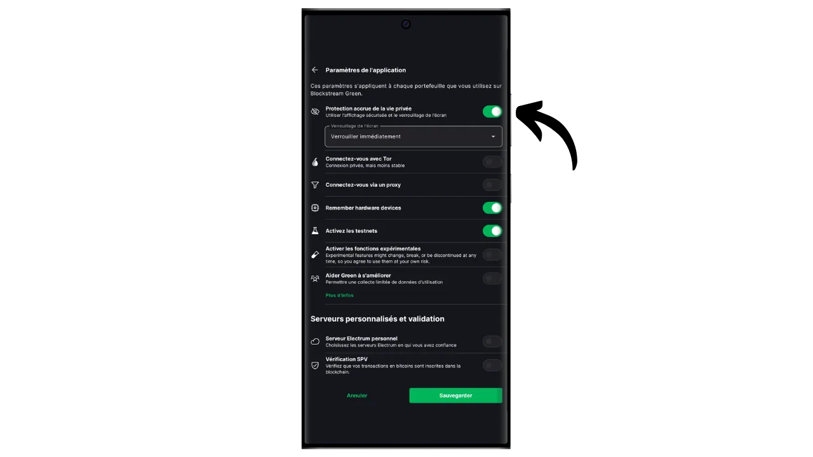
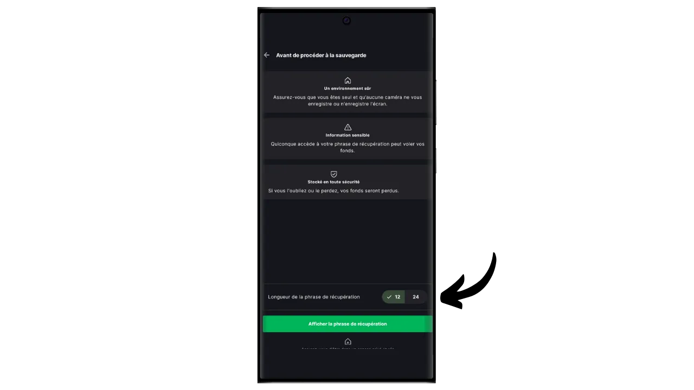

Программный кошелек - это приложение, устанавливаемое на компьютер, смартфон или другое подключенное к Интернету устройство, позволяющее управлять ключами кошелька Bitcoin и обеспечивать их безопасность. В отличие от аппаратных кошельков, которые изолируют приватные ключи, "горячие" кошельки работают в среде, потенциально подверженной кибератакам, что повышает риск пиратства и кражи.

Программные кошельки следует использовать для управления разумными суммами биткоинов, особенно для повседневных транзакций. Они также могут быть интересным вариантом для людей с ограниченными биткоин-активами, для которых инвестиции в аппаратный кошелек могут показаться несоразмерными. Однако постоянная связь с Интернетом делает их менее безопасными для хранения долгосрочных сбережений или крупных средств. Для последних лучше выбрать более надежные решения, такие как аппаратные кошельки.

В этом руководстве я хочу познакомить вас с одним из лучших решений для мобильных кошельков: **Blockstream Green**.

Если вы хотите узнать, как использовать Blockstream Green на своем компьютере, обратитесь к этому другому руководству:

https://planb.network/tutorials/wallet/desktop/blockstream-green-desktop-c1503adf-1404-4328-b814-aa97fcf0d5da
## Представляем блокчейн Green

Blockstream Green - это программный кошелек, доступный на мобильных и настольных компьютерах. Ранее известный как *Green Address*, этот кошелек стал проектом Blockstream после его приобретения в 2016 году.

Green - особенно простое в использовании приложение, что делает его интересным для новичков. Оно предлагает все основные функции хорошего биткойн-кошелька, включая RBF (*Replace-by-Fee*), возможность подключения через Tor, возможность подключения собственного узла, SPV (*Simple Payment Verification*), маркировку монет и управление ими.

Blockstream Green также поддерживает сеть Liquid - сайдчейн биткоина, разработанный компанией Blockstream для быстрых и конфиденциальных транзакций вне основного блокчейна. В этом руководстве рассматривается исключительно Биткойн, но в следующем руководстве будет рассказано об использовании Liquid.

## Установка и настройка приложения Blockstream Green

Первым делом, конечно же, нужно загрузить приложение Green. Перейдите в магазин приложений:

- [Для Android](https://play.google.com/store/apps/details?id=com.greenaddress.greenbits_android_wallet);
- [Для Apple] (https://apps.apple.com/us/app/green-bitcoin-wallet/id1402243590).

Пользователи Android также могут установить приложение с помощью файла `.apk` [доступен на GitHub компании Blockstream] (https://github.com/Blockstream/green_android/releases).

Запустите приложение, затем установите флажок "Я принимаю условия...*".

Когда вы открываете Green в первый раз, на главном экране не будет настроенного портфолио. В дальнейшем, если вы будете создавать или импортировать портфели, они будут появляться в этом интерфейсе. Прежде чем перейти к созданию портфеля, советую вам настроить параметры приложения под себя. Нажмите на "Настройки приложения".

Опция "*Улучшенная конфиденциальность*", доступная только на Android, повышает уровень конфиденциальности, отключая скриншоты и скрывая предварительный просмотр приложений. Кроме того, она автоматически блокирует доступ к приложениям, как только телефон заблокирован, что усложняет раскрытие данных.

Для тех, кто хочет повысить уровень конфиденциальности, в приложении предусмотрена возможность маршрутизации трафика через Tor - сеть, которая шифрует все ваши соединения и делает вашу деятельность трудноотслеживаемой. Хотя эта опция может несколько замедлить работу приложения, она настоятельно рекомендуется для защиты вашей конфиденциальности, особенно если вы не используете собственный полноценный узел.

Для пользователей, имеющих собственный полноценный узел, Green Wallet предлагает возможность подключения к нему через сервер Electrum, гарантируя полный контроль над информацией о сети Bitcoin и распределением транзакций.

Другой альтернативной функцией является опция "*SPV Verification*", которая позволяет напрямую проверить определенные данные блокчейна и тем самым уменьшить необходимость доверять узлу Blockstream по умолчанию, хотя этот метод не обеспечивает всех гарантий полноценного узла.

После того как вы настроите эти параметры в соответствии с вашими потребностями, нажмите на кнопку "*Сохранить*" и перезапустите приложение.

## Создайте кошелек Bitcoin на Blockstream Green

Теперь вы готовы к созданию кошелька Bitcoin. Нажмите на кнопку "*Начать*".

Вы можете выбрать между созданием локального программного кошелька и управлением холодным кошельком через аппаратный кошелек. В этом уроке мы сосредоточимся на создании горячего кошелька, поэтому вам нужно будет выбрать опцию "*На этом устройстве*". В одном из следующих уроков я покажу вам, как использовать другой вариант.

Опция "*Смотреть только*" позволяет импортировать расширенный открытый ключ (`xpub`) для просмотра транзакций портфеля без возможности тратить связанные с ним средства, что удобно, например, для отслеживания портфеля на аппаратном кошельке.

Затем вы можете выбрать восстановление существующего кошелька Bitcoin или создание нового. Для целей этого руководства мы будем создавать новый кошелек. Однако если вам нужно восстановить существующий кошелек Bitcoin из его мнемонической фразы, например после потери аппаратного кошелька, вам нужно будет выбрать второй вариант.

Затем вы можете выбрать мнемоническую фразу из 12 или 24 слов. Эта фраза позволит вам восстановить доступ к кошельку с помощью любого совместимого программного обеспечения в случае проблем с телефоном. В настоящее время выбор фразы из 24 слов не обеспечивает большей безопасности, чем фраза из 12 слов. Поэтому я рекомендую вам выбрать мнемоническую фразу из 12 слов.

После этого Грин сообщит вам мнемоническую фразу. Прежде чем продолжить, убедитесь, что за вами не наблюдают. Нажмите на кнопку "*Показать фразу восстановления*", чтобы вывести ее на экран.

**Эта мнемоника дает вам полный, неограниченный доступ ко всем вашим биткоинам ** Любой человек, владеющий этой мнемоникой, может украсть ваши средства, даже не имея физического доступа к вашему телефону.

Она восстанавливает доступ к вашим биткоинам в случае потери, кражи или поломки телефона. Поэтому очень важно тщательно создать резервную копию **на физическом носителе (не цифровом)** и хранить ее в надежном месте. Вы можете записать ее на листе бумаги, а для дополнительной безопасности, если это большой кошелек, я рекомендую выгравировать ее на подставке из нержавеющей стали, чтобы защитить ее от риска пожара, наводнения или обрушения (для горячего кошелька, предназначенного для хранения небольшого количества биткоинов, вероятно, будет достаточно простой бумажной резервной копии).

*Разумеется, вы никогда не должны делиться этими словами в Интернете, как это делаю я в этом учебнике. Этот образец портфолио будет использоваться только в Testnet и будет удален по окончании урока.*

После того как вы правильно записали свою мнемоническую фразу на физический носитель, нажмите "*Продолжить*". Затем Green Wallet попросит вас подтвердить некоторые слова в вашей мнемонической фразе, чтобы убедиться, что вы записали их правильно. Заполните пропуски недостающими словами.

Выберите PIN-код вашего устройства, который будет использоваться для разблокировки Green wallet. Это ваша защита от несанкционированного физического доступа. Этот PIN-код не участвует в создании криптографических ключей вашего кошелька. Поэтому, даже не имея доступа к этому PIN-коду, владение мнемонической фразой из 12 или 24 слов позволит вам восстановить доступ к своим биткоинам.

Мы рекомендуем выбрать 6-значный PIN-код, который должен быть как можно более случайным. Обязательно сохраните этот код, чтобы не забыть его, иначе вам придется восстанавливать кошелек по мнемонике. Вы можете добавить опцию биометрической блокировки, чтобы не вводить PIN-код при каждом использовании. Вообще говоря, биометрические данные гораздо менее безопасны, чем сам PIN-код. Поэтому по умолчанию я не советую устанавливать эту опцию разблокировки.

Введите PIN-код второй раз, чтобы подтвердить его.

Дождитесь создания портфолио, а затем нажмите на кнопку "*Создать учетную запись*".

Затем вы можете выбрать между стандартным кошельком с одной подписью, который мы будем использовать в этом руководстве, и кошельком, защищенным двухфакторной аутентификацией (2FA).

Опция 2FA в Green создает мультиподписной кошелек 2/2 с одним ключом, хранящимся в Blockstream. Это означает, что для проведения транзакции необходимы оба ключа: локальный ключ, защищенный PIN-кодом на вашем телефоне, и удаленный ключ, защищенный 2FA на серверах Blockstream. В случае потери доступа к 2FA или недоступности сервисов Blockstream механизмы восстановления, основанные на скриптах блокировки времени, гарантируют, что ваши средства могут быть восстановлены автономно. Хотя такая конфигурация значительно снижает риск кражи ваших биткоинов, она сложнее в управлении и частично зависит от Blockstream. В этом руководстве мы остановимся на классическом кошельке с одной подписью, ключи от которого хранятся локально на телефоне.

Теперь ваш кошелек Bitcoin создан с помощью приложения Green!

Прежде чем вы получите первые биткоины в свой кошелек, **я настоятельно рекомендую вам провести тест на восстановление пустого кошелька**. Запишите какую-нибудь справочную информацию, например, свой xpub или адрес первого получения, затем удалите кошелек в приложении Green, пока он еще пуст. Затем попробуйте восстановить кошелек в Green, используя свои бумажные резервные копии. Проверьте, совпадает ли информация cookie, полученная после восстановления, с той, которую вы записали изначально. Если совпадает, то вы можете быть уверены, что ваши бумажные резервные копии надежны. Чтобы узнать больше о том, как провести тестовое восстановление, обратитесь к другому руководству:

https://planb.network/tutorials/wallet/backup/recovery-test-5a75db51-a6a1-4338-a02a-164a8d91b895
## Настройка портфеля на Blockstream Green

Если вы хотите персонализировать свое портфолио, нажмите на три маленькие точки в правом верхнем углу.

Опция "*Переименовать*" позволяет настроить имя вашего портфеля, что особенно полезно, если вы управляете несколькими портфелями в одном приложении.

Меню "*Unit*" позволяет изменить базовую единицу вашего кошелька. Например, вы можете выбрать отображение в сатоши, а не в биткоинах.

Меню "*Настройки*" предоставляет доступ к различным опциям вашего кошелька Bitcoin.

Здесь, например, вы найдете свой расширенный открытый ключ и его *дескриптор*, который пригодится, если вы планируете создать кошелек в режиме watch-only с этого кошелька.

Вы также можете изменить PIN-код своего кошелька и активировать биометрическое соединение.

## Использование Blockstream Green

Теперь, когда ваш кошелек Bitcoin настроен, вы готовы получить свои первые саты! Просто нажмите на кнопку "*Получить*".

Затем зеленый цвет отобразит первый пустой адрес приема в вашем кошельке. Вы можете либо отсканировать соответствующий QR-код, либо скопировать адрес напрямую, чтобы отправить биткоины. В адресах этого типа не указывается сумма, которую должен отправить плательщик. Однако вы можете сгенерировать адрес, запрашивающий определенную сумму, нажав на три маленькие точки в правом верхнем углу, затем на "*Запросить сумму*" и введя желаемую сумму.

Поскольку вы используете аккаунт Segwit v0 (BIP84), ваш адрес будет начинаться с `bc1q...`. В моем примере я использую портфель Testnet, поэтому префикс немного отличается.

Когда транзакция будет транслироваться в сети, она появится в вашем кошельке.

Подождите, пока вы не получите достаточно подтверждений, чтобы считать сделку окончательной.

Имея биткоины в кошельке, вы теперь можете также отправлять биткоины. Нажмите на кнопку "*Отправить*".

На следующей странице введите адрес получателя. Вы можете ввести его вручную или отсканировать QR-код.

Выберите сумму платежа.

В нижней части экрана вы можете выбрать размер комиссии для данной операции. У вас есть выбор: следовать рекомендациям приложения или установить свою комиссию. Чем выше комиссия по отношению к другим ожидающим транзакциям, тем быстрее будет обработана ваша транзакция. Информацию о рынке комиссий можно найти на сайте [Mempool.space](https://mempool.space/) в разделе "*Транзакционные сборы*".

Нажмите "*Следующее*", чтобы перейти к экрану сводки транзакций. Проверьте правильность адреса, суммы и расходов.

Если все прошло успешно, сдвиньте зеленую кнопку в нижней части экрана вправо, чтобы подписать и транслировать транзакцию в сети Bitcoin.

Теперь ваша транзакция появится на панели вашего кошелька Bitcoin и будет ожидать подтверждения.

*Этот учебник основан на [оригинальной версии, принадлежащей Bitstack](https://www.bitstack-app.com/blog/installer-portefeuille-bitcoin-green-wallet), написанной Лоиком Морелем. Bitstack - это французский биткоин-необанк, который предлагает возможность экономить в биткоинах, либо в DCA (Dollar Cost Averaging), либо через систему автоматического округления для ежедневных расходов.* Bitstack - это французский биткоин-необанк, который предлагает возможность экономить в биткоинах, либо в DCA (Dollar Cost Averaging), либо через систему автоматического округления для ежедневных расходов