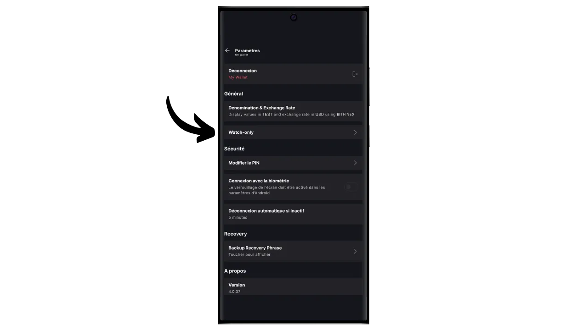
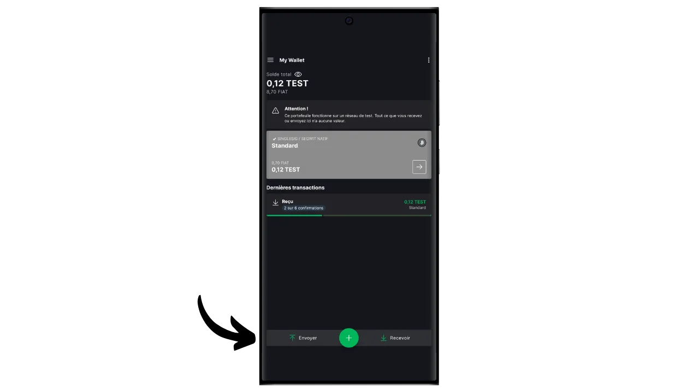

软件钱包是安装在电脑、智能手机或其他联网设备上的应用程序，使您能够管理和保护您的比特币钱包密钥。与隔离私人密钥的硬件钱包不同，"热 "钱包的运行环境可能会受到网络攻击，从而增加盗版和盗窃的风险。

软件钱包应用于管理合理数量的比特币，尤其是日常交易。对于比特币资产有限的人来说，软件钱包也是一个有趣的选择。不过，硬件钱包经常暴露在互联网上，对于存储长期储蓄或大额资金来说，安全性较低。对于后者，最好选择更安全的解决方案，如硬件钱包。

在本教程中，我将向您介绍最好的手机软件钱包解决方案之一： **Blockstream Green**。

如果您想了解如何在电脑上使用 Blockstream Green，请参阅本教程：

https://planb.network/tutorials/wallet/desktop/blockstream-green-desktop-c1503adf-1404-4328-b814-aa97fcf0d5da
## 绿色 Blockstream 介绍

Blockstream Green是一款软件钱包，可在移动端和桌面端使用。该钱包前身为*Green Address*，在2016年被收购后成为Blockstream项目。

Green 是一款特别简单易用的应用程序，这使它对初学者很有吸引力。它提供了优秀比特币钱包的所有基本功能，包括 RBF（*收费替换*）、Tor 连接选项、连接自己的节点、SPV（*简单支付验证*）、硬币标记和控制。

Blockstream Green 还支持 Liquid 网络，这是 Blockstream 为在主区块链之外进行快速、保密交易而开发的比特币侧链。本教程只关注比特币，但稍后的教程将介绍液体的使用。

## 安装和配置 Blockstream Green 应用程序

第一步当然是下载绿色应用程序。前往应用程序商店：

- [Android版](https://play.google.com/store/apps/details?id=com.greenaddress.greenbits_android_wallet)；
- [苹果公司](https://apps.apple.com/us/app/green-bitcoin-wallet/id1402243590)。

对于安卓用户，您也可以通过`.apk`文件[可在 Blockstream 的 GitHub 上获取](https://github.com/Blockstream/green_android/releases)安装应用程序。

启动应用程序，然后勾选 "我接受条件...*"框。

首次打开 Green 时，主屏幕上不会出现已配置的投资组合。之后，如果创建或导入投资组合，它们就会出现在这个界面中。在创建投资组合之前，我建议你调整应用程序设置，以满足自己的需要。点击 "应用程序设置"。

仅适用于 Android 系统的 "*增强隐私*"选项可通过禁用屏幕截图和隐藏应用程序预览来增强隐私。一旦手机被锁定，它还会自动锁定应用程序的访问权限，使你的数据更难暴露。

对于那些希望加强隐私保护的用户，程序提供了通过 Tor（一个对所有连接进行加密的网络，使你的活动难以被追踪）根植流量的选项。虽然该选项可能会略微减慢程序的运行速度，但我们还是强烈建议你使用该选项来保护自己的隐私，尤其是当你不使用自己的完整节点时。

对于拥有自己完整节点的用户，绿色钱包提供通过 Electrum 服务器与之连接的可能性，从而保证对比特币网络信息和交易分配的完全控制。

另一个替代功能是 "*SPV 验证*"选项，它允许您直接验证某些区块链数据，从而减少对 Blockstream 默认节点的信任，不过这种方法并不能提供完整节点的所有保证。

根据需要调整这些设置后，点击 "*保存*"按钮并重新启动应用程序。

## 在 Blockstream Green 上创建比特币钱包

现在您可以创建一个比特币钱包了。点击 "*开始*"按钮。

您可以选择创建本地软件钱包或通过硬件钱包管理冷钱包。在本教程中，我们将专注于创建热钱包，因此你需要选择 "*在此设备上*"选项。在今后的教程中，我将向你展示如何使用其他选项。

同时，"*仅查看*"选项允许你导入一个扩展公钥（"xpub"）来查看投资组合的交易，但不能使用相关资金，例如，这对于跟踪硬件钱包上的投资组合非常方便。

然后，你可以选择恢复现有的比特币钱包或创建一个新钱包。在本教程中，我们将创建一个新钱包。但是，如果您需要从现有比特币钱包的记忆短语中重新生成一个比特币钱包，例如在丢失硬件钱包后，您需要选择第二个选项。

然后，您可以选择 12 个字或 24 个字的记忆短语。如果您的手机出现问题，这个短语可以让您通过任何兼容软件恢复对钱包的访问。目前，选择 24 个字的短语并不比 12 个字的短语更安全。因此，我建议您选择 12 个字的记忆短语。

然后，绿色将为您提供记忆短语。在继续之前，请确保您没有被监视。点击 "*显示恢复短语*"将其显示在屏幕上。

**本记忆法可让您完全不受限制地访问您的所有比特币 ** 任何拥有本记忆法的人都可以盗取您的资金，即使无法实际访问您的手机。

在手机丢失、被盗或损坏的情况下，它可以恢复对比特币的访问。因此，在物理介质（而非数字介质）**上仔细备份并将其存放在安全的地方非常重要。你可以把它写在一张纸上，或者为了增加安全性，如果这是一个大型钱包，我建议把它刻在一个不锈钢支架上，以防止火灾、水灾或倒塌的风险（对于旨在保护少量比特币的热钱包，简单的纸质备份可能就足够了）。

*显然，您绝不能像我在本教程中所做的那样，在互联网上分享这些文字。这个样本作品集将仅在 Testnet 上使用，并将在本教程结束后删除。

在物理介质上正确记录记忆短语后，点击 "*继续*"。然后，绿色钱包会要求您确认记忆短语中的一些单词，以确保您正确记录了这些单词。在空白处填上缺失的单词。

选择设备的 PIN 码，用于解锁绿色钱包。这可以防止未经授权的物理访问。该 PIN 码不参与钱包加密密钥的生成。因此，即使无法获得 PIN 码，只要拥有 12 或 24 个字的记忆短语，就可以重新获得比特币。

我们建议您选择一个尽可能随机的 6 位数 PIN 码。请务必保存好这个密码，以免忘记，否则就只能通过助记符找回钱包了。然后，您可以添加生物识别拦截选项，避免每次使用时都要输入 PIN 码。一般来说，生物识别技术的安全性远远低于 PIN 码本身。因此，在默认情况下，我建议你不要设置这个解锁选项。

再次输入密码确认。

等待您的投资组合创建完成，然后点击 "*创建账户*"按钮。

然后，您可以选择本教程中使用的标准单签名钱包，或受双因素身份验证（2FA）保护的钱包。

Green 上的 2FA 选项可创建一个 2/2 多重签名钱包，其中一个密钥由 Blockstream 持有。这意味着要进行交易，需要两把密钥：一把是由您手机上的 PIN 码保护的本地密钥，另一把是由 Blockstream 服务器上的 2FA 保护的远程密钥。如果无法访问 2FA 或 Blockstream 服务无法使用，基于时间锁定脚本的恢复机制可确保您的资金自主恢复。虽然这种配置大大降低了比特币被盗的风险，但管理起来比较复杂，而且部分依赖于 Blockstream。在本教程中，我们将选择经典的单签名钱包，密钥存储在手机本地。

您的比特币钱包已使用绿色应用程序创建！

在您的钱包收到第一个比特币之前，**我强烈建议您进行一次空钱包恢复测试**。记下一些参考信息，如您的 xpub 或第一个接收地址，然后在 Green 应用程序上删除您的钱包，此时钱包还是空的。然后尝试使用纸质备份在 Green 上恢复钱包。检查还原后生成的 cookie 信息是否与您最初写下的信息一致。如果吻合，您就可以放心，您的纸质备份是可靠的。要了解有关如何进行测试恢复的更多信息，请参阅本教程：

https://planb.network/tutorials/wallet/backup/recovery-test-5a75db51-a6a1-4338-a02a-164a8d91b895
## 在 Blockstream Green 上建立您的投资组合

如果您想个性化您的作品集，请点击右上角的三个小圆点。

通过 "*Rename*"（重命名）选项，您可以自定义投资组合的名称，如果您在同一个应用程序中管理多个投资组合，这个选项尤其有用。

通过 "*单位*"菜单，您可以更改钱包的基本单位。例如，您可以选择用卫星币而不是比特币显示。

通过 "*设置*"菜单可以访问比特币钱包的各种选项。

例如，您可以在这里找到您的扩展公钥及其*描述符*，如果您打算用这个钱包在只看管模式下设置一个钱包，这对您很有用。

您还可以更改钱包密码和激活生物识别连接。

## 使用绿色 Blockstream

现在，您的比特币钱包已经设置完毕，可以开始接收第一笔比特币了！只需点击 "*接收*"按钮。

然后，绿色将显示钱包中的第一个空白接收地址。您可以扫描相关的二维码，或直接复制地址来发送比特币。这种地址不指定付款人要发送的金额。不过，您可以通过点击右上角的三个小圆点，然后点击 "*请求金额*"，并输入所需的金额，生成一个请求特定金额的地址。

由于您使用的是 Segwit v0 账户 (BIP84)，您的地址将以 `bc1q...` 开头。在我的例子中，我使用的是 Testnet 投资组合，所以前缀略有不同。

交易在网络上广播后，就会出现在您的钱包中。

等到收到足够多的确认信息后，再确定交易。

钱包里有了比特币，现在还可以发送比特币。点击 "*发送*"。

在下一页，输入收件人地址。您可以手动输入或扫描二维码。

选择付款金额。

在屏幕底部，您可以选择该交易的费率。您可以选择按照应用程序的建议或自定义收费。与其他待处理交易相比，费用越高，交易处理速度越快。有关费用市场信息，请访问 [Mempool.space](https://mempool.space/) 中的 "*交易费用*"部分。

点击 "*下一步*"进入交易摘要屏幕。检查地址、金额和费用是否正确。

如果一切顺利，将屏幕底部的绿色按钮向右滑动，即可在比特币网络上签署并广播交易。

您的交易将显示在比特币钱包仪表板上，等待确认。

*本教程基于 Loïc Morel 编写的 [属于 Bitstack 的原始版本](https://www.bitstack-app.com/blog/installer-portefeuille-bitcoin-green-wallet)。Bitstack 是一个法国的比特币新银行，提供以 DCA（美元成本平均法）或通过自动四舍五入系统为日常开支储蓄比特币的可能性。