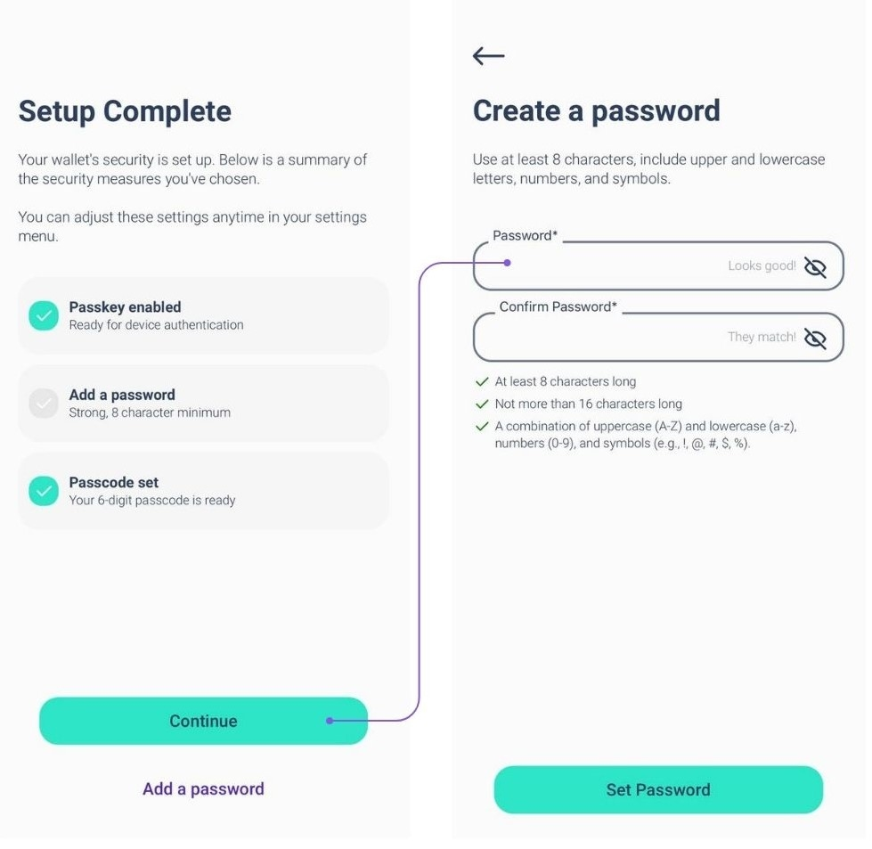

Elysium Wallet on Šveitsi idufirma Elysium Labs esimene mittekohustuslik tarkvaraline rahakott.

Tänu uuenduslikule võtmehaldussüsteemile saate juurdepääsu oma digitaalsetele varadele, kasutades elemente, mis on osa igapäevaelust: kasutajanimi, pääsukood, salasõna või pääsukood.

See on õige: enam ei ole rangelt vajalik kasutada seemnefraasi, et taastada juurdepääs oma digitaalsetele varadele.

Selline lihtsustamine võib kiirendada Bitcoini levikut kogu maailmas.

## Kuidas avada konto?

Lae alla Elysium Wallet App Apple Store'ist või Google Play'st.

Avage oma seadmesse alla laaditud rakendus Elysium Wallet.

Puudutage valikut "Loo uus rahakott".

Ilmub ekraan kasutustingimustega.

Konto loomisega nõustumiseks ja selle jätkamiseks koputage nuppu "Alusta seadistamist".

Sisestage oma kasutajanimi.

Profiilipilt on kohandatav: valige üks etteantud võimalustest, tehke foto või laadige pilt oma seadmest üles.

Kui olete valinud, koputage nuppu "Jätka".

Elysium paistab silma uuendusliku mitmefaktorilise algoritmi poolest, mis ühendab endas Passkey, PassCode ja PassWord.

PassKeys on kohustuslik.

Need võimaldavad teil autentida end kiiresti ja turvaliselt, kasutades oma seadme sisseehitatud turvafunktsioone, näiteks Face ID või sõrmejälje skaneerimist.

Need on teie peamine kaitsekiht, mis tagab kiire ja turvalise juurdepääsu.

Valige oma teine tase: PassCode või PassWord

Järgmisena peate valima teise turvataseme:

- PassCode: 6-kohaline kood, mida on lihtne meeles pidada. Sobib suurepäraselt täiendava kaitsekihi lisamiseks.
- Parool: Looge tugev, vähemalt 8-täheline parool, mis lisab veelgi rohkem turvalisust.
Te peate kasutama Passkey'd koos PassCode'i või PassWord'iga.

Märkus: Konto loomiseks on vaja vähemalt 2 tegurit, millest üks peab olema Passkey.

Turvalisuse täiendavaks suurendamiseks saate lisada kolmanda kaitsekihi (Passkey + PassCode + PassWord).

Kihtide kombinatsioon maksimaalse turvalisuse tagamiseks

Te kasutate alati Passkey't kui esmast tegurit. Teise kihi jaoks valige PassCode või PassWord.

Kui olete valinud teise tegurina PassCode, saate lisada kolmandaks kihiks PassWord või vastupidi. Selline paindlik lähenemisviis tagab, et teie varad on kaitstud vastavalt teie eelistustele.

Kolmanda turvateguri saate lisada seadistamisetapis (vt pilte) või hiljem, valides Seaded > Turvalisuse parandamine.

Kui te siiski unustate ühe teguri, siis võtke seda arvesse:

Kui olete seadistanud kõik kolm tegurit, saate neid alati seadetest muuta või lähtestada.

Kahjuks, kui olete seadistanud ainult kaks tegurit ja unustate ühe, ei ole taastamise võimalust.

Soovitame tungivalt seadistada kõik kolm tegurit algusest peale, et tagada maksimaalne turvalisus ja paindlikkus.

## Kuidas saada tehingut?

Samm 1: Avage Elysiumi rakendus ja minge peamenüüsse. Puudutage valikut "Receive".

Nüüd valige ahel, mille alusel soovite makseid saada (Bitcoin või Polygon), ja saate lihtsalt jagada oma Elysiumi rahakoti QR-koodi isikuga, kes peab teile maksma, ja nad hoolitsevad ülejäänud eest.

## Kuidas saada tehingut Lightning Networkis?

STEP 1: Puudutades valikut "Makse taotlemine", taotlete Bitcoini makset Lightning Networki kaudu.

2. samm: Sisestage summa, mida soovite taotleda, valige valuuta, mida soovite saada, ja lisage vajaduse korral kirjeldus.

Märkus: esimese Lightning Network (LN) makse eest tuleb maksta väike tasu LN-kanali avamiseks. Pärast seda on kõik järgmised maksed tasuta.

## Kuidas saata tehingut?

STEP 1: Minge peamenüüsse ja koputage valikut "Saada".

2. samm: Skaneerige saaja QR-kood tema Elysium Walletist, et salvestada tema kontakt automaatselt oma aadressiraamatusse.

Teise võimalusena kopeeri nende aadress käsitsi ja kleebi see saaja väljale.

Pärast saaja valimist või tema lisamist oma aadressiraamatusse koputage valikut "Saada makse".

Kas kontakt on juba olemas? Valige see otse aadressiraamatust.

3. samm: Sisestage summa, mida soovite saata, ja valige vara, mida soovite üle kanda.

BTC tehingute puhul saate valida oma eelistatud võrgu kiiruse ja tasud (nagu on näidatud kolmandal pildil)

Teie tehing on esitatud! Saate hõlpsasti kontrollida oma Elysium Walleti ajakohastatud saldot ja tehingu staatust.

## Kuidas saata tehingut Lightning Networkis (LN)?

STEP 1: Koputage skanneri avamiseks valikut "Skaneeri".

2. samm: skaneeri LN QR-kood maksmiseks.

STEP3: Vaadake makse üksikasjad üle ja kinnitage, et kõik on õige.

STEP4: Tehingu lõpuleviimiseks puudutage valikut "Kinnita".

## Kuidas näha Seed Phrase?

Minge peamenüüsse ja koputage valikut "Keskus". Valige Seaded ja koputage valikut "Extract private key".

Logige sisse oma parooliga ja sisestage oma parool ja/või paroolikood.

Seemne fraas kuvatakse 24 sõna formaadis.

Ära jaga seda kellegagi!

## Kuidas võtta ühendust klienditoega?

Kas vajate abi Elysium Walletiga? Me oleme siin, et aidata!

Lae rakendus alla.

Nii saate meie klienditoe meeskonnaga otse rakendusest ühendust võtta:

1. Mine keskusesse

2. Puudutage valikut Seaded

3. Valige Abi

Ilmub vorm, kus saate kirjeldada tekkinud probleemi.

Kui te olete selle esitanud, vastab meie meeskond võimalikult kiiresti lahendusega!

Kui soovite veast teatada või meile tagasisidet anda, klõpsake kodulehe vidinale:

