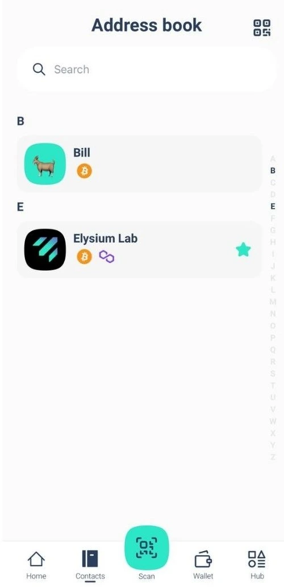

Elysium Wallet on sveitsiläisen startup-yrityksen Elysium Labsin ensimmäinen ei-hallinnollinen ohjelmistolompakko.

Innovatiivisen avaintenhallintajärjestelmän ansiosta voit käyttää digitaalista omaisuuttasi jokapäiväiseen elämään kuuluvilla elementeillä: käyttäjätunnuksella, salasanalla, salasanalla tai salasanalla.

Aivan oikein: enää ei ole ehdottoman välttämätöntä käyttää siemenlauseketta, jotta digitaaliseen omaisuuteesi pääsee käsiksi.

Tämä yksinkertaistaminen voisi nopeuttaa Bitcoinin leviämistä ympäri maailmaa.

## Miten avata tili?

Lataa Elysium Wallet -sovellus Apple Storesta tai Google Playsta.

Avaa laitteeseesi lataamasi Elysium Wallet -sovellus.

Napauta "Luo uusi lompakko".

Näyttöön tulee käyttöehdot sisältävä ruutu.

Hyväksy ja jatka tilin luomista napauttamalla "Aloita asetukset".

Kirjoita käyttäjätunnuksesi.

Profiilikuva on muokattavissa: voit valita sen annetuista vaihtoehdoista ottamalla valokuvan tai lataamalla kuvan laitteestasi.

Kun olet valinnut, napauta "Jatka".

Elysium erottuu innovatiivisella monitekijäalgoritmillaan, jossa yhdistyvät Passkey, PassCode ja PassWord.

PassKeys on pakollinen.

Niiden avulla voit todentaa henkilöllisyytesi nopeasti ja turvallisesti käyttämällä laitteesi sisäänrakennettuja suojausominaisuuksia, kuten Face ID:tä tai sormenjälkilaskentaa.

Ne ovat tärkein suojakerroksesi, joka takaa nopean ja turvallisen pääsyn.

Valitse toinen taso: PassCode tai PassWord

Seuraavaksi sinun on valittava toinen turvallisuustaso:

- PassCode: 6-numeroinen koodi, joka on helppo muistaa. Täydellinen lisäsuojan lisäämiseen.
- Salasana: Luo vahva, vähintään 8 merkkiä sisältävä salasana, joka lisää turvallisuutta entisestään.
Passkeyta on käytettävä yhdessä PassCoden tai PassWordin kanssa.

Huomautus: Tilin määrittämiseen tarvitaan vähintään kaksi tekijää, joista toisen on oltava Passkey.

Voit lisätä turvallisuutta entisestään lisäämällä kolmannen suojauskerroksen (Passkey + PassCode + PassWord).

Kerrosten yhdistelmä maksimaalista turvallisuutta varten

Käytät aina Passkeyta ensisijaisena tekijänä. Valitse toiseksi kerrokseksi PassCode tai PassWord.

Jos olet valinnut PassCoden toiseksi tekijäksi, voit lisätä PassWordin kolmanneksi kerrokseksi tai päinvastoin. Tämä joustava lähestymistapa varmistaa, että omaisuutesi suojataan mieltymystesi mukaisesti.

Voit lisätä kolmannen suojaustekijän asennusvaiheessa (katso kuvat) tai myöhemmin valitsemalla Asetukset > Paranna suojausta.

Jos kuitenkin unohdat yhden tekijöistä, ota se huomioon:

Jos olet määrittänyt kaikki kolme tekijää, voit aina muuttaa tai nollata ne asetuksista.

Jos olet määrittänyt vain kaksi tekijää ja unohdat toisen, palautusvaihtoehtoa ei valitettavasti ole.

Suosittelemme vahvasti kaikkien kolmen tekijän määrittämistä alusta alkaen, jotta turvallisuus ja joustavuus olisivat mahdollisimman hyvät.

## Miten vastaanottaa maksutapahtuma?

Vaihe 1: Avaa Elysium-sovellus ja siirry päävalikkoon. Napauta "Vastaanota".

Valitse nyt ketju, jossa haluat vastaanottaa maksun (Bitcoin tai Polygon), ja voit yksinkertaisesti jakaa Elysium-lompakkosi QR-koodin sen henkilön kanssa, joka haluaa maksaa sinulle, ja hän hoitaa loput.

## Miten vastaanottaa transaktio Lightning-verkossa?

VAIHE 1: Napauttamalla "Pyydä maksua" pyydät Bitcoin-maksua Lightning Networkin kautta.

Vaihe 2: Kirjoita summa, jonka haluat pyytää, valitse haluamasi valuutta ja lisää tarvittaessa kuvaus.

Huomautus: Ensimmäisestä Lightning Network (LN) -maksusta peritään pieni maksu LN-kanavan avaamiseksi. Sen jälkeen kaikki seuraavat maksut ovat ilmaisia.

## Miten lähetän tapahtuman?

VAIHE 1: Siirry päävalikkoon ja napauta "Lähetä".

VAIHE 2: Skannaa vastaanottajan QR-koodi hänen Elysium Walletistaan tallentaaksesi hänen yhteystietonsa automaattisesti osoitekirjaasi.

Vaihtoehtoisesti voit kopioida heidän osoitteensa manuaalisesti ja liittää sen vastaanottajakenttään.

Kun olet valinnut vastaanottajan tai lisännyt hänet osoitekirjaasi, napauta "Lähetä maksu".

Onko sinulla jo yhteyshenkilö? Valitse se suoraan osoitekirjasta.

VAIHE 3: Kirjoita summa, jonka haluat lähettää, ja valitse siirrettävä omaisuuserä.

BTC-transaktioita varten voit valita haluamasi verkon nopeuden ja maksut (kuten kolmannessa kuvassa näkyy)

Tapahtumasi on lähetetty! Voit helposti tarkistaa Elysium-lompakkosi päivitetyn saldon ja tapahtuman tilan.

## Miten lähetän tapahtuman Lightning Networkissa (LN)?

VAIHE 1: Avaa skanneri napauttamalla "Skannaa".

VAIHE 2: Skannaa LN:n QR-koodi maksua varten.

STEP3: Tarkista maksutiedot ja varmista, että kaikki on oikein.

VAIHE 4: Suorita maksutapahtuma loppuun napauttamalla "Vahvista".

## Miten nähdä siemenlause?

Siirry päävalikkoon ja napauta "Keskus". Valitse Asetukset ja napauta "Pura yksityinen avain".

Kirjaudu sisään tunnusluvulla ja syötä salasana ja/tai salasana.

Siemenlause näytetään 24 sanan muodossa.

Älä jaa sitä kenenkään kanssa!

## Miten otan yhteyttä tukeen?

Tarvitsetko apua Elysium Walletin kanssa? Olemme täällä auttamassa!

Lataa sovellus.

Näin voit ottaa yhteyttä asiakastukitiimiimme suoraan sovelluksesta:

1. Siirry Hubiin

2. Napauta Asetukset

3. Valitse Ohje

Näyttöön tulee lomake, jossa voit kuvata ongelman.

Kun olet lähettänyt sen, tiimimme vastaa mahdollisimman pian ratkaisun kanssa!

Jos haluat ilmoittaa virheestä tai antaa meille palautetta, napsauta etusivulla olevaa widgettiä:

