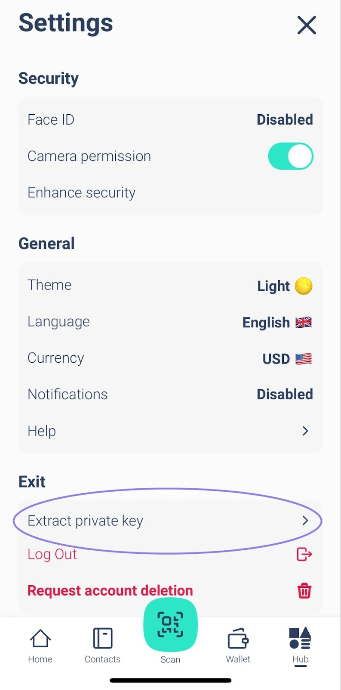

Elysium Walletは、スイスの新興企業Elysium Labsによる初の非保管型ソフトウェアウォレットである。

革新的なキー・マネージメント・システムにより、ユーザー名、パスキー、パスワード、パスコードなど、日常生活の一部である要素を使用してデジタル資産にアクセスすることができます。

そうです。デジタル資産へのアクセスを取り戻すために、シードフレーズを使う必要はもはやありません。

この簡素化により、ビットコインの世界的な普及が加速する可能性がある。

## 口座開設方法

Apple StoreまたはGoogle PlayからElysium Walletアプリをダウンロードしてください。

デバイスにダウンロードしたElysium Walletアプリを開きます。

新しいウォレットを作成」をタップします。

利用規約の画面が表示されます。

アカウントの作成に同意して続行するには、「セットアップを開始」をタップします。

ユーザー名を入力してください。

プロフィール画像はカスタマイズ可能です。写真を撮るか、デバイスから画像をアップロードして、提供されているオプションから1つを選択します。

選択したら「Continue」をタップします。

Elysiumは、Passkey、PassCode、PassWordを組み合わせた革新的な多要素アルゴリズムで際立っている。

PassKeyは必須である。

Face IDや指紋スキャンなど、デバイスに内蔵されたセキュリティ機能を使って素早く安全に認証できる。

迅速かつ安全なアクセスを保証する、主要な保護層です。

セカンドレベルを選択してください：PassCodeまたはPassWord

次に、第二のセキュリティレベルを選択する必要がある：

- パスコード：覚えやすい6桁のコード。保護層を増やすのに最適。
- パスワード：少なくとも8文字の強力なパスワードを作成し、セキュリティをさらに強化します。
Passkeyは、PassCodeまたはPassWordと組み合わせて使用する必要があります。

注：アカウントを設定するには、少なくとも2つの要素が必要で、そのうちの1つはパスキーでなければなりません。

さらにセキュリティを高めるために、3つ目の保護レイヤー（Passkey + PassCode + PassWord）を追加することができます。

レイヤーの組み合わせによる最大限のセキュリティ

常にPasskeyを第一要因として使用する。2番目のレイヤーには、PassCodeまたはPassWordを選択します。

PassCodeを2番目のファクターとして選択した場合、PassWordを3番目のレイヤーとして追加することができます。このような柔軟なアプローチにより、お客様の資産をお客様の好みに合わせて保護することができます。

3つ目のセキュリティファクターは、セットアップの段階（画像を参照）で追加することも、後で「設定」＞「セキュリティの向上」で追加することもできます。

ただし、どれかひとつでも忘れていたら、その点は注意してほしい：

3つの要素をすべて設定した場合は、いつでも設定から変更またはリセットすることができます。

残念ながら、2つの要素しか設定しておらず、1つを忘れてしまった場合、リカバリーオプションはない。

最大限の安全性と柔軟性を確保するために、最初から3つの要素をすべて設定することを強くお勧めします。

## 取引の受け取り方は？

ステップ1: Elysiumアプリを開き、メインメニューに進みます。受信」をタップする。

あとは、支払いを受け取りたいチェーン（ビットコインかポリゴン）を選択し、エリジウム・ウォレットのQRコードを支払いが必要な相手と共有するだけで、あとは向こうがやってくれる。

## ライトニング・ネットワークでトランザクションを受け取るには？

STEP 1: 「支払いをリクエスト」をタップすると、ライトニングネットワーク経由でのビットコイン支払いをリクエストします。

ステップ2：請求金額を入力し、受け取りたい通貨を選択し、必要であれば説明を追加します。

注：LNチャネルを開設するための最初のライトニング・ネットワーク（LN）決済には少額の手数料がかかります。それ以降はすべて無料です。

## トランザクションの送信方法は？

ステップ1：メインメニューから「送信」をタップします。

ステップ2： Elysium Walletから受信者のQRコードをスキャンして、受信者の連絡先を自動的にアドレス帳に保存します。

または、相手のアドレスを手動でコピーし、受信者フィールドに貼り付ける。

受取人を選択するか、アドレス帳に追加した後、「支払いを送信」をタップします。

すでに連絡先をお持ちですか？アドレス帳から直接お選びください。

ステップ3：送金額を入力し、送金する資産を選択します。

BTC取引では、お好みのネットワーク速度と手数料を選択することができます（3番目の画像に示されています）。

取引が送信されました！Elysium Walletの最新の残高と取引状況を簡単に確認できます。

## ライトニング・ネットワーク（LN）でトランザクションを送信するには？

ステップ1：「スキャン」をタップしてスキャナーを開きます。

STEP 2: LN QRコードをスキャンしてお支払いください。

ステップ3支払い内容を確認し、間違いがないことを確認します。

STEP4: 「確認」をタップして取引を完了します。

## シードフレーズを見るには？

メインメニューに移動し、「Hub」をタップします。設定」を選択し、「秘密鍵の抽出」をタップします。

パスキーでログインし、パスワードまたはパスコードを入力してください。

シードフレーズは24語形式で表示される。

誰にも教えてはいけない！

## サポートへの連絡方法は？

Elysium Walletでお困りですか？私たちがお手伝いします！

アプリをダウンロード

アプリから直接カスタマーサポートチームにご連絡いただく方法をご紹介します：

1.ハブへ

2.設定」をタップ

3.ヘルプを選択

フォームが表示されますので、発生している問題をご記入ください。

ご提出後、できるだけ早く解決策をご提案いたします！

バグの報告やフィードバックは、ホームページのウィジェットをクリックしてください：

