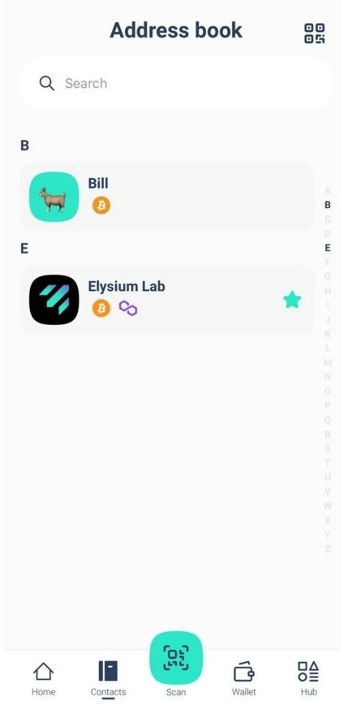

Elysium Wallet é a primeira carteira de software não custodial da startup suíça Elysium Labs.

Graças ao inovador sistema de gerenciamento de chaves, você pode acessar seus ativos digitais usando elementos que fazem parte do cotidiano: seu nome de usuário, chave de acesso, senha ou código de acesso.
Isso mesmo: não é mais estritamente necessário usar uma Frase-Semente para recuperar o acesso aos seus ativos digitais.
Essa simplificação poderia acelerar a disseminação do Bitcoin ao redor do mundo.

## Como Abrir uma Conta?

Baixe o aplicativo Elysium Wallet da Apple Store ou Google Play.
Abra o aplicativo Elysium Wallet que você baixou no seu dispositivo.
Toque em "Criar uma nova carteira".
Uma tela com os termos e condições de uso aparecerá.
Para aceitar e prosseguir com a criação da sua conta, toque em "Iniciar Configuração".
Digite seu nome de usuário.
A imagem de perfil é personalizável: escolha uma das opções fornecidas, tirando uma foto ou fazendo upload de uma imagem do seu dispositivo.
Quando tiver escolhido, toque em "Continuar".

Elysium se destaca por seu inovador algoritmo multifatorial, que combina Chave de Acesso, Código de Acesso e Senha.
As Chaves de Acesso são obrigatórias.
Elas permitem que você se autentique de forma rápida e segura usando os recursos de segurança integrados do seu dispositivo, como Face ID ou leitura de impressão digital.
Elas são sua principal camada de proteção, garantindo acesso rápido e seguro.

Escolha seu segundo nível: Código de Acesso ou Senha
Em seguida, você precisará escolher um segundo nível de segurança:

- Código de Acesso: código de 6 dígitos fácil de lembrar. Perfeito para adicionar uma camada extra de proteção.
- Senha: Crie uma senha forte de pelo menos 8 caracteres, adicionando ainda mais segurança.

Você deve usar Chaves de Acesso em conjunto com um Código de Acesso ou Senha.

Nota: Para configurar sua conta, você precisa de pelo menos 2 fatores, sendo um deles a Chave de Acesso.

Para aumentar ainda mais a segurança, você pode adicionar uma terceira camada de proteção (Chave de Acesso + Código de Acesso + Senha).

Combinação de camadas para máxima segurança
Você sempre usará Chave de Acesso como o fator primário. Para a segunda camada, escolha Código de Acesso ou Senha.
Se você escolheu Código de Acesso como o segundo fator, pode adicionar Senha como a terceira camada ou vice-versa. Esta abordagem flexível garante que seus ativos estejam protegidos de acordo com suas preferências.
Você pode adicionar o terceiro fator de segurança durante a fase de configuração (veja imagens) ou mais tarde, indo em Configurações > Melhorar segurança.

No entanto, se você esquecer um dos fatores, observe que:

Se você configurou todos os três fatores, sempre poderá alterá-los ou redefini-los nas configurações.
Infelizmente, se você configurou apenas dois fatores e esqueceu um, não há opção de recuperação.

Recomendamos fortemente configurar todos os três fatores desde o início para máxima segurança e flexibilidade.

## Como receber uma transação?

Passo 1: Abra o aplicativo Elysium e vá para o menu principal. Toque em 'Receber'.

Agora, selecione a cadeia na qual você deseja receber o pagamento (Bitcoin ou Polygon) e você pode simplesmente compartilhar o código QR da sua carteira Elysium com a pessoa que precisa pagar você, ela cuidará do resto.

## Como Receber uma Transação na Lightning Network?
PASSO 1: Ao tocar em "Solicitar Pagamento", você solicita um pagamento em Bitcoin via Rede Lightning.

Passo 2: Insira o valor que deseja solicitar, selecione a moeda que deseja receber e adicione uma descrição, se necessário.

Nota: Há uma pequena taxa para o primeiro pagamento na Rede Lightning (LN) para abrir o canal LN. Após isso, todos os pagamentos subsequentes são gratuitos.

## Como enviar uma transação?

PASSO 1: Vá ao menu principal e toque em "Enviar".

PASSO 2: Escaneie o código QR do destinatário de sua Carteira Elysium para salvar automaticamente o contato em sua agenda.
Alternativamente, copie manualmente o endereço deles e cole no campo do destinatário.
Após selecionar o destinatário ou adicioná-lo à sua agenda, toque em "Enviar Pagamento".

Já tem o contato? Escolha diretamente da agenda.

PASSO 3: Insira o valor que deseja enviar e selecione o ativo que deseja transferir.
Para transações BTC, você pode selecionar a velocidade e as taxas de rede preferenciais (como mostrado na terceira imagem)

Sua transação foi enviada! Você pode facilmente verificar o saldo atualizado e o status da transação da sua Carteira Elysium.

## Como enviar uma transação na Rede Lightning (LN)?

PASSO 1: Toque em "Escanear" para abrir o scanner.
PASSO 2: Escaneie o código QR LN para pagamento.
PASSO 3: Revise os detalhes do pagamento e confirme se está tudo correto.
PASSO 4: Toque em "Confirmar" para completar a transação.

## Como ver a Frase-Semente?

Vá ao menu principal e toque em "Hub". Selecione Configurações e toque em "Extrair chave privada".

Faça login com sua chave de acesso e insira sua senha e/ou código de acesso.
A frase-semente será exibida no formato de 24 palavras.

Não compartilhe com ninguém!

## Como entrar em contato com o suporte?

Precisa de ajuda com a Carteira Elysium? Estamos aqui para ajudar!

Baixe o App.
Veja como você pode entrar em contato com nossa equipe de suporte ao cliente diretamente do aplicativo:

1. Vá para Hub
2. Toque em Configurações
3. Selecione Ajuda

Um formulário aparecerá onde você pode descrever o problema que está enfrentando.

Uma vez enviado, nossa equipe responderá o mais rápido possível com uma solução!

Para relatar um bug ou nos fornecer feedback, clique no widget na página inicial:

[help2](assets/help2.webp)