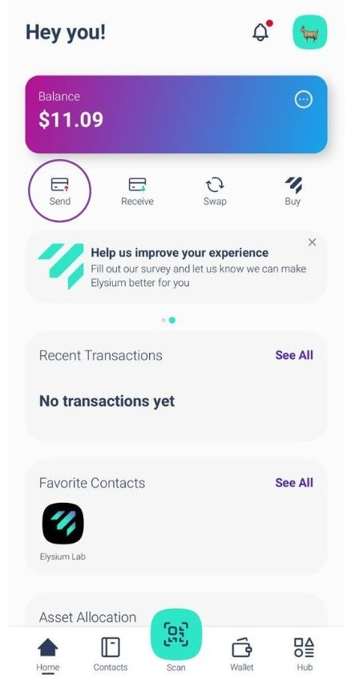

Elysium Wallet 是瑞士创业公司 Elysium Labs 推出的首个非托管软件钱包。

借助创新的密钥管理系统，您可以使用日常生活中的各种元素访问数字资产：用户名、密钥、密码或通行码。

没错：重新访问数字资产不再严格需要使用 "种子短语"。

这种简化可能会加速比特币在全球的传播。

## 如何开设账户？

从 Apple Store 或 Google Play 下载极乐世界钱包应用程序。

打开您下载到设备上的极乐世界钱包应用程序。

点击 "创建新钱包"。

屏幕上将显示使用条款和条件。

要接受并继续创建账户，请点击 "开始设置"。

输入您的用户名。

个人主页图片可自定义：从提供的选项中选择一张照片或从设备上传一张图片。

选择后，点击 "继续"。

Elysium 因其创新的多因素算法而脱颖而出，该算法结合了 Passkey、PassCode 和 PassWord。

PassKeys 是必填项。

它们允许您使用设备的内置安全功能（如 Face ID 或指纹扫描）快速、安全地进行身份验证。

它们是您的主要保护层，可确保快速安全的访问。

选择第二级：密码或口令

接下来，您需要选择第二级安全：

- 密码易于记忆的 6 位代码。是增加额外保护的完美选择。
- 密码：创建一个至少 8 个字符的强密码，以提高安全性。
您必须将密码匙与密码代码或密码单词结合使用。

注意：要设置账户，至少需要 2 个因素，其中一个必须是密码。

为进一步提高安全性，您可以添加第三层保护（密码＋密码代码＋密码字）。

多层组合，实现最高安全性

您将始终使用密码作为主要因素。对于第二层，请选择密码（PassCode）或口令（PassWord）。

如果您选择 PassCode 作为第二层因素，则可以添加 PassWord 作为第三层因素，反之亦然。这种灵活的方法可确保您的资产根据您的偏好得到保护。

您可以在设置阶段（见图片）或稍后通过设置 > 提高安全性添加第三个安全因素。

不过，如果您忘记了其中一个因素，请注意：

如果您已经设置了所有三个因素，您可以随时从设置中更改或重置它们。

遗憾的是，如果您只设置了两个因素，却忘记了其中一个，那么就没有恢复选项了。

我们强烈建议从一开始就设置这三个因素，以获得最大的安全性和灵活性。

## 如何接收交易？

步骤 1：打开极乐世界应用程序，进入主菜单。点击 "接收"。

现在，请选择您要接收付款的链条（比特币或多边形），然后您只需将 Elysium 钱包的二维码分享给需要付款的人，他们就会处理剩下的事情。

## 如何在闪电网络中接收交易？

第 1 步： 点击 "请求付款"，即可通过闪电网络请求比特币付款。

第 2 步： 输入您要申请的金额，选择您要接收的货币，必要时添加说明。

注：首次使用闪电网络（LN）付款需支付小额费用，以打开 LN 通道。此后，所有后续支付均免费。

## 如何发送交易？

第 1 步： 进入主菜单，点击 "发送"。

第 2 步： 扫描收件人 Elysium 钱包中的二维码，自动将联系人保存到您的通讯录中。

或者，手动复制他们的地址并粘贴到收件人字段。

选择收件人或将其添加到通讯录后，点击 "发送付款"。

已有联系人？直接从通讯录中选择。

第 3 步： 输入要发送的金额并选择要转移的资产。

对于 BTC 交易，您可以选择自己喜欢的网络速度和费用（如第三张图片所示）

您的交易已提交！您可以轻松查看极乐世界钱包的最新余额和交易状态。

## 如何在闪电网络（LN）中发送交易？

第 1 步： 点击 "扫描 "打开扫描仪。

第 2 步： 扫描 LN QR 码付款。

步骤 3：查看付款详情并确认一切无误。

第四步： 点击 "确认 "完成交易。

## 如何查看种子词？

进入主菜单，点击 "Hub"。选择 "设置"，然后点击 "提取私钥"。

使用密码匙登录并输入密码和/或密码。

种子短语将以 24 个字的格式显示。

不要与任何人分享！

## 如何联系技术支持？

使用极乐世界钱包需要帮助吗？我们将竭诚为您服务！

下载应用程序。

以下是您如何直接从应用程序联系我们的客户支持团队的方法：

1.转至枢纽

2.点击设置

3.选择帮助

这时会出现一个表格，您可以在其中描述您遇到的问题。

一旦提交，我们的团队将尽快回复并提供解决方案！

要报告错误或向我们提供反馈，请单击主页上的小工具：

