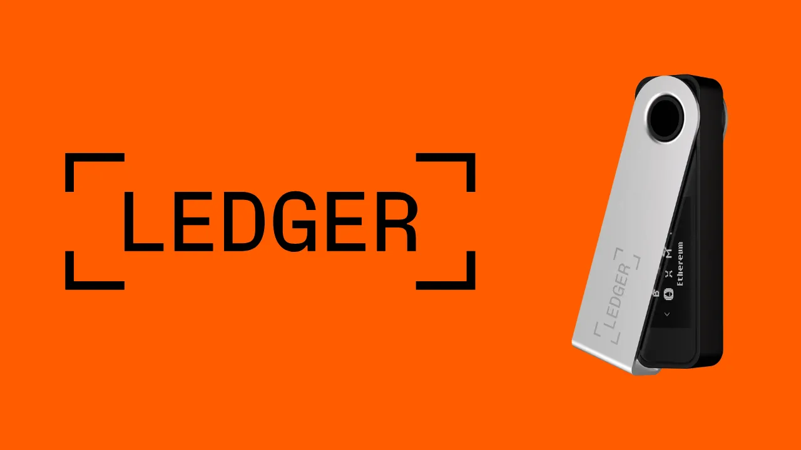

En maskinvarelommebok er en elektronisk enhet som er dedikert til å administrere og sikre de private nøklene til en Bitcoin-lommebok. I motsetning til programvarelommebøker (eller hot wallets) som er installert på generelle maskiner som ofte er koblet til Internett, gjør maskinvarelommebøker det mulig å isolere de private nøklene fysisk, noe som reduserer risikoen for hacking og tyveri.

Hovedmålet med en maskinvarelommebok er å minimere enhetens funksjonalitet så mye som mulig for å redusere angrepsflaten. En mindre angrepsflate betyr også færre potensielle angrepsvektorer, dvs. færre svakheter i systemet som angripere kan utnytte for å få tilgang til bitcoins.

Det anbefales å bruke en maskinvarelommebok for å sikre bitcoinsene dine, spesielt hvis du har betydelige beløp, enten i absolutt verdi eller som en andel av de totale eiendelene dine.

Maskinvare-lommebøker brukes i kombinasjon med en programvare for lommebokadministrasjon på en datamaskin eller smarttelefon. Programvaren administrerer opprettelsen av transaksjoner, men den kryptografiske signaturen som er nødvendig for å validere transaksjonene, utføres kun i maskinvarelommeboken. Dette betyr at de private nøklene aldri blir eksponert for et potensielt sårbart miljø.

Maskinvare-lommebøker tilbyr dobbel beskyttelse for brukeren: På den ene siden sikrer de bitcoinsene dine mot eksterne angrep ved å holde de private nøklene offline, og på den andre siden tilbyr de generelt bedre fysisk motstand mot forsøk på å trekke ut nøklene. Og det er nettopp ut fra disse to sikkerhetskriteriene at man kan bedømme og rangere de forskjellige modellene som er tilgjengelige på markedet.

I denne veiledningen vil jeg vise deg en av disse løsningene: **Ledger Nano S Plus**.

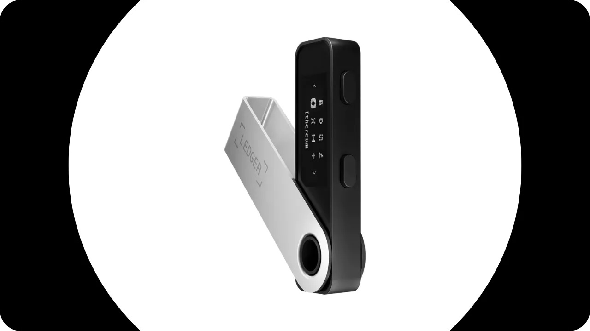

## Introduksjon til Ledger Nano S Plus

Ledger Nano S Plus er en maskinvarelommebok produsert av det franske selskapet Ledger, markedsført til en pris på 79 €.

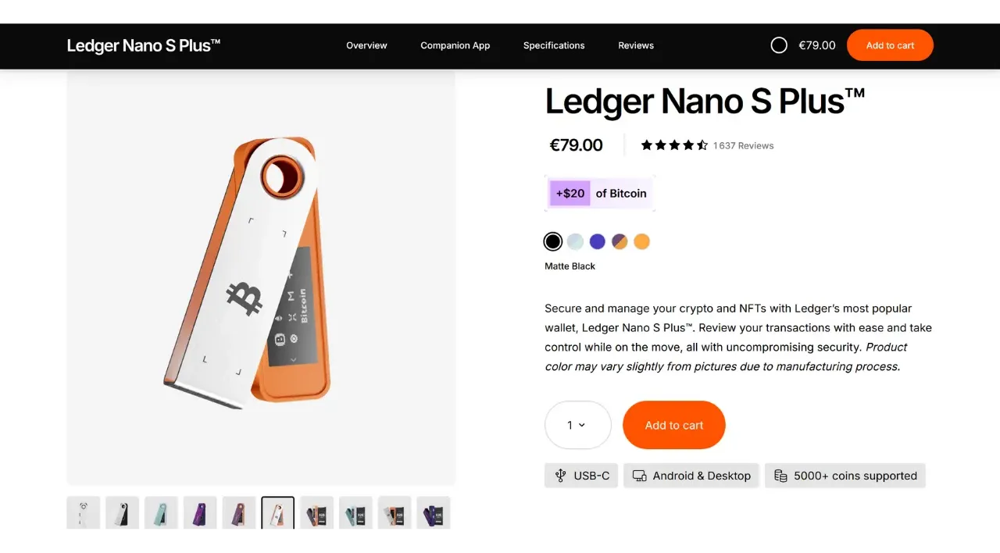

Nano S Plus er utstyrt med en CC EAL6+-sertifisert brikke ("*secure element*"), som gir deg avansert beskyttelse mot fysiske angrep på maskinvaren. Skjermen og knappene styres direkte av denne brikken. Et kritikkpunkt som ofte reises, er at koden til denne brikken ikke er åpen kildekode, noe som krever en viss tillit til integriteten til denne komponenten. Likevel blir dette elementet revidert av uavhengige eksperter.

Når det gjelder bruk, fungerer Ledger Nano S Plus utelukkende gjennom en kablet USB-C-tilkobling.

Ledger skiller seg ut fra konkurrentene ved at de alltid raskt tar i bruk nye Bitcoin-funksjoner, som for eksempel Taproot eller Miniscript, noe som er høyt verdsatt.

Etter å ha testet den, synes jeg at Ledger Nano S Plus er en utmerket innstegslommebok på maskinvarenivå. Den tilbyr et høyt sikkerhetsnivå til en rimelig pris. Den største ulempen sammenlignet med andre enheter i samme prisklasse er at fastvarekoden ikke er åpen kildekode. Skjermen på Nano S Plus er også relativt liten sammenlignet med dyrere modeller, som Ledger Flex eller Coldcard Q1. Grensesnittet er likevel svært godt utformet: Til tross for to knapper og en liten skjerm er det enkelt å bruke, også avanserte funksjoner som BIP39-passordet. Ledger Nano S Plus har ikke batteri, Air-gap-tilkobling, kamera eller micro SD-port, men dette er ganske normalt for denne prisklassen.

Etter min mening er Ledger Nano S Plus et godt alternativ for å sikre Bitcoin-lommeboken din, og passer for både nybegynnere og viderekomne brukere. I denne prisklassen foretrekker jeg imidlertid Trezor Safe 3, som tilbyr omtrent de samme alternativene. Fordelen med Trezor, slik jeg ser det, ligger i håndteringen av det sikre elementet: den mnemoniske frasen og nøklene håndteres utelukkende av åpen kildekode, men drar likevel nytte av beskyttelsen til brikken. Ulempen med Trezor er at de noen ganger er veldig trege med å implementere nye funksjoner, i motsetning til Ledger.

## Hvordan kjøpe en Ledger Nano S Plus?

Ledger Nano S Plus er tilgjengelig for salg [på den offisielle nettsiden](https://shop.ledger.com/products/ledger-nano-s-plus). Hvis du vil kjøpe den i en fysisk butikk, kan du også finne [listen over sertifiserte forhandlere](https://www.ledger.com/reseller) på Ledgers nettsted.

## Forutsetninger

Når du har mottatt din Ledger Nano, er det første trinnet å sjekke emballasjen for å forsikre deg om at den ikke har blitt åpnet. Hvis den er skadet, kan det tyde på at maskinvarelommeboken har blitt kompromittert og kanskje ikke er autentisk.

Når du åpner esken, bør du finne følgende elementer i den:

- Ledger Nano S Plus;
- En USB-C til USB-A-kabel;
- En brukerhåndbok;
- Kort til å skrive ned minnefrasen din.
For denne opplæringen trenger du to programmer: Ledger Live for å initialisere Ledger, og Sparrow Wallet for å administrere Bitcoin-lommeboken din. Last ned [Ledger Live] (https://www.ledger.com/ledger-live) og [Sparrow Wallet] (https://sparrowwallet.com/download/) fra deres offisielle nettsider.

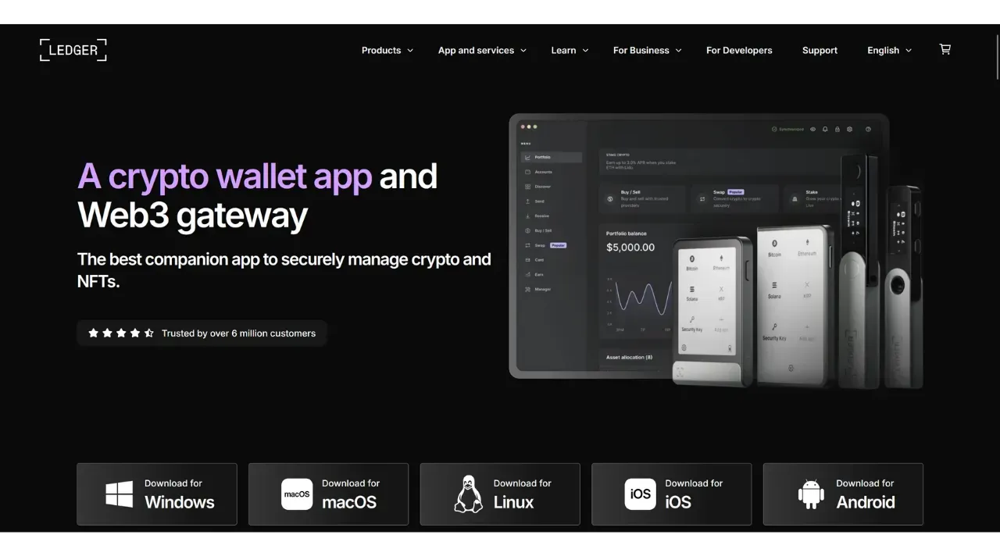

For disse to programmene anbefaler jeg på det sterkeste at du kontrollerer både ektheten (med GnuPG) og integriteten (via hashen) før du installerer dem på maskinen din. Hvis du ikke er sikker på hvordan du gjør dette, kan du følge denne andre veiledningen:

https://planb.network/tutorials/others/general/integrity-authenticity-21d0420a-be02-4663-94a3-8d487f23becc
## Hvordan initialiserer jeg en Ledger Nano?

Koble din Nano til datamaskinen der Ledger Live og Sparrow Wallet er installert. For å navigere i Ledger bruker du venstre knapp for å gå til venstre og høyre knapp for å gå til høyre. Trykk på begge knappene samtidig for å velge eller bekrefte et alternativ.

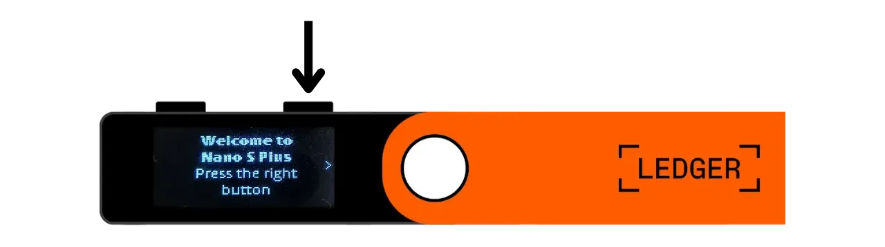

Bla gjennom de ulike introduksjonssidene, og klikk deretter på de to knappene for å begynne.

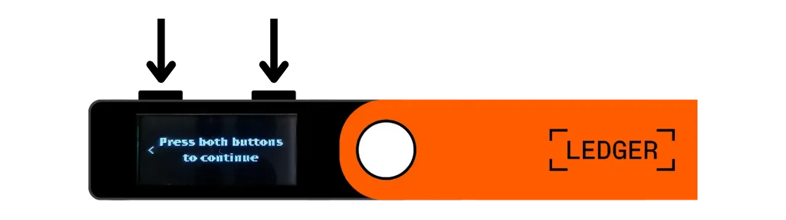

Velg alternativet "*Sett opp som en ny enhet*".

Velg PIN-koden som skal brukes til å låse opp hovedboken. Dette er derfor en beskyttelse mot uautorisert fysisk tilgang. Denne PIN-koden spiller ingen rolle i utledningen av lommebokens kryptografiske nøkler. Selv uten tilgang til denne PIN-koden vil du derfor kunne få tilgang til bitcoinsene dine igjen hvis du har din 24 ord lange huskeregel.

Det anbefales å velge en 8-sifret PIN-kode, så tilfeldig som mulig. Sørg også for å lagre denne koden på et annet sted enn der Ledger Nano S Plus er lagret (for eksempel i en passordbehandler).

Bruk knappene til å flytte over sifrene, og velg deretter hvert enkelt siffer ved å klikke på begge knappene samtidig.

Tast inn PIN-koden en gang til for å bekrefte den.

Nano inneholder instruksjoner om hvordan du administrerer gjenopprettingsfrasen.

**Denne huskeregelen gir full og ubegrenset tilgang til alle bitcoinsene dine**. Alle som er i besittelse av denne frasen kan stjele pengene dine, selv uten fysisk tilgang til hovedboken din. Med 24-ordsfrasen kan du gjenopprette tilgangen til bitcoinsene dine i tilfelle tap, tyveri eller skade på din Ledger Nano. Det er derfor svært viktig å lagre og oppbevare den på et sikkert sted.

Du kan skrive det ned på papparket som følger med hovedboken, eller for større sikkerhet anbefaler jeg at du graverer det inn på et medium av rustfritt stål for å beskytte mot brann, oversvømmelse eller kollaps.

Du kan bla gjennom disse instruksjonene og hoppe over sider ved å klikke på høyre knapp.

Hovedboken vil lage minnefrasen din ved hjelp av en tilfeldig tallgenerator. Forsikre deg om at du ikke blir observert under denne operasjonen. Skriv ned ordene du får fra Ledger på det fysiske mediet du ønsker. Avhengig av sikkerhetsstrategien din, kan du vurdere å lage flere fullstendige fysiske kopier av frasen (men det er viktig at du ikke deler den opp). Det er viktig å holde ordene nummerert og i sekvensiell rekkefølge.

***Du bør selvsagt aldri dele disse ordene på internett, i motsetning til hva jeg gjør i denne veiledningen. Dette eksemplet på lommebok vil kun bli brukt på Testnet og vil bli slettet etter opplæringen

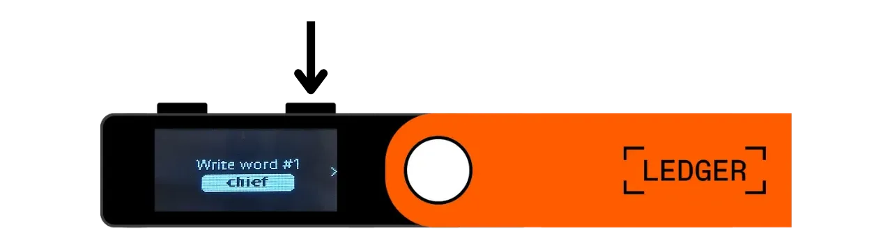

Klikk på høyre knapp for å gå til neste ord.

Når alle ordene er notert, klikker du på de to knappene for å gå videre til neste trinn.

Klikk på de to knappene "*Bekreft din gjenopprettingsfrase*", og velg deretter ordene i huskesetningen i riktig rekkefølge for å bekrefte at du har notert dem riktig. Bruk venstre- og høyreknappene til å navigere mellom alternativene, og velg deretter riktig ord ved å klikke på de to knappene. Fortsett denne prosedyren til det 24. ordet.

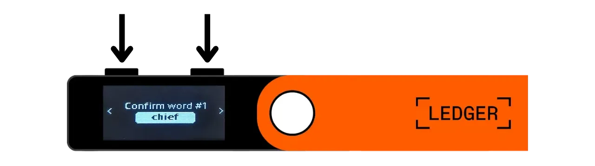

Hvis frasen du bekrefter, stemmer nøyaktig overens med den du fikk fra hovedboken i forrige trinn, kan du fortsette. Hvis ikke, betyr det at den fysiske sikkerhetskopien av minnefrasen er feil, og at du må starte prosessen på nytt.

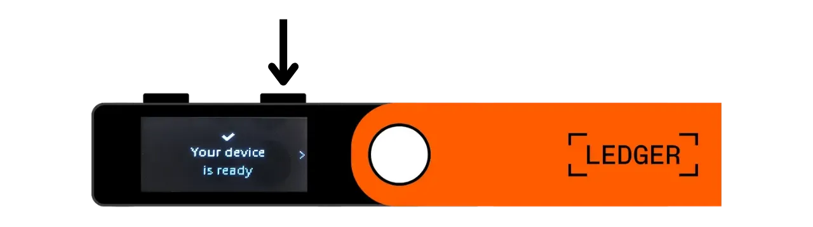

Og der har du det, frøet ditt er riktig opprettet på din Ledger Nano S Plus. Før vi fortsetter med å opprette en ny Bitcoin-lommebok fra dette frøet, la oss utforske enhetsinnstillingene sammen.

## Hvordan endrer du innstillingene i hovedboken?

For å få tilgang til innstillingene holder du de to knappene nede i noen sekunder.

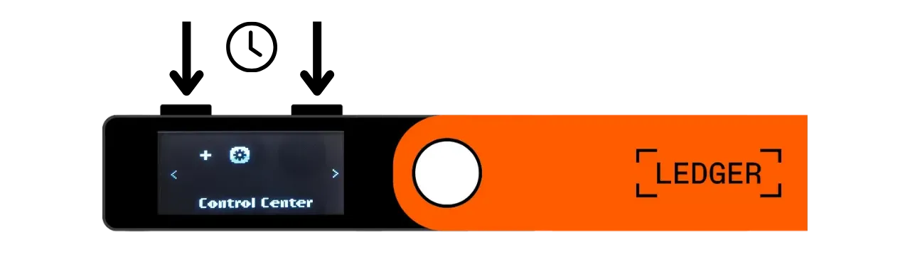

Klikk på menyen "*Innstillinger*".

Og velg "*Generell*".

I menyen "*Language*" kan du endre språket på skjermen.

I menyen "*Brightness*" kan du justere lysstyrken på skjermen. Vi er ikke interessert i resten av de generelle innstillingene for øyeblikket.

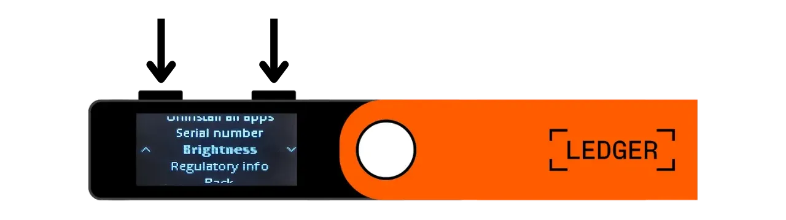

Gå nå til delen "*Security*"-innstillinger.

med "*Change PIN*" kan du endre PIN-koden din.

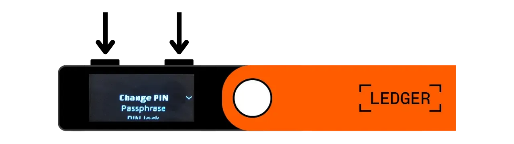

"*Passordfrase*" lar deg sette opp en BIP39-passordfrase. Passordfrasen er et valgfritt passord som, kombinert med gjenopprettingsfrasen din, gir et ekstra sikkerhetslag for lommeboken din.

For øyeblikket genereres lommeboken din fra en mnemonisk frase som består av 24 ord. Denne gjenopprettingsfrasen er svært viktig fordi den lar deg gjenopprette alle nøklene i lommeboken din i tilfelle tap. Den utgjør imidlertid et enkelt feilpunkt (SPOF). Hvis den blir kompromittert, er bitcoinsene dine i fare. Det er her passordfrasen kommer inn i bildet. Det er et valgfritt passord, som du kan velge vilkårlig, som legges til den mnemoniske frasen for å forbedre lommebokens sikkerhet.

Passordfrasen må ikke forveksles med PIN-koden. Den spiller en rolle i utledningen av de kryptografiske nøklene dine. Den fungerer sammen med den mnemoniske frasen, og endrer frøet som nøklene genereres ut fra. Selv om noen får tak i 24-ordsfrasen din, kan de ikke få tilgang til pengene dine uten passordfrasen. Ved å bruke en passordfrase oppretter du i praksis en ny lommebok med egne nøkler. Hvis du endrer (selv bare litt) på passordfrasen, vil det generere en annen lommebok.

Passordfrasen er et veldig kraftig verktøy for å øke sikkerheten til bitcoinsene dine. Det er imidlertid veldig viktig å forstå hvordan det fungerer før du implementerer det, for å unngå å miste tilgangen til lommeboken din. Derfor anbefaler jeg deg å lese denne andre veiledningen hvis du ønsker å sette opp en passordfrase på din Ledger:

https://planb.network/tutorials/wallet/hardware/passphrase-ledger-9ae6d9a2-7293-438a-8fe0-e59147ef2f49
I menyen "*PIN-lås*" kan du konfigurere og aktivere automatisk låsing av hovedboken etter en bestemt periode med inaktivitet.

I menyen "*Screen saver*" kan du justere hvilemodus for Ledger Nano. Merk at skjermspareren ikke krever PIN-kode ved oppvåkning, med mindre alternativet "*PIN-lås*" er aktivert for å korrespondere med hvilemodus. Denne funksjonen er spesielt nyttig for Ledger Nano X-enheter som er utstyrt med et batteri, for å redusere energiforbruket.

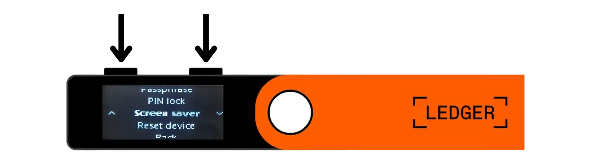

Til slutt kan du tilbakestille hovedboken din ved hjelp av menyen "*Reset device*". Bare fortsett med denne tilbakestillingen hvis du er sikker på at den ikke inneholder noen nøkler som sikrer bitcoins, da du permanent kan miste tilgangen til midlene dine. Dette alternativet kan være nyttig for å utføre en tom gjenopprettingstest, men jeg vil snakke litt mer om dette senere.

## Hvordan installerer jeg Bitcoin-applikasjonen?

Start med å starte Ledger Live-programvaren på datamaskinen din, og koble deretter til og lås opp Ledger Nano. I Ledger Live går du til menyen "*My Ledger*". Du vil bli bedt om å autorisere tilgang til din Nano.

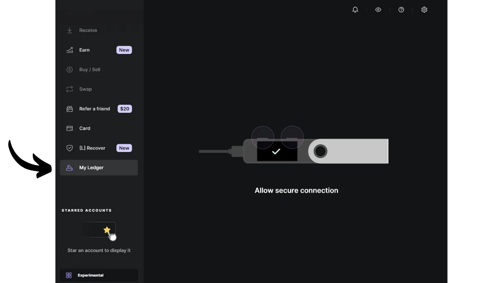

Valider tilgangen til hovedboken ved å klikke på de to knappene.

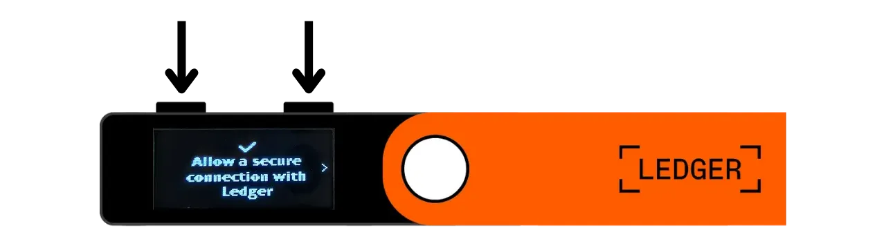

Først, på Ledger Live, må du sørge for at "*Ekthetskontroll*" vises. Dette bekrefter at enheten din er ekte.

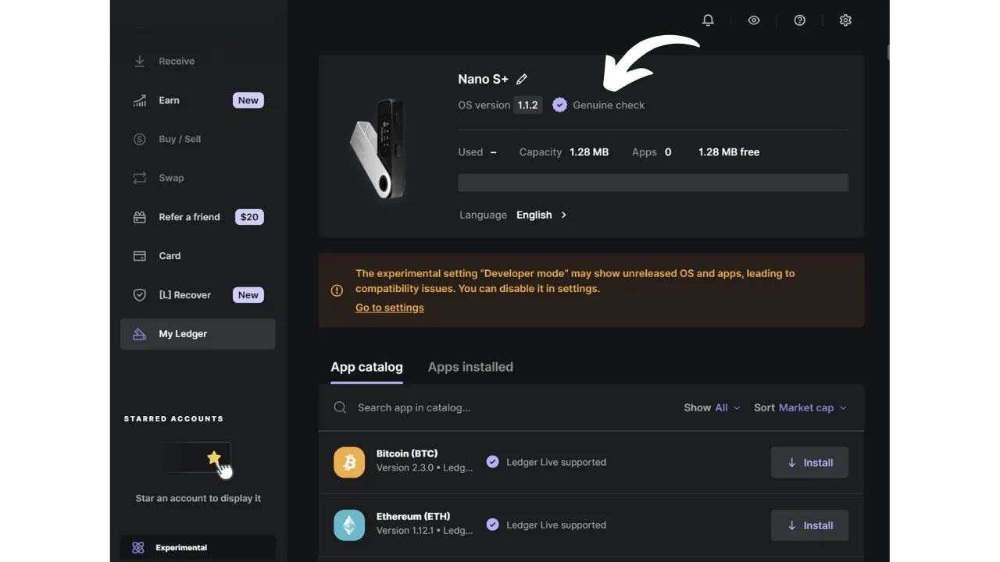

Hvis fastvaren til din Ledger Nano ikke er oppdatert, vil Ledger Live automatisk tilby deg å oppdatere den. Hvis det er nødvendig, klikker du på "*Oppdater fastvare*", og deretter på "*Installer oppdatering*" for å starte installasjonen. Klikk på de to knappene på Ledger for å bekrefte, og vent deretter under installasjonen.

Til slutt vil vi legge til Bitcoin-applikasjonen. For å gjøre dette, på Ledger Live, klikker du på "*Install*" -knappen ved siden av "*Bitcoin (BTC)*".

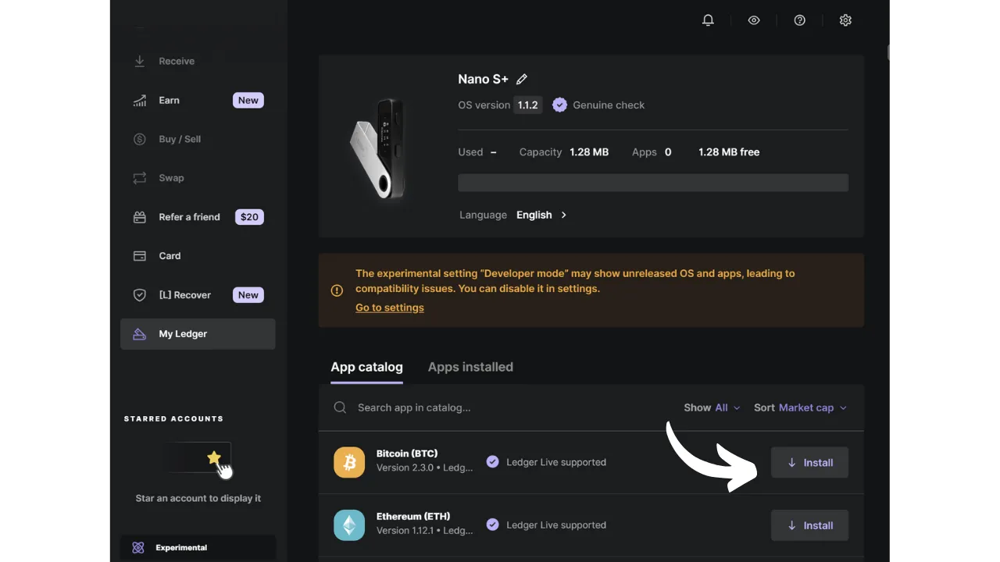

Programmet installeres på din Nano.

Fra nå av trenger du ikke lenger Ledger Live-programvaren for å administrere lommeboken din regelmessig. Du kan av og til gå tilbake til den for å oppdatere fastvaren når nye versjoner er tilgjengelige. For alt annet vil vi bruke Sparrow Wallet, som er et mye mer omfattende verktøy for effektiv administrasjon av en Bitcoin-lommebok.

## Hvordan sette opp en ny Bitcoin-lommebok med Sparrow?

Åpne Sparrow Wallet og hopp over introduksjonssidene for å komme til startskjermen. Kontroller at du er riktig koblet til en node ved å se på bryteren nederst til høyre på skjermen.

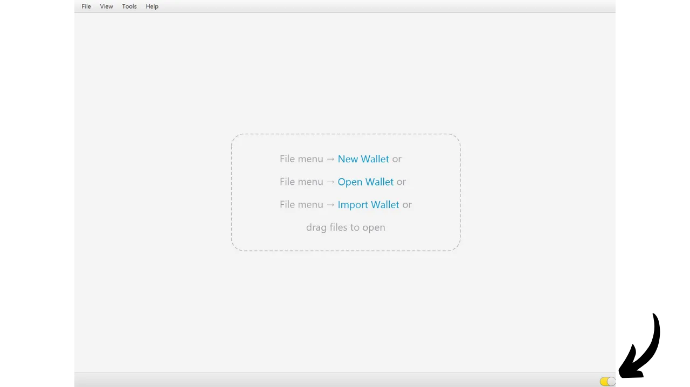

Jeg anbefaler på det sterkeste å bruke din egen Bitcoin-node. I denne veiledningen bruker jeg en offentlig node (gul) fordi jeg er på testnettet, men for normal bruk er det bedre å velge en lokal Bitcoin Core (grønn) eller en Electrum-server som er koblet til en ekstern node (blå).

Klikk på "*File*"-menyen og deretter på "*New Wallet*".

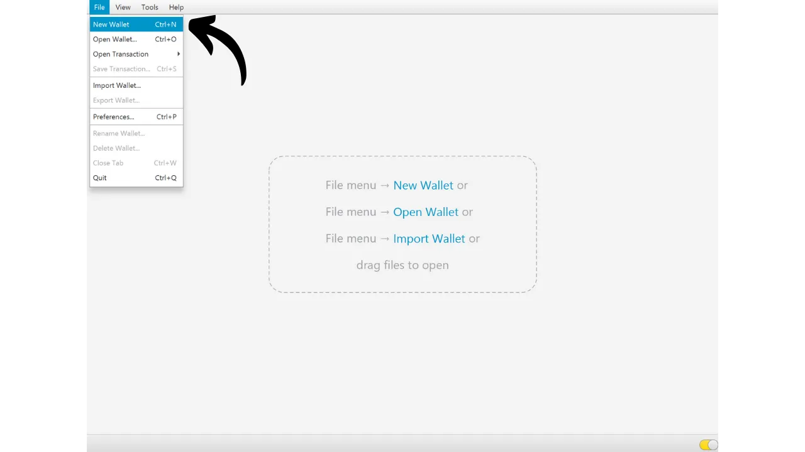

Velg et navn for denne lommeboken, og klikk deretter på "*Create Wallet*".

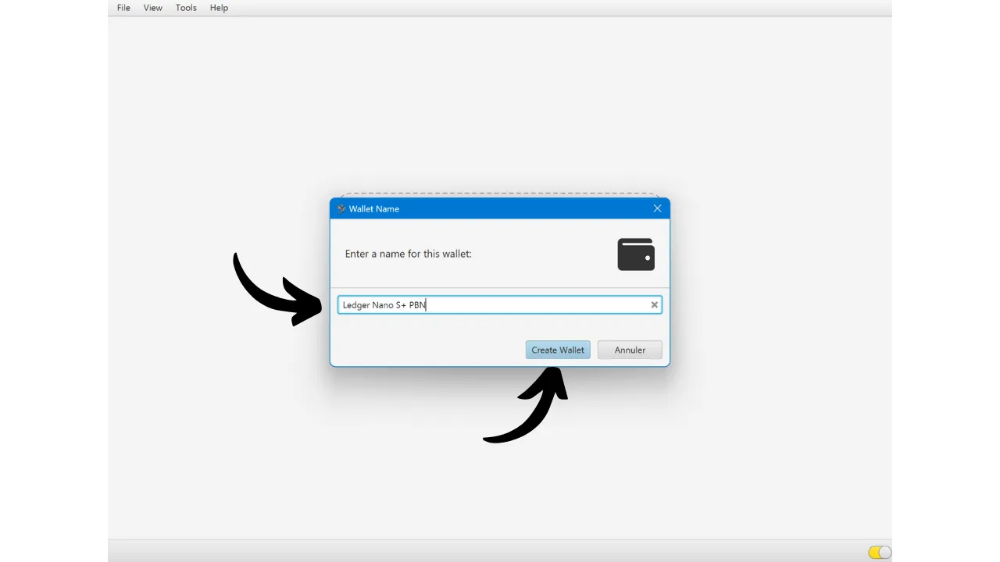

I rullegardinmenyen "*Script Type*" velger du hvilken type skript som skal brukes til å sikre bitcoinsene dine. Jeg anbefaler at du velger "*Taproot*", eller hvis det ikke er tilgjengelig, "*Native SegWit*".

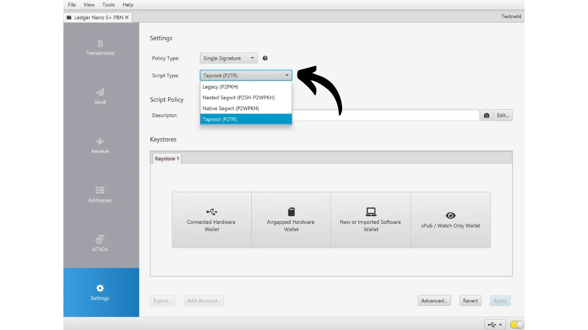

Klikk på knappen "*Connected Hardware Wallet*".

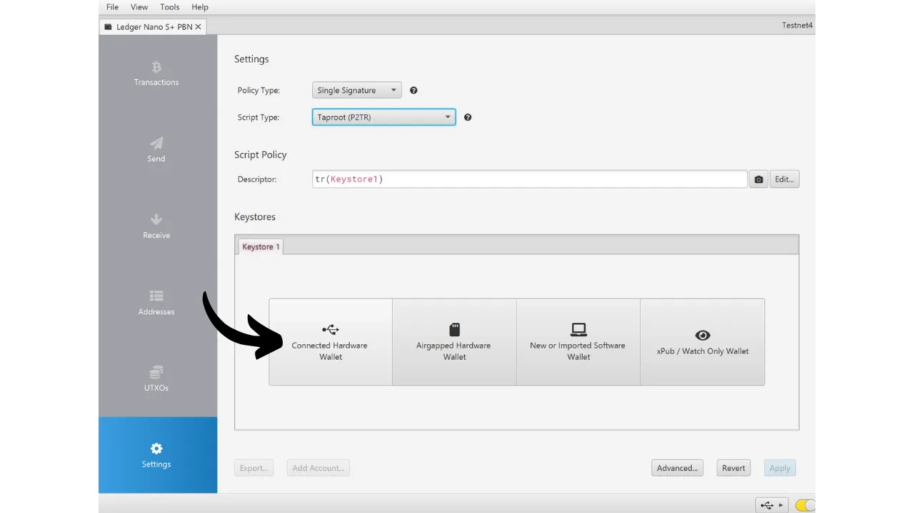

Hvis du ikke allerede har gjort det, kobler du Ledger Nano S Plus til datamaskinen, låser den opp med PIN-koden din, og åpner deretter "*Bitcoin*"-applikasjonen ved å klikke på de to knappene på Bitcoin-logoen.

*I denne veiledningen bruker jeg Bitcoin Testnet-applikasjonen, men fremgangsmåten er den samme for hovednettet*

På Sparrow klikker du på "*Scan*"-knappen.

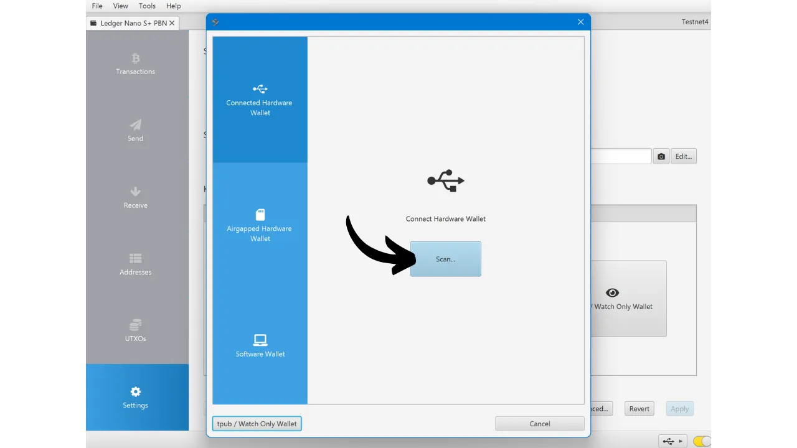

Klikk deretter på "*Importer nøkkellager*".

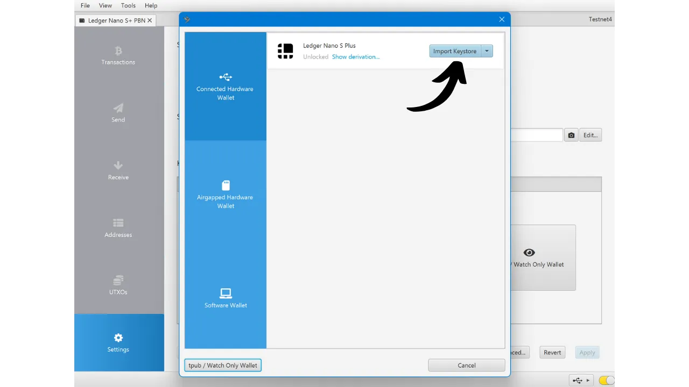

Du kan nå se detaljene for lommeboken din, inkludert den utvidede offentlige nøkkelen til den første kontoen din. Klikk på "*Apply*"-knappen for å fullføre opprettelsen av lommeboken.

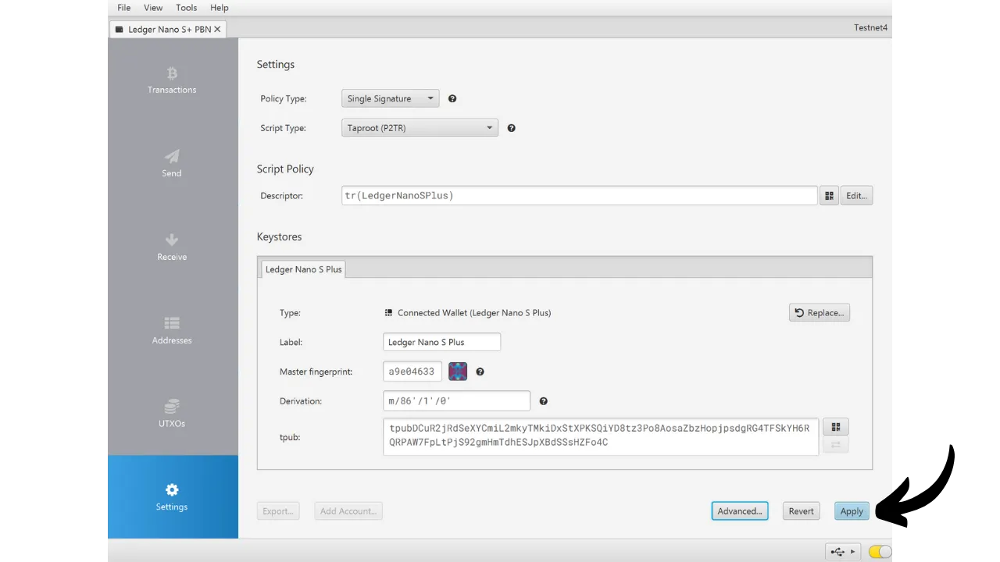

Velg et sterkt passord for å sikre tilgangen til Sparrow Wallet. Dette passordet vil sikre tilgangen til lommebokdataene dine på Sparrow, noe som bidrar til å beskytte dine offentlige nøkler, adresser, etiketter og transaksjonshistorikk mot uautorisert tilgang.

Jeg anbefaler deg å lagre dette passordet i en passordbehandler, slik at du ikke glemmer det.

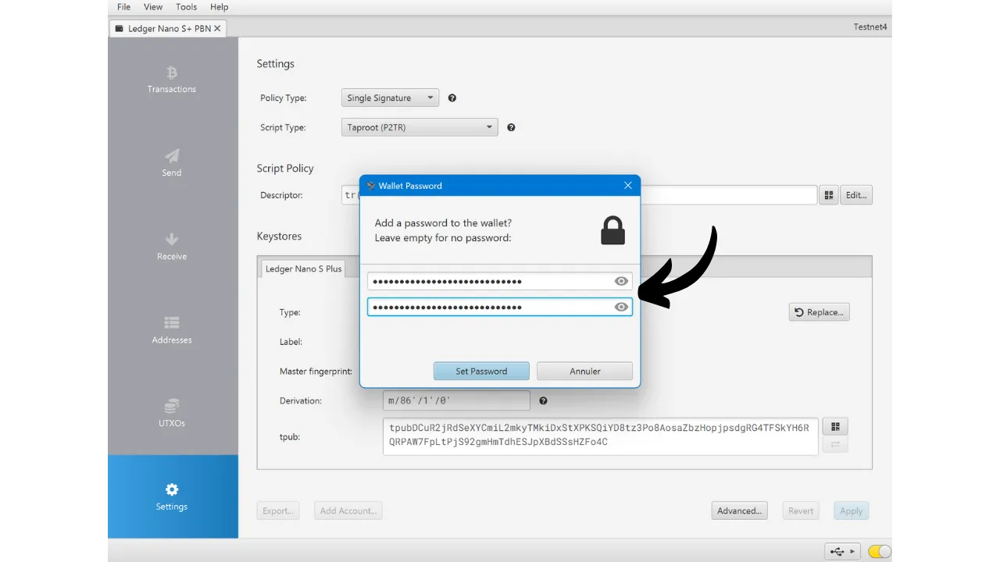

Og der har du det, lommeboken din er nå opprettet!

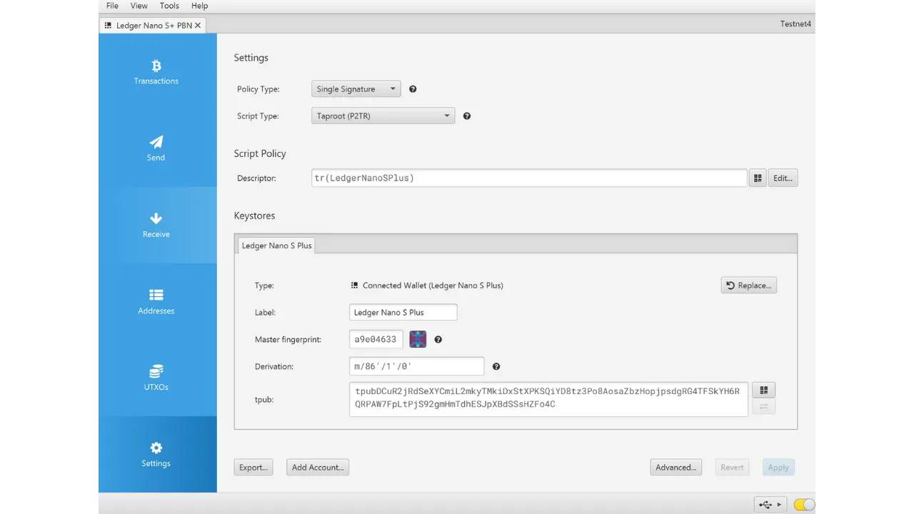

Før du mottar dine første bitcoins i lommeboken din, anbefaler jeg deg på det sterkeste å utføre en gjenopprettingstest**. Noter ned en referanseinformasjon, for eksempel xpub, og tilbakestill deretter Ledger Nano mens lommeboken fortsatt er tom. Prøv deretter å gjenopprette lommeboken på Ledger ved hjelp av papirsikkerhetskopiene dine. Sjekk at xpuben som genereres etter gjenopprettingen, stemmer overens med den du først noterte. Hvis det stemmer, kan du være sikker på at papirbackupene dine er pålitelige.

Hvis du vil lære mer om hvordan du utfører en gjenopprettingstest, anbefaler jeg at du leser denne andre veiledningen:

https://planb.network/tutorials/wallet/backup/recovery-test-5a75db51-a6a1-4338-a02a-164a8d91b895
## Hvordan motta bitcoins med Ledger Nano?

Klikk på fanen "*Mottak*".

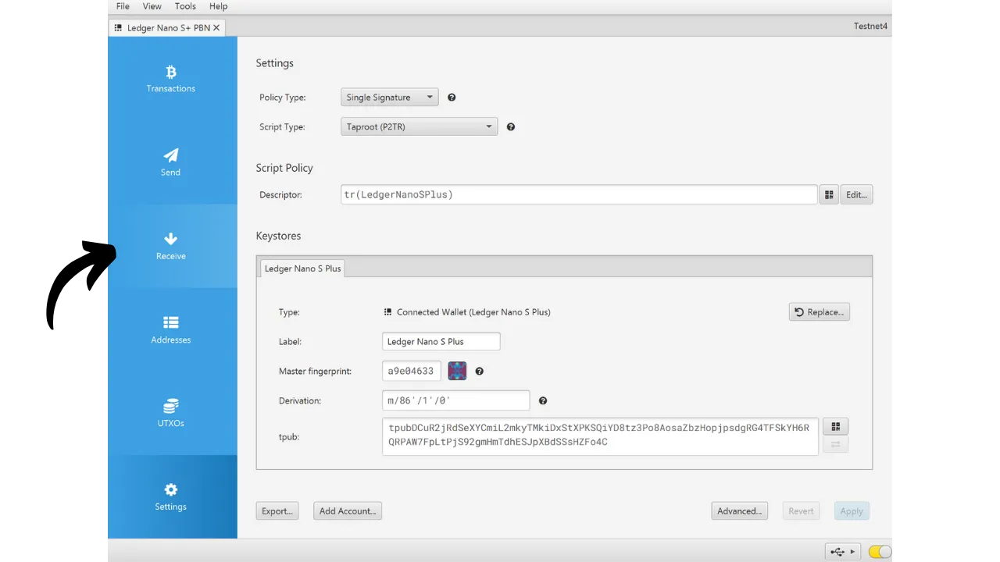

Koble Ledger Nano S Plus til datamaskinen, lås den opp med PIN-koden din, og åpne deretter applikasjonen "*Bitcoin*".

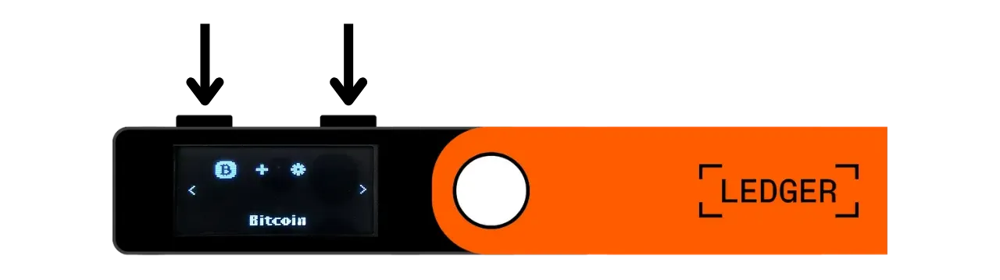

Før du bruker adressen fra Sparrow Wallet, må du verifisere den på Ledger-skjermen. På denne måten kan du bekrefte at adressen som vises på Sparrow ikke er falsk, og at maskinvarelommeboken faktisk har den private nøkkelen som er nødvendig for å bruke bitcoins som er sikret med denne adressen senere. Dette hjelper deg med å unngå flere typer angrep.

For å utføre denne verifiseringen klikker du på knappen "*Vis adresse*".

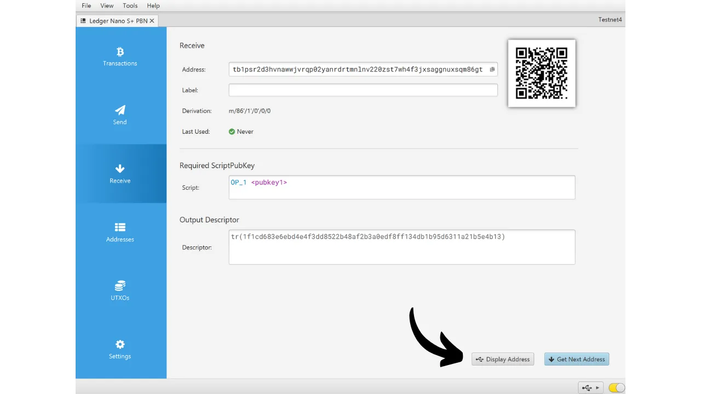

Kontroller at adressen som vises i hovedboken din stemmer overens med den som er angitt i Sparrow Wallet. Det anbefales også å utføre denne verifiseringen rett før du gir adressen din til avsenderen, for å være sikker på at den er gyldig. Du kan bruke knappene for å se hele adressen.

Klikk deretter på "*Godkjenn*" hvis adressene faktisk er identiske.

Du kan legge til en "*Label*" for å beskrive kilden til bitcoinsene som skal sikres med denne adressen. Dette er en god praksis som hjelper deg med å administrere UTXO-ene dine bedre.

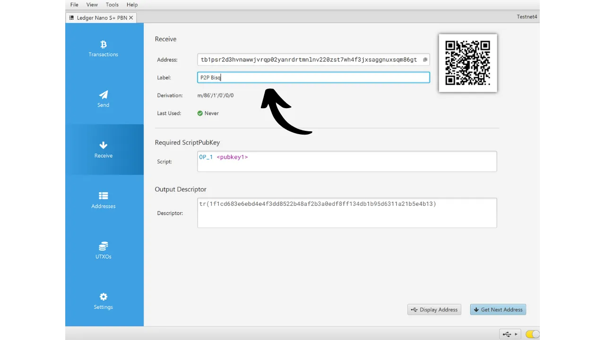

Hvis du vil ha mer informasjon om merking, anbefaler jeg deg også å ta en titt på denne andre veiledningen:

https://planb.network/tutorials/privacy/on-chain/utxo-labelling-d997f80f-8a96-45b5-8a4e-a3e1b7788c52
Du kan deretter bruke denne adressen til å motta bitcoins.

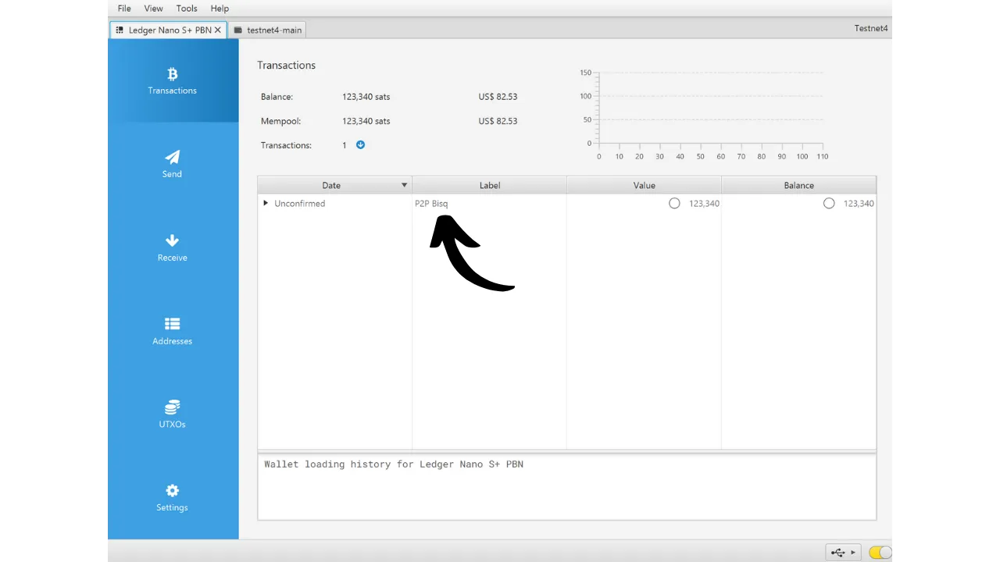

## Hvordan sende bitcoins med Ledger Nano?

Nå som du har mottatt dine første satellitter i lommeboken sikret med Nano S Plus, kan du også bruke dem! Koble Ledger til datamaskinen, lås den opp, start Sparrow Wallet, og gå deretter til "*Send*"-fanen for å opprette en ny transaksjon.

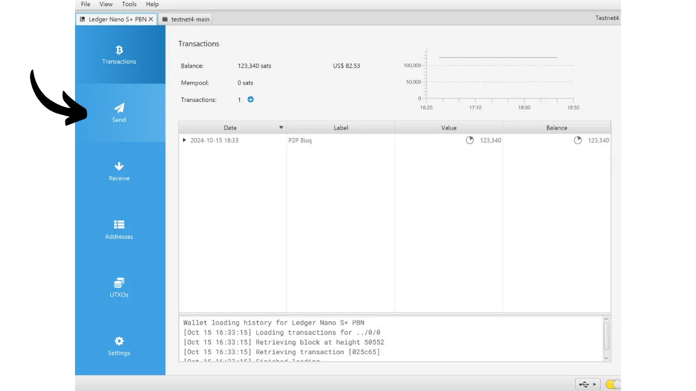

Hvis du vil gjøre "*myntkontroll*", det vil si spesifikt velge hvilke UTXO-er som skal brukes i transaksjonen, går du til "*UTXO*"-fanen. Velg UTXO-ene du ønsker å bruke, og klikk deretter på "*Send Selected*". Du vil bli omdirigert til samme skjermbilde som i "*Send*"-fanen, men med UTXO-ene du allerede har valgt for transaksjonen.

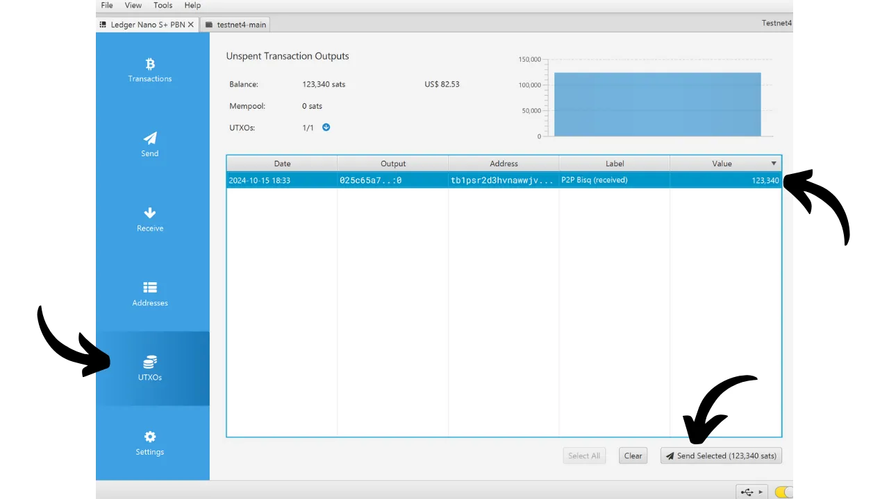

Skriv inn destinasjonsadressen. Du kan også legge inn flere adresser ved å klikke på knappen "*+ Legg til*".

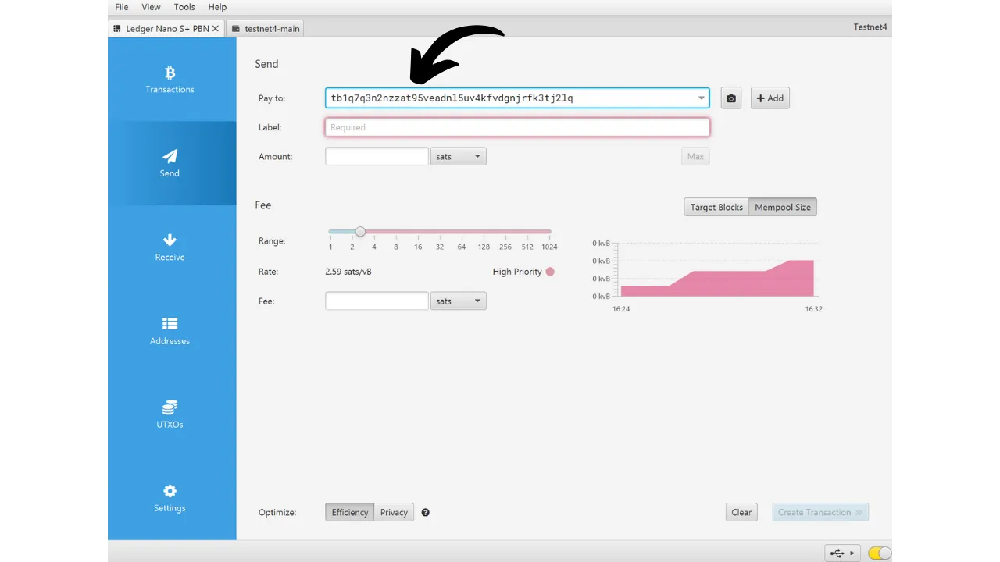

Noter en "*Label*" for å huske formålet med denne utgiften.

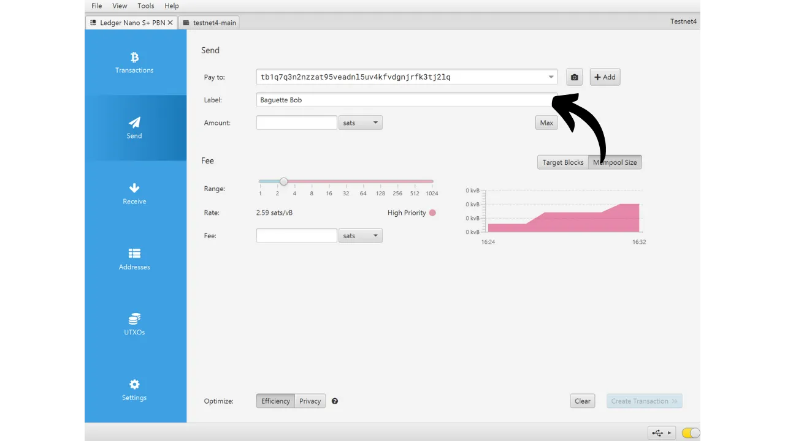

Velg beløpet som skal sendes til denne adressen.

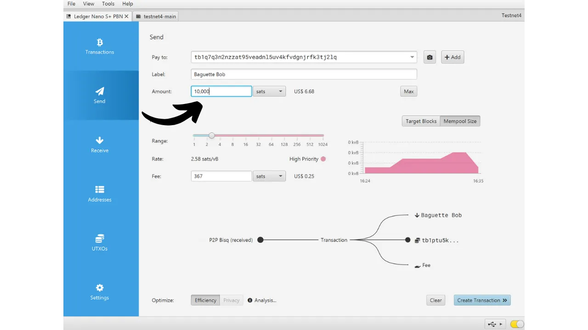

Juster transaksjonsgebyret i henhold til gjeldende marked.

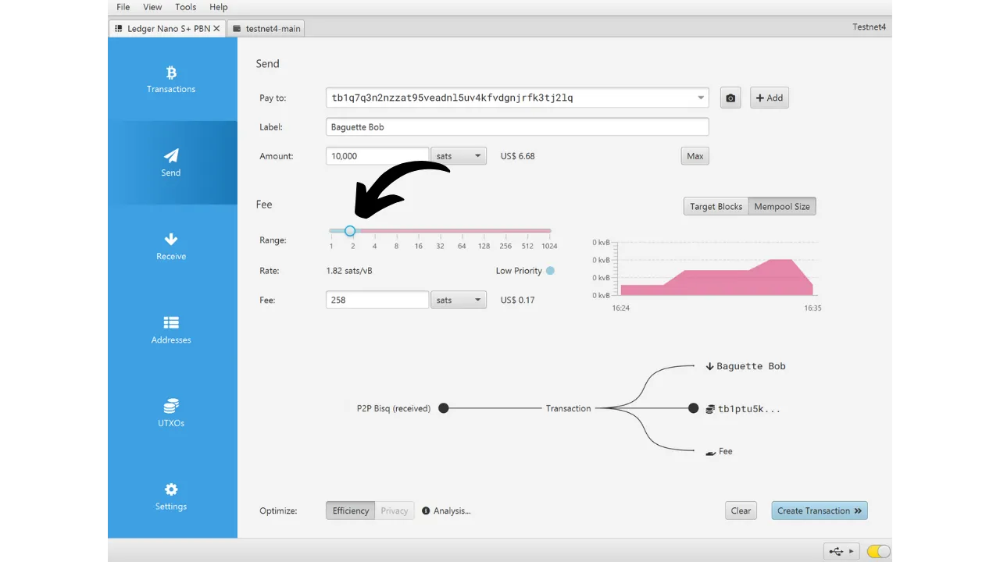

Kontroller at alle innstillingene for transaksjonen er riktige, og klikk deretter på "*Opprett transaksjon*".

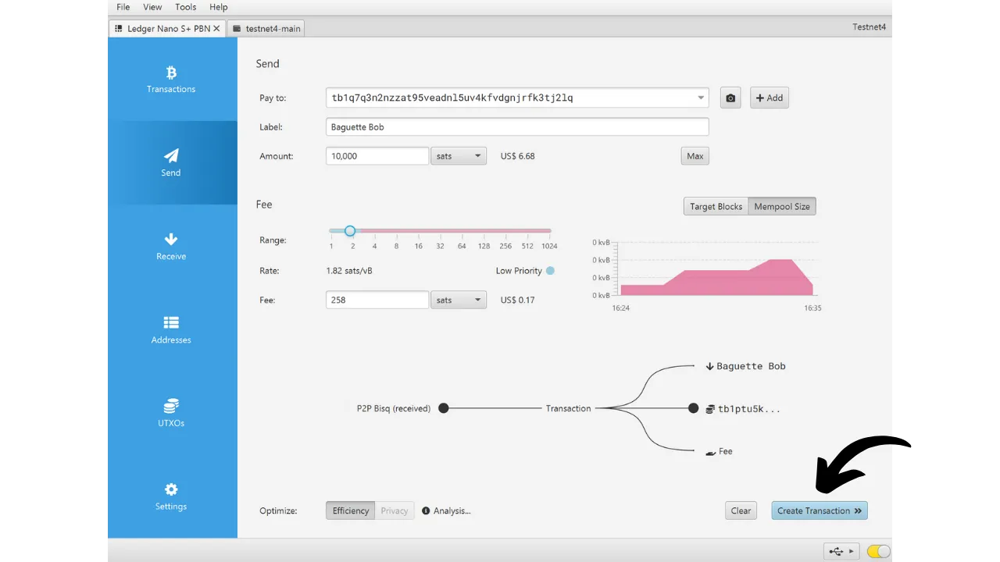

Hvis alt ser bra ut, klikker du på "*Finalize Transaction for Signing*".

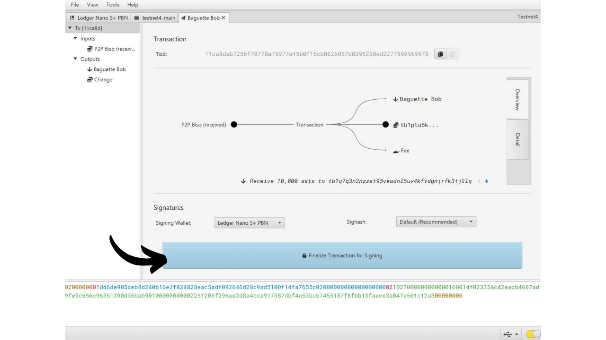

Klikk på "*Signer*".

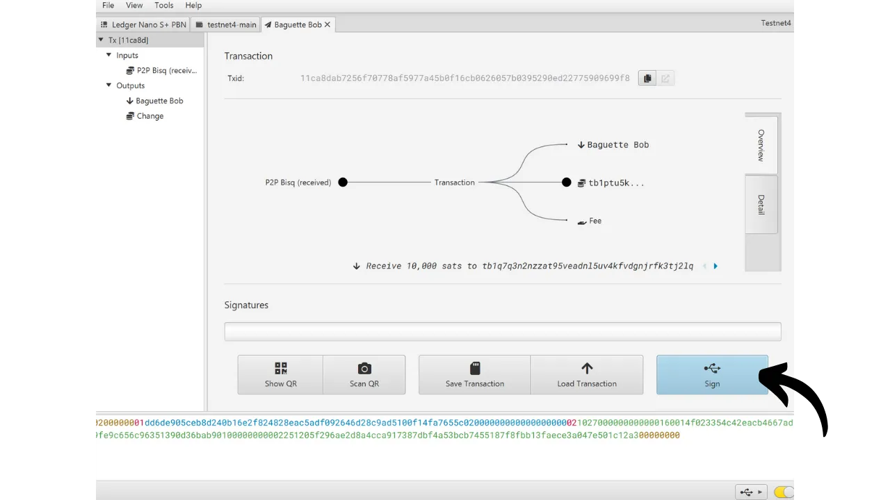

Klikk på "*Sign*" ved siden av Ledger Nano S Plus.

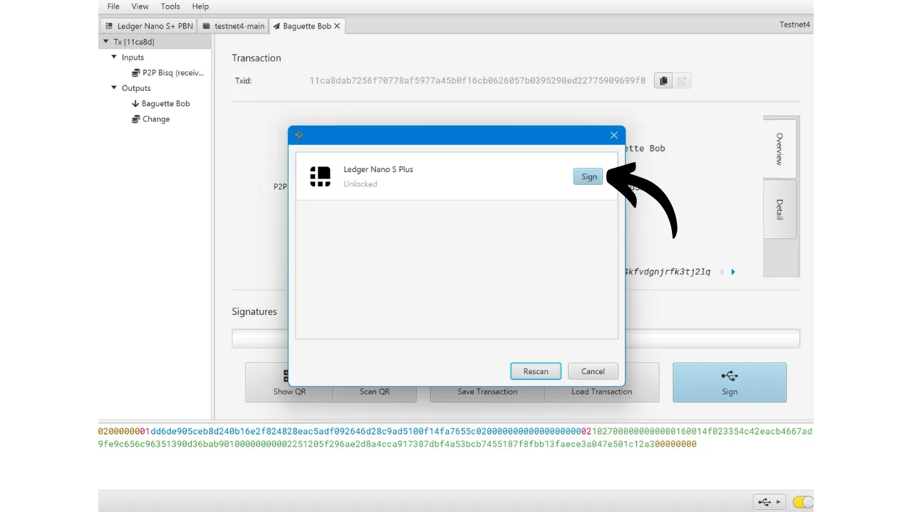

Kontroller transaksjonsinnstillingene på skjermbildet i hovedboken, inkludert mottakerens mottaksadresse, det sendte beløpet og gebyrbeløpet.

Hvis alt ser bra ut, trykker du på de to knappene på "*Signer transaksjon*" for å signere.

Transaksjonen din er nå signert. Dobbeltsjekk at alt ser bra ut, og klikk deretter på "*Broadcast Transaction*" for å kringkaste den på Bitcoin-nettverket.

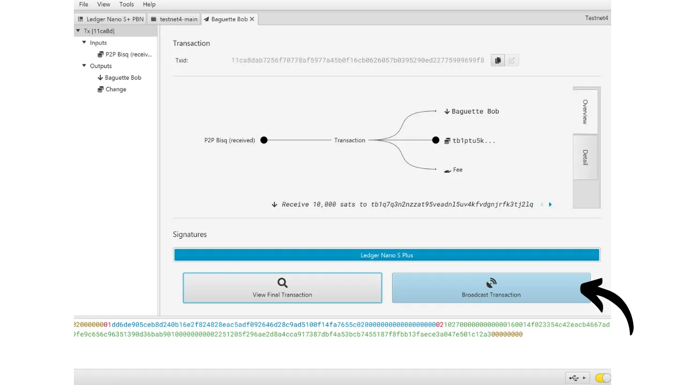

Du finner den under fanen "*Transaksjoner*" i Sparrow Wallet.

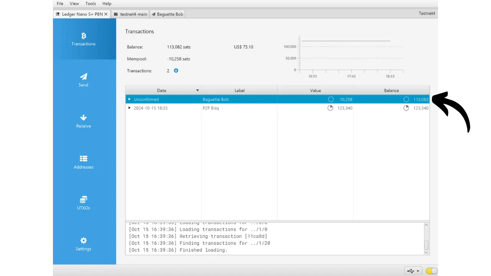

Gratulerer, du er nå oppdatert på grunnleggende bruk av Ledger Nano S Plus med Sparrow Wallet! I en fremtidig veiledning vil vi se hvordan du bruker Ledger med Liana for å utnytte Miniscript.

Hvis du fant denne opplæringen nyttig, vil jeg sette pris på det hvis du kan legge igjen tommelen opp nedenfor. Del gjerne denne artikkelen på dine sosiale nettverk. Tusen takk skal du ha!

Jeg anbefaler også at du sjekker ut denne komplette veiledningen om Ledger Flex:

https://planb.network/tutorials/wallet/hardware/ledger-flex-3728773e-74d4-4177-b39f-bd923700c76a