Dans ce tutoriel, nous allons expliquer pas à pas comment se servir de l'application Liana sur ordinateur. Vous apprendrez, entre autres, à mettre en place un plan de succession automatisé, à recevoir et à envoyer des bitcoins en situation normale, et à récupérer les fonds d'un portefeuille existant après une période donnée.

En janvier 2025, les portefeuilles matériels compatibles avec Liana étaient les suivants : le BitBox02, le Blockstream Jade, le Blockstream Jade Plus, le COLDCARD MK4, le COLDCARD Q, le Ledger Nano S, le Ledger Nano S Plus, le Ledger Nano X, le Ledger Flex, le Specter DIY.

Si vous souhaitez récupérer les fonds d'un portefeuille Liana existant, lisez la présentation ci-dessous et rendez-vous directement à la section « Récupération des bitcoins ».

## Présentation du logiciel Liana

Liana est un logiciel libre destiné à la création et à la gestion d'un portefeuille avancé, notamment dans le cadre d'un système d'héritage automatisé ou un mécanisme de sauvegarde robuste. Le projet est développé depuis 2022 par la société Wizardsardine, cofondée par Kévin Loaec et Antoine Poinsot. Sur le site officiel, Liana est présenté comme « un portefeuille simple à conservation personnelle, doté de fonctionnalités de récupération et d'héritage ». Le logiciel fonctionne sur ordinateur -- Linux, MacOS, Windows -- et son code source (ouvert) est disponible [sur GitHub](https://github.com/wizardsardine/liana).

Liana se base sur la programmabilité de Bitcoin pour mettre en place un portefeuille avancé. Il tire notamment parti des verrous temporels (*timelocks*), qui permettent de n'autoriser la dépense de fonds qu'une fois qu'une période de temps donnée est passée, et qui interviennent dans la récupération des bitcoins. Un portefeuille Liana est ainsi composé de plusieurs chemins de dépense (*spending paths*) :

- Un chemin de dépense principal, qui est toujours disponible ;
- Au moins un chemin de récupération, qui devient accessible après un certain temps.

Le schéma ci-dessous illustre le fonctionnement d'un portefeuille doté de deux chemins de dépense :

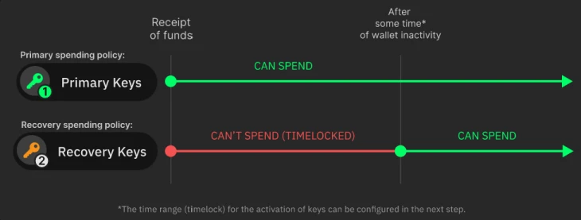

Ce fonctionnement permet de mettre en place diverses configurations, dont notamment :

- Un plan de succession (ou d'héritage), permettant aux héritiers de récupérer les fonds dans le cas du décès de l'utilisateur. Si vous voulez avoir plus d'informations sur le sujet, nous vous conseillons de lire la [partie 4](https://planb.network/courses/btc102/233c88d3-2e8e-5eba-ac06-efe67a209038) du cours BTC102.

- Une sauvegarde renforcée avec un délai de récupération, donnant à l'utilisateur la possibilité de se servir de son portefeuille sans avoir à garder la phrase secrète correspondante et risquer de se la faire voler, lors d'un cambriolage par exemple.

- Un filet de sécurité pour une personne qui commence avec Bitcoin : cette dernière gèrera son propre portefeuille et son « gardien » (un proche par exemple) se réservera le droit de récupérer ses fonds après une période donnée.

- Un schéma de signature multipartite (*multisig*) avec baisse des exigences dans le temps, permettant de faire face à la disparition d'un ou plusieurs des participants, comme les associés d'une entreprise par exemple.

Le gros point fort de Liana est qu'il introduit un moyen standardisé de garantir la récupération des fonds dans le cas de perte de la clé principale, utilisée pour la dépense courante. Cela constitue une immense innovation pour la conservation propre des fonds, qui comporte de nombreux risques, notamment si l'on est peu informé sur le sujet. Liana pourrait donc pousser les utilisateurs les plus frileux à ne plus avoir recours à un dépositaire (comme une plateforme de change) pour détenir leurs fonds et à retrouver la propriété de leur argent, conformément à l'éthos cypherpunk de Bitcoin.

Bien sûr, le fonctionnement de Liana s'accompagne de certains inconvénients. Le premier défaut est qu'il faut actualiser le portefeuille régulièrement en effectuant une transaction sur la chaîne de blocs de Bitcoin. Cette contrainte peut s'avérer pénible (selon la fréquence d'utilisation du logiciel) et coûteuse (selon le niveau des frais du moment), mais c'est le prix à payer pour bénéficier d'une sécurité supplémentaire.

Un second point négatif peut être la confidentialité. Lorsque vous faites participer une autre personne dans la configuration, elle a connaissance de l'intégralité de vos adresses et peut donc surveiller votre activité. Cependant, le problème ne se posera pas si vous optez pour une sauvegarde renforcée, ou pour un plan de succession dans lequel votre héritier n'a pas une connaissance immédiate des détails concernant le portefeuille.

## Préparation

Dans ce tutoriel, nous mettrons en place un plan de succession. Nous utiliserons pour ce faire :

- Un Ledger Nano S Plus, servant à la dépense courante ;

https://planb.network/tutorials/wallet/hardware/ledger-nano-s-plus-75043cb3-2e8e-43e8-862d-ca243b8215a4

- Un Blockstream Jade, servant à la récupération des fonds ;

https://planb.network/tutorials/wallet/hardware/jade-7d62bf0c-f460-4e68-9635-af9b731dabc3

- Deux moyens de stockage (clés USB) où enregistrer le descripteur du portefeuille ;

- Une lettre de succession, contenant les instructions pour récupérer les fonds ;

- Un sachet scellé numéroté, permettant de s'assurer que l'appareil de récupération (le Jade) n'a pas été utilisé.

## Installation et configuration

Rendez-vous sur le site officiel de Wizardsardine et téléchargez Liana à l'adresse https://wizardsardine.com/liana/. Vous pouvez aussi télécharger la dernière version [depuis le dépôt GitHub](https://github.com/wizardsardine/liana/releases), où vous pouvez vérifier l'authenticité du logiciel. La version utilisée dans ce tutoriel est la version 0.9.

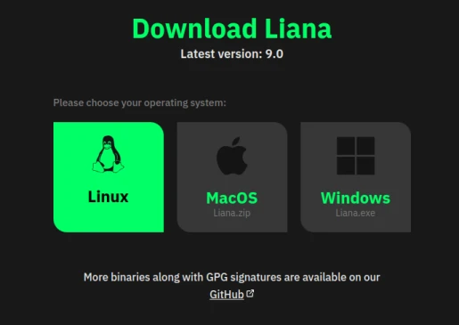

Pour savoir comment vérifier manuellement l'authenticité et l'intégrité d'un logiciel avant son installation, nous vous recommandons de consulter ce tutoriel :

https://planb.network/tutorials/others/general/integrity-authenticity-21d0420a-be02-4663-94a3-8d487f23becc

Installez le logiciel sur votre machine et lancez-le. Choisissez l'option « *Create a new Liana wallet* » pour configurer votre portefeuille.

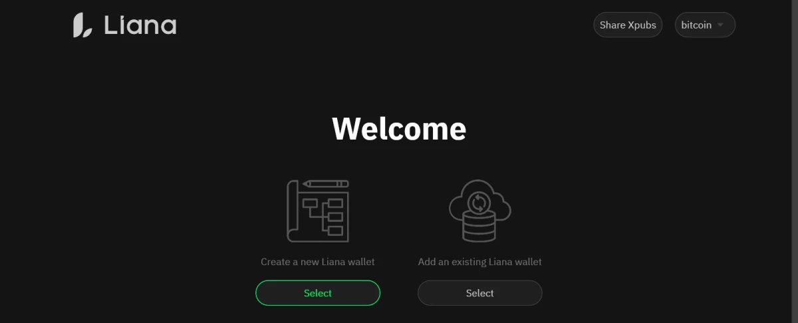

Choisissez votre type de portefeuille. Si vous voulez mettre en place une sauvegarde renforcée avec délai de récupération, vous pouvez choisir l'option « *Build your own* » et opter pour le schéma proposé par défaut. Le fonctionnement sera sensiblement le même, à l'exception que vous ne devrez pas conserver la phrase de récupération du portefeuille matériel.

Nous ignorons ici le cas de la signature multipartite (« *Expanding multisig* ») qui met en place une configuration plus complexe.

Dans le cadre de ce tutoriel, nous utiliserons le plan de succession simple (« *Simple inheritance* »).

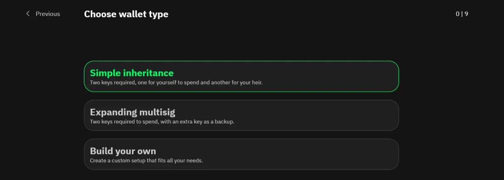

Une rapide explication vous est ensuite proposée.

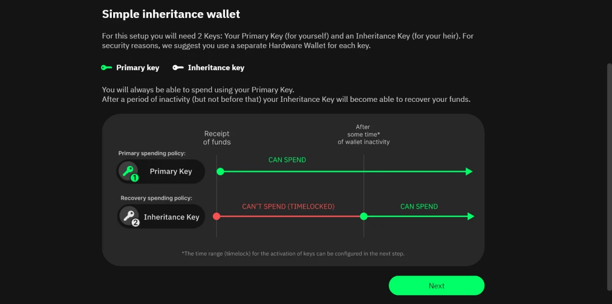

Après avoir lu l'explication, vous pourrez configurer les clés de votre portefeuille Liana. C'est une étape cruciale, car elle décide des caractéristiques de dépense de votre compte.


Tout d'abord, dans le menu « *Advanced Settings* », vous pouvez décider du « type de descripteur », c'est-à-dire la façon dont le contrat sera écrit sur la chaîne. Vous avez le choix entre deux types : P2WSH (SegWit) ou Taproot. Dans les deux cas, la sémantique des conditions de dépense sera la même. Bien que P2WSH favorise la compréhension du contrat, Taproot est supérieur dans le sens où il permet de cacher les conditions non exploitées et d'économiser des frais lors de la récupération.

Ce choix est optionnel : dans le doute, laissez l'option par défaut (P2WSH dans le cas de la version 0.9, mais cela est amené à changer).

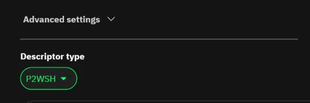

Puis, configurez votre clé principale (*primary key*). Cette clé (ou plutôt, cet ensemble de clés) sera utilisée pour la dépense courante des fonds, qui n'est soumise à aucune condition de temporalité. En cliquant sur « *Set* », vous pourrez choisir l'appareil de signature (*signing device*) correspondant. Dans notre cas, nous avons choisi le portefeuille matériel Ledger Nano S Plus.

Autorisez le partage de la clé publique étendue depuis l'appareil. Donnez à cette clé un nom évocateur (ici « Nano S+ »). Notez que toutes les applications installées sur l'appareil continueront à fonctionner normalement.

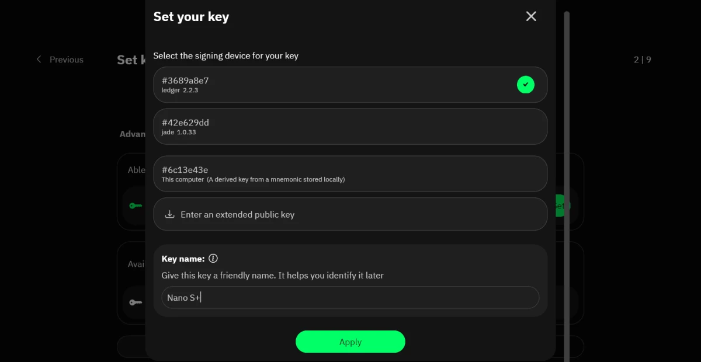

Ensuite, configurez le délai de récupération, c'est-à-dire le temps au bout duquel les fonds pourront être dépensés par la clé de succession (*inheritance key*). Ce délai est défini en nombre de blocs, chaque bloc étant séparé par 10 minutes en moyenne. Il peut aller de 10 minutes (1 bloc) à 15 mois environ (65 535 blocs). Cette borne supérieure est une limitation du protocole Bitcoin, le temps de verrouillage étant encodé sur 16 bits.

Sauf circonstances particulières, optez pour le délai le plus élevé : 15 mois ou 65 535 blocs. Vous pourrez ainsi économiser des frais. Nous vous conseillons cependant de procéder à la manipulation d'actualisation (décrite dans la section « Actualisation du portefeuille ») une fois par an, toujours durant la même période de l'année, afin de « ritualiser » cette pratique et éviter d'oublier.

Ici, nous avons mis en place un délai de récupération d'une heure (6 blocs) pour procéder à nos essais.

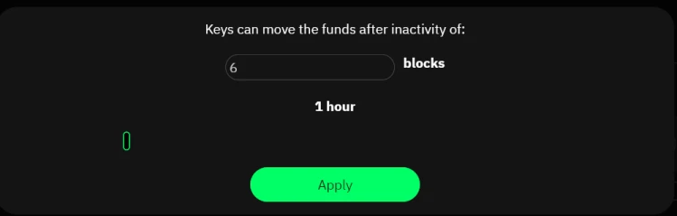

Enfin, configurez votre clé de succession. Cette clé (ou plutôt, cet ensemble de clés) permettra de récupérer les fonds dans le cas où vous disparaîtriez. Cliquez sur « *Set* », choisissez l'appareil de signature et validez le partage de la clé publique étendue sur celui-ci.

Pour ce tutoriel, nous avons choisi le Jade. Donnez à la clé un nom évocateur (ici « Jade »). Comme pour le premier appareil, les comptes classiques continueront de fonctionner.

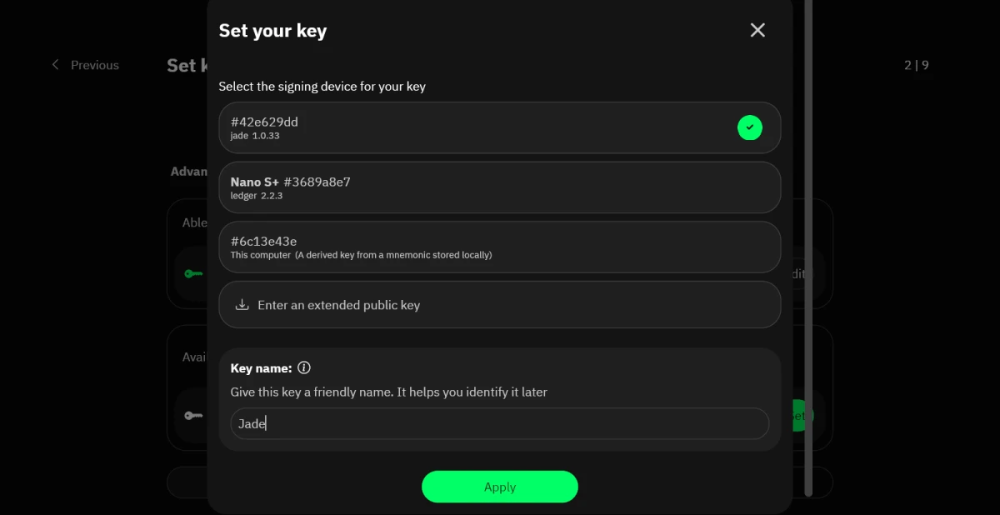

Une fois que toutes ces actions réalisées, vérifiez que tout est en ordre et cliquez sur « *Continue* » pour confirmer vos choix.

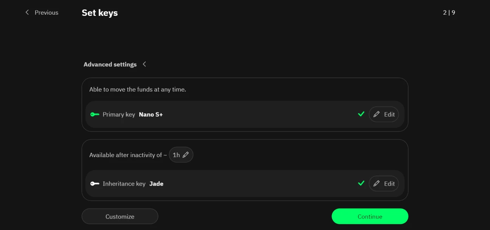

L'étape suivante est la sauvegarde du descripteur (*descriptor*) de votre portefeuille. Il s'agit de l'information permettant de retrouver les fonds présents sur le compte. Contrairement à la phrase mnémotechnique, le descripteur ne permet pas de dépenser des fonds, de sorte que sa divulgation ne posera qu'un problème de confidentialité (la personne connaîtra toutes vos transactions).

Sauvegardez le descripteur en deux exemplaires sur des supports électroniques, comme des clés USB. Veillez également à l'imprimer en deux exemplaires sur des feuilles de papier, afin de pouvoir y accéder en cas de dégradation des supports électroniques. Chaque sauvegarde doit être associée à un appareil de signature.

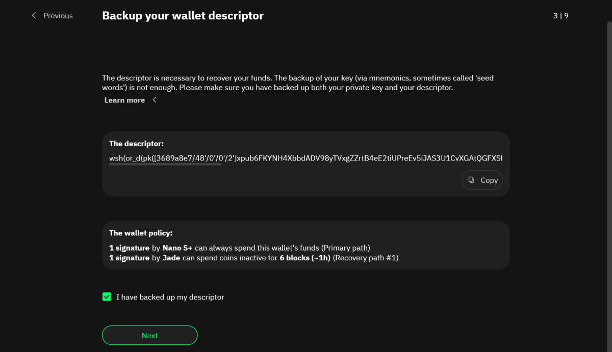

Notre descripteur (qui est analysé à la fin du tutoriel) est le suivant :

```plaintext
wsh(or_d(pk([3689a8e7/48'/0'/0'/2']xpub6FKYNH4XbbdADV98yTVxgZZrtB4eE2tiUPreEv5iJAS3U1CvXGAtQGFXSHyFYdYNn9wNa9KU1pwfYoxQhwq4sPXGihD725VncdSy66v9WQa/<0;1>/*),and_v(v:pkh([42e629dd/48'/0'/0'/2']xpub6DpQGv9LkwAQXvghWASvsfA7t1BVj7bGDQ939v32iB6aUJsMRB6inckim26gRp74NBdS2zuyfHNXDZ9dTuNXkFFiz6QvwEeVvBuC2cnRWQd/<0;1>/*),older(6))))#8alrve5h
```

L'étape finale de la configuration initiale du portefeuille consiste à vérifier le descripteur dans chacun des portefeuilles matériels qui servent d'appareils de signature.


Faites l'opération pour chacun des appareils de signature. Vous devrez vérifier et confirmer l'ajout du descripteur sur chaque portefeuille matériel.


Les informations relatives à votre portefeuille sont à présent enregistrées, et il ne vous reste plus qu'à configurer la façon dont vous voulez vous connecter au réseau Bitcoin. Vous pouvez choisir d'utiliser votre propre nœud (local ou distant) ou bien utiliser l'infrastructure de WizardSardine. Dans le second cas, vous devrez lier une adresse de courrier électronique à votre portefeuille qui vous permettra de récupérer le descripteur. WizardSardine aura accès à toutes vos transactions. La première option est donc suggérée.

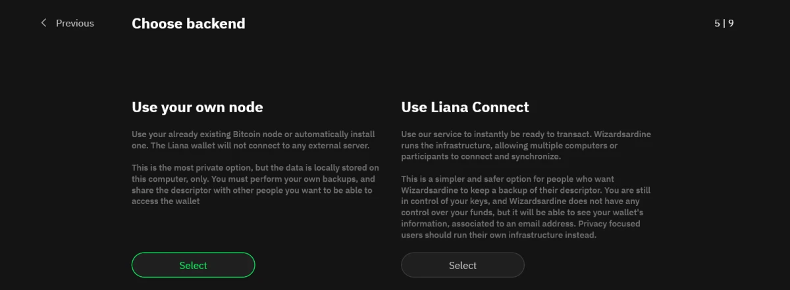

Nous avons choisi d'utiliser notre propre nœud. Vous pouvez utiliser un nœud existant, ou installer un nœud réduit (*pruned node*) sur votre machine. Si vous n'avez accès à aucun autre nœud, installez votre nœud sur votre machine, ce qui devrait prendre un temps important (de l'ordre de plusieurs jours).

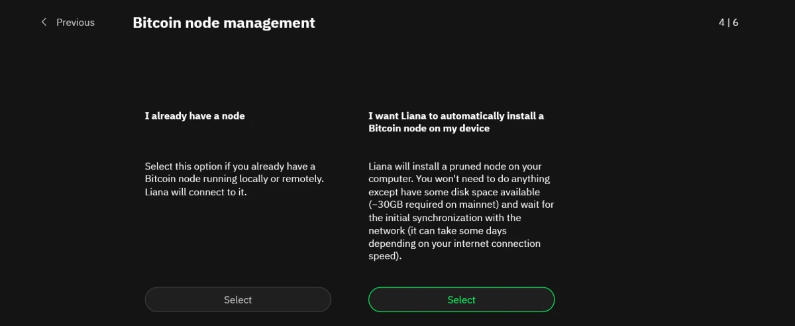

Pour ce tutoriel, nous avons utilisé un serveur Electrum existant (public). Attention ! Celui-ci avait accès à toute notre activité avec le portefeuille Liana. Préférez donc utiliser votre propre nœud si vous voulez protéger votre vie privée.

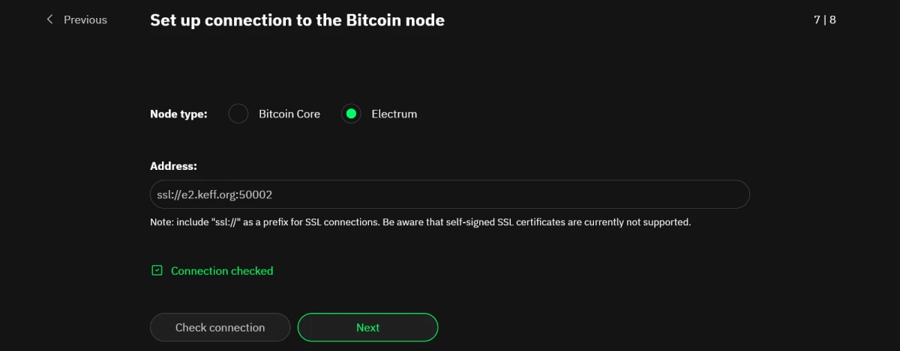

Une fois la configuration du nœud terminée, l'écran principal devrait s'ouvrir et afficher votre portefeuille Liana fraîchement créé.

Profitez-en pour mettre en lieu sûr l'appareil de récupération. Il devra être entreposé à un endroit stratégique, de sorte à être retrouvé par vos héritiers en cas de décès.

Pour plus de sécurité, vous pouvez placer les éléments servant à la récupération dans un sachet scellé (*tamper-evident bag*) et inscrire quelque part son numéro de série. Cette méthode permet de vous assurer que personne n'y a accédé et que votre dispositif reste valide.

Dans notre exemple, nous avons rassemblé les éléments suivants :

- Le Blockstream Jade servant d'appareil de signature pour la succession ;
- Un câble USB, permettant de brancher et de recharger l'appareil ;
- Une sauvegarde papier de la phrase en cas de dysfonctionnement ou de dégradation de l'appareil (notez que le support peut aussi être en méta, et donc à l'abri des intempéries, comme c'est le cas des capsules Cryptosteel par exemple) ;
- La clé USB contenant le descripteur du portefeuille ;
- La sauvegarde papier du descripteur, en cas de dysfonctionnement ou de dégradation de la clé USB (cette sauvegarde n'a pas été prise en photo ici) ;
- Une lettre de succession décrivant les opérations à effectuer pour récupérer les fonds.

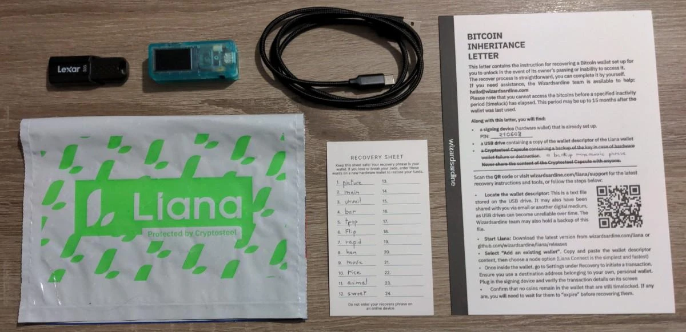

Et nous avons mis ces éléments mis sous scellé !

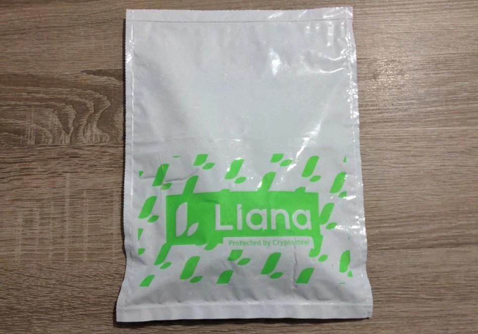

## Réception de fonds

L'écran principal de Liana affiche votre solde ainsi que les transactions (passées et en cours) liées à votre portefeuille. Dans notre cas, le solde est à zéro, ce qui est normal.

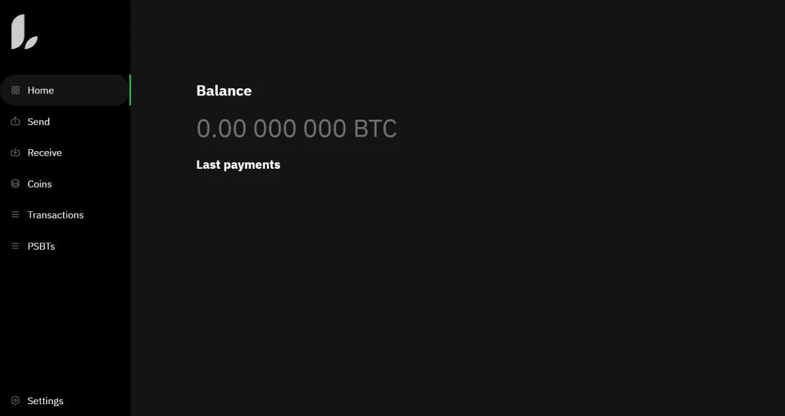

Pour recevoir des fonds, allez dans l'onglet « *Receive* » et cliquez sur « *Generate address* ». Une nouvelle adresse devrait apparaître sur votre écran. Celle-ci est plus longue que dans les portefeuilles classiques : il s'agit en effet d'une adresse liée à un contrat autonome (P2WSH ou Taproot).

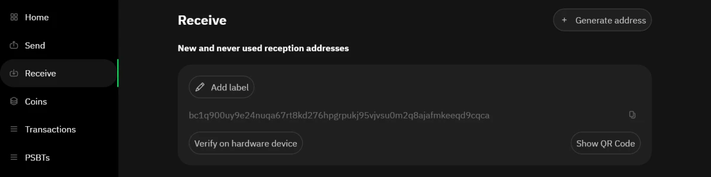

Vous devez vérifier cette adresse sur votre portefeuille matériel en cliquant sur « *Verify on hardware device* ».

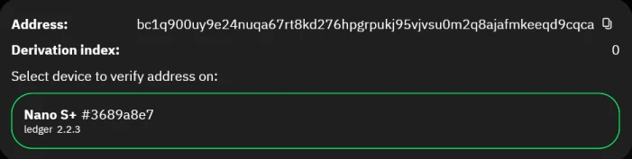

Une fois les fonds envoyés, la transaction apparaît sur l'écran principal (d'abord comme non confirmée, puis comme confirmée). Ici, nous avons envoyé 50 000 satoshis (un peu plus de 50 $ au moment du transfert) pour réaliser cet essai. Il va de soi que le montant transféré dans votre cas devra être un ordre de grandeur supérieur à cette valeur en raison des frais de transaction.

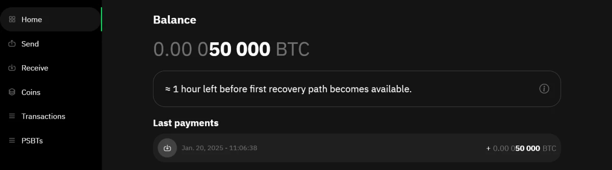

Vous pouvez vérifier l'état du délai d'expiration des fonds en allant dans l'onglet « *Coins* ». Cet onglet vous présente les différentes pièces (UTXO) présentes dans votre portefeuille. Ici, on peut voir que la pièce de 50 000 satoshis créée par notre transaction expire le jour même (une heure de temps).

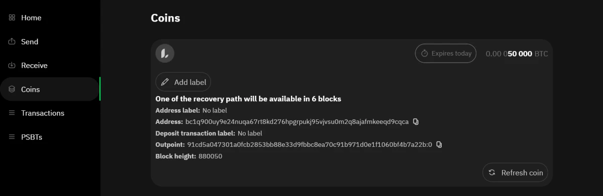

Pour saisir un peu mieux ce qu'est le modèle de représentation par UTXO utilisé dans Bitcoin, vous pouvez consulter la première partie du cours sur la confidentialité dans Bitcoin rédigé par Loïc Morel :

https://planb.network/courses/btc204

## Dépense courante

La dépense courante est la situation normale d'utilisation de Liana. L'envoi de bitcoins avec la clé principale fonctionne comme dans tous les portefeuilles Bitcoin classiques comme Electrum ou Sparrow.

Pour faire une dépense, allez dans l'onglet « *Send* » et indiquez les informations essentielles : l'adresse BTC du destinataire, le montant à envoyer et le taux de frais désiré. Une description (enregistrée localement) peut aussi être ajoutée pour votre confort personnel. Dans notre exemple, nous avons envoyé 10 000 satoshis à un certain Bob, pour un taux de frais de 4 sat/ov, soit 0,67 $ au moment de la transaction.

Liana propose également le « contrôle des pièces » (*coin control*) : vous devez ainsi indiquer quelle pièce (UTXO) vous souhaitez dépenser. Ici, nous avons choisi la pièce de 50 000 satoshis précédemment créée.

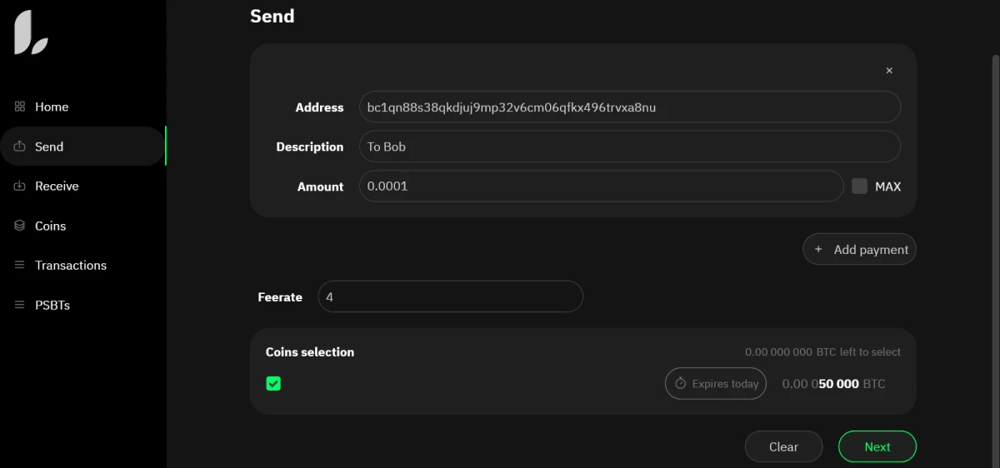

Puis, signez la transaction avec votre appareil de signature lié à la clé principale en cliquant sur « *Sign* ». Vous devrez vérifier et confirmer la transaction sur votre portefeuille matériel. Ici, nous avons utilisé le Nano S Plus pour signer la transaction.

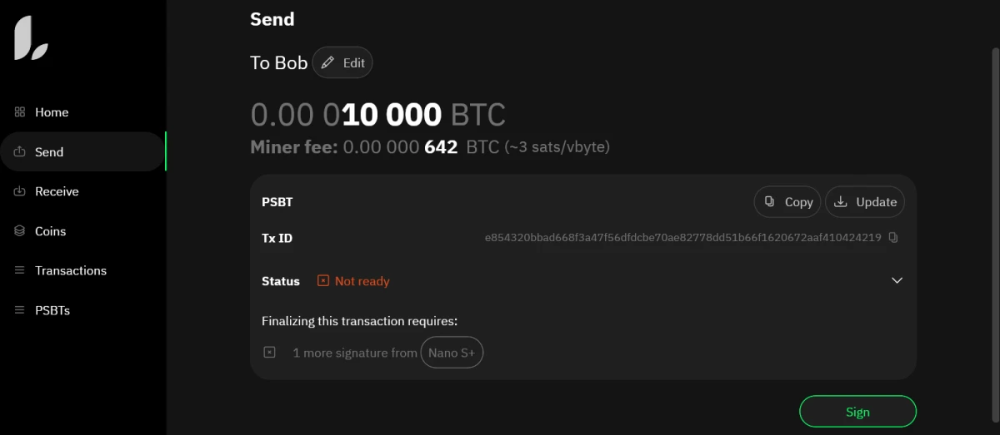

Enfin, diffusez la transaction sur le réseau en cliquant « *Broadcast* ». Notez que l'envoi de fonds va réinitialiser le délai de récupération des pièces utilisées.

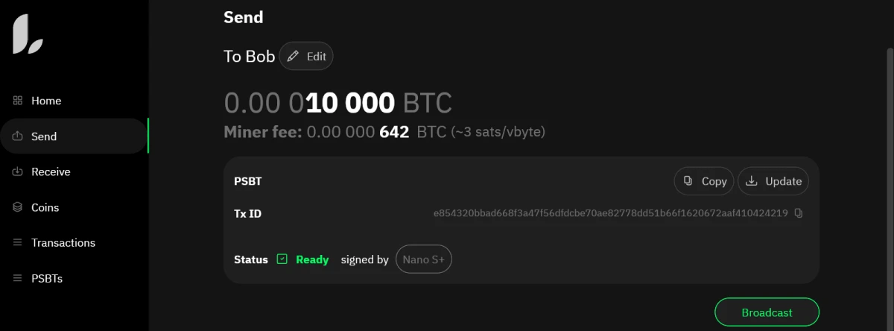

La transaction apparaîtra sur l'écran principal et votre solde sera mis à jour.

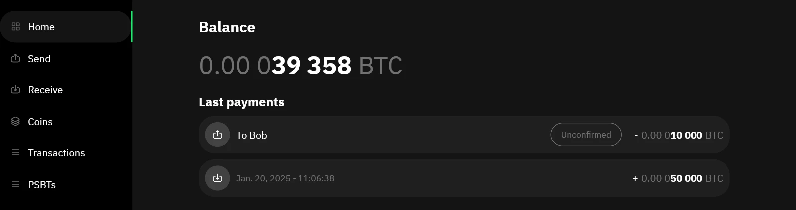

## Actualisation du portefeuille

Comme expliqué plus haut, le portefeuille Liana requiert que vous actualisiez vos fonds régulièrement en effectuant une opération sur la chaîne de blocs. Si vous ne le faites pas, vos fonds peuvent être récupérés par votre héritier (ou par votre second appareil dans le cas d'une sauvegarde renforcée). Cette situation n'est pas extrêmement dangereuse, mais cela va à l'encontre de la raison pour laquelle vous avez mis en place ce mécanisme : rester maître de vos bitcoins sans recourir à un tiers de confiance, tout en bénéficiant d'un filet de sécurité.

Un avertissement sera affiché avant que vos fonds (ou une partie d'entre eux) arrivent à expiration et puissent être dépensés par la clé de récupération. Il sera indiqué que votre « chemin de récupération » (*recovery path*) est bientôt disponible. Étant donné la brièveté de notre délai de récupération (une heure), ce message est affiché directement dans notre cas.

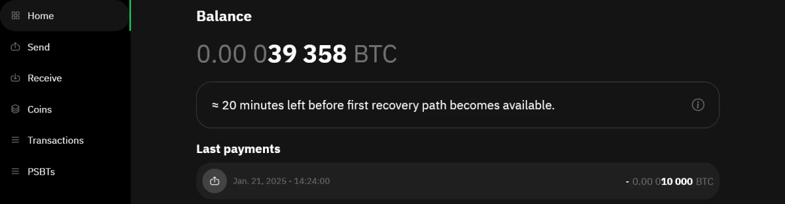

Lorsque la fin du délai approchera, un bouton vous invitant à actualiser les fonds concernés apparaîtra.

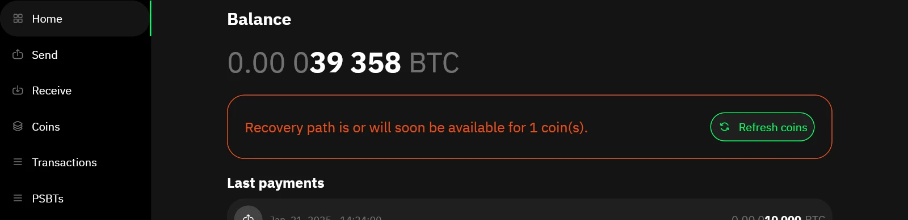

Pour actualiser vos pièces, allez donc dans l'onglet « *Coins* » et cliquez sur « *Refresh coin* » dans l'encadré de la pièce correspondante. Si vous avez plusieurs pièces, vous devriez les actualiser une à une, et avec un intervalle de temps relativement espacé, pour des raisons de confidentialité. Pour limiter les frais, vous pouvez consolider vos fonds en envoyant l'intégralité des fonds du portefeuille sur une nouvelle adresse de réception, mais cette opération nuira à votre confidentialité.

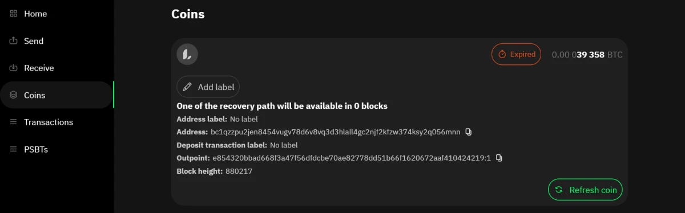

Indiquez le taux de frais désiré pour la transaction. Puisqu'il s'agit d'un transfert à vous-mêmes, vous pouvez configurer un taux de frais assez bas, surtout si vous vous y prenez plusieurs jours avant l'expiration.

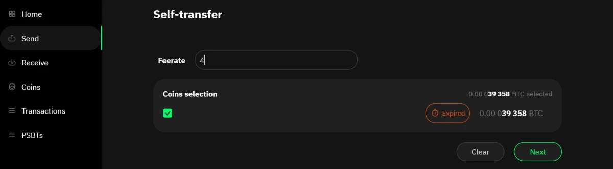

La transaction (étiquetée « *self-transfer* ») sera uniquement visible dans l'onglet « *Transactions* ».

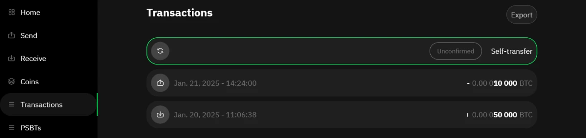

Une fois celle-ci confirmée, votre pièce est à l'abri ! Vous pouvez être tranquille jusqu'à la prochaine expiration.

## Récupération des bitcoins

Lors de la récupération des fonds présents sur le portefeuille Liana, vous pouvez être confrontés à deux situations. Vous pouvez avoir accès à l'ordinateur sur lequel est installé le logiciel, auquel cas il vous suffit de l'ouvrir (ce qui aura lieu dans le cas du modèle de sauvegarde renforcée). Toutefois, il est possible que vous n'ayez pas accès à cet ordinateur ; c'est pourquoi nous repartirons de zéro ici. Notez que la manipulation de récupération sera la même dans les deux cas.

Pour commencer, téléchargez Liana depuis [le site officiel de Wizardsardine](https://wizardsardine.com/liana/), ou bien depuis [le dépôt GitHub](https://github.com/wizardsardine/liana/releases), où vous pouvez vérifier l'authenticité du logiciel. Installez le logiciel et lancez-le. La version utilisée dans notre cas est la version 0.9, donc les visuels peuvent avoir changé. Sur l'écran d'accueil, sélectionnez l'option  « *Add an existing Liana wallet* ».

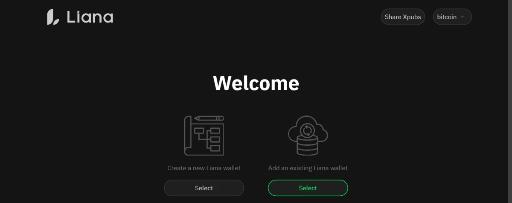

Configurez la façon dont vous voulez vous connecter au réseau. Vous pouvez choisir d'utiliser votre propre nœud (local ou distant) ou bien utiliser l'infrastructure de WizardSardine. Dans le second cas, vous devrez disposer de l'adresse de courrier électronique utilisée par le créateur du portefeuille, afin de procéder à la localisation des fonds automatiquement. Si vous ne disposez pas d'une telle information, choisissez la première option.

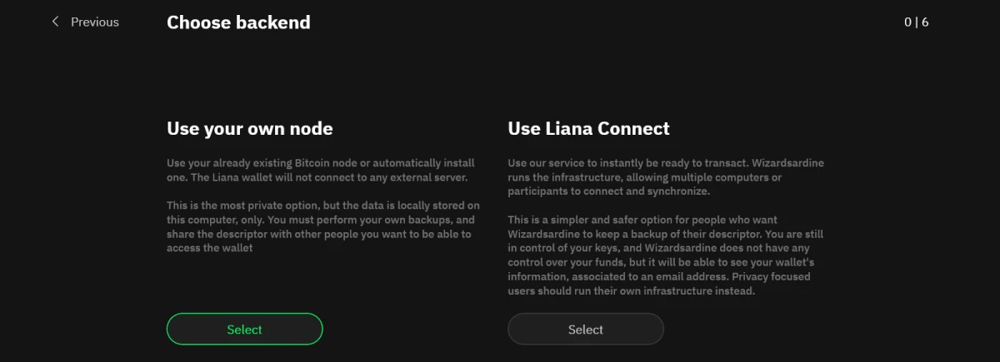

Dans le cas où vous utilisez votre propre nœud, importez le descripteur du portefeuille. Celui-ci est une description technique du compte permettant de récupérer les fonds qui s'y trouvent. Dans notre cas, il s'agit de l'information suivante :

```plaintext
wsh(or_d(pk([3689a8e7/48'/0'/0'/2']xpub6FKYNH4XbbdADV98yTVxgZZrtB4eE2tiUPreEv5iJAS3U1CvXGAtQGFXSHyFYdYNn9wNa9KU1pwfYoxQhwq4sPXGihD725VncdSy66v9WQa/<0;1>/*),and_v(v:pkh([42e629dd/48'/0'/0'/2']xpub6DpQGv9LkwAQXvghWASvsfA7t1BVj7bGDQ939v32iB6aUJsMRB6inckim26gRp74NBdS2zuyfHNXDZ9dTuNXkFFiz6QvwEeVvBuC2cnRWQd/<0;1>/*),older(6))))#8alrve5h
```


Liana vous propose ensuite d'entrer une phrase mnémotechnique. Si vous disposez d'un appareil de signature fonctionnel (portefeuille matériel), ignorez cette partie. Si votre appareil est manquant ou endommagé, mais que vous disposez des 12 ou 24 mots correspondant, vous pouvez cependant utiliser cette option. Pour plus de sécurité (dans le cas où le montant à récupérer serait élevé), nous vous suggérons tout de même de vous procurer un nouveau portefeuille matériel et d'utiliser la phrase mnémotechnique pour restaurer les clés sur ce dernier.

Dans notre cas, nous utilisons le portefeuille matériel Blockstream Jade comme appareil de récupération et choisissons de passer (« *Skip* ») cette étape.

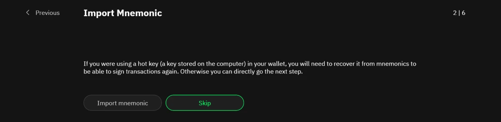

Vérifiez et enregistrez le descripteur dans votre appareil de signature en sélectionnant ce dernier sur l'écran. Si votre portefeuille matériel n'apparaît pas, vérifiez qu'il est bien connecté et déverrouillé. Vérifiez et confirmez l'ajout de cette information sur votre appareil.

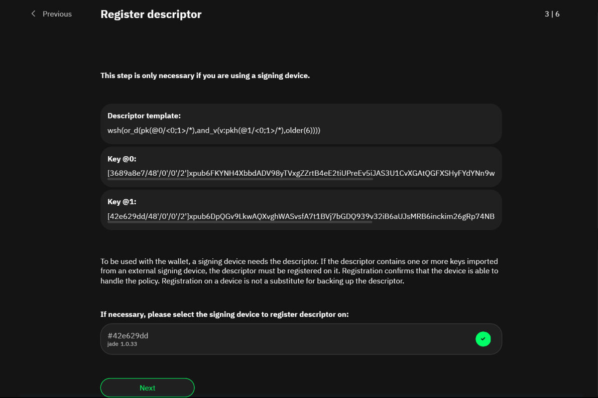

Configurez votre nœud. Vous pouvez utiliser un nœud existant ou installer un nœud réduit (*pruned node*) sur votre machine. Dans notre cas, nous avons utilisé un nœud existant.

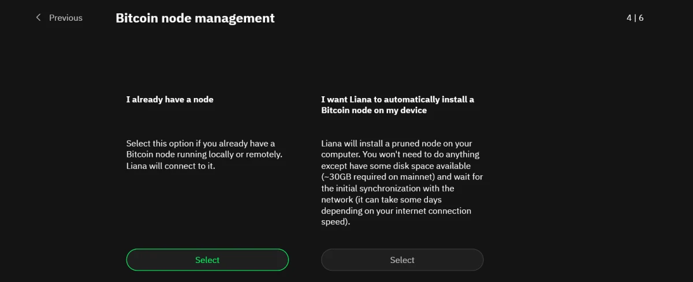

Pour ce tutoriel, nous avons utilisé un serveur Electrum public. Celui-ci avait cependant accès à toute notre activité avec le portefeuille Liana. Préférez donc utiliser votre propre nœud si vous voulez protéger votre vie privée.


Une fois votre nœud configuré, vous arrivez sur l'écran principal du portefeuille où vous pouvez observer le solde et les transactions passées liées au compte. Vous voyez aussi si des fonds peuvent être récupérés. Ici, nous constatons qu'une pièce peut être récupérée.

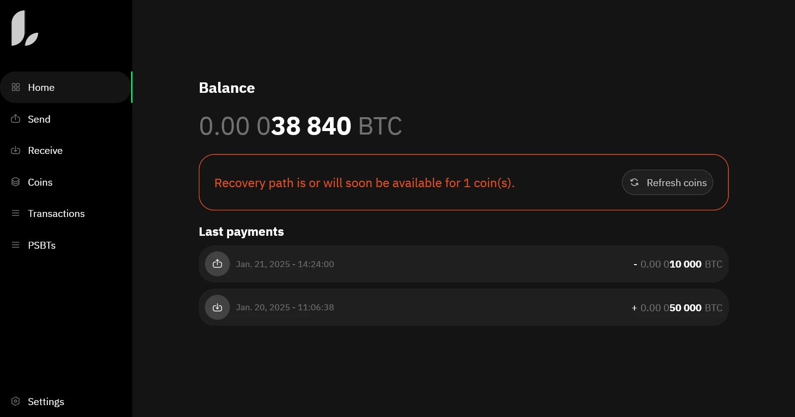

Pour récupérer les fonds du portefeuille, allez dans les paramètres (« *Settings* ») en bas à gauche et cliquez sur « *Recovery* ».

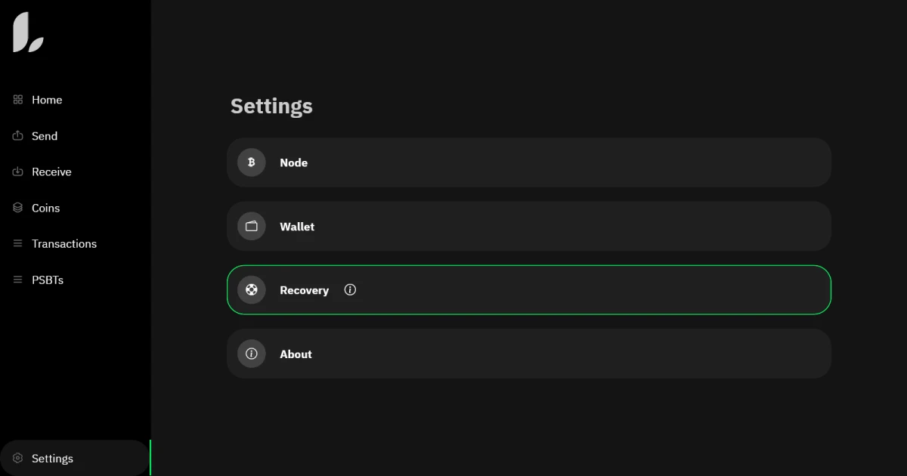

Dépensez la pièce présente dans le portefeuille en cochant la case correspondante. Indiquez l'adresse BTC où vous voulez envoyer les fonds, ainsi que le taux des frais de transaction. Puis cliquez sur « *Next* ».

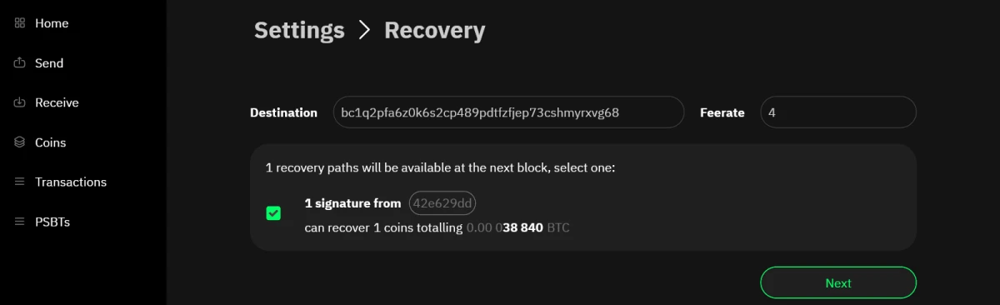

Signez la transaction en cliquant sur « *Sign* » et en valident l'opération sur votre portefeuille matériel.

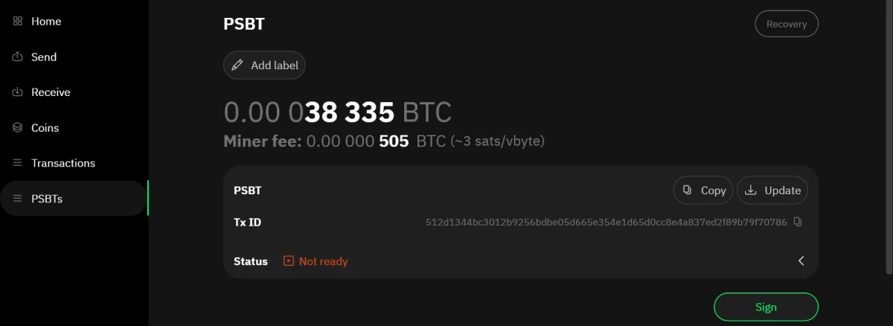

Puis diffusez-la sur le réseau en cliquant sur « *Broadcast* ».

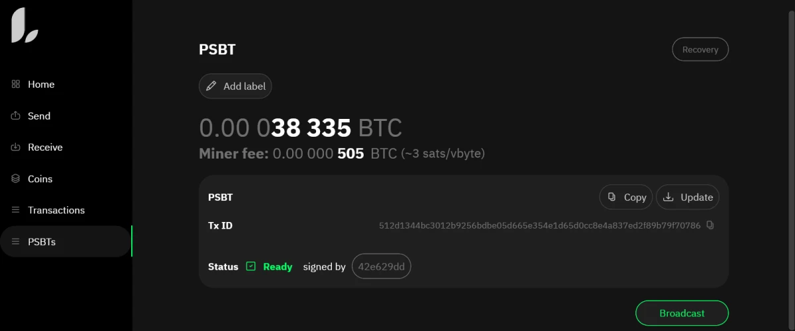

La transaction devrait apparaître sur l'écran principal. Une fois confirmée, la récupération sera terminée !

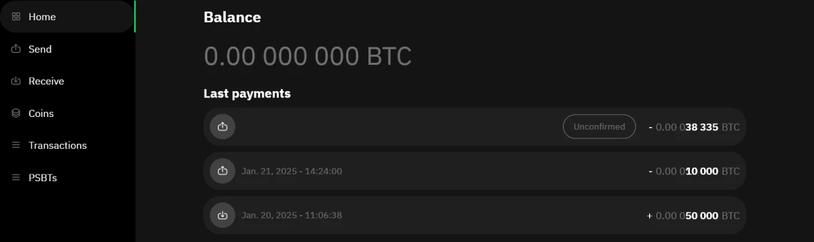

## Vidéos

Si vous voulez en savoir plus sur Liana, il existe du contenu vidéo qui vous permettra de vous faire une idée plus claire de son fonctionnement. Voici une vidéo de présentation de Liana avec Kévin Loaec et Antoine Poinsot :


Et voici un tutoriel d'utilisation de Liana, avec Antoine Poinsot :


Les manipulations montrées dans cette dernière sont proches de ce qui a été présenté dans ce tutoriel.

## Bonus : analyse du descripteur

Le descripteur est une chaîne de caractère, lisible par l'homme, qui décrit un ensemble d'adresses de façon exhaustive. Il combine un certain nombre d'informations essentielles pour retrouver les pièces (UTXO) d'un portefeuille avancé. La façon dont est écrit le descripteur se base sur la [syntaxe de Miniscript](https://bitbox.swiss/blog/understanding-bitcoin-miniscript-part-2/), le langage d'écriture de scripts mis au point par Andrew Poelstra, Pieter Wuille et Sanket Kanjalkar en 2019.

Pour mieux comprendre pourquoi cette chaîne de caractère est importante, analysons le descripteur de notre exemple, qui est :

```plaintext
wsh(or_d(pk([3689a8e7/48'/0'/0'/2']xpub6FKYNH4XbbdADV98yTVxgZZrtB4eE2tiUPreEv5iJAS3U1CvXGAtQGFXSHyFYdYNn9wNa9KU1pwfYoxQhwq4sPXGihD725VncdSy66v9WQa/<0;1>/*),and_v(v:pkh([42e629dd/48'/0'/0'/2']xpub6DpQGv9LkwAQXvghWASvsfA7t1BVj7bGDQ939v32iB6aUJsMRB6inckim26gRp74NBdS2zuyfHNXDZ9dTuNXkFFiz6QvwEeVvBuC2cnRWQd/<0;1>/*),older(6))))#8alrve5h
```

Voici les informations que l'on peut extraire de ce descripteur :

- `wsh` (abréviation de *witness script hash*) : C'est le type de sortie transactionnelle créée. Si nous avions choisi d'utiliser Taproot, l'identifiant aurait été `tr`.
- `or_d` : Il s'agit d'un opérateur logique indiquant que *l'une des deux* conditions qui suivent doit être remplie pour que la dépense soit acceptée (le `_d` indique une syntaxe particulière).
- `pk` (abréviation de *public key*) : Cet opérateur vérifie une signature donnée par rapport à la clé publique qui suit, et donne la réponse sous forme de booléen (TRUE ou FALSE).
- `[3689a8e7/48'/0'/0'/2']` : Cet élément comprend la trace (*fingerprint*) de la clé maîtresse du portefeuille matériel principal (ici le Nano S Plus), et le chemin de dérivation pour retrouver la clé privée étendue liée (de laquelle sont issues toutes les autres clés privées).
- `xpub6FKY ... WQa` : C'est la clé publique étendue liée au portefeuille matériel principal (ici le Nano S Plus)
- `/<0;1>/*` : Ce sont les chemins de dérivations permettant d'obtenir les clés simples et les adresses : `0` pour la réception, `1` pour les opérations internes (*change*), avec un « wildcard » (`*`) permettant la dérivation séquentielle de plusieurs adresses de manière paramétrable, similaire à la gestion d'un « gap limit » sur des logiciels de portefeuille classiques.
- `and_v` : Il s'agit d'un opérateur logique indiquant que *les deux* conditions qui suivent doivent être remplies pour que la dépense soit acceptée (le `_v` indique une syntaxe particulière).
- `v:pkh` (abréviation de *verify: public key hash*) : Cet opérateur vérifie une signature donnée et une clé publique données par rapport à l'empreinte (*hash*) de la clé publique qui suit. C'est essentiellement la même vérification que pour les scripts P2PKH et P2WPKH.
- `[42e629dd/48'/0'/0'/2']` : C'est le même élément que précédemment (composé de la trace et du chemin de dérivation), à l'exception qu'on indique la trace de la clé maîtresse du portefeuille matériel de récupération (ici le Jade).
- `xpub6DpQ ... WQd` : C'est la clé publique étendue liée au portefeuille matériel de récupération (ici le Jade).
- `older(6)` : Cet opérateur vérifie que la sortie transactionnelle créée doit avoir un âge strictement supérieur à 6 blocs pour être dépensée.

La dernière donnée (`8alrve5h`) est la somme de contrôle du descripteur, et correspond à l'identifiant du portefeuille.

Les scripts créés par ce portefeuille auront ainsi la forme suivante :

```plaintext
<primary_key> CHECKSIG IFDUP NOTIF DUP HASH160 <recovery_key_hash> EQUALVERIFY CHECKSIGVERIFY <locktime> CHECKSEQUENCEVERIFY ENDIF
```

Puisque la sécurité de votre portefeuille Bitcoin dépend aussi de votre compréhension de son fonctionnement, je vous suggère d'étudier en profondeur les mécanismes des portefeuilles déterministes et hiérarchiques en suivant cette formation gratuite sur Plan ₿ Network :

https://planb.network/courses/cyp201
