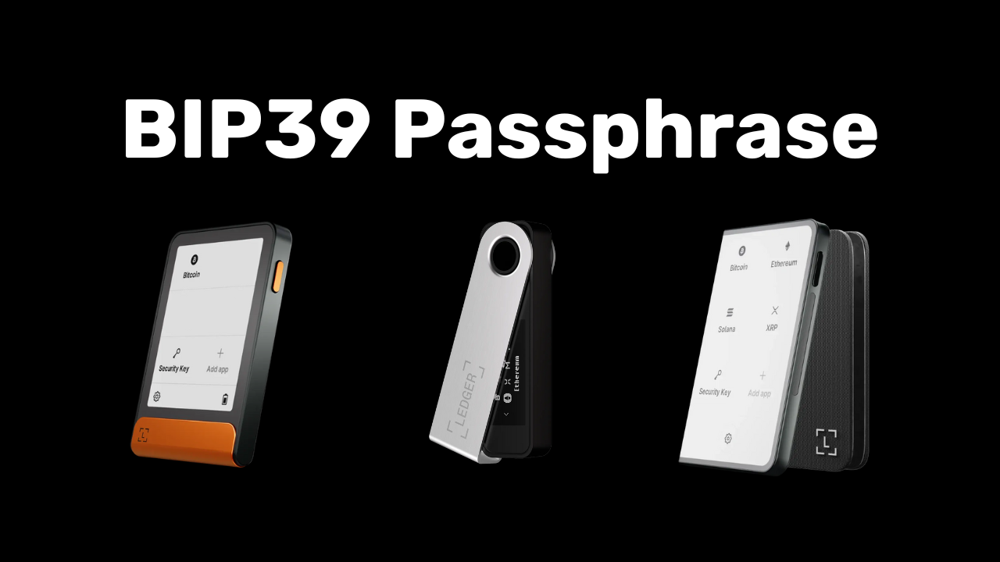

En BIP39-passordfrase er et valgfritt passord som, når det kombineres med din mnemoniske frase, gir et ekstra sikkerhetslag for deterministiske og hierarkiske Bitcoin-lommebøker. I denne veiledningen går vi sammen gjennom hvordan du setter opp en passordfrase på din sikre Bitcoin-lommebok på en Ledger (uavhengig av modell).

Hvis du ikke er kjent med konseptet med en passordfrase, hvordan det fungerer og hva det innebærer for Bitcoin-lommeboken din, anbefaler jeg på det sterkeste at du leser denne andre teoretiske artikkelen der jeg forklarer alt:

https://planb.network/tutorials/wallet/backup/passphrase-a26a0220-806c-44b4-af14-bafdeb1adce7
## Hvordan fungerer passordfrasen i en hovedbok?

Med Ledger-enheter har du to forskjellige alternativer for å konfigurere en passordfrase på lommeboken din: "*PIN-tied*"-alternativet og "*temporary*"-alternativet.

Med alternativet "*PIN-tied*" knytter du en passordfrase til en annen PIN-kode på din Ledger. Dette betyr at du vil ha to PIN-koder: én for å få tilgang til den vanlige lommeboken din uten passordfrase, og én for å få tilgang til den andre lommeboken som er beskyttet av passordfrasen.

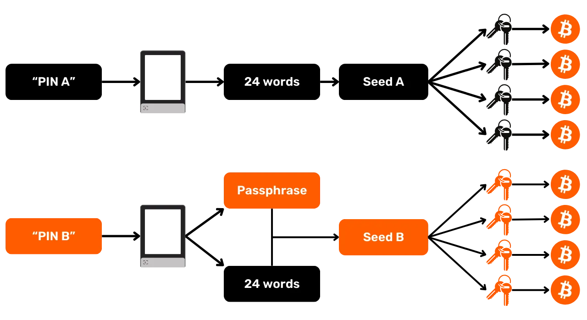

Selv med denne passordfrasen knyttet til den andre PIN-koden, forblir passordfrasen din passordfrase. Dette betyr at hvis du mister hovedboken din og ønsker å gjenopprette bitcoinsene dine på en annen enhet eller programvare, vil du absolutt trenge 24-ordsfrasen og den **fullstendige passordfrasen**. PIN-koden som er knyttet til passordfrasen, brukes bare for å få tilgang til den på din nåværende hovedbok, men den fungerer ikke på andre hovedbøker eller annen programvare. Det er derfor viktig å ta en fullstendig sikkerhetskopi av passordfrasen på et fysisk medium. **Det er ikke nok å kjenne til den sekundære PIN-koden for å få tilgang til lommeboken din**; det er bare en praktisk funksjon i hovedboken din.

Dette andre PIN-alternativet er spesielt interessant for å håndtere fysiske angrep. Hvis en angriper for eksempel tvinger deg til å låse opp enheten din for å stjele pengene dine, kan du bruke den første PIN-koden til å få tilgang til en falsk lommebok som inneholder en liten mengde bitcoins, mens hovedpengene dine er sikret bak den andre PIN-koden.

Dette alternativet gir dessuten alle sikkerhetsfordelene med BIP39-passordet, uten at du trenger å taste det inn manuelt hver gang du bruker signeringsenheten. På denne måten kan du bruke en lang og tilfeldig passordfrase, noe som styrker beskyttelsen mot brute force-angrep, samtidig som du slipper å måtte skrive den inn manuelt hver gang på enhetens små knapper.

Alternativet "midlertidig passordfrase" lagrer ikke passordfrasen på enheten. Hver gang du vil ha tilgang til den beskyttede lommeboken din, må du skrive inn passordfrasen manuelt på Ledger. Dette gjør bruken mer tungvint, men øker også sikkerheten noe ved at det ikke etterlates spor av passordfrasen på enheten. Så snart du slår av enheten, går den tilbake til standardtilstanden og krever en ny inntasting av den fullstendige passordfrasen for å få tilgang til de skjulte kontoene. Denne "midlertidige passordfrasen" ligner dermed på funksjonen til andre maskinvarelommebøker.

I denne veiledningen bruker jeg Ledger Flex som eksempel. Hvis du bruker en annen Ledger-modell, er prosessen den samme. For Ledger Stax er grensesnittet det samme som for Ledger Flex. Når det gjelder Nano S-, Nano S Plus- og Nano X-modellene, er prosessen og navnene på menyene de samme, selv om grensesnittet er annerledes.

**Hvis du allerede har mottatt bitcoins på din Ledger før du aktiverer passordfrasen, må du overføre dem via en Bitcoin-transaksjon. Passordfrasen genererer et sett med nye nøkler, og oppretter dermed en lommebok som er helt uavhengig av den opprinnelige lommeboken din. Når du legger til passordfrasen, får du en ny lommebok som vil være tom. Dette sletter imidlertid ikke den første lommeboken din uten passordfrase. Du kan fortsatt få tilgang til den, enten direkte via Ledger uten å skrive inn passordfrasen, eller via en annen programvare ved hjelp av 24-ordsfrasen din.

Før du starter denne veiledningen, må du forsikre deg om at du allerede har initialisert reskontroen og generert minnefrasen din. Hvis dette ikke er tilfelle og hovedboken din er ny, må du følge den spesifikke veiledningen for din modell som er tilgjengelig på PlanB Network. Når dette trinnet er fullført, kan du gå tilbake til denne veiledningen.

https://planb.network/tutorials/wallet/hardware/ledger-flex-3728773e-74d4-4177-b39f-bd923700c76a
https://planb.network/tutorials/wallet/hardware/ledger-nano-s-plus-75043cb3-2e8e-43e8-862d-ca243b8215a4
https://planb.network/tutorials/wallet/hardware/ledger-c6fc7d82-91e7-4c74-bad7-cbff7fea7a88
## Hvordan setter jeg opp en midlertidig passordfrase med en hovedbok?

Klikk på tannhjulet for innstillinger på startsiden til Ledger.

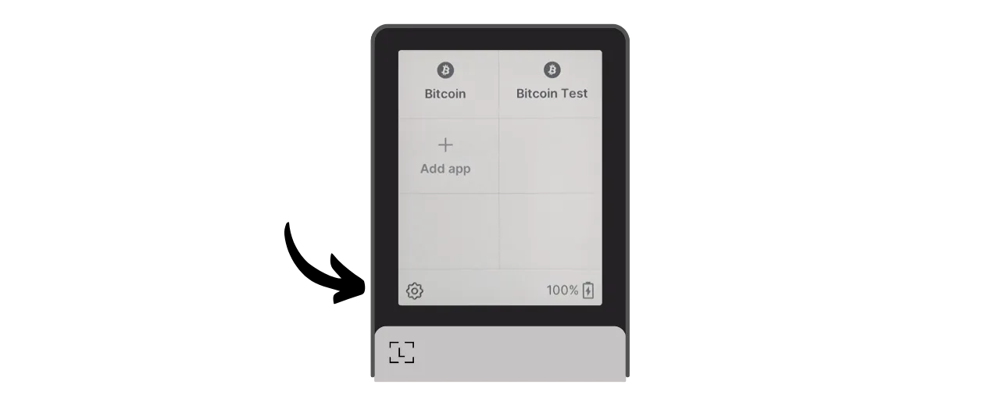

Velg menyen "Avansert" og deretter "Angi passordfrase".

Dette er trinnet der du kan velge mellom alternativet "knyttet til PIN-kode" eller "midlertidig" som vi snakket om i forrige del. Her vil jeg forklare hvordan du setter opp en midlertidig passordfrase, så klikk på "Angi midlertidig passordfrase".

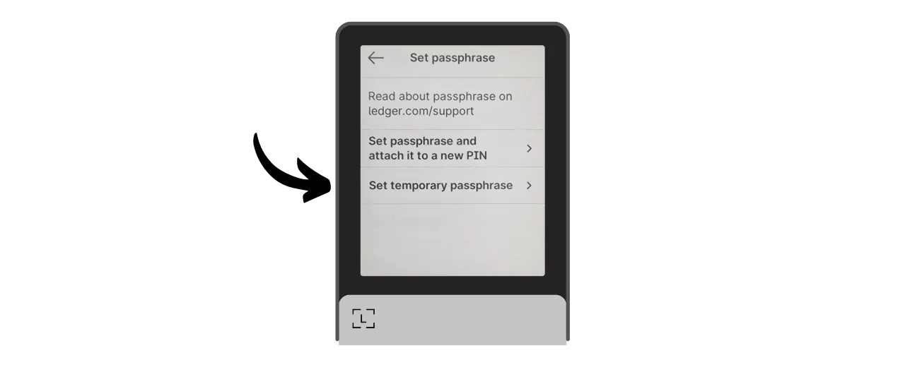

Du blir deretter bedt om å oppgi passordfrasen din. Velg en sterk passordfrase, og fortsett umiddelbart til en fysisk sikkerhetskopi, på et medium som papir eller metall. I dette eksemplet valgte jeg passordfrasen: `fH3&kL@9mP#2sD5qR!82`. Etter at du har skrevet inn passordfrasen, klikker du på "*Fortsett*"-knappen.

Kontroller at passordfrasen stemmer overens med det du har notert på den fysiske sikkerhetskopien, og klikk deretter på knappen "*Yes, it's correct*" for å bekrefte.

For å fullføre opprettelsen av passordfrasen din, skriver du inn PIN-koden til din Ledger. Fra nå av må du følge nøyaktig de samme trinnene som beskrevet her når du vil ha tilgang til lommeboken din med en passordfrase på Ledger.

Du kan nå importere ditt sett med offentlige nøkler på Sparrow Wallet for å administrere lommeboken din. På Sparrow vil dette tilsvare en annen lommebok enn den opprinnelige lommeboken din uten passordfrase.

Åpne Sparrow Wallet. Sørg for at programvaren er koblet til en node, klikk deretter på "*File*"-fanen og velg "*New Wallet*".

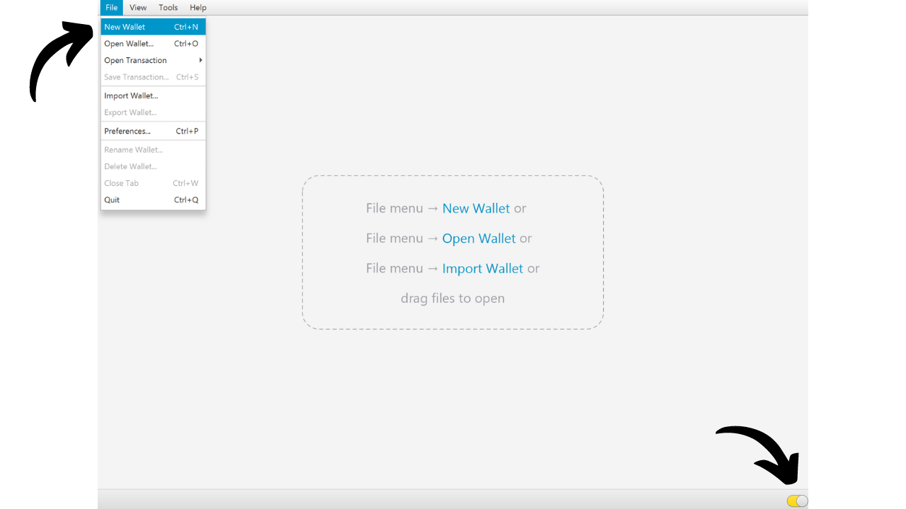

Velg et navn på lommeboken din som er beskyttet av en passordfrase. I dette eksemplet har jeg valgt et navn som eksplisitt inneholder uttrykket "*passphrase*". Men hvis du foretrekker å holde denne lommeboken diskret på datamaskinen din, kan du velge et mindre stemningsfullt navn.

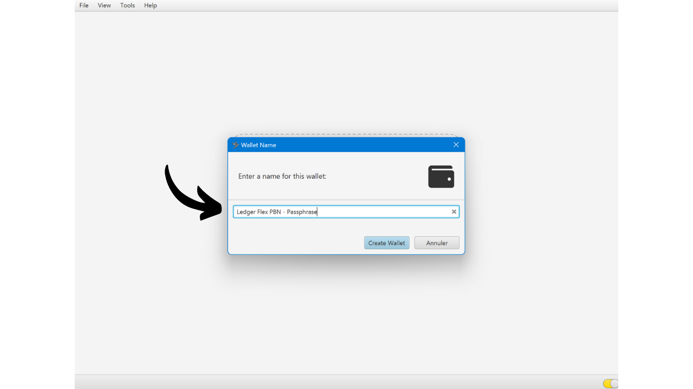

Velg type skript for lommeboken din. Jeg anbefaler deg å velge "*Taproot*" eller alternativt "*Native SegWit*".

Koble Ledger til datamaskinen, og klikk deretter på "*Connected Hardware Wallet*". Kontroller at du allerede har angitt passordfrasen din på din Ledger. Hvis ikke, går du tilbake til forrige trinn for å legge inn passordfrasen. Før du fortsetter med skanningen, må du også huske å åpne "*Bitcoin*"-applikasjonen på din Ledger.

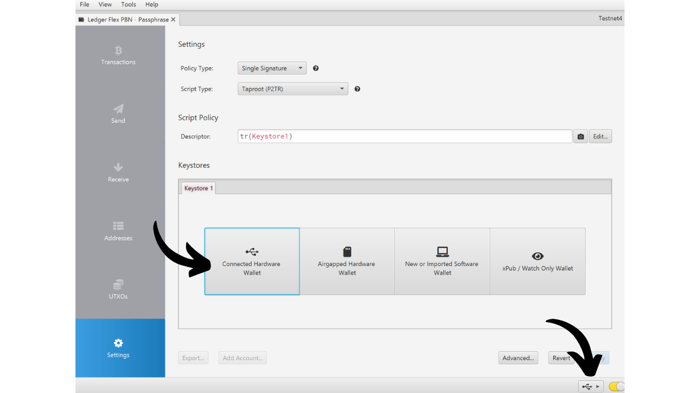

Klikk på knappen "*Scan...*".

Klikk på "*Importer nøkkellager*" ved siden av hovedboken din.

Lommeboken din, som er beskyttet av passordfrasen, er nå opprettet på Sparrow. For å bekrefte, klikk på "*Apply*"-knappen.

Velg et sterkt passord for å sikre tilgangen til Sparrow Wallet. Dette passordet vil sikre tilgangen til lommebokdataene dine på Sparrow, noe som bidrar til å beskytte dine offentlige nøkler, adresser, etiketter og transaksjonshistorikk mot uautorisert tilgang.

Jeg anbefaler deg å lagre dette passordet i en passordbehandler, slik at du ikke glemmer det.

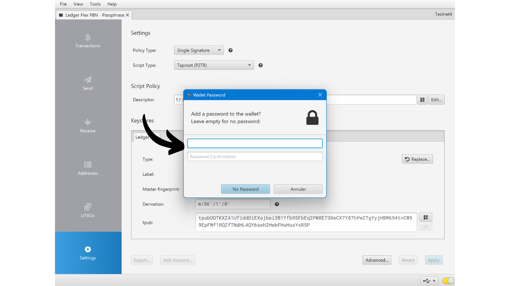

Og der har du det, lommeboken din er nå opprettet! I menyen "*Innstillinger*" vil Sparrow gi deg ditt "*Masterfingeravtrykk*". Dette er fingeravtrykket til hovednøkkelen din, som brukes som grunnlag for å utlede lommeboken din. Jeg anbefaler på det sterkeste å ta vare på en kopi av dette fingeravtrykket. I mitt eksempel tilsvarer det: `281ee33a`.

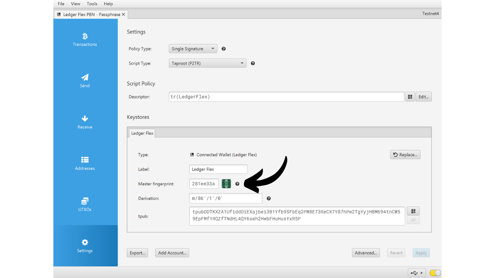

Husk hva vi nevnte i de foregående delene: En feil, selv en liten en, ved å skrive inn passordfrasen din vil generere en helt ny lommebok med andre nøkler. Hver gang du trenger å sikre at du får tilgang til riktig lommebok med riktig passordfrase, må du kontrollere at fingeravtrykket til hovednøkkelen din stemmer overens med det du har notert. Denne informasjonen utgjør i seg selv ingen risiko for sikkerheten til pengene dine eller personvernet ditt.

Før du bruker lommeboken din med en passordfrase, anbefaler jeg deg på det sterkeste å utføre en gjenopprettingstest. Skriv ned en referanseinformasjon, for eksempel xpub eller fingeravtrykket til hovednøkkelen din, og tilbakestill deretter hovedboken mens lommeboken fortsatt er tom. Prøv deretter å gjenopprette lommeboken på Ledger ved hjelp av papirsikkerhetskopiene av 24-ords-frasen og passordfrasen. Sjekk at informasjonen som genereres etter gjenopprettingen, stemmer overens med det du først noterte. Hvis det er tilfelle, kan du være sikker på at papirsikkerhetskopiene dine er pålitelige.

## Hvordan setter jeg opp en passordfrase knyttet til en PIN-kode med en hovedbok?

Klikk på tannhjulet for innstillinger på startsiden til Ledger.

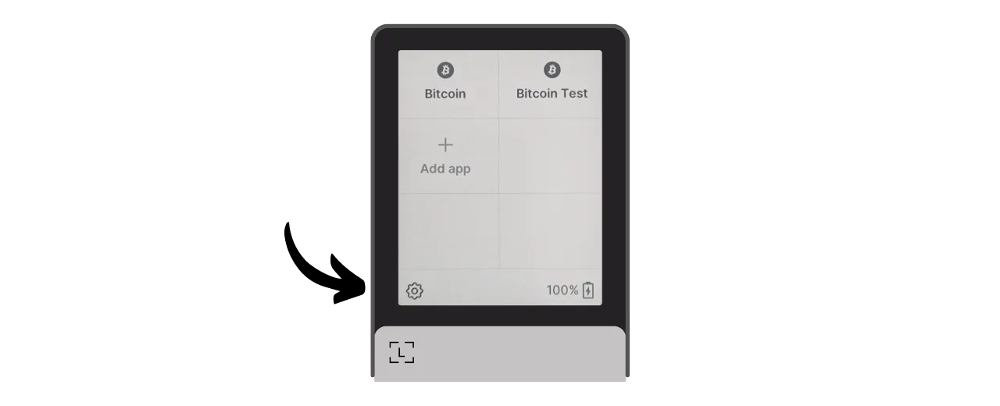

Velg menyen "*Avansert*" og deretter "*Sett passordfrase*".

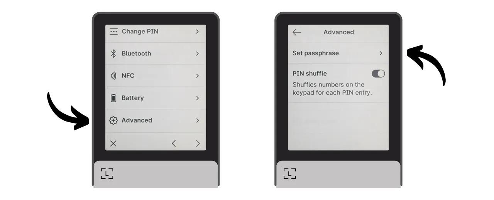

Dette er trinnet der du kan velge mellom alternativene "*koblet til PIN-kode*" eller "*midlertidig*", som vi snakket om i forrige del. Her skal jeg forklare hvordan du setter opp en passordfrase knyttet til en PIN-kode, så klikk på "*Sett passordfrase og knytt den til en ny PIN-kode*".

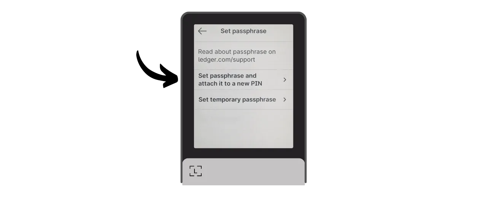

Deretter må du velge PIN-koden som skal knyttes til passordfrasen din. Akkurat som med hoved-PIN-koden, anbefales det å velge en 8-sifret PIN-kode, så tilfeldig som mulig. Sørg også for å lagre denne koden på et annet sted enn der Ledger Flex er lagret.

I mitt tilfelle er hoved-PIN-koden `58293647`, og jeg valgte `71425839` som sekundær PIN-kode knyttet til passordfrasen.

Du blir deretter bedt om å oppgi passordfrasen din. Velg en sterk passordfrase, og fortsett umiddelbart til en fysisk sikkerhetskopi, på et medium som papir eller metall. I dette eksemplet valgte jeg passordfrasen: `fH3&kL@9mP#2sD5qR!82`. Etter at du har skrevet inn passordfrasen, klikker du på "*Fortsett*"-knappen.

Kontroller at passordfrasen stemmer overens med det du har notert på den fysiske sikkerhetskopien, og klikk deretter på knappen "*Yes, it's correct*" for å bekrefte.

For å fullføre opprettelsen av passordfrasen skriver du inn hoved-PIN-koden til hovedboken (ikke den som er knyttet til passordfrasen).

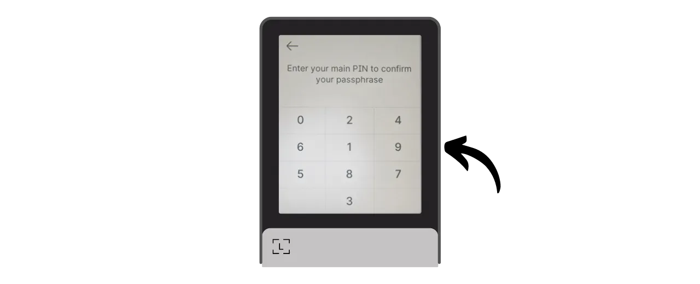

Fra nå av må du ikke lenger oppgi hoved-PIN-koden, men den sekundære PIN-koden når du vil ha tilgang til lommeboken din med en passordfrase på Ledger:

- Hoved-PIN-kode (`58293647`) > lommebok uten passordfrase.
- Sekundær PIN-kode (`71425839`) > lommebok med passordfrase.
Du kan nå importere ditt sett med offentlige nøkler på Sparrow Wallet for å administrere lommeboken din. På Sparrow vil dette tilsvare en annen lommebok enn den opprinnelige lommeboken din uten passordfrase.

Åpne Sparrow Wallet. Sørg for at programvaren er koblet til en node, klikk deretter på "*File*"-fanen og velg "*New Wallet*".

Velg et navn på lommeboken din som er beskyttet av en passordfrase. I dette eksemplet har jeg valgt et navn som eksplisitt inneholder uttrykket "*passphrase*". Men hvis du foretrekker å holde denne lommeboken diskret på datamaskinen din, kan du velge et mindre stemningsfullt navn.

Velg skripttype for lommeboken din. Jeg anbefaler deg å velge "*Taproot*" eller, hvis du ikke klarer det, "*Native SegWit*".

Koble Ledger til datamaskinen, og klikk deretter på "*Connected Hardware Wallet*". Kontroller at du allerede har passordfrasen din på Ledger ved å låse den opp med den sekundære PIN-koden. Hvis ikke, må du starte Ledger på nytt og angi PIN-koden som er knyttet til passordfrasen. Før du fortsetter å skanne, må du også huske å åpne applikasjonen "*Bitcoin*" på din Ledger.

Klikk på knappen "*Scan...*".

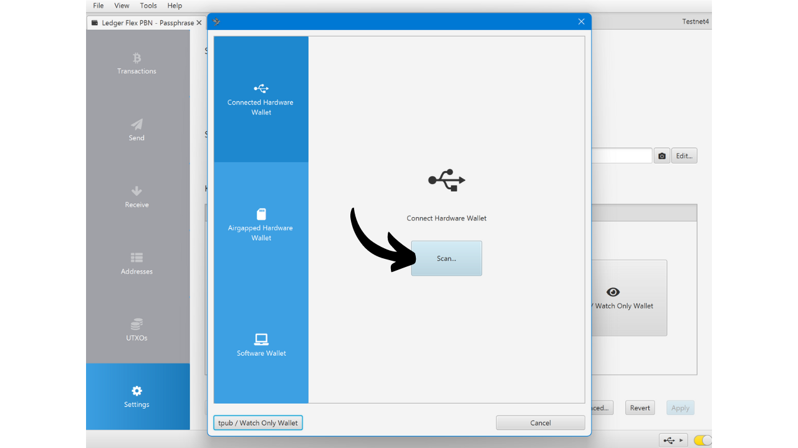

Klikk på "*Importer nøkkellager*".

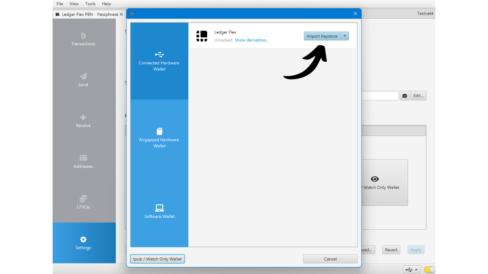

Lommeboken din, som er beskyttet av passordfrasen, er nå opprettet på Sparrow. For å bekrefte, klikk på "*Apply*"-knappen.

Velg et sterkt passord for å sikre tilgangen til Sparrow Wallet. Dette passordet vil sikre tilgangen til lommebokdataene dine på Sparrow, noe som bidrar til å beskytte dine offentlige nøkler, adresser, etiketter og transaksjonshistorikk mot uautorisert tilgang.

Jeg anbefaler deg å lagre dette passordet i en passordbehandler, slik at du ikke glemmer det.

Og der har du det, lommeboken din er nå opprettet! I menyen "*Settings*" vil Sparrow gi deg ditt "*Master fingerprint*". Dette representerer fingeravtrykket til hovednøkkelen din, som brukes som grunnlag for avledningen av lommeboken din. Jeg anbefaler på det sterkeste å ta vare på en kopi av dette fingeravtrykket. I mitt eksempel tilsvarer det: `281ee33a`.

Husk hva vi nevnte i de foregående delene: En feil, selv en mindre feil, ved inntasting av passordfrasen din vil generere en helt ny lommebok med forskjellige nøkler. Hver gang du trenger å sikre tilgang til riktig lommebok med riktig passordfrase, må du kontrollere at fingeravtrykket til hovednøkkelen din samsvarer med det du har notert. Denne informasjonen utgjør i seg selv ingen risiko for sikkerheten til pengene dine eller personvernet ditt.

Før du bruker lommeboken din med en passordfrase, anbefaler jeg deg på det sterkeste å utføre en gjenopprettingstest. Noter ned en referanseinformasjon, for eksempel xpub eller fingeravtrykket til hovednøkkelen din, og tilbakestill deretter hovedboken mens lommeboken fortsatt er tom. Prøv deretter å gjenopprette lommeboken i hovedboken ved hjelp av papirsikkerhetskopiene av 24-ords-frasen og passordfrasen. Sjekk at informasjonen som genereres etter gjenopprettingen, stemmer overens med det du først noterte. Hvis dette er tilfelle, kan du være sikker på at papirbackupene dine er pålitelige.

Gratulerer, din Bitcoin-lommebok er nå sikret med en passordfrase! Hvis du synes denne veiledningen var nyttig, vil jeg sette pris på om du legger igjen en tommel opp nedenfor. Del gjerne denne artikkelen på dine sosiale nettverk. Tusen takk skal du ha!

Jeg anbefaler også at du tar en titt på denne andre komplette veiledningen om hvordan du bruker Ledger Flex:

https://planb.network/tutorials/wallet/hardware/ledger-flex-3728773e-74d4-4177-b39f-bd923700c76a