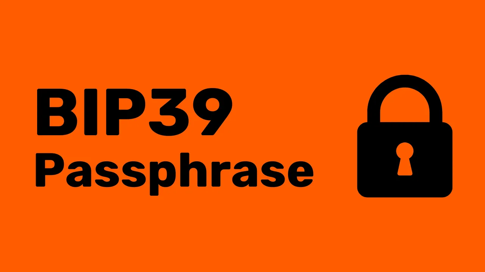
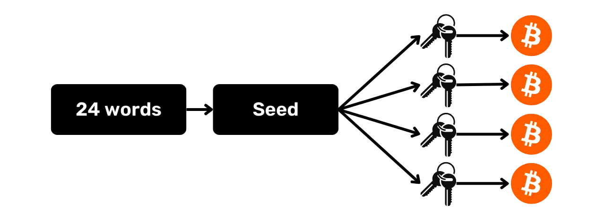
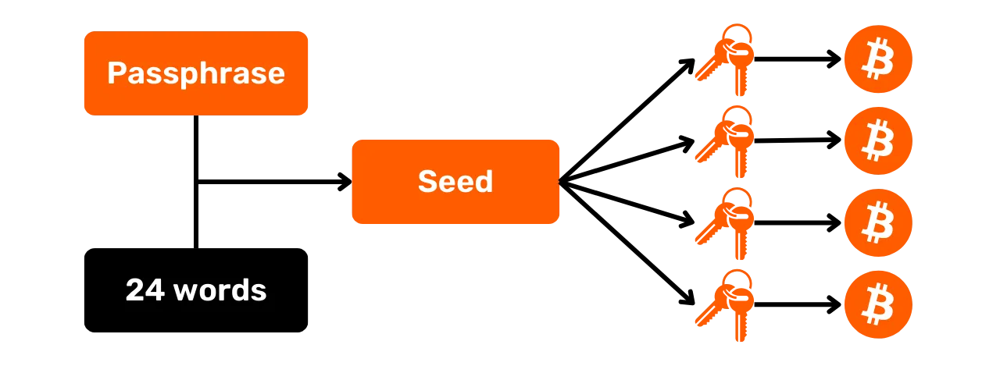

## Hva er en BIP39-passordfrase?

HD-lommebøker genereres vanligvis ut fra en mnemonisk frase som består av 12 eller 24 ord. Denne frasen er svært viktig fordi den gjør det mulig å gjenopprette alle nøklene til en lommebok i tilfelle det fysiske mediet (som for eksempel en maskinvarelommebok) går tapt. Den utgjør imidlertid et enkelt feilpunkt, for hvis den blir kompromittert, kan en angriper stjele alle bitcoinsene.

Det er her passordfrasen kommer inn i bildet. Det er et valgfritt passord som du fritt kan velge, og som legges til den mnemoniske frasen i prosessen med å utlede nøkkelen for å forbedre lommebokens sikkerhet.

Vær forsiktig så du ikke forveksler passordfrasen med PIN-koden til maskinvarelommeboken eller passordet som brukes til å låse opp tilgangen til lommeboken på datamaskinen. I motsetning til alle disse elementene spiller passordfrasen en rolle i utledningen av lommebokens nøkler. **Dette betyr at uten den vil du aldri kunne få tilbake bitcoinsene dine

Passordfrasen fungerer sammen med den mnemoniske frasen, og endrer frøet som nøklene genereres ut fra. Selv om noen skulle få tak i frasen på 12 eller 24 ord, kan de ikke få tilgang til pengene dine uten passordfrasen. **Ved å bruke en passordfrase oppretter du i praksis en ny lommebok med egne nøkler. Hvis du endrer (selv bare litt) på passordfrasen, genereres en annen lommebok**

## Hvorfor bør du bruke en passordfrase?

Passordfrasen er vilkårlig og kan være en hvilken som helst kombinasjon av tegn som brukeren selv velger. Å bruke en passordfrase gir dermed flere fordeler. For det første reduserer det all risiko forbundet med kompromittering av minnefrasen ved at det kreves en annen faktor for å få tilgang til midlene (innbrudd, tilgang til hjemmet ditt osv.).

Deretter kan den brukes strategisk til å lage en lokke-lommebok, for å håndtere fysiske begrensninger for å stjele pengene dine, som det beryktede "* $ 5 skiftenøkkelangrepet *". I dette scenariet er ideen å ha en lommebok uten en passordfrase som bare inneholder en liten mengde bitcoins, nok til å tilfredsstille en potensiell angriper, mens du har en skjult lommebok. Sistnevnte bruker den samme mnemoniske frasen, men er sikret med en ekstra passordfrase.

Til slutt er det interessant å bruke en passordfrase når man ønsker å kontrollere tilfeldigheten i HD-lommebokens seed-generering.

## Hvordan velge en god passordfrase?

For at passordfrasen skal være effektiv, må den være tilstrekkelig lang og tilfeldig. Akkurat som med et sterkt passord, anbefaler jeg at du velger en passordfrase som er så lang og tilfeldig som mulig, med en rekke bokstaver, tall og symboler som gjør det umulig å utføre et brute force-angrep.

Det er også viktig å lagre denne passordfrasen på riktig måte, på samme måte som minnefrasen. **Hvis du mister den, mister du tilgangen til bitcoinsene dine**. Jeg fraråder på det sterkeste å huske den utelukkende i hodet, da dette øker risikoen for tap urimelig mye. Det ideelle er å skrive den ned på et fysisk medium (papir eller metall) adskilt fra huskeregelen. Denne sikkerhetskopien må selvsagt oppbevares på et annet sted enn huskeregelen, for å unngå at begge blir kompromittert samtidig.

## Veiledninger

Hvis du vil sette opp en passordfrase på en Ledger-enhet (Stax, Flex eller Nano), kan du se denne veiledningen:

https://planb.network/tutorials/wallet/hardware/passphrase-ledger-9ae6d9a2-7293-438a-8fe0-e59147ef2f49