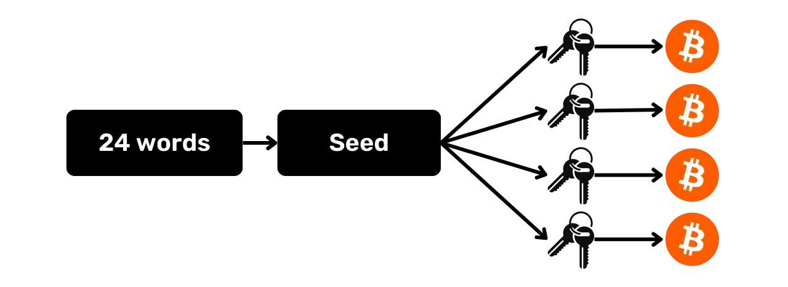
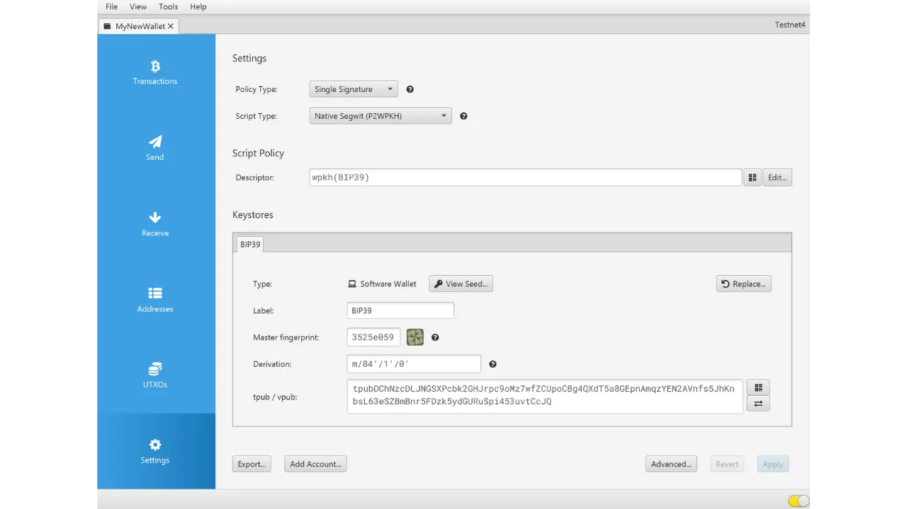
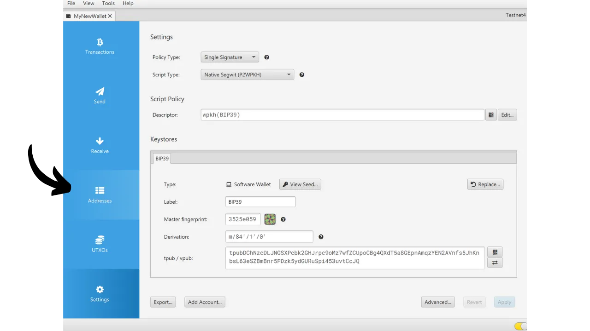

Når du oppretter en Bitcoin-lommebok, blir du bedt om å notere ned en mnemonisk frase, vanligvis bestående av 12 eller 24 ord. Denne frasen lar deg få tilgang til bitcoinsene dine i tilfelle tap, skade eller tyveri av enheten som inneholder lommeboken din. Før du begynner å bruke den nye Bitcoin-lommeboken din, er det svært viktig å verifisere gyldigheten av denne minnefrasen. Den beste måten å gjøre dette på er ved å utføre en gjenopprettingstest.

Denne testen innebærer å simulere en gjenoppretting av lommeboken før vi setter inn noen bitcoins i den. Så lenge lommeboken er tom, simulerer vi en situasjon der enheten som inneholder nøklene våre går tapt, og alt vi har igjen er minnefrasen vår for å forsøke å få tilbake bitcoinsene våre.



## Hva er hensikten?

Denne testprosessen lar deg verifisere at den fysiske sikkerhetskopien av minnefrasen din, enten den er på papir eller metall, er funksjonell. En feil under denne gjenopprettingstesten signaliserer en feil i sikkerhetskopien av frasen, og setter dermed bitcoinsene dine i fare. Hvis testen derimot er vellykket, bekrefter den at minnefrasen din er fullt operativ, og du kan da sikre bitcoins med ro i sjelen ved hjelp av denne lommeboken.

Å utføre en gjenopprettingstest har en dobbel fordel. Ikke bare gir det deg mulighet til å sjekke nøyaktigheten til minnefrasen din, men det gir deg også muligheten til å gjøre deg kjent med lommebokgjenopprettingsprosessen. På denne måten oppdager du potensielle problemer før du står overfor en reell situasjon. Den dagen du faktisk trenger å gjenopprette lommeboken din, vil du være mindre stresset, ettersom du allerede kjenner prosessen, noe som reduserer risikoen for feil. Derfor er det viktig at du ikke forsømmer dette testtrinnet, og at du tar deg nødvendig tid til å gjøre det på riktig måte.

## Hva er en recovery-test?

Testprosessen er ganske enkel:

- Etter at du har opprettet din nye Bitcoin-lommebok, og før du setter inn dine første satoshier, må du notere ned vitneinformasjon, for eksempel en xpub, den første mottakeradressen eller til og med hovednøkkelens fingeravtrykk;
- Deretter sletter du bevisst den fortsatt tomme lommeboken, for eksempel ved å tilbakestille maskinvarelommeboken til fabrikkinnstillingene;
- Deretter simulerer du en gjenoppretting av lommeboken din ved å bruke bare papirbackupene av minnefrasen og passordfrasen, hvis du bruker en;
- Til slutt sjekker du om vitneinformasjonen stemmer overens med informasjonen i den regenererte porteføljen. Hvis informasjonen stemmer overens, kan du være trygg på at den fysiske sikkerhetskopien er pålitelig, og du kan deretter sende de første bitcoinsene dine til denne lommeboken.
Vær forsiktig, under en gjenopprettingstest må **du må bruke den samme enheten som er beregnet for den endelige lommeboken**, for ikke å øke angrepsflaten til lommeboken din. Hvis du for eksempel oppretter en lommebok på en Trezor Safe 5, må du sørge for å utføre gjenopprettingstesten på den samme Trezor Safe 5. Det er viktig at du ikke skriver inn gjenopprettingsfrasen i noen annen programvare, da dette vil kompromittere sikkerheten til maskinvarelommeboken din, selv om lommeboken fortsatt er tom.

## Hvordan utfører man en gjenopprettingstest?

I denne veiledningen vil jeg forklare hvordan du utfører en gjenopprettingstest på en Bitcoin-programvarelommebok ved hjelp av Sparrow Wallet (for en varm lommebok). Prosessen forblir imidlertid den samme for alle andre typer enheter. Igjen, **hvis du bruker en maskinvarelommebok, må du ikke utføre gjenopprettingstesten på Sparrow Wallet** (se forrige avsnitt).

Jeg har nettopp opprettet en ny hot wallet på Sparrow Wallet. For øyeblikket har jeg ennå ikke sendt noen bitcoins til den. Den er tom.



Jeg har nøye notert den 12-ord lange huskefrasen min på et stykke papir. Og siden jeg ønsker å øke sikkerheten til denne lommeboken, har jeg også satt opp en BIP39-passordfrase som jeg har lagret på et annet stykke papir:

```txt
1. shield
2. brass
3. sentence
4. cube
5. marble
6. glad
7. satoshi
8. door
9. project
10. panic
11. prepare
12. general
```

```text
Passphrase: YfaicGzXH9t5C#g&47Kzbc$JL
```

***Du bør selvsagt aldri dele minnefrasen og passordfrasen din på Internett, i motsetning til det jeg gjør i denne veiledningen. Denne eksempellommeboken vil ikke bli brukt og vil bli slettet ved slutten av opplæringen

Jeg vil nå notere ned på en kladd en vitneinformasjon fra lommeboken min. Du kan velge forskjellige opplysninger, for eksempel den første mottakeradressen, xpub eller hovednøkkelens fingeravtrykk. Personlig anbefaler jeg å velge den første mottakeradressen. På denne måten kan du verifisere at du er i stand til å finne hele den første avledningsstien som fører til denne adressen.

I Sparrow klikker du på fanen "*Adresser*".



Skriv deretter ned den aller første mottakeradressen til lommeboken din på et stykke papir. I mitt eksempel er adressen

```txt