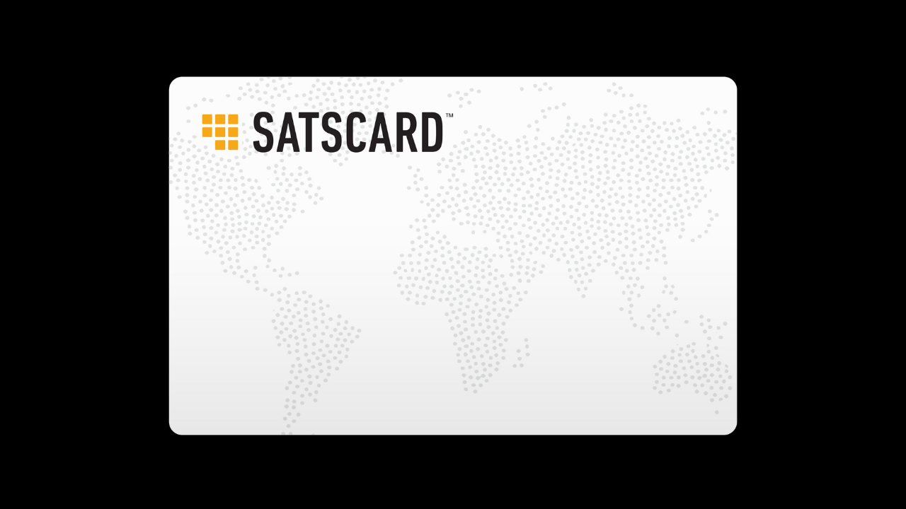

Bitcoin er et elektronisk kontantsystem som gjør det mulig å utføre peer-to-peer-transaksjoner. For å være overbevist om at en transaksjon er uforanderlig, er det imidlertid nødvendig å vente på flere bekreftelser (vanligvis 6) for å unngå at avsenderen forsøker å bruke penger to ganger. Denne valideringsforsinkelsen kan noen ganger være upraktisk, spesielt når man ønsker en umiddelbar bekreftelse som ligner på fysiske kontanter. I motsetning til kontanter, der besittelsen av en seddel overføres umiddelbart, innebærer Bitcoin-transaksjoner en ventetid før de definitivt anses som irreversible.

Det er her Satscard kommer inn i bildet. Det tilbyr en metode som muliggjør fysisk og umiddelbar overføring av bitcoins, uten at det er nødvendig å utføre en transaksjon i kjeden. Satscard fungerer som et bærerkort som muliggjør sikker overføring av bitcoin-eierskap, og tilbyr dermed en opplevelse som ligger nærmere tradisjonelle kontanter. I denne veiledningen vil jeg introdusere deg til denne løsningen.

## Hva er et Satscard?

Satscard fra Coinkite er etterfølgeren til Opendime. Det er et NFC-kort som muliggjør fysisk overføring av bitcoins, på samme måte som en seddel eller mynt. I motsetning til en tradisjonell maskinvarelommebok er Satscard et bærerkort, noe som betyr at fysisk besittelse av kortet tilsvarer eierskap av bitcoins som er sikret med nøklene som er lagret på det. Prisen varierer mellom 6,99 og 17,99 dollar, avhengig av hvilken design som velges.

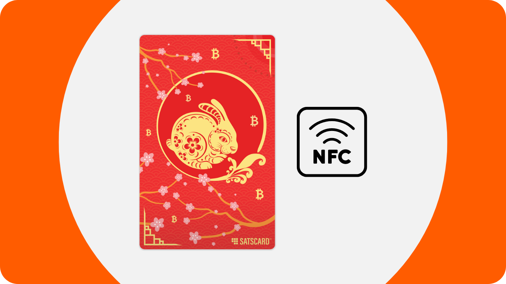

Satscard-brikken er utstyrt med 10 spor, slik at den kan lagre bitcoins opptil 10 ganger på 10 forskjellige adresser. Hvert spor fungerer uavhengig av hverandre og skal i teorien bare brukes én gang for å låse bitcoins i det. For å bruke bitcoinsene er det bare å åpne sporet med et kompatibelt program, for eksempel Nunchuk, ved å taste inn den sekssifrede bekreftelseskoden som står på baksiden av Satscard.

Kortet sikrer at den private nøkkelen som sikrer bitcoins i blokkjeden, ikke kan beholdes av den tidligere eieren når vedkommende fysisk skiller seg av med kortet. Mottakeren kan også verifisere gyldigheten til et spor og beløpet som er lagret i det på tidspunktet for utvekslingen.

Dette systemet er spesielt nyttig for å kjøpe fysiske varer med bitcoins, eller for å gi bort bitcoins som gave.

## Hvordan kjøper jeg et Satscard?

Satscard er tilgjengelig for kjøp [på Coinkites offisielle nettsted](https://store.coinkite.com/store/category/satscard). Hvis du vil kjøpe det i en fysisk butikk, kan du også finne [listen over sertifiserte forhandlere](https://coinkite.com/resellers) på nettstedet.

Du trenger også en telefon som er kompatibel med NFC-kommunikasjon, eller en USB-enhet som kan lese NFC-kort på standardfrekvensen 13,56 MHz.

## Hvordan laster jeg inn et spor på et Satscard?

Når du har mottatt Satscardet ditt, er det første du bør gjøre å sjekke emballasjen for å forsikre deg om at den ikke har blitt åpnet. Hvis pakken er skadet, kan det tyde på at kortet har blitt kompromittert og kanskje ikke er autentisk.

For å administrere Satscard bruker vi mobilapplikasjonen **Nunchuk Wallet**. Sørg for at smarttelefonen din er NFC-kompatibel, og last ned Nunchuk fra [Google Play Store] (https://play.google.com/store/apps/details?id=io.nunchuk.android), [App Store] (https://apps.apple.com/us/app/nunchuk-bitcoin-wallet/id1563190073) eller direkte via [`.apk`-filen] (https://github.com/nunchuk-io/nunchuk-android/releases).

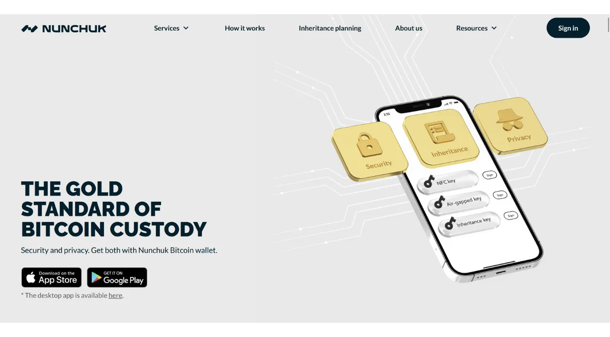

I teorien kan du sende bitcoins direkte til adressen som er angitt på baksiden av Satscardet ditt uten å bruke Nunchuk. Jeg fraråder imidlertid å gjøre dette, ettersom vi først vil verifisere at adressen til det første sporet faktisk er avledet fra en privat nøkkel som er lagret på Satscardet, og at det ikke er en falsk adresse.

Hvis du bruker Nunchuk for første gang, vil appen tilby deg å opprette en konto. I denne veiledningen er det ikke nødvendig å opprette en konto. Velg "*Fortsett som gjest*" for å fortsette uten konto.

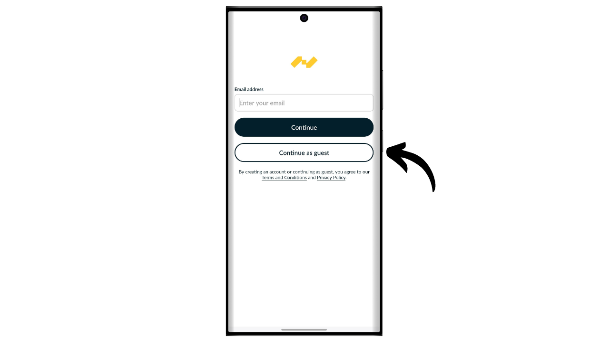

Klikk deretter på "*Uassistert lommebok*".

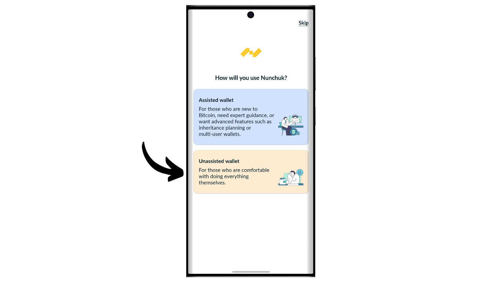

Deretter klikker du på knappen "*Jeg utforsker på egen hånd*".

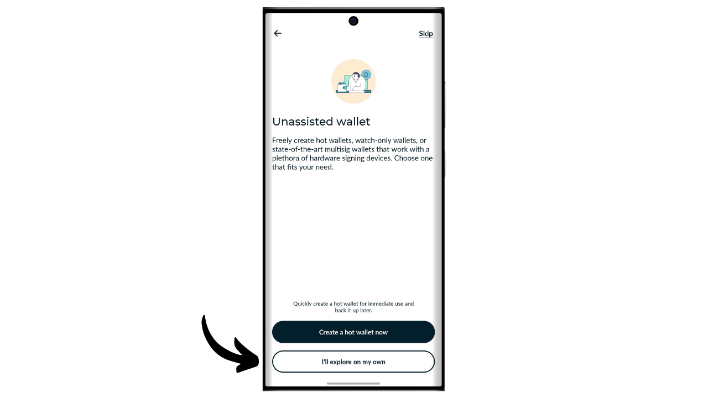

Når du er på startskjermen til Nunchuk, klikker du på "*NFC*"-logoen øverst på skjermen.

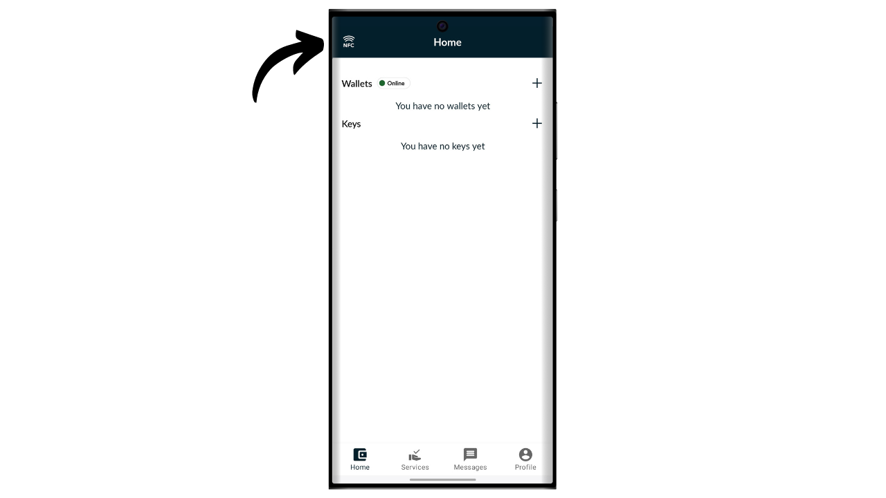

Hold Satscardet mot baksiden av telefonen for å skanne det.

Nunchuk viser mottaksadressen som tilsvarer det første sporet på Satscardet ditt. Normalt skal denne adressen være identisk med den som er skrevet manuelt på baksiden av kortet ditt. Kopier denne adressen og bruk den til å overføre bitcoinsene du ønsker å låse med dette sporet.

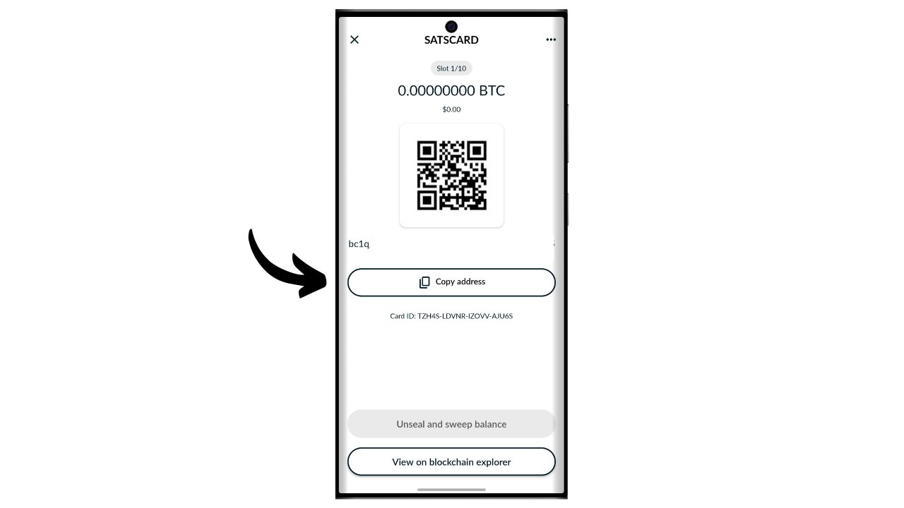

## Hvordan sjekke bitcoins på en spilleautomat?

Når transaksjonen er bekreftet, kan du sjekke saldoen som er knyttet til et spor på Satscardet ditt ved å skanne det med Nunchuk. Under en transaksjon kan mottakeren av bitcoins umiddelbart verifisere, via Nunchuk-appen, at kortet faktisk inneholder de bitcoins vedkommende skylder.

Hvis motparten ikke har Nunchuk-appen, kan de likevel verifisere gyldigheten til Satscardet. Det er bare å aktivere NFC på smarttelefonen og plassere Satscardet på baksiden av enheten. Da åpnes Satscard-nettstedet automatisk i en nettleser, der man kan sjekke kortets gyldighet og beløpet i bitcoins som er knyttet til det.

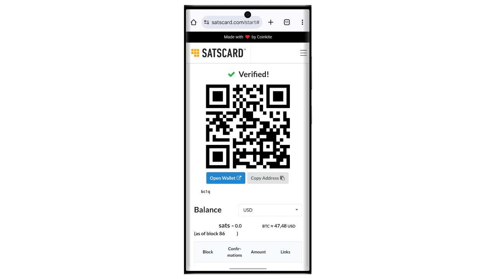

## Hvordan ta ut bitcoins fra en spilleautomat?

Nå som det første sporet på Satscardet er ladet med en viss mengde bitcoins, kan du overlevere kortet til betalingsmottakeren.

Hvis du er mottakeren, må du installere Nunchuk. Når du er inne i appen, klikker du på "*NFC*"-logoen øverst på skjermen.

Plasser Satscardet på baksiden av telefonen.

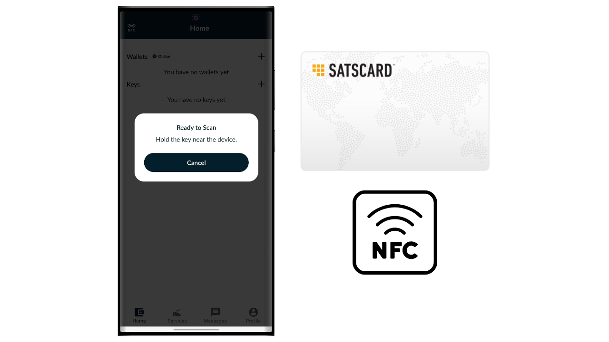

Nunchuk vil avsløre beløpet som er sikret på adressen.

For å oppheve forseglingen av den private nøkkelen og flytte bitcoinsene til en adresse du eier, klikker du på knappen "*Unseal and sweep balance*".

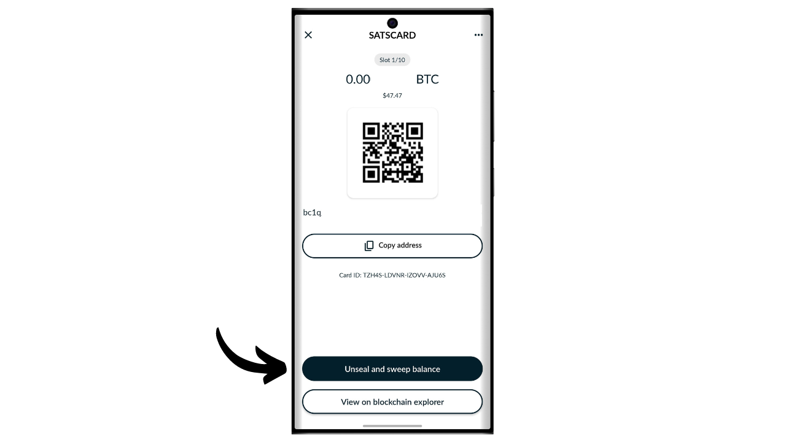

Med alternativet "*Sveip til en lommebok*" kan du sende bitcoins direkte til en lommebok som allerede finnes i Nunchuk-appen din. Hvis du vil overføre pengene til en annen mottakeradresse, velger du "*Trekk til en adresse*".

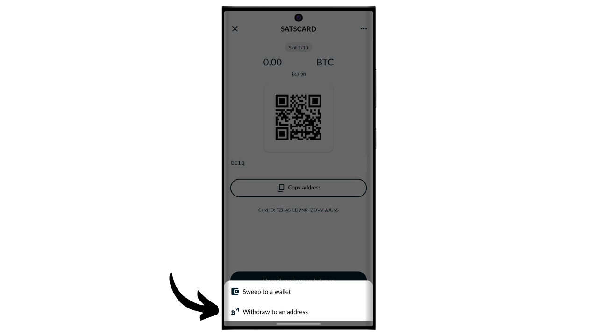

Skriv inn mottakeradressen der du ønsker å sende bitcoins sikret med Satscard. Sørg for at den angitte adressen er riktig (dette er den eneste gangen du kan bekrefte den), og klikk deretter på knappen "*Opprett transaksjon*".

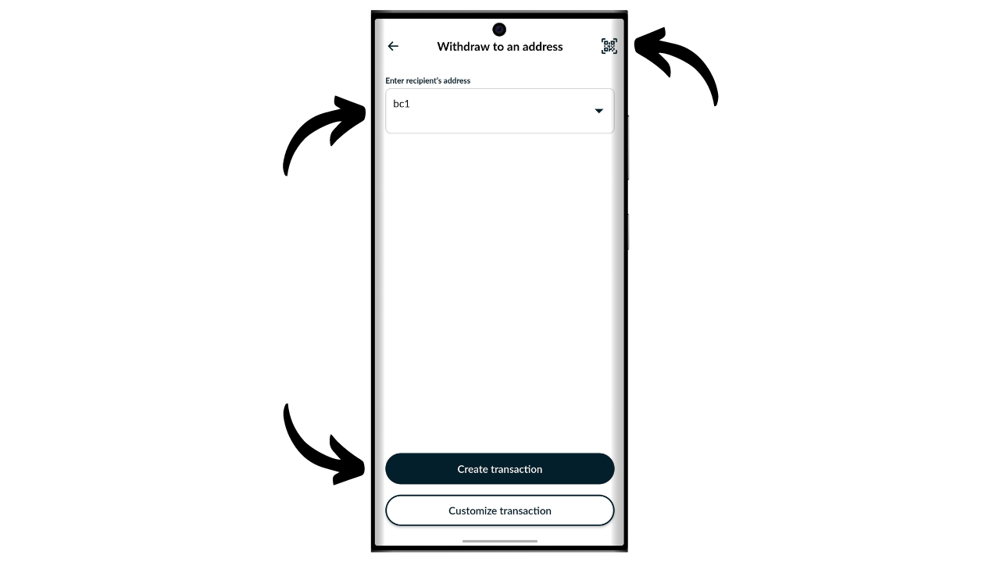

Tast inn PIN-koden til Satscardet ditt. Denne 6-sifrede koden står på baksiden av det fysiske kortet.

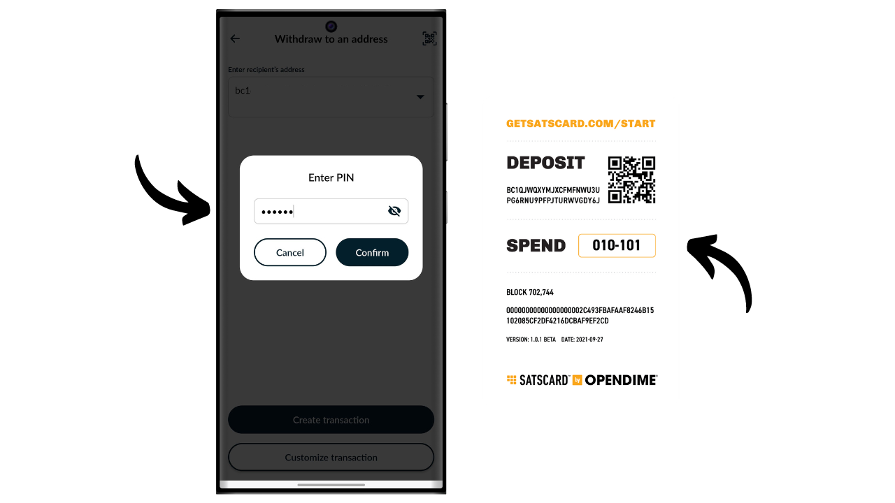

Hold Satscardet på baksiden av smarttelefonen mens du signerer transaksjonen med den private nøkkelen som er lagret på NFC-kortet.

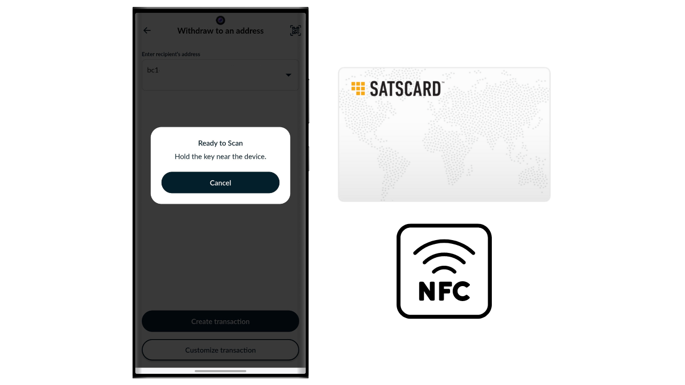

Transaksjonen din er nå signert og sendt ut i Bitcoin-nettverket, noe som betyr at sporet som brukes på Satscardet ditt nå er tomt.

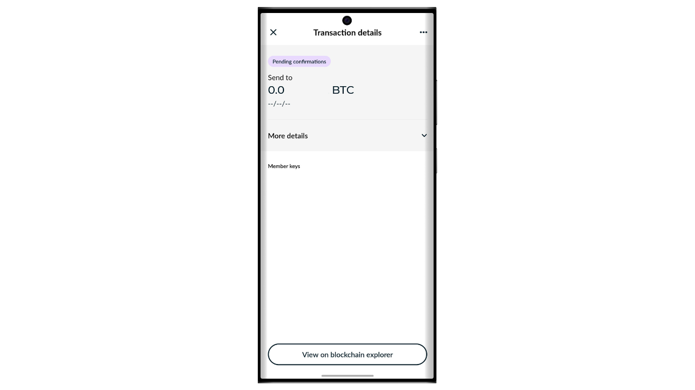

## Hvordan gjenbruker jeg Satscard?

I motsetning til engangsløsninger som Opendime, er Satscard utstyrt med en chip som inneholder 10 uavhengige spor, noe som gir mulighet for opptil 10 operasjoner med ett og samme kort. Det første sporet, som er forhåndskonfigurert på fabrikken av Coinkite, tilsvarer mottaksadressen som er skrevet på baksiden av Satscard.

For å aktivere de andre 9 sporene må du generere nøkkelparet og adressen via Nunchuk-appen. Klikk på "*NFC*"-logoen øverst på skjermen på startsiden til appen.

Plasser Satscardet på baksiden av telefonen.

Nunchuk indikerer at ingen spor er aktive på kortet, noe som er normalt siden det første sporet allerede er brukt og det andre ennå ikke er generert. For å se de tidligere brukte sporene, klikk på "*Vis uforseglede spor*". Det frarådes på det sterkeste å gjenbruke disse sporene, da dette vil føre til gjenbruk av adresser som er skadelig for personvernet ditt i kjeden. Derfor oppretter vi et nytt spor ved å klikke på "*Yes*"-knappen.

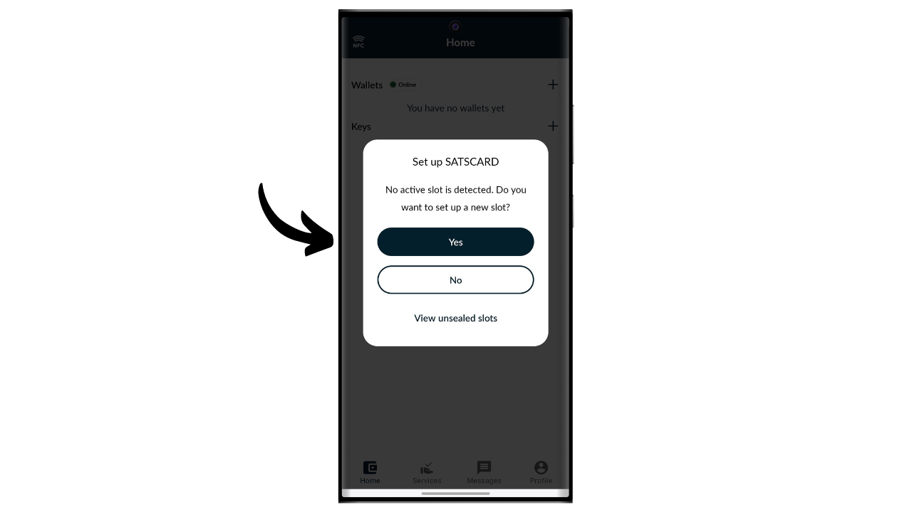

Du må nå velge hvordan du genererer hovedkjedekoden.

Sporene på Satscard følger BIP32-standarden, noe som betyr at utledningen av de kryptografiske nøklene som sikrer bitcoins, ikke baserer seg på en mnemonisk frase som i BIP39-lommebøker, men direkte på en privat hovednøkkel og en hovedkjedekode. Disse to elementene brukes som input i HMAC-SHA512-funksjonen for å generere et underordnet nøkkelpar. Hvert spor har sin egen hovednøkkel og sin egen hovedkjedekode. Det er bare ett avledningsnivå for hvert spor.

Nøkkelparet for det første sporet er forhåndsgenerert av Coinkite. Det er derfor du har direkte tilgang til det via Nunchuk, og det er derfor mottakeradressen er skrevet på baksiden av NFC-kortet. For de andre sporene er du imidlertid selv ansvarlig for å generere nøklene.

Den private hovednøkkelen for hvert spor genereres direkte av Satscard, og hovedkjedekodene må oppgis utenfra. Når det gjelder kjedekoden til det nye sporet, har du to alternativer: du kan la Nunchuk generere den automatisk ved å velge "*Automatic*", eller du kan lage den selv ved å velge "*Advanced*" og skrive den inn i det dedikerte feltet. For at kjedekoden skal være effektiv, må den være så tilfeldig som mulig.

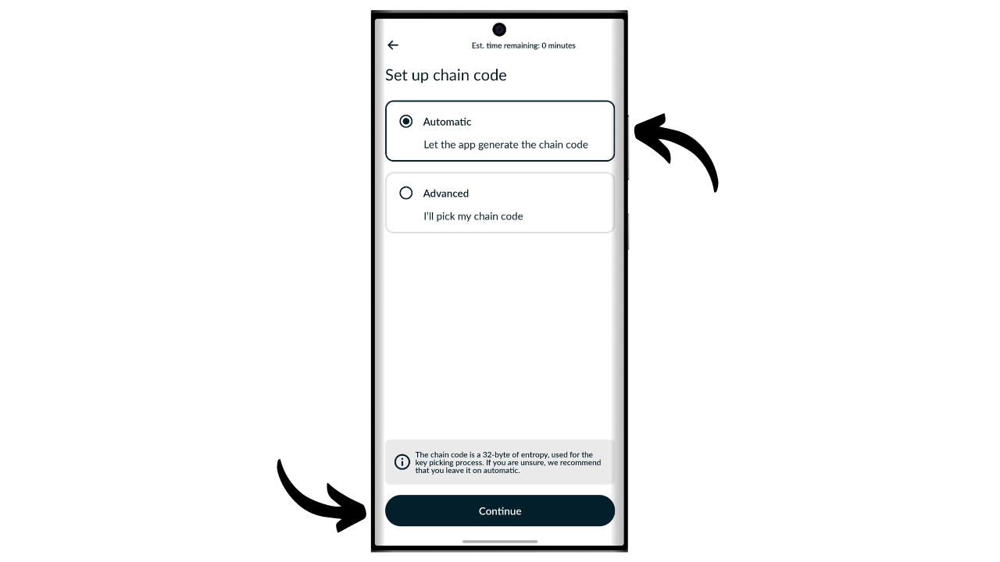

Tast inn den sekssifrede PIN-koden som står på baksiden av Satscardet.

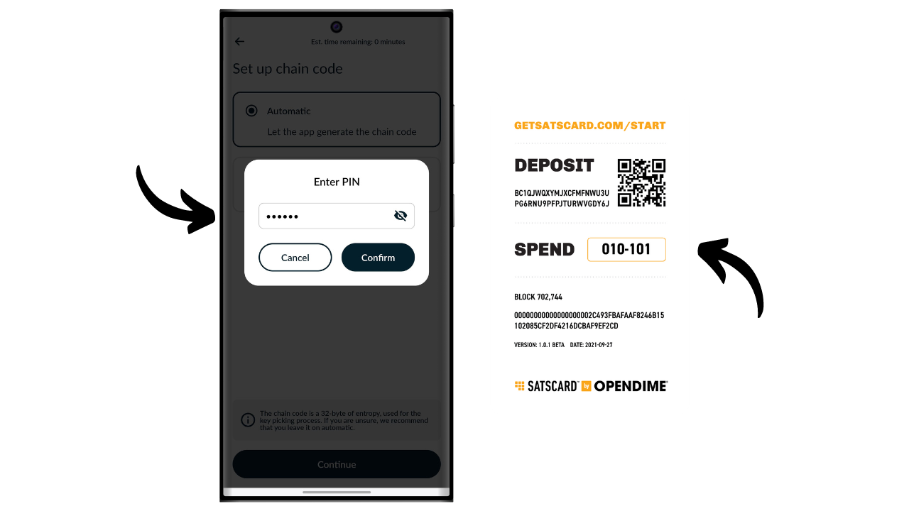

Plasser Satscardet på baksiden av telefonen.

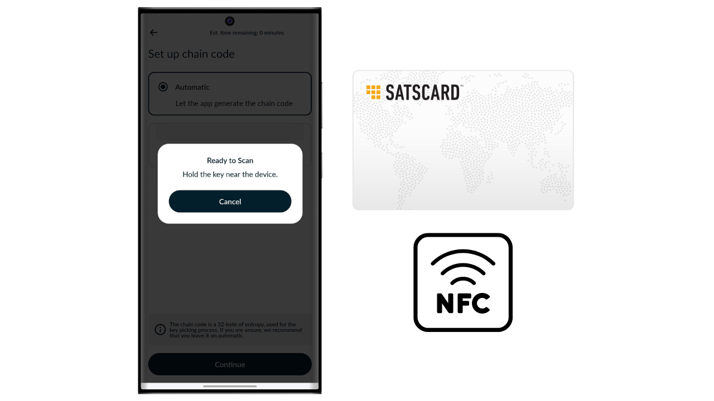

Et nytt spor har blitt konfigurert. Du kan nå se mottakeradressen for å sette inn bitcoins. For å fortsette med innlasting, følg instruksjonene i avsnittet "*Hvordan laste inn et spor på et Satscard?*" i denne veiledningen.

Du kan gjenta denne prosessen opptil 10 ganger på hvert Satscard.

Gratulerer, du er nå i gang med å bruke Satscard! Hvis du synes denne veiledningen var nyttig, vil jeg sette pris på om du legger igjen en tommel opp nedenfor. Del gjerne denne artikkelen på dine sosiale nettverk. Tusen takk skal du ha!